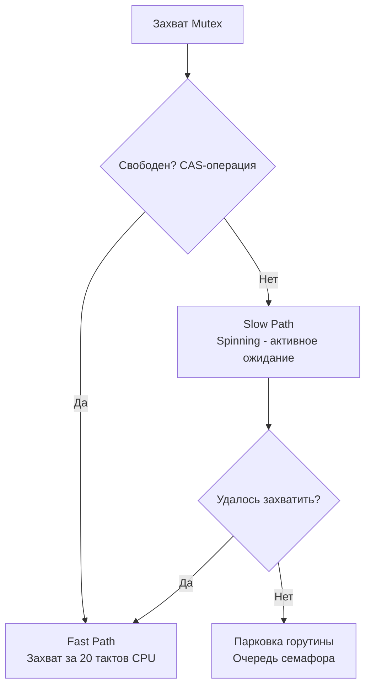

В предыдущих статьях мы возносили дифирамбы каналам и парадигме CSP. Может сложиться ложное впечатление, что в идиоматичном Go нет места классическим блокировкам. Это опасное заблуждение.

Создатели языка, в частности Роб Пайк, всегда подчеркивали: *«Используйте то, что проще и выразительнее»*. 

Каналы идеально подходят для передачи владения данными и оркестрации потоков выполнения. Но если вам нужно просто защитить in-memory кэш (например, `map`) от одновременной записи или подождать завершения пула воркеров, использование каналов сделает код переусложненным и медленным. В таких случаях на сцену выходит пакет `sync`.

---

## 1. sync.WaitGroup: Оркестрация горутин

Когда вы запускаете фоновые горутины, функция `main` (или родительская горутина) не будет их ждать. Если `main` завершится, рантайм жестко убьет все фоновые процессы. `sync.WaitGroup` — это потокобезопасный счетчик, который решает проблему барьерной синхронизации.

У него всего три метода:
* `Add(int)` — увеличивает счетчик (сколько горутин мы ждем).
* `Done()` — уменьшает счетчик на 1 (вызывается внутри горутины при завершении).
* `Wait()` — блокирует текущую горутину, пока счетчик не станет равен 0.

### Под капотом: Атомики и Семафоры

> [!info] Под капотом: Устройство WaitGroup
> Начиная с Go 1.18, структура `WaitGroup` была упрощена и выглядит так:
> ```go
> type WaitGroup struct {
>     noCopy noCopy        // Маркер для go vet, запрещающий копирование
>     state  atomic.Uint64 // 64-битное состояние (счетчик + ждущие)
>     sema   uint32        // Семафор для парковки горутин
> }
> ```
> Гениальность заключается в поле `state`. Это одно 64-битное число, которое логически разделено на две части:
> * **Верхние 32 бита:** Счетчик самих горутин (изменяется через `Add` и `Done`).
> * **Нижние 32 бита:** Счетчик ожидающих (`waiters`), то есть количество горутин, вызвавших `Wait()`.
> 
> Когда вызывается `Done()`, рантайм делает атомарное вычитание из верхних 32 бит. Если счетчик становится равен нулю, рантайм смотрит на нижние 32 бита и вызывает `runtime_Semrelease` ровно столько раз, сколько горутин ждут на семафоре, мгновенно их пробуждая.

> [!warning] Ловушка / Gotcha: Race Condition с Add()
> Абсолютная классика собеседований и багов в продакшене:
> ```go
> var wg sync.WaitGroup
> for i := 0; i < 10; i++ {
>     go func() {
>         wg.Add(1) // ОШИБКА: Add вызывается внутри горутины!
>         defer wg.Done()
>         // ...работа...
>     }()
> }
> wg.Wait()
> ```
> **Почему это сломается?** Планировщик Go не гарантирует мгновенный запуск горутины. Главный поток может дойти до `wg.Wait()`, увидеть, что счетчик равен 0 (потому что ни одна горутина еще не успела проснуться и сделать `Add(1)`), и мгновенно завершить работу. 
> **Правильно:** `wg.Add(1)` всегда должен вызываться **до** ключевого слова `go`.

---

## 2. sync.Mutex: Эксклюзивная блокировка

`Mutex` (Mutual Exclusion) гарантирует, что только одна горутина может находиться в критической секции (например, при записи в `map`, которая в Go не является потокобезопасной).

### Mechanical Sympathy: Fast Path против Slow Path

Системные вызовы для блокировки потоков ОС (`futex` в Linux) — это очень дорого. Поэтому `sync.Mutex` в Go использует гибридный подход.

У мьютекса есть два пути захвата:
1. **Fast Path (Быстрый путь):** Горутина пытается атомарно (с помощью процессорной инструкции Compare-And-Swap, CAS) изменить состояние мьютекса в User Space. Если мьютекс был свободен, операция занимает около **20 тактов CPU**. Никаких обращений к ОС не происходит.
2. **Slow Path (Медленный путь):** Если мьютекс занят, горутина не засыпает сразу. Она делает **Spinning (Активное ожидание)** — несколько раз крутит пустой цикл процессора (инструкция `PAUSE`), надеясь, что мьютекс вот-вот освободится. И только если спиннинг не помог, горутина заносится в очередь ожидания семафора и паркуется (`runtime.gopark`), освобождая системный тред (M) для других горутин.



### Starvation Mode (Режим голодания)

> [!tip] Собеседование
> **Вопрос:** Что такое режим голодания (Starvation) в `sync.Mutex` и зачем он нужен?
> **Ответ:** До Go 1.9 новые горутины, приходящие за мьютексом, имели преимущество перед теми, кто уже давно ждал в очереди семафора, потому что новые горутины уже находились на процессоре (крутили Спиннинг) и быстрее перехватывали освобожденный мьютекс через CAS. Это приводило к **Tail Latency** — старые горутины могли ждать блокировки секундами.
> 
> В Go 1.9 добавили **Starvation Mode**. Если горутина ждет мьютекс дольше **1 миллисекунды**, мьютекс переходит в режим голодания. В этом режиме:
> 1. Новые горутины вообще не пытаются захватить мьютекс (Спиннинг отключается).
> 2. При освобождении мьютекса (Unlock), блокировка передается **строго напрямую** первой горутине в очереди ожидания.
> Режим отключается, когда очередь пустеет или горутина ждала меньше 1 мс.

> [!warning] Ловушка / Gotcha: Копирование Mutex
> Мьютекс — это структура со счетчиками. Если вы передадите её по значению (by value), вы скопируете текущее состояние блокировки, создав совершенно новый, независимый мьютекс.
> ```go
> type Cache struct {
>     mu   sync.Mutex
>     data map[string]string
> }
> 
> // ОШИБКА: метод с Value Receiver копирует структуру и мьютекс!
> func (c Cache) Set(k, v string) { ... } 
> ```
> Всегда используйте указатели (Pointer Receiver) для структур, содержащих примитивы синхронизации. Компилятор и линтер (`go vet`) умеют находить эту ошибку, выдавая `copylock: passes lock by value`.

---

## 3. sync.RWMutex: Разделение чтения и записи

Если ваши данные обновляются редко (например, конфиги или In-Memory словарь), но читаются тысячами горутин одновременно, использование обычного `Mutex` убьет пропускную способность: читатели будут выстраиваться в очередь друг за другом.

Для этого существует `sync.RWMutex` (Read-Write Mutex).
* `RLock()` / `RUnlock()` — захват для чтения. Множество горутин могут владеть им одновременно.
* `Lock()` / `Unlock()` — эксклюзивный захват для записи. Блокирует и новых читателей, и новых писателей.

### Механика работы под капотом

Как `Lock()` предотвращает появление новых читателей, пока ждет завершения старых?
В `RWMutex` есть счетчик `readerCount` (атомарный `int32`). 
Когда приходит писатель, он делает хитрый трюк: вычитает из `readerCount` константу `rwmutexMaxReaders` (равную $2^{30}$). 
Счетчик становится отрицательным! 
Новые читатели видят отрицательное число и сразу уходят в очередь ожидания. При этом писатель точно знает количество старых читателей (прибавив константу обратно) и ждет, пока они не вызовут `RUnlock()`.

> [!warning] Ловушка / Gotcha: RWMutex медленнее Mutex?
> Существует инженерный миф, что `RWMutex` всегда лучше `Mutex`, если чтений больше. **Это не так.**
> При каждом вызове `RLock()`, рантайм делает атомарный инкремент счетчика `readerCount`. Если у вас 64 физических ядра, и все они одновременно делают `RLock()`, кэш-линия процессора (L1 Cache Line), содержащая этот счетчик, будет постоянно инвалидироваться и пересылаться между ядрами (Cache Coherence Protocol, механизм MESI). 
> Из-за этого "прыгания" кэш-линии `RWMutex` может оказаться **медленнее** обычного `Mutex`, если критическая секция чтения очень короткая (например, просто чтение одного `int` из мапы). 
> `RWMutex` эффективен только тогда, когда чтение занимает существенное время (микросекунды). Всегда профилируйте код бенчмарками!

---

## Итог

1. **`WaitGroup`:** Используйте для ожидания завершения пула фоновых задач. Вызывайте `Add` строго до старта горутины.
2. **`Mutex`:** Защищает критические секции. Использует гибридный подход (Спиннинг + Парковка). Имеет режим защиты от голодания (Starvation Mode).
3. **`RWMutex`:** Оптимизирует Read-Heavy нагрузки. Но берегитесь аппаратного ограничения — инвалидации кэш-линий при огромном количестве одновременных `RLock()`.
4. **Не копируйте блокировки:** Примитивы из пакета `sync` всегда должны передаваться и использоваться по указателю.

Базовые примитивы покрывают 90% задач синхронизации. Но пакет `sync` таит в себе еще несколько продвинутых инструментов для хардкорной оптимизации и работы с памятью, которые отличают Senior разработчика от Middle. В следующей статье мы разберем паттерны синглтона, широковещательных сигналов, переиспользования аллокаций и работу без мьютексов вообще: [[41. sync.Once, Cond, Pool и atomic]].