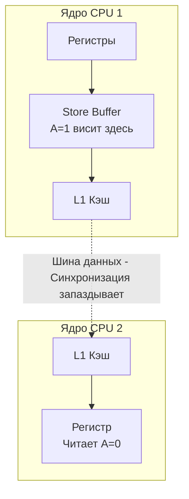

Вплоть до этого момента мы изучали примитивы синхронизации и горутины, полагаясь на интуитивное понимание времени. Кажется очевидным: если горутина А записала `x = 1`, а затем горутина Б прочитала `x`, то она должна увидеть `1`. 

Но в мире многоядерных процессоров и агрессивно оптимизирующих компиляторов интуиция — ваш главный враг. Физика процессора и математика компилятора работают так, чтобы максимально ускорить код, даже если ради этого придется поменять порядок выполнения инструкций или скрыть данные в кэшах процессора.

Чтобы бэкенд-разработчик не сошел с ума от непредсказуемых багов, создатели языка написали формальный контракт — **Go Memory Model (Модель памяти Go)**.

---

## 1. Иллюзия последовательности (Mechanical Sympathy)

Представьте простой кусок кода:

```go
A = 1
B = 2
```

Любой программист скажет, что `A` станет единицей до того, как `B` станет двойкой. 
Но на уровне железа и рантайма это **ложь**. 

1. **Оптимизация компилятора:** Компилятор Go может решить, что поменять эти строки местами будет эффективнее для использования регистров процессора.
2. **Out-of-Order Execution (Внеочередное выполнение):** Современный процессор (x86-64 или ARM) не выполняет инструкции одну за другой. Он анализирует граф зависимостей и выполняет независимые инструкции параллельно.
3. **Store Buffers и L1 Cache:** Даже если процессор выполнил `A = 1` первым, он может записать это значение в свой локальный Store Buffer (буфер записи). Другое ядро процессора не увидит эту единицу до тех пор, пока буфер не будет сброшен в L1/L2 кэш и не отработает протокол когерентности (MESI).



Для однопоточного кода существует правило **As-If Serial**: компилятор и CPU гарантируют, что результат работы будет таким, *как если бы* код выполнялся строго последовательно.
Но в многопоточной среде (между горутинами) эта иллюзия рушится. Наступает хаос, известный как Data Race.

---

## 2. Data Race против Race Condition

На собеседованиях уровня Middle+/Senior часто просят объяснить разницу между этими двумя терминами. Это не синонимы!

### Data Race (Гонка данных)
Происходит, когда две горутины одновременно обращаются к одной и той же ячейке памяти, и **как минимум одно обращение — это запись**. 
В Go наличие Data Race означает **Undefined Behavior (Неопределенное поведение)**. Ваш код может вернуть старое значение, может вернуть мусор, а может вызвать `panic` ядра.

### Race Condition (Состояние гонки)
Это логическая ошибка проектирования. Приложение работает, память не портится (возможно, вы защитили все мьютексами), но порядок операций приводит к ошибке бизнес-логики.
*Пример:* Два запроса одновременно проверяют баланс `if balance >= 100`, оба видят `100` и оба списывают деньги, уводя баланс в минус. Память не повреждена (мьютексы спасли от Data Race), но деньги украдены.

> [!warning] Ловушка / Gotcha: Data Race интерфейсов (Фатальный сбой)
> Самый страшный сценарий Data Race в Go — это гонка при записи в интерфейс или слайс.
> Как мы помним из статьи [[24. Интерфейсы под капотом. iface и eface]], пустой интерфейс (`any`) занимает 16 байт и состоит из двух указателей: на **тип** и на **данные**.
> Если одна горутина пишет в `var val any = &User{}`, а другая читает, процессор не может атомарно обновить все 16 байт (на 64-битных системах атомарная запись — это 8 байт). 
> В итоге читающая горутина может прочитать **старый тип, но новые данные** (или наоборот). Это называется **Torn Write (Разорванная запись)**. Попытка вызвать метод у такого «франкенштейна» приведет к тому, что процессор прыгнет по случайному адресу в памяти. Это уязвимость, которую хакеры могут использовать для захвата контроля над сервером (Exploitation).

---

## 3. Go Memory Model: Отношение Happens-Before

Как писать безопасный код, если железо живет своей жизнью? Для этого нужна Модель Памяти.
Ее фундамент — отношение **Happens-Before (Происходит-До)**.

Это математическое отношение. Если событие $E_1$ *Happens-Before* события $E_2$, это означает, что **любые изменения памяти, сделанные до $E_1$, гарантированно будут видны в $E_2$**. 

Компилятор Go и рантайм берут на себя всю грязную работу (расстановку аппаратных Memory Barriers / Fences), чтобы это правило выполнялось. Если ваш код не использует гарантии Happens-Before, то компилятор имеет полное право игнорировать порядок ваших операций.

---

## 4. Гарантии Happens-Before в Go

Чтобы код был потокобезопасным, вы обязаны использовать примитивы, которые создают связь Happens-Before. Вот основные правила:

### 1. Горутины
Запуск горутины (`go f()`) *happens-before* начала выполнения кода внутри горутины.
```go
var a string

func main() {
	a = "hello" // Гарантированно выполнится до чтения
	go func() {
		fmt.Println(a) // Безопасно, выведет "hello"
	}()
}
```

### 2. Каналы (Channels)
* **Запись** в канал *happens-before* завершения **чтения** из этого же канала.
* Закрытие канала (`close`) *happens-before* получения `zero-value` на стороне читателя.
* **Чтение** из небуферизованного канала *happens-before* завершения **записи** в него.

```go
var c = make(chan int, 10)
var a string

func f() {
	a = "hello"
	c <- 0  // Отправка (запись)
}

func main() {
	go f()
	<-c     // Чтение. Завершение чтения Happens-After записи 'a'
	fmt.Println(a) // Безопасно, всегда "hello"
}
```

### 3. Блокировки (sync.Mutex)
Для любого `sync.Mutex`, вызов `Unlock()` *happens-before* завершения следующего вызова `Lock()`.

```go
var mu sync.Mutex
var a string

func main() {
	mu.Lock()
	a = "hello" // Защищено
	mu.Unlock() // Это действие happens-before следующего Lock()

	go func() {
		mu.Lock() // Этот Lock ждет Unlock() сверху
		fmt.Println(a) // Безопасно
		mu.Unlock()
	}()
}
```

### 4. Атомарные операции (sync/atomic)
Операции из `sync/atomic` (такие как `Store`, `Load`, `CompareAndSwap`) обеспечивают **Sequential Consistency (Последовательную консистентность)**. Запись (`Store`) гарантированно синхронизируется со следующим чтением (`Load`) во всех горутинах.

> [!tip] Собеседование
> **Вопрос:** Если я напишу бесконечный цикл `for !flag {}` в одной горутине, а в другой сделаю `flag = true`, почему первая горутина может никогда не выйти из цикла, даже если это обычный `bool`?
> **Ответ:** Потому что между ними нет связи *Happens-Before*. Компилятор имеет право оптимизировать `for !flag {}` в `if !flag { for {} }` (вынести чтение переменной за пределы цикла, решив, что она не может измениться сама по себе). Также ядро процессора может кэшировать значение `flag` в L1 кэше и никогда не сверяться с оперативной памятью.

---

## 5. Под капотом: Go Race Detector (-race)

В Go встроен один из лучших инструментов в индустрии для поиска Data Race. Вы запускаете тесты или приложение с флагом `-race`:
`go test -race ./...` или `go run -race main.go`.

Как он работает? Он не анализирует код статически. Он работает в рантайме.

Go использует библиотеку **ThreadSanitizer (TSAN)** от Google (которая также встроена в Clang/GCC для C++).

1. **Shadow Memory (Теневая память):** При компиляции с флагом `-race` рантайм выделяет огромный блок теневой памяти. На каждые 8 байт памяти вашего приложения TSAN выделяет **16 байт** метаданных.
2. **Инструментирование:** Компилятор вставляет перехватчики (хуки) перед каждой операцией чтения и записи в память.
3. **Векторные часы (Vector Clocks):** Метаданные хранят историю последних 4 доступов (Thread ID, время по локальным часам потока, тип операции: read/write).
4. **Алгоритм:** Когда горутина обращается к памяти, TSAN сравнивает ее "Векторные часы" с часами в теневой памяти. Если он видит, что другая горутина писала в этот же адрес, и между этими событиями нет ребра графа *Happens-Before* (зафиксированного через мьютексы/каналы), детектор поднимает тревогу и печатает стек-трейс с точным указанием строк кода, где произошел конфликт.

> [!warning] Ловушка / Gotcha: Цена детектора
> Никогда не компилируйте и не запускайте production-бинарник с флагом `-race`.
> * Потребление оперативной памяти (RAM) увеличивается в **5-10 раз** из-за Shadow Memory.
> * Скорость выполнения приложения падает в **2-20 раз** из-за постоянных проверок и обновления метаданных TSAN при каждом обращении к памяти.
> Детектор гонок — это инструмент для этапа CI/CD (интеграционных тестов) и локальной отладки.

---

## Итог

1. **Компиляторы и CPU врут:** Они переставляют инструкции местами. Не полагайтесь на хронологический порядок выполнения кода между разными горутинами.
2. **Data Race (Гонка данных)** — это фатальная аппаратная ошибка многопоточности (отсутствие синхронизации при записи). Она вызывает неопределенное поведение, вплоть до паники рантайма или "разорванных" интерфейсов.
3. **Race Condition** — ошибка бизнес-логики (неправильный алгоритм), даже если Data Race нет.
4. **Go Memory Model** базируется на отношении **Happens-Before**. Если вы не связали две горутины через канал, мьютекс или пакет `atomic`, рантайм вам ничего не гарантирует.
5. Использование `go test -race` обязательно в любом бэкенд-проекте на этапе CI (Continuous Integration).

Теперь вы знаете, как железо и компилятор работают с памятью и блокировками. Но знание примитивов — это лишь половина пути. В распределенных и высоконагруженных системах неправильное использование блокировок и каналов ведет к остановке всей системы. В следующей статье мы разберем классические архитектурные ошибки проектирования бэкенда на Go и способы борьбы с ними: [[43. Deadlock, Livelock и типичные ошибки конкурентности]].