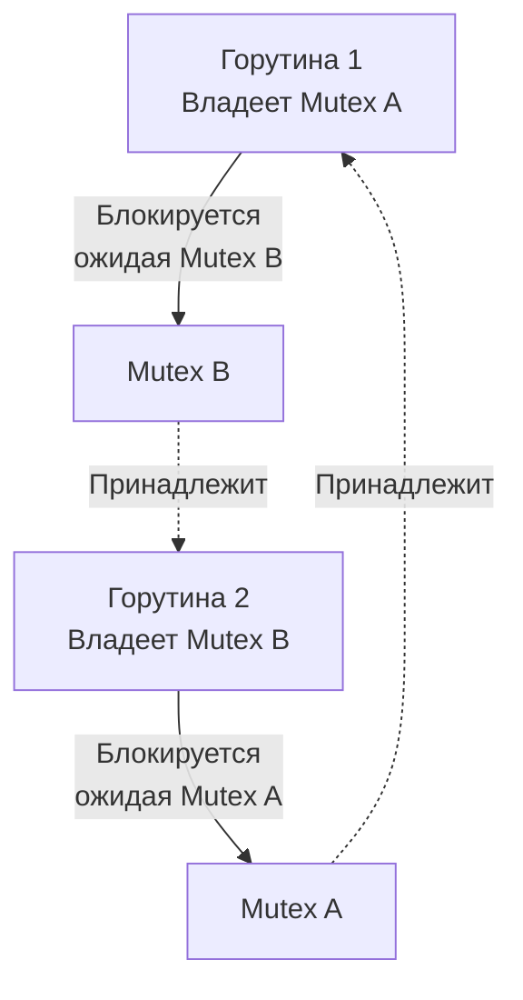

Парадигма конкурентности в Go (горутины и каналы) значительно упрощает написание асинхронного кода по сравнению с коллбеками (Node.js) или ручным управлением потоками ОС (C++). Но за эту простоту мы платим появлением целого класса архитектурных ошибок. 

Когда десятки тысяч независимых горутин пытаются разделить между собой память или обменяться данными, система начинает жить по законам теории хаоса. В этой статье мы разберем главных врагов бэкенд-разработчика: Deadlock, Livelock, Starvation и неявные утечки ресурсов.

---

## 1. Deadlock (Взаимная блокировка)

**Deadlock** — это состояние системы, при котором две или более горутины бесконечно ждут друг друга, из-за чего выполнение программы останавливается.

В информатике существуют **4 условия Коффмана**. Если выполняются все четыре — возникает Deadlock:
1. **Mutual exclusion (Взаимное исключение):** Ресурс не может использоваться несколькими горутинами одновременно (мьютекс или небуферизованный канал).
2. **Hold and wait (Удержание и ожидание):** Горутина уже владеет ресурсом А и запрашивает ресурс Б.
3. **No preemption (Отсутствие вытеснения):** Рантайм или ОС не могут принудительно забрать ресурс (мьютекс) у горутины, пока она сама его не отдаст.
4. **Circular wait (Круговое ожидание):** Горутина 1 ждет ресурс, занятый Горутиной 2, которая ждет ресурс, занятый Горутиной 1.

### Классический AB-BA Deadlock

```go
func main() {
	var muA, muB sync.Mutex

	go func() { // Горутина 1
		muA.Lock()
		time.Sleep(10 * time.Millisecond) // Имитация работы
		muB.Lock()                        // ЖДЕТ МЬЮТЕКС B
		
		muB.Unlock()
		muA.Unlock()
	}()

	// Горутина 2 (Main)
	muB.Lock()
	time.Sleep(10 * time.Millisecond) // Имитация работы
	muA.Lock()                        // ЖДЕТ МЬЮТЕКС A

	muA.Unlock()
	muB.Unlock()
}
```



### Под капотом: Глобальный vs Локальный Deadlock

> [!info] Под капотом: Детектор рантайма (checkdead)
> В Go есть встроенный механизм обнаружения мертвых блокировок. Если вы запустите код выше, программа упадет с паникой: `fatal error: all goroutines are asleep - deadlock!`.
> Как рантайм это понимает? В планировщике есть функция `checkdead()`. Она вызывается, когда количество активно выполняющихся потоков ОС (M) равно нулю, и ни одна горутина не находится в состоянии `_Grunnable` (готовых к выполнению нет). 
> Рантайм видит, что все горутины в системе имеют статус `_Gwaiting` (спят на каналах, мьютексах или таймерах) и нет никаких активных сетевых I/O операций в Netpoll, которые могли бы их разбудить. Если будить некого и некому — это **Глобальный Deadlock**.

> [!warning] Ловушка / Gotcha: Частичный (Локальный) Deadlock
> Механизм `checkdead` **бесполезен в production**. Он ловит только ситуацию, когда заблокированы абсолютно все горутины (включая `main`).
> Если у вас есть HTTP-сервер, который обслуживает другие запросы (то есть есть живые горутины), а где-то в фоне две горутины словили AB-BA Deadlock, **паники не будет**. Рантайм не может математически доказать, что эти две горутины зависли навсегда. Они просто останутся висеть в памяти (статус `_Gwaiting`) до перезапуска сервиса, вызывая постепенную утечку ресурсов.

**Как лечить:**
1. Всегда захватывать мьютексы в **строго одинаковом порядке** во всех частях программы (например, всегда сначала `muA`, потом `muB`).
2. Использовать неблокирующие конструкции (например, каналы с таймаутами через `select`).

---

## 2. Livelock (Динамическая блокировка)

Если Deadlock — это когда две горутины уснули навсегда, то **Livelock** — это когда они обе бодрствуют, постоянно меняют свое состояние, реагируя друг на друга, но система в целом не делает никакой полезной работы.

*Аналогия из жизни:* Вы идете по коридору и сталкиваетесь с человеком. Вы шагаете вправо, чтобы пропустить его, и он одновременно шагает вправо (относительно вас). Вы шагаете влево, и он влево. Вы постоянно двигаетесь (нет Deadlock), но никто не может пройти (нет прогресса).

### Пример из архитектуры (Polling с откатом)

Часто Livelock возникает в распределенных системах или при реализации кастомных спин-локов (Spinlocks), когда две горутины пытаются захватить два ресурса, и при неудаче "вежливо" отпускают первый и пробуют заново с теми же таймингами.

```go
// Псевдокод Livelock
func worker(mu1, mu2 *sync.Mutex) {
	for {
		mu1.Lock()
		if !mu2.TryLock() { // Если второй занят
			mu1.Unlock()    // Отпускаем первый (вежливость)
			continue        // Начинаем заново
		}
		// ... полезная работа ...
		mu2.Unlock()
		mu1.Unlock()
		break
	}
}
```
Если два воркера войдут в этот цикл одновременно, они будут бесконечно захватывать по одному мьютексу, видеть, что второй занят, отпускать свой и начинать заново. 

**Mechanical Sympathy:** В отличие от Deadlock, где горутины паркуются и не потребляют CPU, при Livelock горутины находятся в статусе `_Grunning`. Они **сжигают 100% ядер процессора**, но пропускная способность сервиса равна нулю.

**Как лечить:** Вносить случайность (Jitter) в задержки перед повторными попытками. Вместо мгновенного `continue`, нужно сделать `time.Sleep(random_duration)`, чтобы разбить синхронность их действий.

---

## 3. Goroutine Leaks (Утечки горутин)

Это самая распространенная проблема конкурентности в Go. 
Память в Go управляется сборщиком мусора (GC). Если вы забудете закрыть файл, ОС в конце концов закроет его при завершении процесса (или GC удалит объект). 

Но **горутина никогда не удаляется сборщиком мусора**. Стек горутины и ее структура `g` остаются в куче, пока функция горутины не сделает `return`.

### Сценарий утечки: Брошенный канал

```go
func processRequest() error {
	ch := make(chan Result)
	
	go func() {
		// Делаем тяжелый запрос к внешней API
		res := fetchFromAPI() 
		ch <- res // ОПАСНОСТЬ: отправка в небуферизованный канал
	}()

	select {
	case result := <-ch:
		return nil
	case <-time.After(1 * time.Second):
		return errors.New("timeout") // Мы выходим по таймауту!
	}
}
```

> [!warning] Ловушка / Gotcha: Анатомия утечки
> В коде выше мы ждем ответа 1 секунду. Если `fetchFromAPI` отработает за 5 секунд, функция `processRequest` уже вернет ошибку и канал `ch` больше никто не будет читать.
> Горутина с `fetchFromAPI` дойдет до строки `ch <- res` и **навсегда заблокируется**, так как канал небуферизованный, а получателя больше нет.
> Если этот эндпоинт дергают 1000 раз в секунду, вы будете терять по 1000 горутин ежесекундно. Через несколько часов сервер упадет по OOM (Out Of Memory).

**Как лечить:**
1. Использовать буферизованный канал: `make(chan Result, 1)`. Тогда горутина положит результат в буфер (даже если его никто не прочитает) и успешно завершится.
2. Использовать отмену через `Context` (из статьи [[39. Context. Управление жизненным циклом операций]]).

---

## 4. Starvation (Голодание)

**Голодание** возникает, когда горутина готова к выполнению, но планировщик Go или примитив синхронизации постоянно отдают ресурсы другим, более "агрессивным" горутинам.

### Проблема "жадных" горутин
До появления асинхронного вытеснения в Go 1.14 (статья [[35. Scheduler Go. G, M, P и work stealing]]), горутина, выполняющая бесконечный математический цикл (без вызова других функций или выделения памяти), могла захватить поток ОС (`M`) навсегда. Другие горутины в очереди этого процессора (`P`) голодали.

Сейчас планировщик вытесняет горутины по `sysmon` сигналу `SIGURG`. Однако голодание на мьютексах все еще возможно, если одна горутина постоянно дергает `Lock()` / `Unlock()` в плотном цикле, а другая долго висит в ожидании своей очереди.

> [!tip] Собеседование
> **Вопрос:** Как рантайм Go борется с голоданием на уровне мьютексов?
> **Ответ:** В `sync.Mutex` реализован режим `Starvation Mode`. Если горутина не может захватить мьютекс более 1 миллисекунды, мьютекс переключается в режим, при котором блокировка передается **напрямую** первой горутине в очереди ожидания, минуя "быстрый путь" (Fast Path) и спиннинг (Spinning) для новых пришедших горутин. Это гарантирует отсутствие Tail Latency (задержек в хвосте распределения).

---

## 5. Ошибки дизайна: "Закрытие закрытого"

Работа с каналами требует строгой дисциплины в отношении жизненного цикла (Ownership). Отсутствие дисциплины приводит к панике в рантайме.

**Правила, нарушающие целостность CSP:**
1. **Запись в закрытый канал вызывает panic.**
2. **Повторное закрытие канала вызывает panic.**

```go
func badDesign() {
	ch := make(chan int)
	
	// Воркер 1
	go func() {
		ch <- 1
		close(ch)
	}()
	
	// Воркер 2
	go func() {
		ch <- 2 // Если Воркер 1 уже сделал close(), здесь будет PANIC!
	}()
	
	<-ch
	<-ch
}
```

**Паттерн лечения:** Закрывать канал должен **только** тот, кто в него пишет (Sender). Если писателей несколько (N Send, 1 Receive), никто из них не имеет права закрывать data-канал. Вместо этого Receiver (или оркестратор) должен закрыть специальный `done`-канал, который писатели слушают через `select`, понимая, что пора остановиться.

---

## Итог и диагностика

Любой высоконагруженный бэкенд на Go рано или поздно сталкивается с этими багами. Ваш инструментарий:
1. **Детектор гонок (`-race`):** Находит Data Races во время тестирования.
2. **pprof (`net/http/pprof`):** Зайдя на эндпоинт `/debug/pprof/goroutine?debug=1`, вы можете увидеть дамп стеков **всех** текущих горутин. Если их количество аномально растет и они все висят на `chan receive` — у вас Goroutine Leak.
3. **Trace (`go tool trace`):** Позволяет увидеть, кто и как долго ждет на мьютексах (выявление Starvation и Lock Contention).

Мы прошли долгий путь изучения языка: от базового синтаксиса до внутреннего устройства планировщика, управления памятью и паттернов конкурентности. В следующей, финальной статье этого раздела, мы соберем всю картину воедино и подведем черту перед переходом к "Deep Go": [[44. Итоги раздела. Что нужно знать перед переходом к Deep Go]].