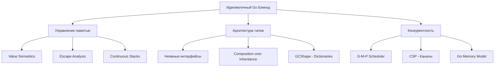

## Переломный момент

Мы завершили огромный путь. Раздел, который начинался с установки языка и объявления переменных, перерос в разбор внутренностей рантайма, устройства планировщика ОС и аппаратных кэш-линий процессора. 

Если вы внимательно изучили предыдущие 43 статьи, ваш инженерный кругозор уже значительно шире, чем у среднестатистического разработчика, который просто пишет `go run` и надеется на лучшее. Вы больше не воспринимаете Go как "упрощенный C" или "странную Java". Вы видите структуры данных в памяти, понимаете цену переключения контекста и знаете, как компилятор принимает решения об аллокациях.

Прежде чем мы двинемся дальше — к созданию реальных бэкенд-сервисов, работе с сетью и стандартной библиотекой, — давайте кристаллизуем фундаментальные принципы языка. Это тот самый "майндсет", который отличает Senior Go Engineer от туриста из других экосистем.

---

## 3 Столпа Идиоматичного Go

Вся философия и техническая реализация Go держится на трех китах: Механической симпатии к памяти, Композиции и Конкурентности на основе сообщений.

### Столп 1: Данные и Память (Value Semantics)
Go — это язык с семантикой значений (Value Semantics), который дает разработчику контроль над тем, где живут данные: на стеке или в куче.

* **Механическая симпатия:** Непрерывные блоки памяти — лучшие друзья CPU. Вы знаете, что слайсы (в отличие от связанных списков) обеспечивают идеальное попадание в кэш L1/L2 ([[17. Slice под капотом. len, cap, append и realloc]]).
* **Escape Analysis:** Вы понимаете, что возврат указателя из функции заставит компилятор выкинуть объект в кучу (Heap), что создаст работу для сборщика мусора (GC). Передача по значению часто бывает дешевле передачи указателя.
* **Инструменты под капотом:** Вы знаете, что `map` — это сложная хэш-таблица с бакетами и механизмом эвакуации ([[19. Map под капотом. hmap, buckets и рост]]), а строки неизменяемы для безопасного шаринга памяти.

### Столп 2: Архитектура и Абстракции
Мы забыли про классы, наследование и иерархии типов. Go требует плоской и прозрачной архитектуры.

* **Интерфейсы — это контракты постфактум:** Тип не знает, какой интерфейс он реализует (Duck Typing). Это позволяет писать слабосвязанный код. Но вы помните, что пустой интерфейс `any` стоит 16 байт и прячет за собой динамическую диспетчеризацию ([[24. Интерфейсы под капотом. iface и eface]]).
* **Композиция вместо наследования:** Мы не строим пирамиды. Мы собираем поведение из маленьких, независимых кусочков с помощью встраивания ([[25. Встраивание. Embedding вместо наследования]]).
* **Дженерики не бесплатны:** Вы знаете про GCShape и скрытые словари (Dictionaries), из-за которых дженерики могут вызывать промахи кэша и замедлять вызов методов ([[33. Дженерики под капотом и ограничения текущей реализации]]).

### Столп 3: Конкурентность (Concurrency is not Parallelism)
Это главная киллер-фича языка, ради которой Go выбирают для высоконагруженных бэкендов.

* **Модель G-M-P:** Горутины живут в User Space. Планировщик сам раскидывает их по системным тредам ОС, воруя работу у соседей (Work Stealing), чтобы не простаивали ядра ([[35. Scheduler Go. G, M, P и work stealing]]).
* **CSP и Каналы:** "Не общайтесь, разделяя память; вместо этого разделяйте память, общаясь". Каналы передают право владения данными, снижая необходимость в мьютексах ([[36. Каналы. Передача данных между горутинами]]).
* **Оркестрация и Жизненный цикл:** Ни одна горутина не должна быть брошена. Вы умеете глушить целые деревья горутин каскадно через `Context` ([[39. Context. Управление жизненным циклом операций]]) и жонглировать потоками через мультиплексор `select`.

---

## Чек-лист для самопроверки

Перед тем как начать писать реальные сетевые сервисы, пробегитесь по этому чек-листу. Если какой-то пункт вызывает сомнения — лучше вернитесь к соответствующей статье. Дальше этот фундамент будет подразумеваться как нечто само собой разумеющееся.

1.  **Понимаю ли я разницу между `len` и `cap` у слайса?** Что произойдет, если я сделаю `append` в слайс, переданный в функцию по значению?
2.  **Смогу ли я объяснить, почему пустой интерфейс `interface{}` убивает производительность в Hot Paths?** 3.  **Знаю ли я, чем Data Race отличается от Race Condition?** Почему интерфейс может оказаться "разорванным" (Torn Write) при отсутствии синхронизации? ([[42. Race Condition и Go Memory Model]]).
3.  **Понимаю ли я, как закрытие канала будит спящие горутины в `select`?** И почему чтение из закрытого канала не вызывает панику, а запись — вызывает?
4.  **Знаю ли я, зачем нужен `context.Context`?** Почему нельзя передавать через него параметры бизнес-логики (`limit`, `offset`), а только Request-Scoped данные (`TraceID`)?
5.  **Умею ли я избегать Goroutine Leaks?** Понимаю ли я, что произойдет с горутиной, которая попытается отправить данные в небуферизованный канал, который никто не слушает?

> [!warning] Ловушка / Gotcha: Иллюзия простоты
> Go — язык с очень маленьким словарем (всего 25 ключевых слов). Его синтаксис можно выучить за выходные. Это порождает когнитивное искажение: разработчики начинают писать production-код на второй неделе знакомства с языком, перенося паттерны из Java, C# или Python.
> Итог всегда печален: месиво из `interface{}`, текущие горутины, убитый Garbage Collector (из-за передачи указателей везде, где только можно) и паники в рантайме. Простота синтаксиса Go не означает простоты инженерии. Она лишь означает, что компилятор не будет прятать от вас сложность аппаратуры.

> [!tip] Собеседование: Хардкорный уровень
> Когда вы будете проходить секцию "Платформа/Internals" на позицию Senior, от вас будут ждать не просто знания "как написать код", но и "что сделает рантайм". 
> Вас спросят про `hmap`, про `sudog` внутри очередей каналов, про алгоритм Work Stealing и про то, как работает сборщик мусора с GCShape. Все эти детали мы разобрали в данном разделе. Возвращайтесь к нему перед каждым серьезным техническим интервью.

## Что дальше?

Мы изучили инструмент. Мы знаем, как он устроен, из каких деталей состоит и как его правильно держать.
Но знание устройства молотка не делает вас архитектором.

В следующем разделе **"6. Стандартная библиотека Go"** мы перейдем к прикладной разработке. Go знаменит своей "батарейкой в комплекте". Мы будем разбирать, как без использования сторонних фреймворков и библиотек поднять мощный HTTP-сервер, организовать потоковое чтение огромных файлов через `io.Reader`, сериализовать сложные структуры в JSON и грамотно работать с файловой системой ОС. 

Тренировочные колеса сняты. Добро пожаловать в реальный бэкенд на Go.