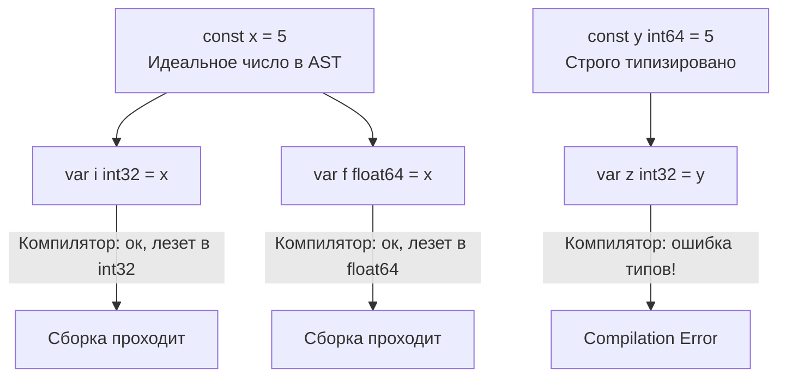

В языках со слабой или динамической типизацией (PHP, Python, JS) переменные — это просто ярлыки для значений, которые могут менять свой тип на лету. В системных языках вроде C++ переменные жестко привязаны к типу и участку памяти, но разработчик вынужден сам следить за их безопасной инициализацией.

Go занимает жесткую позицию прагматичной безопасности: язык статически типизирован, неявные преобразования типов (implicit type casting) запрещены полностью, а неинициализированной памяти (с "мусором" из предыдущих программ) в Go-коде не существует в принципе.

В этой статье мы разберем, как компилятор выводит типы, как рантайм обнуляет память под капотом и почему константы в Go работают не так, как в других языках.

## Два стула инициализации: var и :=

В Go есть два основных способа объявить переменную. Понимание того, когда использовать каждый из них, отличает идиоматичный код от кода новичка.

### 1. Ключевое слово var
Используется для явного указания типа или когда вы хотите объявить переменную, но инициализировать ее позже (в таком случае она получит `Zero Value`).

```go
// Объявление на уровне пакета (глобально) возможно только через var
var GlobalCounter int64 = 100

func process() {
    // Явное указание типа (полезно, если тип важен для контракта)
    var timeout time.Duration = 5 * time.Second
    
    // Объявление без присвоения. Значение будет 0
    var attempt int 
}
```

### 2. Краткое объявление (:=)
Оператор `:=` совмещает объявление переменной и присваивание значения, перекладывая задачу определения типа на компилятор (Type Inference). Доступен **только внутри тел функций**.

```go
func process() {
    timeout := 5 * time.Second // Компилятор сам выведет time.Duration
    count := 10                // По умолчанию выводится как int
}
```

> [!info] Под капотом: Type Inference
> Вывод типов в Go не несет **никакого оверхеда в рантайме** (в отличие от рефлексии). Оператор `:=` — это чистый синтаксический сахар для этапа компиляции. Когда компилятор строит абстрактное синтаксическое дерево (AST) и доходит до фазы Type Checking, он смотрит на возвращаемое значение правой части выражения и "вписывает" этот тип в узел переменной. В генерируемом машинном коде разницы между `var x int = 10` и `x := 10` не существует.

### Идиоматичный подход
- Используйте `:=` в 95% случаев внутри функций для локальных переменных.
- Используйте `var`, когда вам нужно выделить память под структуру или коллекцию, чтобы она была готова к работе (имела нулевое значение), но пока не заполнять её.
- Используйте `var`, если тип по умолчанию не подходит (например, вам нужен `int32`, а `:= 10` даст `int`).

## Ловушка: Затенение переменных (Shadowing)

Оператор `:=` имеет одну очень коварную особенность, на которой "горят" многие мидлы, особенно при обработке ошибок. 

Оператор `:=` объявляет **новые** переменные в текущей лексической области видимости (scope). Если переменная с таким именем уже существует во внешней области видимости, она не будет перезаписана — она будет **затенена**.

```go
var globalErr error

func doSomething() {
    // ...
    if condition {
        // ЛОВУШКА! 
        // := создает НОВУЮ локальную переменную err внутри блока if.
        // Глобальная (или внешняя локальная) globalErr остается nil.
        result, globalErr := operation()
        _ = result
        if globalErr != nil {
            return
        }
    }
    
    // Здесь globalErr всё еще nil!
}
```

>[!tip] Собеседование
> **Как защититься от Shadowing?** 
> 1. Никогда не используйте одинаковые имена для глобальных и локальных переменных.
> 2. Если вам нужно обновить существующую переменную вместе с получением новой, сначала объявите новую через `var`, а затем используйте обычное присваивание `=`:
> ```go
> var result string
> result, globalErr = operation() // Обновит существующую globalErr
> ```
> 3. Обязательно используйте линтер `shadow` в составе `golangci-lint` в CI/CD пайплайнах.

## Zero Values: Безопасность на уровне памяти

Если в C/C++ вы напишете `int x;`, в этой переменной будет лежать мусор — случайные биты, оставшиеся в этой ячейке оперативной памяти от предыдущего использования. Это источник классических уязвимостей безопасности (утечки памяти, непредсказуемое поведение ветвлений).

В Go **неинициализированных переменных не бывает**. Любая переменная, объявленная без явного значения, автоматически получает "нулевое значение" (`Zero Value`):
- Для чисел (`int`, `float64`) — `0`
- Для булевых (`bool`) — `false`
- Для строк (`string`) — `""` (пустая строка)
- Для указателей, слайсов, мап, каналов и интерфейсов — `nil`
- Для структур — структура, где каждое поле инициализировано своим нулевым значением.

### Mechanical Sympathy: Как работает зануление
Обнуление памяти не бывает бесплатным для процессора — это требует тактов CPU на запись нулей.

Когда компилятор аллоцирует переменную (неважно, на стеке благодаря Escape Analysis или в куче), рантайм Go гарантированно очищает этот кусок памяти. В исходниках рантайма (ассемблерные файлы для разных архитектур) за это отвечают высокооптимизированные функции, такие как `runtime.memclrNoHeapPointers`.

Они используют векторные (SIMD) инструкции процессора (например, AVX/SSE на x86-64), чтобы записывать нули широкими блоками по 16, 32 или 64 байта за один такт. Таким образом, разработчики Go разменяли микроскопические накладные расходы на инициализацию (о которых в 99.9% случаев можно не беспокоиться) на абсолютную детерминированность программы и защиту от утечек данных.

## Магия нетипизированных констант

Константы в Go (объявляемые через `const`) — это не просто переменные, доступные только для чтения (read-only variables), как в C++. 

Фундаментальное отличие: в Go константы могут быть **нетипизированными (untyped)**. Это концепция, уникальная для Go, которая сильно упрощает написание кода.

```go
const a = 5         // Нетипизированная константа
const b int32 = 5   // Типизированная константа
```

### В чем разница под капотом?
Типизированная константа подчиняется строгим правилам типизации Go. Вы не можете сложить `int32` и `int64` без явного приведения типов.

Нетипизированная константа живет **только в уме компилятора**. Она не существует в скомпилированном бинарнике как участок памяти до тех пор, пока не будет подставлена в выражение. Компилятор хранит ее значение как идеальное число произвольной точности.



Это позволяет писать математические выражения без бесконечных `int32()`, `float64()` кастов.

```go
const secondsInHour = 60 * 60 // Вычисляется на этапе компиляции!
var delay time.Duration = secondsInHour // Работает идеально

// Вычисления с гигантской точностью (не переполнит int64)
const HugeNumber = 1 << 100 
const SmallNumber = HugeNumber >> 99
var result int = SmallNumber // result = 2, компилируется без проблем!
```

> [!info] Под капотом: Компиляция математики
> Вычисление константных выражений (Constant folding) происходит исключительно на этапе компиляции. Если вы пишете `const x = 2 + 2`, в итоговом ассемблерном коде процессору не придется складывать числа — компилятор сразу подставит инструкцию `MOV eax, 4`.

### Iota: Элегантные перечисления
Так как в Go нет классических `enum`, их принято заменять блоками констант с использованием встроенного генератора `iota`. `iota` начинается с `0` и автоматически увеличивается на `1` для каждой следующей строки в блоке `const()`.

```go
const (
    StatePending = iota // 0
    StateRunning        // 1
    StateFailed         // 2
)
```

С `iota` можно использовать битовые сдвиги для создания флагов (bitmasks), что очень популярно в низкоуровневом бэкенде:

```go
const (
    FlagRead  = 1 << iota // 1 (001)
    FlagWrite             // 2 (010)
    FlagExec              // 4 (100)
)
```

## Итог

1. **var vs :=** : Используйте `:=` для быстрого объявления внутри функций. Используйте `var` на уровне пакета или когда вам нужно безопасное нулевое значение (Zero Value).
2. **Shadowing**: Остерегайтесь оператора `:=`, если переменная с таким же именем уже была объявлена выше по scope. Это приведет к созданию новой переменной и потере данных.
3. **Zero Values**: Go всегда очищает память через оптимизированные SIMD инструкции. Вы никогда не прочитаете "грязные" байты.
4. **Нетипизированные константы**: Идеальные математические сущности времени компиляции, избавляющие от боли явного приведения базовых числовых типов.

Теперь, когда мы понимаем, как объявлять переменные и как рантайм обнуляет под них память, пора посмотреть, какие именно типы данных мы можем в эту память положить. Переходим к следующей статье: [[6. Базовые типы данных. int, float, bool, string]].