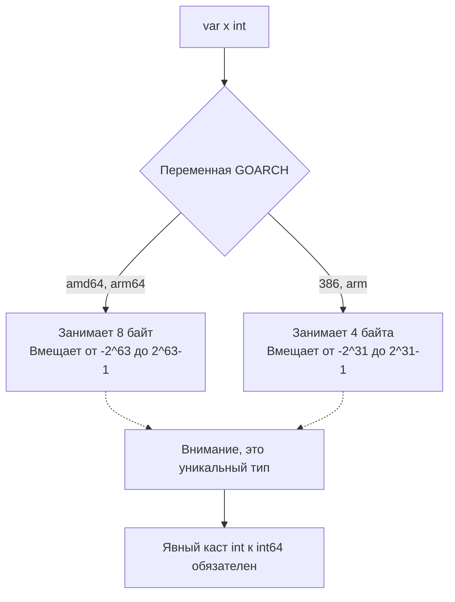

В Go тип данных — это не просто абстрактная категория языка программирования. Это строгий контракт с компилятором, который четко определяет, сколько байт памяти нужно выделить на стеке или в куче, и как именно процессор должен интерпретировать эту последовательность нулей и единиц (как целое число со знаком, как мантиссу и экспоненту или как указатель).

Как бэкенд-разработчики, мы должны думать о базовых типах не просто как о "числах" и "строках", а как о блоках памяти, которые влияют на кэш-линии процессора и потребление RAM. 

## Логический тип: bool

Тип `bool` может принимать значения `true` или `false`. Его значение по умолчанию — `false`.

> [!info] Под капотом: Размер bool
> В теории для хранения логического значения достаточно одного бита. Однако в Go (как и в C/C++) `bool` занимает **1 байт** (8 бит). 
> Почему не 1 бит? Это связано с **Mechanical Sympathy** и устройством процессора. Минимальная адресуемая единица оперативной памяти — это байт. Процессор физически не может прочитать или записать один бит напрямую из RAM. Если бы `bool` занимал 1 бит, компилятору приходилось бы генерировать тяжелый ассемблерный код с побитовыми операциями (read-modify-write) для извлечения или изменения нужного бита из байта. Это убило бы производительность и сломало бы атомарность операций при многопоточном доступе.

## Целочисленные типы: int, uint и их братья

Go предлагает два набора целочисленных типов: платформозависимые (`int`, `uint`, `uintptr`) и с фиксированным размером (`int8`, `int16`, `int32`, `int64` и их беззнаковые `uint` аналоги).

### Платформозависимый int
Когда вы объявляете `var x int` (или используете `x := 10`), вы используете платформозависимый тип. Его размер определяется целевой архитектурой при компиляции (переменная `GOARCH`).



> [!tip] Собеседование
> **Вопрос:** Является ли `int` псевдонимом (алиасом) для `int64` на 64-битной системе?
> **Ответ:** Категорически нет. С точки зрения компилятора Go `int` и `int64` — это **два совершенно разных типа**, даже если под капотом они занимают одинаковые 8 байт. Вы не можете передать `int` в функцию, которая ожидает `int64`, без явного преобразования `int64(x)`. Это защищает код от непредсказуемого поведения при кросс-компиляции под 32-битные системы.

### Mechanical Sympathy: Размер имеет значение
Многие разработчики пишут всё через `int`. Для счетчика цикла это нормально. Но если вы создаете срез (slice) из миллиона элементов, выбор типа критичен.

**Кэш-линия** современного процессора (L1/L2 cache) обычно равна 64 байтам. 
Когда CPU запрашивает у RAM один элемент массива, контроллер памяти приносит всю кэш-линию.
- Если у вас `[]int64`, в одну кэш-линию поместится ровно **8 элементов** (64 / 8).
- Если вы можете обойтись `[]int8`, в кэш-линию поместится **64 элемента**. 

Итерирование по слайсу из `int8` вызовет в 8 раз меньше промахов кэша (Cache Misses) и обращений к медленной RAM, что сделает алгоритм значительно быстрее (благодаря работе Hardware Prefetcher'а). Однако при использовании типов разного размера внутри структур важно помнить про выравнивание памяти (Memory Padding), о чем мы детально поговорим в статье про структуры.

### Переполнение (Integer Overflow)
В Go целочисленное переполнение не вызывает ошибку (panic) в рантайме. Оно тихо оборачивается (wrap-around) по правилам дополнения до двух.

```go
var max int8 = 127
max = max + 1
fmt.Println(max) // Выведет -128
```
Если в вашем коде критично поймать переполнение (например, финансовые расчеты или генерация уникальных ID), используйте функции из стандартного пакета `math/bits`, такие как `bits.Add64()`, которые возвращают флаг переноса (carry out).

## Числа с плавающей точкой: float32, float64

В Go нет типов `float` или `double`. Вы обязаны явно указать размер: `float32` (одинарная точность) или `float64` (двойная точность). Если используете `:=`, компилятор выберет `float64`.

Под капотом это строгая реализация стандарта **IEEE-754**. 
Число разбивается на три компонента на битовом уровне:
1. Знак (Sign).
2. Экспонента (Exponent).
3. Мантисса (Fraction / Mantissa).

> [!warning] Ловушка / Gotcha
> Классическая ловушка плавающей точки работает в Go точно так же, как в любом другом языке:
> ```go
> a := 0.1
> b := 0.2
> fmt.Println(a + b == 0.3) // Выведет false! (в реальности 0.30000000000000004)
> ```
> **Никогда не сравнивайте float через оператор `==`.** Вместо этого сравнивайте абсолютную разницу с небольшой погрешностью (epsilon): `math.Abs(a - b) < 1e-9`.
> **Никогда не используйте float для денег.** Округляющиеся копейки приведут к финансовым расхождениям. Для денег используйте целые числа (`int64`, храня суммы в минимальных единицах — копейках или центах) либо специализированные библиотеки, такие как `github.com/shopspring/decimal`.

Также типы `float` могут принимать специальные значения: `NaN` (Not a Number), `+Inf` (положительная бесконечность) и `-Inf`. Проверять их нужно через пакет `math`: `math.IsNaN(f)`.

## Строки: string

Строка в Go (`string`) — это неизменяемая (immutable) последовательность байт (чаще всего представляющая UTF-8 текст). 

С точки зрения рантайма строка — это крошечная легковесная структура `StringHeader` из двух полей (размером 16 байт на 64-битной ОС):

1. `Data` — указатель на неизменяемый массив байт в памяти.
2. `Len` — длина строки в байтах (типа `int`).

```go
// Так строка выглядит под капотом в пакете reflect
type StringHeader struct {
    Data uintptr
    Len  int
}
```

Благодаря такому устройству, вычисление длины строки `len(str)` — это операция $O(1)$, которая отрабатывает мгновенно, так как просто читает поле `Len`. Присвоение строк `a = b` или передача в функцию по значению — это сверхдешевая операция: копируются только эти 16 байт структуры, а не сами текстовые данные.

Поскольку строки фундаментально важны и таят в себе особенности при работе с кириллицей и эмодзи, мы будем подробно препарировать их устройство в памяти и работу с GC в отдельной статье [[20. Строки в Go. Immutable string и работа с Unicode]].

## Строгость приведения типов

Go требует **явного преобразования** (Type Conversion) для всех типов. В языке полностью отсутствует неявное приведение (Implicit Casting) из C++ или C#.

```go
var i int32 = 42
// var f float64 = i // Ошибка компиляции!
var f float64 = float64(i) // Только так
```

Это касается даже типов, которые под капотом имеют идентичную структуру. Если вы создадите свой тип поверх базового:
```go
type UserID int64
var id UserID = 100

var x int64 = 50
// x = id // Ошибка компиляции! Cannot use 'id' (type UserID) as type int64
x = int64(id) // Явное преобразование
```

Этот подход избавляет разработчиков от "магии", когда компилятор незаметно конвертирует типы, теряя точность или изменяя знак (например, приведение `int` к `uint` в C++). Вы всегда видите в коде, где происходит трансформация данных.

## Итог

1. **`bool`** занимает 1 байт из-за архитектурных ограничений адресации памяти процессором.
2. **`int`** и **`uint`** меняют свой размер (4 или 8 байт) в зависимости от архитектуры. Используйте `int32`/`int64`, когда вам нужен жестко фиксированный размер (например, бинарные протоколы или API).
3. **Mechanical Sympathy**: Выбирайте минимально необходимый размер типа (`int8`, `int16`) для больших массивов, чтобы максимизировать эффективность кэша процессора L1/L2.
4. **`float`**: Подчиняется IEEE-754. Никаких сравнений через `==` и никаких финансовых расчетов.
5. **Строгая типизация**: Компилятор не делает неявных приведений. Все преобразования данных должны быть написаны программистом явно.

Хотя `string` является базовым типом, текстовые данные в Go тесно связаны с кодировкой UTF-8 и концепцией рун (runes). В следующей статье [[7. Rune, Byte и Unicode в Go]] мы разберемся, почему в Go нет классического типа `char`, как компилятор разделяет байты и символы, и почему итерация по строке может преподнести неприятные сюрпризы при работе с кириллицей.