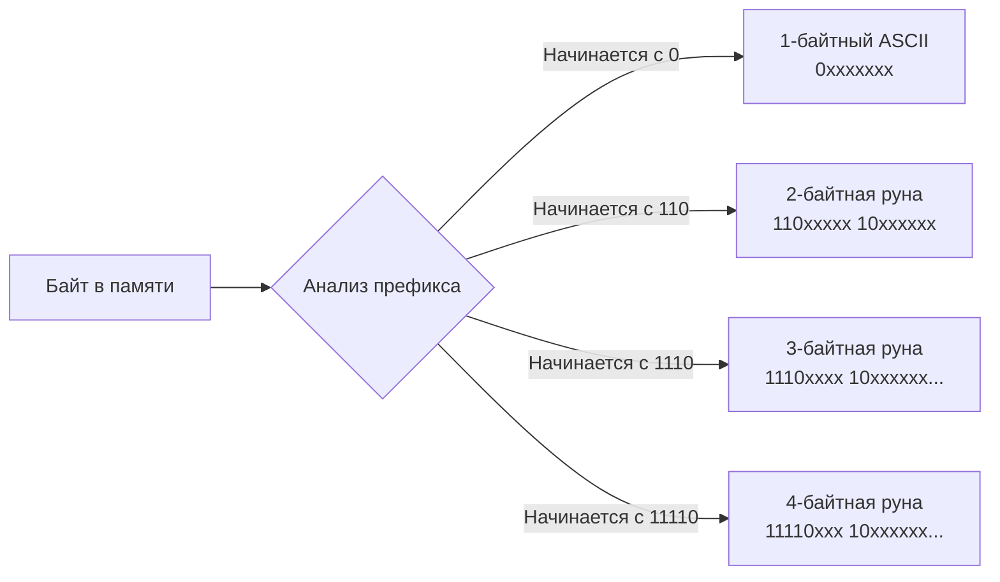

Если вы пришли из C/C++, то привыкли, что символ — это `char`, занимающий 1 байт. Если из Java или C#, то `char` для вас — это 2 байта (кодировка UTF-16). 

В Go нет типа `char`. Создатели языка (Роб Пайк и Кен Томпсон) — это те же самые люди, которые в 1992 году изобрели кодировку **UTF-8**. Поэтому поддержка UTF-8 вшита в ДНК языка, а работа с текстом выстроена вокруг двух фундаментальных типов: `byte` и `rune`.

Чтобы не допускать банальных ошибок при работе с текстом в высоконагруженных системах, бэкенд-разработчику необходимо понимать разницу между физическим хранением строки в памяти и её логическим представлением.

## Истинное лицо: byte и rune

В отличие от многих языков, где байт и символ — это уникальные сущности, в Go это просто синтаксические псевдонимы (aliases) для базовых целочисленных типов.

```go
type byte = uint8   // Занимает 1 байт (от 0 до 255)
type rune = int32   // Занимает 4 байта (от -2^31 до 2^31-1)
```

> [!info] Под капотом: Псевдонимы типов
> Ключевое слово `=` в определении типа означает, что компилятор считает `byte` и `uint8` **абсолютно идентичными**. Вы можете передать `byte` в функцию, ожидающую `uint8`, без явного приведения типов (в отличие от создания нового типа без `=`, как мы обсуждали в предыдущей статье). Псевдонимы созданы исключительно для читаемости кода: увидев `byte`, программист понимает, что речь идет о сырых бинарных данных, а увидев `rune` — о символе Unicode.

### Почему rune — это int32?
Стандарт Unicode содержит более 140 000 символов. Каждый символ (буква, иероглиф, эмодзи) имеет свой уникальный номер — **Code Point** (кодовая точка). 
Например:
- Латинская `A` — это кодовая точка `U+0041`.
- Кириллистическая `П` — это `U+041F`.
- Эмодзи `🌍` — это `U+1F30D`.

Максимально возможная кодовая точка в Unicode требует 21 бита памяти. Ближайший стандартный тип данных, в который гарантированно поместится любой символ Unicode — это 32-битное целое число. Поэтому `rune` (руна) является синонимом `int32`.

## Строка — это массив байт, а не рун

Фундаментальное правило Go: **строка (`string`) — это неизменяемый срез (slice) байт (`byte`), а не рун (`rune`)**. Строка не знает, какие символы внутри нее лежат, она хранит только бинарные данные, закодированные в UTF-8.

В кодировке UTF-8 размер одного символа **динамический** — он может занимать от 1 до 4 байт:
- ASCII символы (английский алфавит, цифры) — **1 байт**.
- Кириллица, латынь с диакритикой, греческий — **2 байта**.
- Большинство азиатских иероглифов — **3 байта**.
- Эмодзи и редкие символы — **4 байта**.

### Ловушка длины строки

Из-за динамической природы UTF-8 встроенная функция `len()` ведет себя не так, как ожидают разработчики из мира Python или PHP. Она возвращает **количество байт**, а не количество символов.

```go
func main() {
    s1 := "Hello"
    fmt.Println(len(s1)) // Выведет: 5 (5 букв * 1 байт)

    s2 := "Привет"
    fmt.Println(len(s2)) // Выведет: 12! (6 букв * 2 байта)

    s3 := "Go🌍"
    fmt.Println(len(s3)) // Выведет: 6 (2 ASCII байта + 4 байта эмодзи)
}
```

> [!tip] Собеседование
> **Вопрос:** Как получить реальное количество символов в строке для ограничения длины (например, валидация логина до 20 символов)?
> **Ответ:** Использовать функцию `utf8.RuneCountInString(s)` из стандартной библиотеки. Она за $O(N)$ проходит по строке и анализирует байты, подсчитывая реальные символы без аллокации дополнительной памяти.

## Итерация по строке: for vs range

Поскольку строка состоит из байт, способ обхода строки кардинально меняет результат.

### Подход 1: Обход по байтам (классический for)
Если вы используете классический цикл со счетчиком, вы обращаетесь к "сырым" байтам в памяти.

```go
s := "Код"
for i := 0; i < len(s); i++ {
    fmt.Printf("%x ", s[i]) 
}
// Выведет: d0 9a d0 be d0 b4 (6 байт, представляющих 3 кириллические буквы)
```

### Подход 2: Декодирование на лету (for ... range)
Когда вы используете `range` по строке, рантайм Go понимает, что вы хотите получить логические символы. Он **автоматически декодирует** UTF-8 последовательности в `rune` на каждой итерации.

```go
s := "Go🌍"
for i, r := range s {
    fmt.Printf("Индекс: %d, Руна: %c\n", i, r)
}
```

> [!warning] Ловушка / Gotcha
> Обратите внимание на индексы, которые выдаст этот цикл!
> Индекс: 0, Руна: G
> Индекс: 1, Руна: o
> Индекс: **2**, Руна: 🌍
> *(Индексы 3, 4 и 5 пропущены, так как эмодзи заняло 4 байта начиная со второго индекса).*
> Индекс в цикле `range` по строке — это **не порядковый номер буквы**, это байтовое смещение в памяти (byte offset) от начала строки.

### Mechanical Sympathy: Как работает декодирование UTF-8

Как цикл `range` понимает, сколько байт нужно прочитать для текущей руны? Секрет кроется в самом стандарте UTF-8. Процессор смотрит на старшие биты (префиксы) первого байта:



Эта проверка реализована в Go максимально эффективно с использованием битовых масок. Если процессор встречает некорректную последовательность байт (например, битый текстовый файл), `range` вернет специальный символ замены `\uFFFD` ( — Replacement Character), который занимает 3 байта, и сместит индекс на 1.

## Срезы (Slicing) строк ломают UTF-8

Еще одна частая ошибка на собеседованиях и в продакшене — попытка отрезать часть строки по индексам.
Операция среза `s[start:end]` работает **строго на уровне байт**.

```go
s := "Привет"
fmt.Println(s[0:2]) // Ожидаем "Пр", получаем "П" (т.к. "П" занимает 2 байта)
fmt.Println(s[0:1]) // Ожидаем "П", получаем "" (сломали кодировку)
```

Разрезав двухбайтный символ пополам, мы получили невалидный UTF-8. 

**Как правильно отрезать 3 символа кириллицы?**

Плохой подход (через аллокацию):
```go
// Приведение строки к слайсу рун.
// Внимание: выделяет O(N) памяти в куче для создания массива int32!
runes := []rune("Привет") 
res := string(runes[0:3]) // "При"
```

Хороший подход (используя пакет `utf8` без аллокаций):
```go
s := "Привет"
// Руками находим байтовое смещение нужной руны, чтобы отрезать безопасно.
// Пакет utf8 предоставляет инструменты для работы без выделения памяти.
```
*(Подробно алгоритмы оптимизированной работы с текстом и Zero-Allocation парсинг мы рассмотрим в разделе глубокого погружения в [[20. Строки в Go. Immutable string и работа с Unicode]]).*

## Итог

1. **`byte`** — это синоним `uint8` (1 байт). Используется для работы с сырыми бинарными потоками данных (файлы, сокеты, хэши).
2. **`rune`** — это синоним `int32` (4 байта). Представляет собой единый символ (Code Point) в стандарте Unicode.
3. Строка `string` — это неизменяемый срез байт в кодировке UTF-8, а не массив символов.
4. Функция `len(s)` и оператор среза `s[a:b]` работают с байтами. Если в тексте есть что-то, кроме английских букв, они могут сломать текст.
5. Итерация `for i, r := range s` автоматически и безопасно декодирует строку из байт в руны, но `i` будет перепрыгивать через индексы. 
6. Для подсчета реального количества символов всегда используйте `utf8.RuneCountInString()`.

Разобравшись с базовыми "кирпичиками" данных, мы готовы перейти к тому, как этими данными манипулировать на уровне языка. В следующей статье [[8. Операторы и выражения]] мы рассмотрим арифметические, логические и битовые операции, а также как Go защищает нас от типичных ошибок приоритета операторов из C-подобных языков.