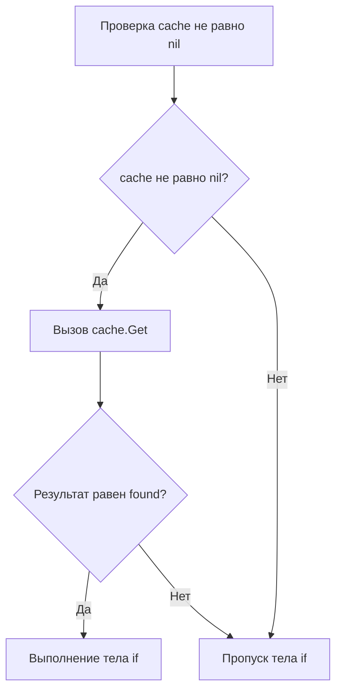

Если вы пишете на C++ или Java, ваши выражения могут быть произведениями искусства: с перегруженными операторами, постфиксными инкрементами внутри вызовов функций и неявными кастами. 

Go считает, что "произведение искусства" в коде — это синоним "нечитаемого мусора". Язык намеренно ограничивает возможности разработчика в построении выражений, чтобы код читался линейно, однозначно и компилировался максимально быстро. В Go нет перегрузки операторов, инкремент — это не выражение, а унарный побитовый NOT выглядит совсем не так, как вы привыкли в C.

В этой статье мы разберем специфику работы операторов в Go, заглянем в то, как компилятор оптимизирует логические выражения, и изучим уникальные битовые операции языка.

## 1. Инкремент и декремент: Конец неопределенному поведению

В C, C++ и Java инкремент (`++`) и декремент (`--`) — это **выражения (expressions)**. Они возвращают значение. Из-за этого возможны конструкции вроде `a = b++ + ++c;`.
Исторически такие выражения становились причиной сложнейших багов и Неопределенного Поведения (Undefined Behavior), так как порядок вычисления аргументов часто зависел от конкретного компилятора.

> [!warning] Ловушка / Gotcha
> В Go `++` и `--` — это **инструкции (statements)**, а не выражения. Они не возвращают значение.
> 
> ```go
> i := 0
> // j := i++ // Ошибка компиляции! syntax error: unexpected ++
> i++         // Правильно: отдельная инструкция
> ```
> Кроме того, в Go **не существует префиксных форм** `++i` или `--i`. Есть только постфиксная запись, которая применяется к операнду на отдельной строке.

Это архитектурное решение полностью убивает целый класс ошибок, связанных с порядком вычислений (Order of Evaluation), делая код скучным, но предсказуемым.

## 2. Битовые операции и уникальный &^ (Bit Clear)

Для бэкендера, пишущего сетевые протоколы, работающего с правами доступа (битовыми масками) или криптографией, битовые операции — основной инструмент. Go поддерживает стандартный набор: `&` (AND), `|` (OR), `^` (XOR), `<<` (сдвиг влево), `>>` (сдвиг вправо).

Но здесь есть два важных отличия от C-подобных языков.

### Унарный XOR вместо побитового NOT (~)
В C/C++ для инвертирования битов (побитового отрицания) используется тильда `~`. В Go тильды нет. Вместо нее используется унарный `^` (XOR с маской из единиц).
```go
var a uint8 = 0b00001111
b := ^a // Результат: 11110000
```
Если `^` стоит между двумя операндами (`a ^ b`) — это логический XOR. Если перед одним (`^a`) — это инверсия битов.

### Уникальный оператор: &^ (Сброс бита / AND NOT)
Go ввел специфический оператор `&^`, который читается как "AND NOT". Он используется для очистки (сброса) определенных битов в маске. 

`z = x &^ y` означает: каждый бит в `z` будет равен `0`, если соответствующий бит в `y` равен `1`. Иначе он берется из `x`.

```go
const (
    Read    = 1 << iota // 001
    Write               // 010
    Execute             // 100
)

func main() {
    permissions := Read | Write | Execute // 111 (Все права)
    
    // Хотим отобрать право Write
    // В C++ пришлось бы писать: permissions &= ~Write
    // В Go есть элегантный оператор сброса:
    permissions = permissions &^ Write // 101 (Остались Read и Execute)
}
```

> [!info] Под капотом: Mechanical Sympathy
> На уровне процессора оператор `&^` во многих архитектурах мапится в одну нативную ассемблерную инструкцию. Например, в ARM64 существует инструкция `BIC` (Bit Clear), которая делает ровно это (выполняет логическое И с инвертированным вторым операндом). Компилятор Go напрямую преобразует `a &^ b` в `BIC a, b`, не тратя такты CPU на предварительное инвертирование маски.

### Арифметические сдвиги и тип результата
Операторы сдвига `<<` и `>>` в Go всегда сдвигают биты. Важная особенность: тип сдвига (логический или арифметический) зависит от **типа левого операнда**.
- Если тип беззнаковый (`uint`, `uint64`), сдвиг вправо `>>` будет **логическим** (освобождающиеся старшие биты заполняются нулями).
- Если тип знаковый (`int`, `int64`), сдвиг вправо будет **арифметическим** (старшие биты заполняются копией знакового бита, чтобы сохранить минус).

```go
var x int8 = -128 // 10000000
fmt.Printf("%b", uint8(x)) // 10000000

// Арифметический сдвиг знакового типа сохраняет знак (единицы слева)
fmt.Printf("%b", x>>1)     // 11000000 (-64)
```

## 3. Short-Circuit Evaluation (Ленивые логические вычисления)

Операторы `&&` (логическое И) и `||` (логическое ИЛИ) в Go вычисляются по принципу "короткого замыкания" (Short-circuiting), строго слева направо. 

Это означает, что правый операнд не будет вычисляться, если результат уже очевиден из левого.
```go
// Если cache == nil, паники не будет, так как cache.Get() даже не попытается выполниться.
if cache != nil && cache.Get("key") == "found" {
    // ...
}
```

### Mechanical Sympathy: Оптимизация ветвлений
На уровне машинного кода ленивые вычисления — это не просто удобство, это механизм управления потоком команд (Control Flow), критически важный для предсказателя ветвлений процессора (Branch Predictor).



Компилятор преобразует выражение с `&&` в цепочку условных переходов (`JMP` / `JNE` в x86 ASM). Правая часть выражения может содержать тяжелый вызов к БД или сложную математику. Грамотное расположение условий (самое легкое или часто отвергаемое условие — слева) спасет миллионы тактов CPU.

> [!tip] Собеседование
> **Вопрос:** Вы пишете `if heavyQuery1() || heavyQuery2()`. Что нужно поставить первым?
> **Ответ:** Ту функцию, которая выполняется быстрее ИЛИ чаще возвращает `true`. В случае с `||` (ИЛИ), если левая часть возвращает `true`, правая часть игнорируется. Это называется оптимизацией по вероятности (Probability Based Optimization) на уровне разработчика.

## 4. Приоритет операторов: Минимализм Go

Одной из причин, почему код на C++ бывает трудно читать, является наличие 15+ уровней приоритета операторов. Программистам приходится заучивать, что `<<` выполняется до `==`, а побитовые `&` и `|` почему-то имеют приоритет ниже, чем сравнение (историческая ошибка дизайна C).

В Go авторы безжалостно упростили таблицу приоритетов, оставив всего **5 уровней**. Чем выше уровень, тем раньше выполняется операция:

1. `*`, `/`, `%`, `<<`, `>>`, `&`, `&^` (Умножения, деления и сдвиги)
2. `+`, `-`, `|`, `^` (Сложения и побитовые OR/XOR)
3. `==`, `!=`, `<`, `<=`, `>`, `>=` (Сравнения)
4. `&&` (Логическое И)
5. `||` (Логическое ИЛИ)

Благодаря тому, что побитовые операции (`&`, `|`, `^`) встали в один ряд с арифметическими, выражения типа `if a & mask == 0` теперь работают **без скобок**, как и ожидает логика (в C/C++ это выражение интерпретируется как `a & (mask == 0)`, что ломает код).

## 5. Никакой перегрузки операторов

В Go нельзя переопределить оператор `+`, чтобы он складывал ваши кастомные структуры `Matrix` или `Vector`. 
Вы должны написать метод: `func (m Matrix) Add(other Matrix) Matrix`.

Почему так строго? Авторы языка считают, что оператор должен нести гарантию сложности $O(1)$ и отсутствия побочных эффектов. 
Когда вы читаете код `a = b + c`:
- В C++ это может вызывать неявное чтение из файла, блокировку мьютекса или аллокацию мегабайта памяти в куче (если `b` и `c` — сложные объекты).
- В Go вы на 100% уверены, что это либо сложение чисел, либо конкатенация двух строк. Это просто несколько тактов процессора, никаких скрытых сетевых вызовов или аллокаций гигантских структур.

> [!warning] Ловушка / Gotcha: Деление и %
> 1. Оператор остатка от деления `%` (modulo) в Go работает **только с целыми числами**. Если вам нужен остаток от деления `float64`, вы обязаны использовать функцию `math.Mod(a, b)`.
> 2. Деление на ноль константы (например, `x := 1 / 0`) выдаст ошибку еще на этапе компиляции. Но если делитель — переменная (`1 / y`, где `y = 0`), программа поймает аппаратное прерывание от CPU (SIGFPE) в рантайме, которое Go перехватит и превратит в `panic`, убив горутину (подробнее про это мы поговорим в [[13. Panic, Recover и stack trace]]).

## Итог

1. Инкремент `++` и декремент `--` — это изолированные инструкции, а не выражения. Запрещено использовать их внутри присваиваний или других вычислений.
2. Вместо `~` для инверсии битов используется унарный `^`.
3. Оператор `&^` (AND NOT) — идиоматичный и высокопроизводительный способ сбрасывать биты в масках.
4. Логические операторы `&&` и `||` вычисляются лениво (short-circuit). Располагайте быстрые/вероятные проверки слева, чтобы экономить такты CPU.
5. Приоритетов операторов всего 5, они логичны и предсказуемы.
6. Отсутствие перегрузки операторов гарантирует, что за `+` или `*` не скрывается тяжелая бизнес-логика.

Выражения в Go утилитарны: они делают ровно то, что написано. Выработав понимание базовых логических вычислений, мы переходим к управлению потоком выполнения программы (Control Flow). В следующей статье [[9. Управляющие конструкции. if, switch, for]] мы посмотрим, как Go избавился от циклов `while` и `do...while`, и почему встроенный `switch` в Go является одним из самых мощных среди всех современных языков программирования.