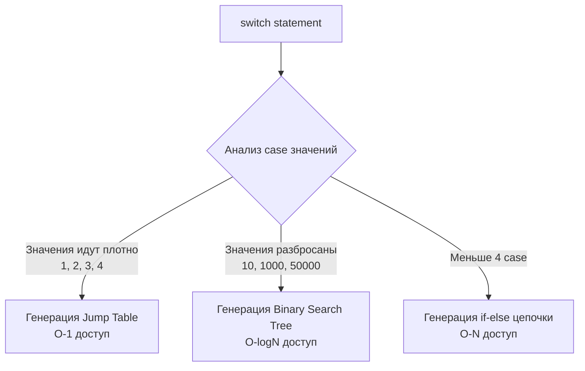

В большинстве современных языков программирования синтаксис управления потоком (Control Flow) раздут до невероятных масштабов: `while`, `do...while`, `foreach`, тернарные операторы, сложные конструкции `switch` с обязательными `break`.

Философия Go — ортогональность и минимализм. Создатели языка безжалостно вырезали всё лишнее. В Go нет циклов `while` или `do...while`. В Go нет тернарного оператора (`condition ? a : b`). Зато встроенный `switch` настолько могущественен, что заменяет собой бесконечные цепочки `if-else`. 

В этой статье мы разберем анатомию трех главных (и единственных) управляющих конструкций: `if`, `for` и `switch`, а также заглянем в их машинный код и разберем самую громкую проблему Go, исправленную только в версии 1.22.

## 1. Конструкция if: Инициализация по месту

Базовый `if` в Go выглядит привычно, за исключением того, что условие не нужно оборачивать в круглые скобки. Фигурные скобки обязательны всегда, даже если внутри одна строка кода — это защищает от классических уязвимостей вроде `goto fail` из Apple iOS.

Но главная фича `if` в Go — это **блок инициализации** перед условием.

```go
// Классический подход (переменная user "утекает" во внешнюю область видимости)
user := getUser()
if user.IsActive() {
    // ...
}

// Идиоматичный Go: инициализация и проверка в одной строке
if user := getUser(); user.IsActive() {
    // user доступна только внутри этого блока if и связанных else
    fmt.Println(user.Name)
}
// Здесь переменная user больше не существует (удалена из Scope)
```

Это ключевой паттерн для обработки ошибок, который мы постоянно будем видеть в бэкенд-коде:
```go
if err := processData(); err != nil {
    return err // Обработка и немедленный возврат (Early Return)
}
```

>[!warning] Ловушка / Gotcha
> Как мы обсуждали в статье [[5. Переменные, константы и вывод типа]], оператор `:=` внутри блока `if` создает **новую** переменную в текущей области видимости. Если вы пытаетесь присвоить результат функции уже существующей глобальной переменной, но используете `:=` внутри `if`, вы создадите локальную тень (Shadowing), которая исчезнет при выходе из `if`.

## 2. Ультимативный for: Один цикл, чтобы править всеми

Поскольку в Go нет `while`, ключевое слово `for` берет на себя все сценарии организации циклов. У него есть четыре фундаментальные формы.

### Форма 1: Классический C-style
Используется, когда нужен жесткий контроль над индексом.
```go
for i := 0; i < 10; i++ {
    // ...
}
```

### Форма 2: Замена while
Если опустить блоки инициализации и поститерации, `for` превращается в классический `while`.
```go
n := 1
for n < 100 {
    n *= 2
}
```

### Форма 3: Бесконечный цикл
Отсутствие условия делает цикл бесконечным. Это стандартный паттерн для воркеров (worker pools) или горутин, читающих данные из каналов.
```go
for {
    msg := <-ch // Ожидание сообщения из канала
    process(msg)
}
```

### Форма 4: Цикл for ... range
Это самый популярный вид цикла в Go. Он умеет итерироваться по слайсам, массивам, строкам (декодируя UTF-8, как мы видели в [[7. Rune, Byte и Unicode в Go]]), мапам и каналам.

```go
items :=[]string{"apple", "banana", "cherry"}
for index, value := range items {
    fmt.Printf("%d: %s\n", index, value)
}
```

>[!tip] Собеседование
> **Вопрос:** Вы пишете `for index, value := range bigSlice`. Слайс содержит тяжелые структуры по 1 КБ каждая. Будет ли этот код медленным?
> **Ответ:** Да! Переменная `value` — это **копия** элемента. На каждой итерации рантайм будет копировать 1 КБ данных из слайса в переменную `value`. Чтобы избежать оверхеда, используйте итерацию только по индексу: `for i := range bigSlice`, и обращайтесь к элементам напрямую: `&bigSlice[i]`.

### Самая известная ловушка Go: Замыкания в цикле (Исправлено в Go 1.22)

Если вы пойдете на собеседование по Go, вас **обязательно** спросят про эту особенность, потому что до релиза Go 1.22 (февраль 2024 года) она была причиной тысяч багов в production.

**Код до Go 1.22:**
```go
funcs := make([]func(), 0)
for _, v := range[]int{1, 2, 3} {
    // Каждая функция "замыкает" (closure) переменную v
    funcs = append(funcs, func() { fmt.Println(v) })
}
for _, f := range funcs {
    f() 
}
// Вывод в Go 1.21: 3, 3, 3! (Ожидали 1, 2, 3)
```

**Почему так происходило под капотом?**
До версии 1.22 переменная `v` создавалась компилятором **один раз** перед циклом. На каждой итерации в этот же адрес памяти просто записывалось новое значение. Замыкания захватывали указатель на эту единственную переменную `v`. Когда цикл завершался, в `v` лежало последнее значение (3), и все функции выводили его.
Приходилось писать "костыль": `v := v` внутри цикла.

**Начиная с Go 1.22**, компилятор автоматически создает **новую переменную `v` (с новым адресом) на каждой итерации**. Теперь этот код безопасно выводит `1, 2, 3` без каких-либо костылей. Обязательно упоминайте это историческое поведение, чтобы показать глубокое понимание развития языка.

## 3. switch: Мощь и Mechanical Sympathy

Конструкция `switch` в Go сильно отличается от своих аналогов в C++ или Java.

1. **Нет неявного fallthrough**. В C/C++, если вы забыли написать `break` в конце `case`, выполнение провалится в следующий `case`. В Go `break` подставляется неявно. Если вы действительно хотите провалиться в следующий блок, используйте ключевое слово `fallthrough` в самом конце блока `case`.
2. **Множественные значения**. Вы можете перечислять значения через запятую: `case 1, 2, 3:`.
3. **Switch без условия**. Заменяет громоздкие цепочки `if - else if - else`.

```go
score := 85

// Switch без значения работает как switch true
switch {
case score >= 90:
    fmt.Println("A")
case score >= 80:
    fmt.Println("B")
default:
    fmt.Println("F")
}
```

### Под капотом компилятора: Как оптимизируется switch?

Почему `switch` работает быстрее цепочки `if-else`? 
Компилятор Go проводит глубокий анализ ваших `case` значений на этапе генерации SSA (Single Static Assignment). В зависимости от плотности (density) значений, он применяет одну из трех архитектурных оптимизаций:



1. **Jump Table (Таблица переходов)**: Если вы проверяете значения типа "статусы" (0, 1, 2, 3), компилятор вообще не будет делать сравнений в рантайме. Он создаст в памяти массив адресов инструкций. Значение переменной становится индексом этого массива. Процессор совершает мгновенный переход (ассемблерная инструкция `JMP`) по индексу за $O(1)$. Это максимально "дружит" с кэшем инструкций процессора (I-Cache).
2. **Binary Search Tree**: Если значения сильно разбросаны, таблица переходов заняла бы гигантский объем памяти (заполненная пустыми ссылками). Тогда компилятор строит сбалансированное бинарное дерево из инструкций сравнения и переходов, находя нужный блок за $O(\log N)$.
3. **If-Else цепочка**: Применяется только если `case` очень мало, потому что накладные расходы на создание дерева превышают выгоду.

Понимая эти механизмы (Mechanical Sympathy), вы можете проектировать свои константы (`iota` из статьи [[5. Переменные, константы и вывод типа]]) плотными рядами (0, 1, 2, 3...), чтобы компилятор мог использовать сверхбыстрые таблицы переходов в ваших state-машинах.

## Type Switch: Рефлексия на минималках

У `switch` есть еще одна суперспособность — работа с интерфейсами. Вы можете переключаться не по значению, а по **типу** данных, лежащих в переменной типа `interface{}`.

```go
var v interface{} = "Hello, System!"

switch val := v.(type) { // Специальный синтаксис .(type)
case int:
    fmt.Printf("Это число, возводим в квадрат: %d\n", val*val)
case string:
    fmt.Printf("Это строка длиной: %d байт\n", len(val))
default:
    fmt.Println("Неизвестный тип")
}
```

Этот механизм базируется на внутреннем устройстве пустых интерфейсов `eface` (подробнее о них мы поговорим в разделе про ООП). Рантайм проверяет скрытый указатель на тип внутри интерфейса, что позволяет писать безопасный обобщенный код без тяжеловесной рефлексии.

## Итог

1. **`if`** поддерживает инициализацию перед условием (`if err := do(); err != nil`). Остерегайтесь локального затенения переменных (shadowing) при использовании `:=`.
2. **`for`** — единственный цикл в языке. Он может быть `while`-циклом, счетчиком или обходить коллекции через `range`. 
3. **Ловушка Loop Variable**: Помните, что с Go 1.22 переменная цикла в `range` пересоздается на каждой итерации. В старых версиях она переиспользовала адрес памяти, ломая замыкания.
4. **`switch`** в Go не проваливается вниз без явного `fallthrough`. На уровне машинного кода компилятор оптимизирует его в $O(1)$ Jump-таблицы или $O(\log N)$ бинарные деревья, что делает его гораздо эффективнее длинных `if-else`.
5. **Type Switch** позволяет безопасно распаковывать значения из интерфейсов по их конкретному типу.

Поток управления (Control Flow) в Go линейный и предсказуемый. Большинство логических блоков рано или поздно упаковываются в переиспользуемые модули. В следующей статье [[10. Функции. Аргументы, return, multiple return values]] мы разберем, как в Go устроены функции — First-Class Citizens языка, как они передают аргументы на стеке и почему возврат нескольких значений — это киллер-фича при проектировании API.