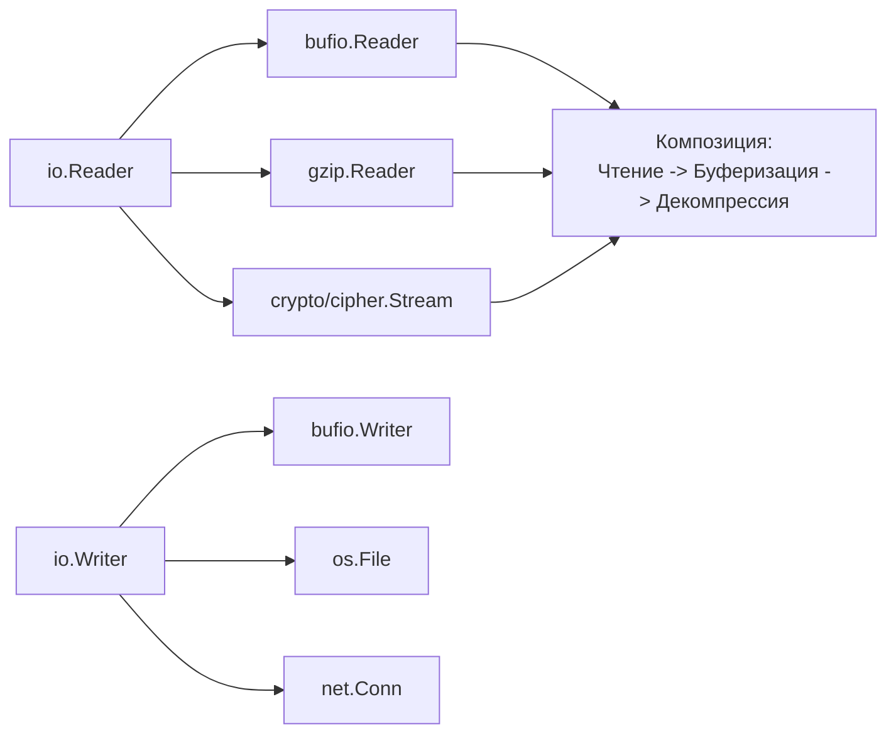

## Философия «батарейки в комплекте»

Когда вы приходите в экосистему Go из мира PHP (с Composer), Python (с PyPI) или JavaScript (с npm), первое, что бросается в глаза — это непривычно маленький список зависимостей в `go.mod` у качественных проектов. В то время как типичный микросервис на Node.js может тянуть за собой `node_modules` на сотни мегабайт, аналогичный сервис на чистом Go часто обходится одним только стандартным набором пакетов.

Это не случайность, а результат осознанной архитектурной философии. Создатели Go (Роб Пайк, Кен Томпсон, Роберт Гризмер) проектировали язык и его библиотеки так, чтобы разработчик мог решить 90–95% типовых задач бэкенда, не выходя за пределы `GOROOT`.

> [!info] Под капотом
> Стандартная библиотека Go — это не просто набор утилит. Это **единая, согласованная система абстракций**, где интерфейсы `io.Reader` и `io.Writer` позволяют компоновать компоненты как лего, а рантайм обеспечивает их эффективное исполнение на уровне системных вызовов и планировщика горутин.

## Принципы проектирования стандартной библиотеки

Понимание этих принципов поможет вам писать более идиоматичный код и принимать взвешенные решения при выборе зависимостей.

### 1. Стабильность и обратная совместимость
Пакеты stdlib проходят экстремально строгий процесс ревью. Изменения вносятся только если они не ломают существующий код. Это гарантирует, что код, написанный на Go 1.10, с высокой вероятностью скомпилируется и будет работать на Go 1.23 без правок.

### 2. Композиция через минималистичные интерфейсы
Вместо монолитных классов библиотека предоставляет набор мелких, ортогональных интерфейсов.



> [!warning] Ловушка / Gotcha
> Не создавайте свои интерфейсы «на будущее». В Go действует принцип: **интерфейсы определяются там, где они используются** (consumer), а не там, где реализуются. Создание преждевременных абстракций (`IUserService`, `IDataRepository`) — это антипаттерн, пришедший из строгого ООП, который усложняет код в Go.

### 3. Zero Dependencies и предсказуемость
Стандартная библиотека не имеет внешних зависимостей. Это критически важно для:
*   **Безопасности**: Меньше поверхность атаки, меньше риск уязвимостей в транзитивных зависимостях (supply chain attacks).
*   **Сборки**: Отсутствие необходимости скачивать гигабайты пакетов при `go build`.
*   **Лицензий**: Вам не нужно отслеживать совместимость лицензий десятков сторонних библиотек.

## Ключевые домены стандартной библиотеки

Давайте кратко пройдемся по тому, что именно дает нам `stdlib` для решения производственных задач.

| Домен | Пакеты | Что покрывает |
|-------|--------|---------------|
| **Ввод/Вывод** | `io`, `bufio`, `bytes`, `strings` | Потоковая обработка данных, буферизация, работа с памятью без лишних аллокаций. |
| **Сеть** | `net`, `net/http`, `net/url` | Полноценный веб-сервер и клиент, поддержка HTTP/1.1, HTTP/2, TLS, DNS-резолвинг. |
| **Данные** | `encoding/json`, `encoding/xml`, `database/sql` | Сериализация, универсальный интерфейс к реляционным БД (с драйверами). |
| **Конкурентность** | `sync`, `context`, `atomic` | Примитивы синхронизации, отмена операций, атомарные операции на уровне инструкций процессора. |
| **Инфраструктура** | `log/slog`, `testing`, `pprof`, `trace` | Логирование, юнит-тесты, бенчмарки, профилирование продакшена «из коробки». |
| **Безопасность** | `crypto/*`, `tls` | Криптографические примитивы, сертифицированные алгоритмы, безопасный рукопожатие TLS. |

## Under the hood: Почему stdlib быстрая?

Многие разработчики ошибочно полагают, что «универсальное» значит «медленное». В случае с Go это не так, потому что стандартная библиотека имеет привилегированный доступ к рантайму.

### 1. Сетевой поллер (Netpoller)
Пакет `net` не использует блокирующие системные вызовы в лоб. В основе `net/http` лежит асинхронный сетевой поллер (реализованный через `epoll` в Linux, `kqueue` в macOS/BSD, `IOCP` в Windows).

Когда вы делаете запрос через `http.Client`, горутина не блокирует системный поток (OS thread). Вместо этого:
1.  Горутина регистрирует файловый дескриптор сокета в поллере.
2.  Горутина уходит в состояние ожидания (parked) в планировщике Go.
3.  Поток ОС (M) освобождается для выполнения других горутин.
4.  Когда данные приходят, поллер будит горутину, и она продолжает выполнение.

Это позволяет обрабатывать десятки тысяч одновременных соединений с минимальным потреблением памяти, чего сложно добиться, используя «обертки» над стандартными сокетами из сторонних библиотек.

### 2. Escape Analysis и аллокации
Функции в `fmt` или `strings` оптимизированы компилятором. Например, `strings.Builder` спроектирован так, чтобы минимизировать утечки памяти в кучу (heap).

```go
// Пример: strings.Builder минимизирует аллокации
var b strings.Builder
b.Grow(1024) // Предварительное выделение памяти (pre-allocation)
b.WriteString("header")
// ...
// Компилятор видит, что внутреннее поле []byte не "убегает" за пределы,
// если мы не берем из него строку через .String() слишком рано.
```

> [!tip] Собеседование
> **Вопрос:** В чем разница между `bytes.Buffer` и `strings.Builder`?
> **Ответ:** `bytes.Buffer` возвращает срез байтов `[]byte` и поддерживает чтение (реализует `io.Reader`), он мутабелен. `strings.Builder` предназначен только для записи строки, он не позволяет читать данные по ходу записи и оптимизирован именно под построение `string`. Начиная с определенного момента, `strings.Builder` паникует при попытке изменить уже записанные данные, что позволяет ему быть чуть более эффективным в определенных сценариях.

## Сравнение экосистем: Когда «голой» stdlib достаточно?

| Задача | Подход в других языках | Подход в Go (stdlib) |
|--------|------------------------|----------------------|
| **HTTP Router** | Express (JS), Flask (Py) требуют внешние роутеры. | `net/http` + `http.ServeMux` (в 1.22+ с поддержкой методов и паттернов). |
| **Конфигурация** | viper, dotenv, config. | `flag`, `os.Getenv`, `encoding/json` для парсинга файлов. |
| **Логирование** | log4j, winston, structlog. | `log/slog` (структурированное логирование с уровнями) — стандарт с Go 1.21. |
| **Тестирование** | jest, pytest, junit. | `testing`, `httptest`, `iotest` — встроенные и мощные. |
| **ORM** | Hibernate, Entity Framework, Django ORM. | `database/sql` + генерация кода (`sqlc`) или простые репозитории. |

> [!warning] Ловушка / Gotcha
> **Синдром «Нужен фреймворк»**.
> Часто разработчики, переходящие с других языков, ищут «аналог Spring» или «аналог Laravel» для Go. Попытка натянуть паттерны жесткого фреймворка на идиоматичный Go приводит к сложной, медленной и негибкой архитектуре.
>
> **Правило:** Начинайте со стандартной библиотеки. Добавляйте внешнюю зависимость только тогда, когда вы четко сформулировали проблему, которую stdlib не решает, и проверили, что альтернатива стоит стоимости поддержки этой зависимости.

## Когда всё-таки нужны внешние зависимости?

Быть пуристом — это хорошо, но прагматизм важнее. Есть сценарии, где `stdlib` действительно не хватает:

1.  **Сложная работа с базой данных**: Если вам нужна автоматическая маппинг-структур в строки БД (хотя `sqlc` или `ent` часто лучше полноценных ORM).
2.  **Специфичные протоколы**: `gRPC` (требует `google.golang.org/grpc`), `WebSocket` (требует `gorilla/websocket` или `nhooyr.io/websocket`, хотя `net/http` в будущем может покрыть часть нужд).
3.  **Валидация**: `stdlib` не имеет мощного валидатора тегов (как `go-playground/validator`), хотя для многих случаев достаточно простых проверок `if`.
4.  **CLI интерфейсы**: Для сложных утилит командной строки `cobra` или `urfave/cli` экономят время.

## Практический совет: Оценка зависимости

Прежде чем добавить `import "github.com/some/library"`, задайте себе вопросы:
1.  Могу ли я реализовать это за 30 минут, используя `io`, `strings` и `net/http`?
2.  Насколько активен репозиторий? (Когда был последний коммит? Есть ли открытые критические баги?)
3.  Не тянет ли эта библиотека за собой еще 50 транзитивных зависимостей? (`go mod graph`)

> [!tip] Собеседование
> **Вопрос:** Почему в проекте на Go может быть плохим знаком наличие 200+ зависимостей?
> **Ответ:**
> 1.  **Время сборки**: Увеличивается время `go build` и `go test`.
> 2.  **Безопасность**: Риск уязвимостей (CVE) в цепочке поставок.
> 3.  **Сложность обновления**: Конфликты версий (dependency hell), хотя `go mod` и смягчает эту проблему.
> 4.  **Понимание кода**: Сложнее онбордить новых разработчиков, если код напичкан магическими библиотеками, скрывающими бизнес-логику.

## Итог

Стандартная библиотека Go — это ваш первый и главный инструмент. Она спроектирована так, чтобы быть **достаточной** для создания высоконагруженных, надежных распределенных систем. Использование `stdlib` по умолчанию — это не ограничение, а стратегическое преимущество, которое дает вам стабильность, производительность и контроль над кодовой базой.

В следующей статье мы начнем глубокое погружение в конкретные пакеты, стартуя с одного из самых часто используемых инструментов отладки и вывода: [[2. fmt. Форматированный вывод и форматирование строк]].