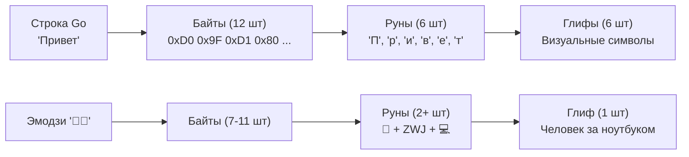

## UTF-8: Почему Go не использует `char`

В языках вроде C, Java или C# символ часто представляется как фиксированный блок памяти (1 байт в ASCII/C, 2 байта в UTF-16/Java, 4 байта в UCS-4). Go пошел другим путем. В основе строковых операций в Go лежит кодировка **UTF-8**.

**UTF-8** — это переменная кодировка длиной от 1 до 4 байт на один символ (руну).
*   ASCII символы (`a-z`, `0-9`) занимают **1 байт**.
*   Латиница с диакритикой, кириллица, греческий — **2 байта**.
*   Большинство азиатских иероглифов — **3 байта**.
*   Эмодзи и редкие символы — **4 байта**.

Это делает Go невероятно эффективным для обработки английского текста (совместимость с ASCII 100%) и компактным для смешанных текстов, но требует от разработчика понимания разницы между **байтом**, **руной** и **глифом**.

> [!info] Под капотом
> **Руна (`rune`)** в Go — это просто псевдоним типа `int32`. Она хранит Unicode Code Point (кодовую точку).
> ```go
> type rune = int32
> ```
> Когда вы видите символ `€`, для компьютера это число `8364` (0x20AC). В памяти строки Go оно будет закодировано в UTF-8 как последовательность из 3 байтов: `0xE2 0x82 0xAC`.

## Три уровня абстракции текста

Чтобы не совершать ошибок, нужно четко разделять три понятия:

1.  **Byte (`byte` / `uint8`)**: Сырой элемент строки. `len(s)` возвращает количество байт.
2.  **Rune (`int32`)**: Юникод-символ. Результат декодирования UTF-8.
3.  **Grapheme Cluster (Глиф)**: То, что видит пользователь. Может состоять из нескольких рун. Например, эмодзи "семья" 👨‍👩‍👧‍👦 или буква `é` (которая может быть одной руной `U+00E9`, или комбинацией `e` + `combining acute accent`).



> [!warning] Ловушка / Gotcha
> **Индексация строки работает по байтам!**
> ```go
> s := "Привет"
> fmt.Println(s[0]) // Выведет 208 (первый байт буквы 'П'), а не саму букву!
> fmt.Println(string(s[0])) // Выведет кракозябру или пустоту, так как 208 — невалидная UTF-8 последовательность сама по себе.
> ```
> Чтобы получить i-ый символ, нужно использовать `range` или конвертацию в слайс рун.

## Пакет `unicode/utf8`: Эффективное декодирование без аллокаций

Многие новички делают так: `runes := []rune(s)`. Это работает, но **крайне неэффективно**. Эта операция проходит по всей строке, декодирует UTF-8 и выделяет новый массив `int32` в куче. Сложность $O(N)$ по времени и памяти.

Пакет `unicode/utf8` позволяет работать с рунами, оставаясь в рамках байтового представления, без аллокаций.

### Ключевые функции

1.  `utf8.RuneCountInString(s)`: Быстрый подсчет количества рун. Работает быстрее, чем `len([]rune(s))`, так как не создает слайс, а только сканирует байты, считая стартовые последовательности.
2.  `utf8.DecodeRuneInString(s)`: Декодирует первую руну из строки и возвращает её значение и размер в байтах.
3.  `utf8.ValidString(s)`: Проверяет, является ли строка валидной UTF-8 последовательностью. Критически важно при приеме данных из сети (HTTP body, сокеты), чтобы избежать паник при дальнейшем парсинге.

```go
func processFirstChar(s string) {
    if !utf8.ValidString(s) {
        log.Println("Invalid UTF-8")
        return
    }
    
    r, size := utf8.DecodeRuneInString(s)
    if r == utf8.RuneError && size == 1 {
        // Обработка ошибки декодирования
        return
    }
    
    fmt.Printf("Первый символ: %c, размер в байтах: %d\n", r, size)
}
```

## Итерация по строке: магия `range`

Цикл `for range` в Go — это единственный встроенный механизм, который автоматически и правильно декодирует UTF-8.

```go
s := "Go语言" // "Go" (ASCII) + "语言" (Китайские иероглифы, 3 байта каждый)

// len(s) вернет 8 (2 + 3 + 3)
for i, r := range s {
    // i — индекс начала руны в БАЙТАХ
    // r — значение руны (int32)
    fmt.Printf("Index (byte): %d, Rune: %c\n", i, r)
}
```

**Вывод:**
```text
Index (byte): 0, Rune: G
Index (byte): 1, Rune: o
Index (byte): 2, Rune: 语
Index (byte): 5, Rune: 言
```
Обратите внимание на скачок индекса с 2 на 5. Это нормально для UTF-8.

## Пакет `unicode`: Классификация символов

Пакет `unicode` содержит таблицы свойств символов. Он позволяет отвечать на вопросы: «Является ли эта руна буквой?», «Это пробел?», «Это цифра?».

```go
import "unicode"

func isCyrillic(r rune) bool {
    return unicode.Is(unicode.Cyrillic, r)
}

func cleanSpace(s string) string {
    var b strings.Builder
    for _, r := range s {
        if !unicode.IsSpace(r) {
            b.WriteRune(r)
        }
    }
    return b.String()
}
```

> [!info] Под капотом
> Функция `unicode.Is(category, r)` выполняет поиск по битовым маскам или таблицам диапазонов. Для основных категорий (Letter, Digit, Space) это очень быстрые операции, часто сводящиеся к нескольким сравнениям `if r >= min && r <= max`. Однако использование экзотических скриптов может требовать более сложных поисков.

## Нормализация и Grapheme Clusters

Стандартные пакеты `unicode` и `utf8` работают с **кодовыми точками** (рунами). Они не знают о визуальном представлении.

Пример проблемы:
Символ `é` может быть представлен двумя способами:
1.  Одна руна: `U+00E9` (LATIN SMALL LETTER E WITH ACUTE).
2.  Две руны: `U+0065` (e) + `U+0301` (COMBINING ACUTE ACCENT).

Для Go это **две разные строки**, хотя визуально они идентичны. `len()` будет разным, сравнение `==` вернет `false`.

Для решения таких задач используется пакет `golang.org/x/text/unicode/norm`, который не входит в стандартную библиотеку, но является де-факто стандартом для серьезной работы с текстом. Он приводит строки к нормальной форме (NFC или NFD), обеспечивая каноническую эквивалентность.

> [!tip] Собеседование
> **Вопрос:** Почему `len("☺")` возвращает 3, а `len("a")` — 1?
> **Ответ:** Потому что `len` считает байты. Смайлик `☺` (U+263A) в UTF-8 кодируется тремя байтами: `0xE2 0x98 0xBA`. Буква `a` — одним байтом `0x61`.
>
> **Вопрос:** Как эффективно перевернуть строку с поддержкой Unicode?
> **Ответ:** Нельзя просто менять байты местами! Нужно работать с рунами.
> 1. Конвертировать в `[]rune` (аллокация, но безопасно).
> 2. Поменять элементы слайса местами двумя указателями.
> 3. Конвертировать обратно в `string`.
> Для экстремальной производительности можно использовать `utf8.DecodeLastRuneInString` и собирать результат в `strings.Builder` с конца, избегая создания полного слайса рун, но это сложнее в реализации.

## Сравнение с другими языками

| Язык | Единица измерения | Индексация | Проблема |
|------|-------------------|------------|----------|
| **C** | `char` (1 байт) | По байтам | Не поддерживает Unicode из коробки. Нужны внешние библиотеки (ICU). |
| **Java** | `char` (2 байта, UTF-16) | По code units | Эмодзи занимают 2 `char` (суррогатные пары). `length()` может врать для эмодзи. |
| **Python 3** | Unicode Code Point | По рунам | `len("☺")` вернет 1. Удобно, но скрытая конвертация может стоить памяти. |
| **Go** | Byte (UTF-8 encoded) | По байтам | Максимальная прозрачность и эффективность памяти. Требует осознанности при работе с `range`. |

## Итог

1.  **Строка в Go — это байты.** `len()` возвращает размер в байтах, а не в символах.
2.  **Используйте `range`** для итерации по символам. Он автоматически декодирует UTF-8.
3.  **Избегайте `[]rune(s)`** в горячих путях. Используйте `unicode/utf8` для подсчета и декодирования без аллокаций.
4.  **Валидируйте ввод.** Всегда проверяйте `utf8.ValidString()` для данных извне.
5.  **Помните про нормализацию.** Визуально одинаковые строки могут иметь разное байтовое представление. Для сравнения таких строк используйте `golang.org/x/text/unicode/norm`.

Понимание того, как текст хранится в памяти, подводит нас к работе с файловой системой и операционной средой. Как Go взаимодействует с файлами, процессами и окружением ОС? В следующей статье: [[11. os. Работа с процессом, окружением и файлами]].