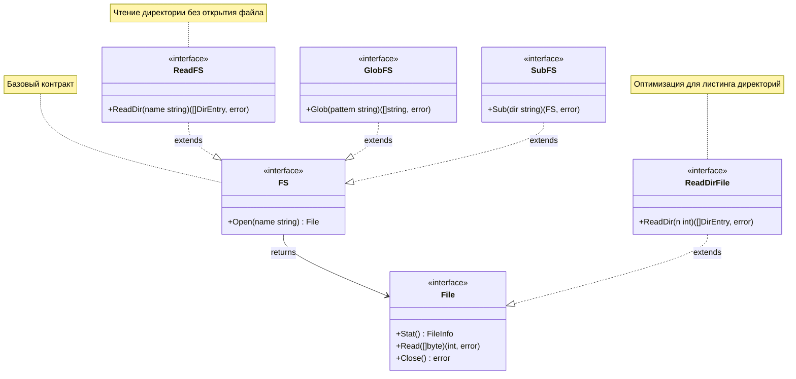

## `io/fs`: Единый интерфейс для всего

До Go 1.16 работа с файлами была жестко привязана к операционной системе через пакет `os`. Если вы хотели прочитать конфиг, вы использовали `os.ReadFile`. Если тот же конфиг лежал внутри ZIP-архива или был сгенерирован в памяти, вам приходилось писать адаптеры или использовать сторонние библиотеки.

Go 1.16 представил пакет `io/fs`, который ввел минималистичные интерфейсы для абстрагирования файловой системы. Теперь функции стандартной библиотеки (например, `text/template`, `embed`, `http.FileServer`) работают не с конкретными файлами на диске, а с любым объектом, реализующим интерфейс `fs.FS`.

> [!info] Под капотом
> Ключевой интерфейс пакета — `fs.FS`:
> ```go
> type FS interface {
>     Open(name string) (File, error)
> }
> ```
> Это похоже на `io.Reader`, но для иерархических структур данных. Метод `Open` возвращает интерфейс `fs.File`, который позволяет читать данные и получать информацию о файле (`Stat`).
>
> Важнейшее архитектурное решение: пути внутри `fs.FS` **всегда** используют прямой слэш `/` как разделитель, независимо от ОС. Это гарантирует переносимость кода между Linux, Windows и macOS, а также совместимость с веб-путями.

## Иерархия интерфейсов: От простого к сложному

Пакет `io/fs` построен на композиции мелких интерфейсов. Это позволяет реализациям предоставлять только те возможности, которые они поддерживают, не перегружая API лишними методами.



### Ключевые расширения
1.  **`fs.ReadDirFS`**: Добавляет метод `ReadDir(name string)`. Позволяет получить список файлов в директории, не открывая саму директорию как файл. Это критически важно для производительности, так как избегает лишних системных вызовов.
2.  **`fs.GlobFS`**: Поддержка поиска по шаблонам (`*.go`).
3.  **`fs.SubFS`**: Позволяет создать «поддерево» файловой системы. Например, если у вас есть архив, вы можете сделать `Sub("configs")`, и все дальнейшие пути будут относительны этой папки.

## Реализации в стандартной библиотеке

Go предоставляет несколько готовых реализаций `fs.FS`:

1.  **`os.DirFS`**: Адаптирует реальную файловую систему диска под интерфейс `fs.FS`.
    ```go
    // Вместо os.Open("/etc/config.yaml")
    fsys := os.DirFS("/etc")
    file, err := fsys.Open("config.yaml") // Путь относительный!
    ```
2.  **`embed.FS`**: Встроенная файловая система (см. статью [[14. embed. Встраивание файлов в бинарник]]).
3.  **`zip.Reader`**: Начиная с Go 1.16, `archive/zip` реализует `fs.FS`. Вы можете ходить по ZIP-архиву как по обычной папке.
4.  **`tar.Reader`**: Аналогично для TAR-архивов (через адаптеры или новые методы в Go 1.17+).

## Mechanical Sympathy: Оптимизация обхода директорий

Интерфейс `fs.ReadDir` возвращает слайс `[]fs.DirEntry`. Как мы обсуждали в статье про `os.ReadDir`, `DirEntry` — это легковесная структура.

Когда вы используете `fs.WalkDir` (замена устаревшему `filepath.Walk`), он под капотом использует именно `ReadDir`. Это означает:
*   **Меньше аллокаций**: `DirEntry` легче, чем полный `FileInfo`.
*   **Меньше syscall'ов**: Метаданные (размер, права) не загружаются, пока вы явно не вызовете `Info()`.
*   **Кэширование**: Некоторые реализации (например, `os.DirFS`) могут кэшировать результаты `readdir`.

```go
// Эффективный рекурсивный поиск всех .go файлов
func findGoFiles(fsys fs.FS) []string {
    var files []string
    fs.WalkDir(fsys, ".", func(path string, d fs.DirEntry, err error) error {
        if err != nil {
            return err
        }
        if !d.IsDir() && strings.HasSuffix(path, ".go") {
            files = append(files, path)
        }
        return nil
    })
    return files
}
```

> [!warning] Ловушка / Gotcha
> **Относительные пути и корень.**
> В `fs.FS` путь `.` обозначает корень файловой системы. Путь не может начинаться с `/` или `..`.
> `fsys.Open("/config.yaml")` вернет ошибку `invalid argument`.
> `fsys.Open("../etc/passwd")` вернет ошибку `invalid argument`.
> Это сделано намеренно для безопасности (предотвращение выхода за пределы sandbox) и унификации. Если вам нужно работать с абсолютными путями, используйте `os.DirFS` с правильным префиксом или `filepath.Rel`.

## Интеграция с `net/http`

Один из самых мощных кейсов использования `io/fs` — раздача статических файлов. Функция `http.FS` адаптирует `fs.FS` под интерфейс `http.FileSystem`, который требует `http.FileServer`.

```go
// Создаем файловую систему из папки "static"
staticFS := os.DirFS("static")

// Оборачиваем в http.FS
fileServer := http.FileServer(http.FS(staticFS))

// Все запросы к /static/* будут обслуживаться из папки "static"
http.Handle("/static/", http.StripPrefix("/static/", fileServer))
```

Это позволяет легко переключаться между раздачей файлов с диска в разработке и из встроенного бинарника (`embed.FS`) в продакшене, не меняя код роутинга.

## Сравнение с другими подходами

| Подход | Язык/Фреймворк | Особенности |
|--------|----------------|-------------|
| **`io/fs`** | Go | Интерфейсный, минималистичный, композируемый. Поддерживает lazy-loading метаданных. |
| **`java.nio.file.FileSystem`** | Java | Тяжеловесный, ООП-ориентированный. Требует фабрик для создания. |
| **`std::filesystem`** | C++ | Value-семантика, прямая работа с ОС. Менее абстрактный, более императивный. |
| **VFS (Virtual File System)** | Python/Ruby | Часто реализуется через сторонние библиотеки (например, `pyfilesystem2`). Не является частью ядра языка в таком же строгом виде. |

> [!tip] Собеседование
> **Вопрос:** Почему `fs.File` не наследуется от `io.Reader` напрямую, а требует приведения типов или отдельного интерфейса?
> **Ответ:** На самом деле, `fs.File` **требует** реализации метода `Read(p []byte) (n int, err error)`, то есть он неявно реализует `io.Reader`. Однако интерфейс `fs.File` также включает `Stat()` и `Close()`. Это сделано для того, чтобы любой файл можно было закрыть и получить его метаданные, что критично для управления ресурсами.
>
> **Вопрос:** Как реализовать кастомную файловую систему (например, для базы данных)?
> **Ответ:** Нужно создать структуру, реализующую метод `Open(name string) (fs.File, error)`. Внутри `Open` вы должны вернуть объект, реализующий `fs.File` (Read, Close, Stat). Если ваша СУБД поддерживает листинг, реализуйте также `fs.ReadDirFile`. Это позволит использовать вашу БД как источник для шаблонов или статики прозрачно для остального кода.

## Итог

1.  **`io/fs` — это стандарт де-факто** для работы с иерархическими данными в Go.
2.  **Пути всегда используют `/`**. Забудьте о `filepath.Join` внутри логики `fs.FS`.
3.  **Используйте `fs.WalkDir`** вместо `filepath.Walk` для эффективности.
4.  **Композиция интерфейсов** позволяет реализациям быть легковесными (не нужно имплементировать всё сразу).
5.  **Безопасность**: Запрет на `..` и абсолютные пути в `Open` защищает от traversal-атак на уровне интерфейса.

Абстракция `io/fs` тесно связана с возможностью встраивать файлы прямо в исполняемый файл. В следующей статье мы разберем, как это работает и зачем это нужно: [[14. embed. Встраивание файлов в бинарник]].