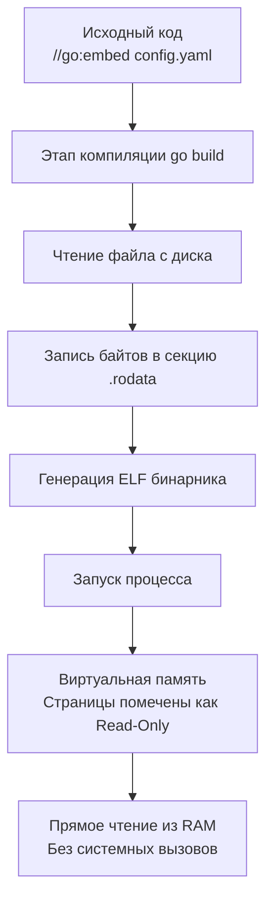

## Философия «всё в одном бинарнике»

До Go 1.16 встраивание статических файлов (HTML-шаблоны, конфигурации, миграции SQL, TLS-сертификаты) требовало сторонних инструментов вроде `go-bindata`. Эти утилиты генерировали Go-код, превращающий байты файлов в строковые литералы, что усложняло сборку, требовало дополнительного шага в CI/CD и порождало проблемы с отслеживанием изменений.

Директива `//go:embed`, появившаяся в Go 1.16, перенесла эту задачу на уровень компилятора. Теперь файлы упаковываются в исполняемый файл на этапе линковки, предоставляя доступ к ним через стандартные типы `string`, `[]byte` или `embed.FS`. Это радикально упрощает деплой: один бинарник содержит всё необходимое для работы.

> [!info] Под капотом
> `embed.FS` реализует интерфейсы `fs.FS`, `fs.ReadFileFS` и `fs.ReadDirFS`. Это означает, что встроенная файловая система полностью совместима с `http.FileServer`, `text/template`, `html/template` и любыми другими компонентами, принимающими `io/fs`. Переход от чтения с диска (`os.DirFS`) к встроенным файлам требует замены всего одной строчки кода.

## Механика директивы и поддерживаемые типы

Директива `//go:embed` работает только на уровне пакета и должна следовать сразу перед объявлением переменной.

```go
package main

import "embed"

// Встраивание одного файла в строку
//go:embed version.txt
var version string

// Встраивание бинарных данных
//go:embed logo.png
var logoData []byte

// Встраивание директории в виртуальную ФС
// Поддерживает шаблоны: *.html, configs/*.yaml
//go:embed templates/* assets/*
var staticFS embed.FS
```

### Правила сопоставления путей
*   Пути указываются относительно директории пакета, где находится файл с директивой.
*   Запрещено использовать `..` для выхода за пределы модуля. Это ограничение безопасности на уровне компилятора.
*   Символ `*` допустим только для выбора файлов в текущей или вложенных директориях, но не для произвольного глоббинга (`*/*.go` запрещено).

## Under the hood: Компиляция и секции памяти

Что происходит на этапе `go build`?

1. **Парсинг**: Компилятор сканирует AST пакета, находит комментарии `//go:embed`.
2. **Валидация**: Проверяет существование файлов, права доступа и ограничения на пути.
3. **Упаковка**: Содержимое файлов читается и пакуется в неизменяемый блок данных.
4. **Линковка**: Блок данных помещается в секцию `.rodata` (read-only data) ELF/Mach-O/PE бинарника.
5. **Инициализация**: На этапе старта программы переменные инициализируются указателями на эту область памяти.



Физически данные лежат в памяти процесса сразу после загрузки бинарника в RAM. Доступ к ним происходит по указателю без накладных расходов на дисковый I/O, буферизацию или парсинг файловых систем.

## Mechanical Sympathy: Влияние на производительность и кэш CPU

Встраивание файлов дает колоссальный выигрыш в скорости доступа, но имеет архитектурную цену.

### Zero-Copy и отсутствие аллокаций
При использовании `embed.FS.Open()` или `staticFS.ReadFile()` рантайм не выделяет память в куче для содержимого файла. Он возвращает слайс `[]byte`, который указывает напрямую на секцию `.rodata` бинарника. Это полностью устраняет давление на Garbage Collector.

### Обратная сторона: Раздувание бинарника и Instruction Cache
1. **Size on Disk**: Каждый встроенный файл увеличивает размер исполняемого файла на свой размер. Встраивание 500 МБ датасетов сделает бинарник неоправданно большим, усложнив скачивание и развертывание в кластере.
2. **Page Cache & TLB**: При загрузке большого бинарника ОС мапит больше виртуальных страниц. Если встроенные файлы велики, они могут вытеснять из кэша процессора (L1/L2) инструкции самого кода приложения, что приводит к `instruction cache miss` и замедлению выполнения бизнес-логики.

> [!warning] Ловушка / Gotcha
> **Иммутабельность `.rodata`**.
> Данные в `embed.FS` доступны только для чтения. Попытка изменить байт через `unsafe` (обход системы типов) приведет к `SIGSEGV` (Segmentation Fault), так как страница памяти имеет флаг `PROT_READ` без `PROT_WRITE`. Если вам нужно менять данные в runtime, скопируйте их в кучу при старте: `mutableData := make([]byte, len(embedded)); copy(mutableData, embedded)`.

## Безопасность и секреты

Встраивание файлов часто используют для TLS-сертификатов или конфигов. **Никогда не встраивайте секреты** (пароли, API-ключи, приватные ключи) через `//go:embed`.
*   Бинарник может попасть в систему контроля версий.
*   Любой, кто имеет доступ к бинарнику, может извлечь данные через `strings` или дизассемблер.
*   Обновление секрета потребует пересборки и редеплоя всего сервиса.

Используйте `os.Getenv`, секретные менеджеры (HashiCorp Vault) или Kubernetes Secrets, которые монтируются в рантайме.

## Ловушки и вопросы с собеседований

| Сценарий | Проблема | Решение |
|----------|----------|---------|
| Директива внутри функции | Компилятор выдаст `invalid go:embed directive` | `//go:embed` работает только на уровне пакета (перед `var`). |
| Изменение файлов после сборки | Бинарник не обновляется | Бинарник самодостаточен. Чтобы обновить статику, нужна новая сборка. Используйте внешнюю ФС для динамического контента. |
| `embed.FS` и права доступа | `Stat()` всегда возвращает права `0644` и `ModTime` = 0001-01-01 | Это ограничение формата. Встроенные файлы не сохраняют метаданные ОС для воспроизводимости сборок. |
| Конфликты имен | Две директивы в разных файлах одного пакета с одинаковыми путями | Компилятор разрешает это, но лучше группировать в одном месте для читаемости. |

> [!tip] Собеседование
> **Вопрос:** В чем разница между `os.DirFS` и `embed.FS` с точки зрения планировщика Go?
> **Ответ:** `os.DirFS` при чтении вызывает системные вызовы `open/read`. Если диск медленный или находится по сети (NFS), горутина блокируется, и планировщик Go может отправить её в ожидание, но syscall всё равно потребляет ресурсы ядра. `embed.FS` работает исключительно в User Space, обращаясь к виртуальной памяти. Это чистая операция с RAM, которая никогда не блокирует поток ОС и выполняется за константное время.
>
> **Вопрос:** Можно ли встроить файл, если он изменён после запуска программы?
> **Ответ:** Нет. Встраивание происходит на этапе линковки (`go build`). Сгенерированный бинарник статичен. Любые изменения на диске не повлияют на уже запущенный процесс.

## Сравнение с другими языками

| Язык | Механизм | Особенности в сравнении с Go |
|------|----------|------------------------------|
| **C / C++** | `xxd -i`, `#include "file.bin"` | Требует внешних утилит. Нет встроенной поддержки в языке. Сложно управлять типами. |
| **Java** | Resources in JAR, `ClassLoader.getResourceAsStream()` | Файлы лежат в архиве JAR. Доступ через ClassLoader, который добавляет overhead синхронизации и поиска в classpath. |
| **Rust** | `include_bytes!("file")` | Макрос компилятора. Похож на Go `[]byte`, но менее гибок для директорий без крейтов вроде `rust-embed`. |
| **Go** | `//go:embed` | Нативный, типобезопасный, интегрирован с `io/fs`. Поддерживает шаблоны и автоматически создает read-only ФС. |

## Итог

1.  **`//go:embed` — часть компилятора**, а не сторонняя генерация. Работает с Go 1.16+.
2.  **Данные помещаются в `.rodata`**. Доступ к ним осуществляется напрямую из памяти без syscall и аллокаций (zero-copy).
3.  **Размер бинарника растет**. Не встраивайте тяжелые датасеты, чтобы не вытеснять код из кэша CPU.
4.  **Абсолютно read-only**. Изменение встроенных данных в runtime невозможно и опасно.
5.  **Безопасность**. Никогда не встраивайте секреты. Для конфигов используйте ENV или внешние системы.
6.  **Совместимость с `io/fs`**. `embed.FS` легко заменяет `os.DirFS`, делая код переносимым между dev (диск) и prod (бинарник).

Освоив доставку статики и конфигов, мы переходим к способу передачи параметров процессу при запуске. Как правильно парсить флаги командной строки, избегая зависимостей от `cobra` или `urfave/cli`? В следующей статье: [[15. flag. Парсинг аргументов командной строки]].