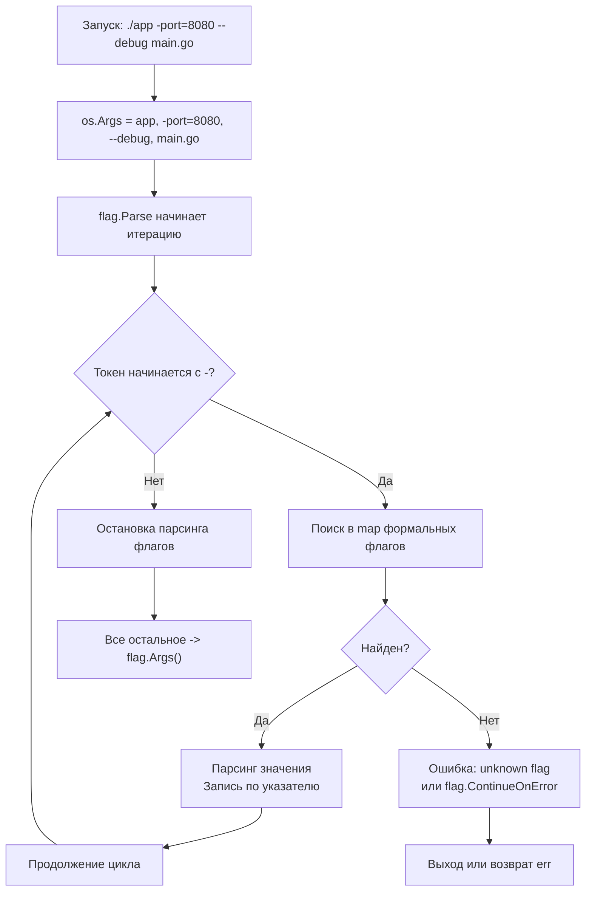

## Философия строгости и минимализма

Пакет `flag` в Go кардинально отличается от привычных парсеров аргументов в других языках. Если `argparse` (Python) или `getopt` (C) пытаются угадать намерения пользователя, поддерживают группировку флагов (`-abc`), произвольный порядок и сложные подкоманды, то `flag` следует жесткому контракту: **флаги должны идти перед позиционными аргументами**.

Это не ограничение, а осознанный архитектурный выбор. Строгость устраняет амбивалентность парсинга, упрощает код библиотек и делает поведение CLI-утилит предсказуемым. Для микросервисов, демонов и простых утилит администрирования этого более чем достаточно.

> [!info] Под капотом
> В основе пакета лежит структура `FlagSet`. По умолчанию используется глобальный `flag.CommandLine`. При вызове `flag.Parse()` рантайм не создает новых структур для каждого флага — он мутирует уже зарегистрированные переменные через переданные указатели. Это делает пакет экстремально легким по памяти и быстрым.

## Under the hood: FlagSet и os.Args

Когда вы запускаете бинарник, ядро ОС передает аргументы через массив указателей в памяти процесса (структура `argv` в `execve`). В Go этот массив экспонируется как `os.Args`.

```go
// Упрощенная структура flag.FlagSet
type FlagSet struct {
    Usage     func()
    name      string
    parsed    bool
    actual    map[string]*Flag  // Распарсенные флаги
    formal    map[string]*Flag  // Зарегистрированные шаблоны
    args      []string          // Оставшиеся позиционные аргументы
    funcs     []func() error    // Хуки валидации
    exitOnError bool           // Поведение при ошибке
}
```

Метод `flag.Parse()` выполняет один линейный проход по `os.Args[1:]`. Он проверяет каждый токен:
1. Начинается с `-` или `--`? → Ищем в `formal`.
2. Найден? → Парсим значение, обновляем переменную по указателю.
3. Не начинается с `-`? → Считаем это началом позиционных аргументов. **Все последующие токены игнорируются как флаги** и попадают в `flag.Args()`.



## 1. Механика парсинга и Mechanical Sympathy

Парсинг в `flag` оптимизирован под кэш процессора и минимизацию аллокаций:
* **Отсутствие рефлексии для примитивов**: `flag.Int`, `flag.String` принимают указатель. Значение записывается напрямую в память. Никаких `reflect.Value.Set()`.
* **Локальность данных**: Карта `formal` создается на этапе инициализации пакета. При запуске процесс уже держит её в кэше L1/L2. Проход по `os.Args` — это последовательное чтение линейного массива строк, что идеально для CPU prefetcher.
* **Нулевые аллокации в горячем пути**: Если вы используете встроенные типы, `flag.Parse()` не выделяет память в куче. Все буферы строк уже существуют в `os.Args`.

> [!warning] Ловушка / Gotcha
> **Флаги после позиционных аргументов игнорируются.**
> Команда `./server start --port 9090` **не установит** порт в 9090. `start` считается позиционным аргументом. Всё, что идет после него (`--port 9090`), попадет в `flag.Args()`.
> **Правильно:** `./server --port 9090 start`
> Это частая причина багов при миграции с POSIX-совместимых утилит на Go.

## 2. Кастомные типы и интерфейс flag.Value

Для сложных сценариев Go предоставляет интерфейс `flag.Value`. Он позволяет парсить слайсы, мапы, URL, временные интервалы и валидировать ввод на лету.

```go
// StringList реализует flag.Value
type StringList []string

func (l *StringList) String() string {
    return strings.Join(*l, ",")
}

func (l *StringList) Set(value string) error {
    *l = append(*l, value)
    return nil
}

// Регистрация
var hosts StringList
flag.Var(&hosts, "host", "Множественный хост (можно указывать несколько раз)")
```

Начиная с Go 1.21, появилась `flag.Func`, которая упрощает создание флагов без реализации интерфейса:
```go
var timeout time.Duration
flag.Func("timeout", "Длительность (напр. 5s, 1m30s)", func(s string) error {
    d, err := time.ParseDuration(s)
    if err != nil { return err }
    timeout = d
    return nil
})
```

> [!info] Под капотом
> `flag.Func` под капотом создает анонимную структуру, реализующую `flag.Value`, и передает вашу функцию в `Set()`. Это добавляет одну аллокацию при регистрации, но полностью устраняет boilerplate-код. Для высоконагруженных демонов, стартующих раз в месяц, это пренебрежимо мало.

## 3. Подкоманды (Subcommands): паттерн без магии

`flag` не поддерживает подкоманды из коробки. Это намеренно. Реализация делается через изолированные `FlagSet`, что дает полный контроль над валидацией и справкой.

```go
func main() {
    // Глобальные флаги
    verbose := flag.Bool("v", false, "Включить подробный лог")
    flag.Parse()

    // Определяем подкоманды
    if len(flag.Args()) == 0 {
        fmt.Println("Usage: app <command> [args]")
        os.Exit(1)
    }

    cmd := flag.Arg(0)
    switch cmd {
    case "serve":
        serveCmd(flag.Args()[1:])
    case "migrate":
        migrateCmd(flag.Args()[1:])
    default:
        fmt.Printf("Unknown command: %s\n", cmd)
        os.Exit(1)
    }
}

func serveCmd(args []string) {
    fs := flag.NewFlagSet("serve", flag.ExitOnError)
    port := fs.Int("port", 8080, "Порт HTTP сервера")
    
    // Парсим только аргументы, относящиеся к этой команде
    fs.Parse(args)
    fmt.Printf("Starting server on :%d (verbose: %v)\n", *port, *flag.Lookup("v").Value.(*bool))
}
```

Этот подход требует больше кода, но гарантирует, что каждая команда имеет свою изолированную область видимости флагов, четкую справку и независимую логику обработки ошибок.

## Сравнение с экосистемами

| Язык / Библиотека | Подход | Особенности в сравнении с Go |
|-------------------|--------|------------------------------|
| **C (`getopt`)** | POSIX-совместимый | Поддерживает `-abc`, `--long`, произвольный порядок. Сложнее в использовании, требует ручной обработки. |
| **Python (`argparse`)** | Декларативный, ООП | Автоматическая генерация справки, подкоманды, типы, валидация. Тяжелый, использует рефлексию, создает много объектов. |
| **Node.js (`minimist`)** | Минималистичный, гибкий | Возвращает объект с флагами. Игнорирует порядок. Может приводить к неожиданным результатам при смешивании стилей. |
| **Go (`flag`)** | Строгий, императивный | Флаги строго перед аргументами. Нулевая магия, минимум аллокаций, полная предсказуемость. |

> [!tip] Собеседование
> **Вопрос:** Почему `flag` по умолчанию вызывает `os.Exit(2)` при неизвестном флаге, а не возвращает ошибку?
> **Ответ:** Для утилит командной строки немедленное завершение с кодом ошибки — стандартное поведение POSIX. Это позволяет скриптам-оберткам (`bash`, `Makefile`) корректно обрабатывать ошибки запуска. Однако вы можете изменить это поведение, создав `flag.NewFlagSet("name", flag.ContinueOnError)`, что позволит парсить аргументы без паники и обрабатывать ошибки в коде (полезно для библиотек).
>
> **Вопрос:** Как безопасно парсить флаги в конкурентном окружении?
> **Ответ:** Регистрация флагов (`flag.String`, `flag.Int`) и вызов `flag.Parse()` **не потокобезопасны** для глобального `CommandLine`. Их нужно вызывать строго в одной горутине (обычно `main`) до запуска других горутин. Чтение распарсенных значений после `Parse()` безопасно, так как переменные больше не мутируются.

## Итог

1.  **Строгий порядок:** Флаги идут до позиционных аргументов. После первого не-флага парсинг прекращается.
2.  **Минимум аллокаций:** Встроенные типы парсятся напрямую по указателям без рефлексии.
3.  **Используйте `flag.Value` или `flag.Func`** для кастомных типов и валидации.
4.  **Подкоманды через `FlagSet`:** Создавайте изолированные наборы флагов для каждой команды. Не пытайтесь эмулировать фреймворковую магию.
5.  **Конфигурация vs CLI:** `flag` предназначен для параметров запуска. Для сложной конфигурации используйте ENV, файлы или специализированные библиотеки. Не перегружайте CLI десятками флагов.

Освоив передачу параметров процессу, мы переходим к одному из самых критичных аспектов production-разработки: наблюдению за состоянием системы. Как правильно логировать события, структурировать сообщения и интегрироваться с системами мониторинга, используя стандартные средства? В следующей статье: [[16. log и log_slog. Логирование в стандартной библиотеке]].