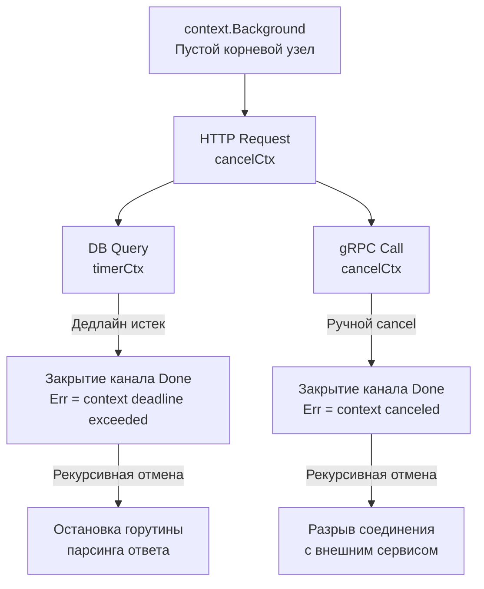

## Философия управления временем жизни горутин

В Go горутины дешевы, и их создание не ограничено системными лимитами. В высоконагруженном сервисе одновременно могут выполняться сотни тысяч горутин. Если не управлять их жизненным циклом, приложение быстро столкнется с утечками памяти, зависшими соединениями и неконтролируемым потреблением CPU.

Пакет `context` решает эту проблему, предоставляя стандартизированный механизм для:
* Отмены длительных операций по запросу клиента или при таймауте.
* Проброса метаданных запроса (request ID, auth token, tracing ID) через весь стек вызовов.
* Синхронизации завершения работы дочерних горутин при graceful shutdown.

`context.Context` — это не просто структура данных. Это контракт, который связывает бизнес-логику, сетевой слой, базы данных и внешние API в единую, предсказуемую систему управления ресурсами.

> [!info] Под капотом
> Интерфейс `context.Context` минималистичен и не требует реализации на уровне пользователя. Он предоставляет всего четыре метода:
> ```go
> type Context interface {
>     Deadline() (deadline time.Time, ok bool)
>     Done() <-chan struct{}
>     Err() error
>     Value(key any) any
> }
> ```
> Все реализации (`cancelCtx`, `timerCtx`, `valueCtx`) находятся внутри пакета `context`. Разработчик работает только с интерфейсом, что гарантирует совместимость со всеми стандартными библиотеками (`net/http`, `database/sql`, `os/exec`).

## Under the hood: Дерево контекстов и внутреннее устройство

Когда вы вызываете `context.WithCancel(parent)` или `context.WithTimeout(parent, d)`, создается новое звено в связанном дереве. Каждый контекст знает о своих потомках через slice или map, в зависимости от количества дочерних элементов.

Внутренняя структура `cancelCtx` выглядит примерно так:
```go
type cancelCtx struct {
    Context
    mu       sync.Mutex            // Защищает children и err
    done     atomic.Pointer[chan struct{}] // Канал закрытия (ленивая инициализация)
    children map[canceler]struct{} // Дочерние контексты
    err      error                 // Причина отмены
}
```

При вызове функции `cancel()` происходит рекурсивный обход дерева:
1. Устанавливается `err` и закрывается `done`.
2. Блокируется мьютекс `mu`.
3. Для каждого потомка вызывается его `cancel()`.
4. Map очищается для освобождения памяти.
5. Мьютекс разблокируется.



> [!warning] Ловушка / Gotcha
> **`context` не является потокобезопасным для хранения мутабельных данных.**
> Метод `Value()` предназначен только для передачи иммутабельных, request-scoped данных (например, `requestID`). Если вы попытаетесь хранить в контексте изменяемые объекты (кэши, сессии, мьютексы), вы получите гонки данных (data race), так как один контекст может быть передан в несколько горутин одновременно.

## Механика отмены и Mechanical Sympathy

Отмена в Go реализована через **закрытие канала** (`close(ch)`). Это аппаратно оптимизированная операция: когда канал закрывается, все горутины, ожидающие чтения из него, мгновенно просыпаются.

### 1. Zero-аллокация при чтении `Done()`
Метод `Done()` возвращает указатель на канал. Ожидание через `select`:
```go
select {
case <-ctx.Done():
    return ctx.Err() // Мгновенный выход при отмене
case result := <-dataCh:
    process(result)
}
```
Этот паттерн не генерирует аллокаций. CPU проверяет внутреннее состояние канала через атомарные операции. Если канал не закрыт, горутина переводится в состояние `Gwaiting` планировщиком Go, освобождая системный тред (M) для другой работы.

### 2. Цена дерева и GC
Каждый вызов `context.WithValue` добавляет новый слой в цепочку. При глубокой вложенности (например, 50+ middleware) поиск значения через `Value()` превращается в линейный проход по связному списку `valueCtx`. 
**Правило Senior Engineer:** Используйте `Value()` только для критичных метаданных запроса. Если вам нужно передать 10+ параметров, создайте структуру `RequestData` и передайте её через один ключ. Это сокращает время поиска с $O(N)$ до $O(1)$.

### 3. Таймеры и `timerCtx`
`context.WithTimeout` создает `timerCtx`, который внутри использует `time.Timer`. Когда дедлайн наступает, таймер вызывает `cancel()`. 
**Важно:** Всегда вызывайте `cancel()`, даже если таймаут сработал. Это освобождает ресурсы таймера и удаляет контекст из внутренних структур рантайма, предотвращая утечки памяти.

## Идиоматичное использование в production

### 1. Контекст — первый параметр
По соглашению Go, `ctx` всегда передается первым аргументом, сразу после `func`.
```go
func GetUser(ctx context.Context, id int64) (*User, error)
```

### 2. Никогда не храните контекст в структурах
```go
// ❌ Антипаттерн: контекст живет дольше функции, вызывающей его
type Service struct {
    ctx context.Context // Ошибка: сложно контролировать время жизни
    db  *sql.DB
}

// ✅ Идиоматично: контекст передается явно в каждый вызов метода
func (s *Service) GetUser(ctx context.Context, id int64) (*User, error)
```

### 3. Интеграция с HTTP и базами данных
`net/http` автоматически создает `context` из `http.Request`. При закрытии соединения клиентом, контекст отменяется.
```go
func handler(w http.ResponseWriter, r *http.Request) {
    ctx := r.Context() // Берем контекст запроса
    // Если клиент разорвал соединение, ctx.Done() закроется
    
    result, err := db.QueryContext(ctx, "SELECT ...")
    if err != nil {
        if errors.Is(err, context.Canceled) {
            // Клиент ушел, не логируем как ошибку сервера
            return
        }
        http.Error(w, "DB error", 500)
        return
    }
}
```

> [!tip] Собеседование
> **Вопрос:** В чем разница между `context.Background()` и `context.TODO()`?
> **Ответ:** Технически они идентичны (оба возвращают указатель на `emptyCtx`). Разница семантическая: `Background()` используется в `main()`, тестах или на верхнем уровне, где нет родительского контекста. `TODO()` — маркер рефакторинга: «здесь должен быть контекст, но я пока не знаю, откуда его взять». В production-коде `TODO()` быть не должно.
>
> **Вопрос:** Почему нельзя передавать `nil` вместо `context.Context`?
> **Ответ:** Большинство функций стандартной библиотеки (`os/exec`, `http`, `sql`) вызывают `ctx.Value()` или проверяют `ctx.Done()`. Если `ctx == nil`, это вызовет панику `runtime: invalid memory address or nil pointer dereference`. Всегда передавайте валидный контекст. Если его нет, используйте `context.Background()`.

## Сравнение с экосистемами других языков

| Язык / Фреймворк | Механизм | Особенности в сравнении с Go |
|------------------|----------|------------------------------|
| **Java** | `CancellationToken`, `CompletableFuture`, ThreadLocal | Требует явной подписки на отмену или использования `ExecutorService`. ThreadLocal не пробрасывается автоматически в пулы потоков. |
| **C++** | `std::stop_token`, `std::jthread` | Встроен в STL с C++20. Работает на уровне ОС-тредов. Более сложная система типов, менее интегрирована в экосистему. |
| **Python** | `asyncio.Event`, `concurrent.futures` | Отмена асинхронных задач требует ручной проверки `cancelled()`. Синхронный код игнорирует отмену. GIL мешает параллельной отмене. |
| **Go** | `context.Context` | Единый стандарт для sync и async кода. Автоматическое проброс через stdlib. Интеграция с планировщиком горутин. |

## 5 Ловушек контекста, которые ломают production

| Ошибка | Последствие | Правильное решение |
|--------|-------------|---------------------|
| Забытый `defer cancel()` | Утечка памяти и горутин, таймеры не очищаются | Всегда `ctx, cancel := context.WithTimeout(...); defer cancel()` |
| Передача `context.Background()` в HTTP handler | Игнорирование отмены клиентом, таймауты не работают | Используйте `r.Context()` |
| `context.WithValue` для бизнес-данных | Усложнение отладки, нарушение инкапсуляции, race conditions | Передавайте данные явно через аргументы функций или структуры |
| Игнорирование `ctx.Err()` после блокирующей операции | Возврат успешного результата при уже отмененном запросе | Проверяйте `if ctx.Err() != nil { return nil, ctx.Err() }` |
| Создание контекста в цикле без отмены | Экспоненциальный рост числа дочерних контекстов | Выносите `WithTimeout` за цикл или используйте один общий `WithCancel` |

## Итог

1. `context.Context` — стандартный контракт для управления жизненным циклом операций в Go.
2. Под капотом это дерево структур (`cancelCtx`, `timerCtx`), связанное рекурсивной отменой и закрытием каналов.
3. Закрытие канала `Done()` — дешевая операция, мгновенно будящая все ожидающие горутины.
4. Никогда не храните контекст в структурах, не используйте `Value()` для мутабельных данных, всегда вызывайте `cancel()`.
5. Интеграция с `net/http` и `database/sql` автоматическая, но требует явной проверки `ctx.Err()` после блокирующих вызовов.

Понимание управления временем жизни операций неразрывно связано с работой с временными интервалами, таймерами и календарными вычислениями. В следующей статье мы разберем, как Go обрабатывает время, часовые пояса и почему `time.Time` не является простым числом: [[18. time. Даты, время, Duration, Timer, Ticker]].