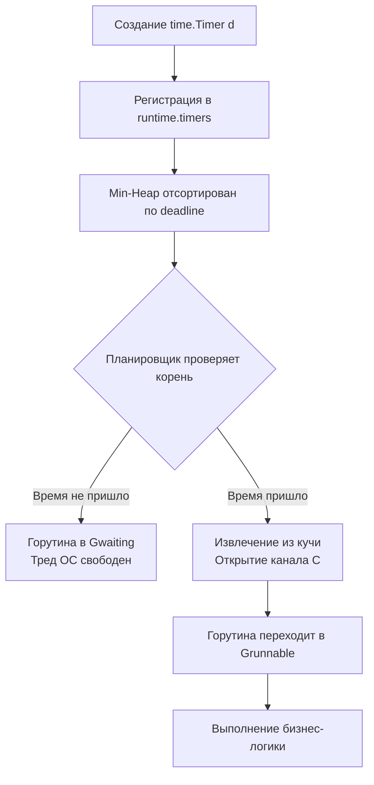

## Философия времени: Монотонность и точность

Время в распределенных системах — это не просто текущая метка. Это фундаментальный источник данных для таймаутов, ретраев, кэширования и аудита. Пакет `time` в Go спроектирован так, чтобы абстрагировать разработчика от хаоса аппаратных часов, NTP-синхронизаций и прыжковых секунд, предоставляя при этом прямой доступ к низкоуровневым механизмам планировщика.

Ключевое архитектурное решение Go — разделение **Wall Clock** (реальное время суток) и **Monotonic Clock** (монотонное, непрерывно растущее время). Это отличает Go от многих языков, где `DateTime` смешивает оба понятия, что приводит к багам при изменении системного времени.

> [!info] Под капотом
> Структура `time.Time` в памяти занимает 24 байта на 64-битной архитектуре и содержит:
> ```go
> type Time struct {
>     wall uint64    // Битовое поле: флаг монотонности, наносекунды, секунды от epoch
>     ext  int64     // Unix-секунды (для wall) или наносекунды с момента старта (для monotonic)
>     loc  *Location // Часовой пояс
> }
> ```
> Если системное время поддерживает монотонные часы (Linux, macOS, современные Windows), `time.Now()` захватывает оба значения одновременно. Сравнение `t1 == t2` и вычисление `t1.Sub(t2)` **всегда используют monotonic**, игнорируя скачки NTP. Метод `String()` или `Format()` используют wall clock.

## `time.Duration`: Наносекунды как фундамент

В Go нет сложных объектов для интервалов. `time.Duration` — это просто псевдоним `int64`, выражающий время в наносекундах:
```go
type Duration int64

const (
    Nanosecond  Duration = 1
    Microsecond          = 1000 * Nanosecond
    Millisecond          = 1000 * Microsecond
    Second               = 1000 * Millisecond
    Minute               = 60 * Second
    Hour                 = 60 * Minute
)
```
Поскольку это целое число, все арифметические операции сложения/вычитания выполняются за 1 такт CPU без аллокаций. Максимальное значение `time.Duration` составляет около 290 лет, что покрывает любые продакшен-сценарии.

## Timer и Ticker: Интеграция с планировщиком Go

`time.Timer` и `time.Ticker` не блокируют системные потоки (OS threads) и не создают отдельных горутин. Они интегрированы непосредственно в планировщик Go через глобальную кучу таймеров `runtime.timers`.

### Механика работы
1. При создании `time.After()` или `time.NewTimer()` рантайм добавляет событие в **min-heap** (двоичную кучу), отсортированную по времени срабатывания.
2. Поток `sysmon` (системный монитор рантайма) или сам планировщик при каждом цикле `schedule()` проверяет корень кучи.
3. Если время срабатывания наступило, таймер извлекается, а горутина, ожидающая в канале `C`, переводится в состояние `Grunnable` и помещается в очередь выполнения.
4. Если таймер не сработал, горутина продолжает "спать" в состоянии `Gwaiting`, не потребляя CPU.



> [!warning] Ловушка / Gotcha
> **Утечка Ticker.**
> `time.Ticker` **не останавливается автоматически**, когда вы перестаете читать из канала. Если вы создаете тикер в цикле или в обработчике и забываете вызвать `ticker.Stop()`, таймер навсегда останется в куче `runtime.timers`. Это приведет к росту памяти и замедлению работы планировщика, так как ему придется постоянно проверять "мертвые" таймеры. Всегда используйте `defer ticker.Stop()` или вызывайте `Stop()` сразу после выхода из области видимости.

## Mechanical Sympathy: vDSO, TSC и цена `time.Now()`

Вызов `time.Now()` кажется тривиальным, но под капотом это взаимодействие с ядром ОС.

1. **Системный вызов**: В Linux используется `clock_gettime(CLOCK_MONOTONIC)`. На современных ядрах этот syscall реализован через **vDSO** (Virtual Dynamically Shared Object). Это специальная страница памяти, мапленная ядром в пространство пользователя, содержащая откалиброванные данные часов. Вызов `time.Now()` превращается в простое чтение из памяти, а не в полноценный переход Ring 3 → Ring 0.
2. **TSC (Time Stamp Counter)**: На архитектуре x86_64 ядро может читать регистр процессора `rdtsc`, который считает тактовые циклы с момента загрузки. Это самая быстрая операция получения времени (~10-20 тактов CPU), не требующая даже чтения кэш-линий ОС.
3. **Влияние на GC**: Создание `time.Time` не требует выделения памяти в куче. Объект размещается на стеке. Escape Analysis срабатывает только если вы возвращаете `time.Time` из функции или сохраняете в долгоживущую структуру. В горячих циклах логирования или метрик `time.Now()` создает нулевое давление на сборщик мусора.

### Оптимизация циклов с таймерами
Частая ошибка: использование `time.After()` внутри `select` в бесконечном цикле.
```go
// ❌ ПЛОХО: Создает новый таймер на каждой итерации -> утечка в runtime.timers + GC
for {
    select {
    case msg := <-ch:
        process(msg)
    case <-time.After(time.Second):
        log.Println("timeout")
    }
}
```
`time.After()` создает `Timer`, который будет жить минимум 1 секунду. При высокой нагрузке цикл создаст тысячи таймеров, которые будут висеть в куче.

```go
// ✅ ХОРОШО: Переиспользование одного таймера
t := time.NewTimer(time.Second)
defer t.Stop()

for {
    t.Reset(time.Second) // Сбрасывает deadline без создания нового объекта
    select {
    case msg := <-ch:
        process(msg)
        if !t.Stop() {
            <-t.C // Опустошаем канал, если таймер уже сработал
        }
    case <-t.C:
        log.Println("timeout")
    }
}
```

## Ловушки и вопросы с собеседований

| Ловушка | Описание | Решение |
|---------|----------|---------|
| Сравнение времен с `==` | `t1 == t2` вернет `false`, если у одного есть monotonic, а у другого нет (после `JSON.Unmarshal` или `Format`/`Parse`). | Используйте `t1.Equal(t2)`. Он корректно сравнивает только wall clock или только monotonic, если они доступны у обоих. |
| `time.Parse` формат | Ожидает строку `"Mon Jan 2 15:04:05 MST 2006"`, а не `%Y-%m-%d`. | Это reference time. Используйте `time.RFC3339` или создайте константу формата на базе этого времени. |
| Таймауты в БД | `ctx, cancel := context.WithTimeout(ctx, 5*time.Second)` + `defer cancel()` в цикле. | `defer` выполнится только при выходе из функции. Таймауты не будут сбрасываться. Вызывайте `cancel()` явно или выносите контекст внутрь цикла. |
| `time.Sleep` в тестах | `time.Sleep(100 * time.Millisecond)` делает тесты медленными и нестабильными (flaky). | Используйте `time.Ticker` с коротким интервалом + `context` или библиотеки для моков времени. |

> [!tip] Собеседование
> **Вопрос:** Почему `time.Sleep` не гарантирует точного пробуждения ровно через N миллисекунд?
> **Ответ:** Планировщик Go кооперативный и асинхронный. Когда таймер срабатывает, горутина переводится в `Grunnable`, но реальный запуск зависит от доступности треда ОС (M) и очереди выполнения. Дополнительно, точность зависит от кванта времени ОС (обычно 1-10 мс) и нагрузки на систему. Для жестких real-time гарантий Go не подходит; используйте `runtime.LockOSThread` или специализированные RTOS.
>
> **Вопрос:** Как `time.Time` обрабатывает переход на летнее/зимнее время?
> **Ответ:** Структура `time.Time` хранит только смещение от UTC в конкретный момент. При вычислении разницы `Sub()` используется арифметика по монотонным часам, поэтому переходы DST не ломают интервалы. При форматировании учитывается `loc`. Всегда используйте `time.UTC()` для хранения меток в БД и `time.Local()` только для вывода пользователю.

## Сравнение с экосистемами

| Язык | Механизм | Особенности в сравнении с Go |
|------|----------|------------------------------|
| **Java** | `java.time.Instant`, `Duration` | `Instant` хранит наносекунды + секунды. Требует JVM. Сравнение всегда monotonic. Более сложный API, но строгая типизация. |
| **C++** | `std::chrono::system_clock`, `steady_clock` | Разделение Wall/Monotonic на уровне типов. Работает на compile-time templates. `sleep_for` блокирует thread напрямую. |
| **Python** | `datetime.datetime`, `timedelta` | `datetime` мутабелен по умолчанию. Нет встроенной monotonic поддержки в `datetime` (требуется `time.monotonic()`). GIL блокирует `sleep()`. |
| **Go** | `time.Time`, `time.Duration` | Иммутабельные структуры. Автоматическое разделение Wall/Monotonic в одном типе. Интеграция `Sleep` с планировщиком горутин. |

## Итог

1. `time.Time` хранит **и** wall clock, **и** monotonic. Используйте `Equal()` для сравнения, чтобы избежать багов из-за NTP.
2. `time.Duration` — это `int64` в наносекундах. Арифметика с ним бесплатна и безопасна.
3. `time.Timer` и `time.Ticker` управляются рантаймом через min-heap. Они не блокируют треды, но требуют явного `Stop()` для освобождения ресурсов.
4. Избегайте `time.After` в циклах `select`. Переиспользуйте `time.NewTimer` с `Reset()`.
5. `time.Now()` оптимизирован через vDSO/TSC. Размещается на стеке, не давит на GC.
6. Храните метки в UTC, форматируйте в локальном времени при выводе.

Понимание таймеров и работы со временем напрямую пересекается с необходимостью синхронизации доступа к общим ресурсам. Как гарантировать безопасность данных при конкурентных операциях, избегать гонок и deadlocks? В следующей статье мы глубоко погрузимся в примитивы синхронизации: [[19. sync. Mutex, RWMutex, WaitGroup, Once]].