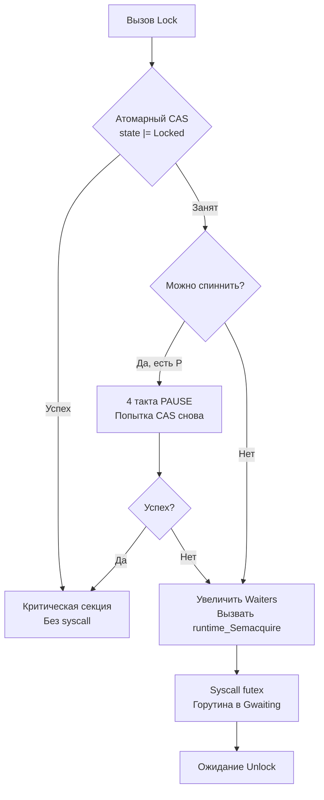

## Философия синхронизации состояния

В Go существует золотое правило: *«Не общайтесь, разделяя память. Делитесь памятью, общаясь»*. Однако когда речь заходит о мутабельном состоянии, разделяемом между горутинами (кэши, счетчики, конфигурации in-memory), каналы становятся неэффективными или неуместными. Пакет `sync` предоставляет низкоуровневые примитивы для безопасного доступа к таким ресурсам.

Ключевое отличие `sync` от мьютексов в C++ или Java — это **гибридная модель**. Блокировка не падает в ядро ОС сразу. Сначала предпринимается попытка захвата в User Space с помощью атомарных инструкций процессора. Только при долгом ожидании горутина передается планировщику ОС. Это минимизирует количество переключений контекста и сохраняет высокую пропускную способность.

## sync.Mutex: Гибридная блокировка и машинные инструкции

`sync.Mutex` — это не просто обертка над `futex` (Linux) или `WaitForSingleObject` (Windows). Это конечный автомат с двумя режимами работы: **Normal** и **Starvation**.

Внутреннее состояние хранится в одном `uint32`:
```go
type Mutex struct {
    state int32 // Биты: 1=Locked, 2=Woken, 4=Starving, 8..=WaiterCount
    sema  uint32 // Семафор для park/unpark
}
```

### Алгоритм захвата (Fast Path -> Slow Path)
1. **Атомарный CAS**: Горутина пытается установить бит `Locked` через `atomic.CompareAndSwapInt32`. Если успешно — возврат за ~5 тактов CPU, никаких syscall.
2. **Спиннинг (Spinning)**: Если мьютекс занят, но есть свободные P (логические процессоры) и очередь горутин короткая, горутина выполняет 4 такта цикла `PAUSE`/`NOP`. Это позволяет удерживать горуину на CPU, ожидая быстрой разблокировки владельцем, и избежать дорогого контекстного переключения.
3. **Парковка (Parking)**: Если спиннинг не помог, мьютекс увеличивает счетчик ожидающих, помечает себя как `Woken` и вызывает `runtime_SemacquireMutex`. Это транслируется в `futex(SYS_futex, FUTEX_WAIT)` на Linux. Горутина переходит в состояние `Gwaiting`, а системный тред (M) освобождается.



> [!info] Под капотом
> Начиная с Go 1.10, мьютекс автоматически переходит в **Starvation Mode**, если ожидание превышает 1 мс. В этом режиме новый владелец выбирается строго из очереди (FIFO), а не через CAS-гонку. Это предотвращает ситуацию, когда активные горутины постоянно перебивают «проснувшиеся», но уже «старые» горутины, вызывая их вечное ожидание.

## sync.RWMutex: Приоритет писателей и балансировка

`RWMutex` позволяет множеству читателей работать параллельно, но блокирует всех при запросе писателя. Внутри используется комбинация `int32` счетчиков и обычного `Mutex`.

### Логика работы
* **Читатели**: Инкрементируют счетчик `readerCount`. Если `readerCount` >= 0, вход разрешен.
* **Писатели**: Пытаются захватить внутренний `Mutex`. При успехе устанавливают `readerCount` в отрицательное значение, блокируя новых читателей. Затем ждут, пока активные читатели (`readerWait`) завершат работу.
* **Разблокировка писателя**: Сбрасывает `readerCount`, будит всех ожидающих писателей или читателей.

> [!warning] Ловушка / Gotcha
> **Рекурсивный захват запрещен.**
> Если горутина удерживает `RLock()` и пытается вызвать `Lock()`, произойдет дедлок. Go не имеет рекурсивных мьютексов (как `pthread_mutex` с `PTHREAD_MUTEX_RECURSIVE`). Архитектура языка требует явного разделения прав доступа. Если вам нужен рекурсивный доступ, пересмотрите архитектуру: вынесите блокировку выше или используйте каналы.

## sync.WaitGroup: Координация без каналов

`WaitGroup` решает задачу ожидания завершения набора горутин. Это не канал, а атомарный счетчик с встроенным семафором.

Внутренняя структура использует `state1 [3]uint32` (или `uint64` на 64-битных системах), разделенный на два поля:
1. **Counter**: Число активных горутин (`Add(1)` -> `counter++`).
2. **Waiters**: Число горутин, ожидающих в `Wait()`.

Когда `Counter` достигает нуля, `WaitGroup` вызывает `runtime_Semrelease` на ровно `Waiters` раз, пробуждая ожидающие горутины.

```go
func processBatch(items []Item) {
    var wg sync.WaitGroup
    // ❌ ОШИБКА: Add внутри горутины создает гонку!
    // for _, item := range items {
    //     go func() {
    //         wg.Add(1) // Может выполниться после wg.Wait()!
    //         ...
    //     }()
    // }
    
    // ✅ ИДИОМАТИЧНО: Add до запуска
    wg.Add(len(items))
    for _, item := range items {
        go func(i Item) {
            defer wg.Done() // Атомарный counter--
            process(i)
        }(item)
    }
    wg.Wait() // Блокирует до counter == 0
}
```

> [!tip] Собеседование
> **Вопрос:** Почему `sync.WaitGroup` нельзя копировать после первого использования?
> **Ответ:** Структура содержит внутренние указатели на семафоры и состояние. Копирование `WaitGroup` через присваивание (`newWg = oldWg`) копирует указатели, но создает независимые структуры. Это приводит к неопределенному поведению и панике `runtime: sync: WaitGroup misuse`. Компилятор и `go vet` отлавливают это. Передавайте `*sync.WaitGroup`.

## sync.Once: Ленивая инициализация и Double-Checked Locking

`sync.Once` гарантирует однократное выполнение функции, даже при конкурентных вызовах. Используется для инициализации синглетонов, загрузки конфигов, настройки кэшей.

Реализация использует паттерн **Double-Checked Locking**:
1. Быстрая проверка атомарного флага `done == 0`.
2. Если `0`, захват мьютекса.
3. Повторная проверка `done` (защита от гонки, пока ждали мьютекс).
4. Выполнение функции, установка `done = 1`, разблокировка мьютекса.

```go
var config *Config
var once sync.Once

func GetConfig() *Config {
    once.Do(func() {
        config = loadFromDisk() // Выполнится строго один раз
    })
    return config
}
```

> [!warning] Ловушка / Gotcha
> **Паника внутри `Do`**.
> Если функция `f` вызывает `panic`, `sync.Once` считает выполнение завершенным и **не будет** вызывать `f` повторно. В Go 1.21+ это поведение задокументировано явно. Если инициализация может падать, обрабатывайте ошибку внутри `f` и возвращайте её, либо не используйте `sync.Once` для критически важных операций с внешними зависимостями.

## Mechanical Sympathy: Кэш-линии, False Sharing и планировщик

### 1. False Sharing (Ложное разделение)
Если два независимых `sync.Mutex` попадают в одну кэш-линию CPU (обычно 64 байта), обновление одного ядром инвалидирует кэш-линию для другого ядра. Это вызывает `cache coherence traffic` и падение производительности на 10–30%.
**Решение:** Выравнивание структур до размера кэш-линии:
```go
type alignedMutex struct {
    mu sync.Mutex
    _  [56]byte // Паддинг до 64 байт на 64-битной системе
}
```

### 2. Конкуренция и рост M-тредов
Когда `sync.Mutex` переводит горутину в `Gwaiting`, тред (M) освобождается. Если блокировка длительная, планировщик может создать новые M-треды для обслуживания других горутин. Это приводит к **Thread Thrashing**: ОС тратит время на переключение контекстов между десятками потоков, вместо выполнения кода.
**Правило:** Держите критические секции максимально короткими. Избегайте I/O или сложных вычислений под `mu.Lock()`.

## Ловушки и вопросы с собеседований

| Ловушка | Описание | Решение |
|---------|----------|---------|
| `defer mu.Unlock()` в начале функции | Разблокировка происходит при `return`, а не сразу после секции | Вызывайте `defer` непосредственно перед `mu.Lock()`, но только если вся функция является критической секцией. |
| Передача `sync.Mutex` по значению | Функция получает копию, мьютекс не синхронизирует | Передавайте только указатели `*sync.Mutex`. |
| `WaitGroup.Add()` в конце горутины | `wg.Wait()` может сработать до инкремента | Всегда `wg.Add()` **до** `go func()`. |
| `Once` для периодических задач | `Once` выполняется один раз за всё время жизни процесса | Для периодической перезагрузки используйте `context` + таймер или `sync.RWMutex` с версионированием. |

> [!tip] Собеседование
> **Вопрос:** Когда использовать `sync.Mutex`, а когда `chan`?
> **Ответ:** 
> * `chan` — для **передачи владения** данными, координации потоков, реализации паттернов (worker pool, fan-in/out). Это «общение».
> * `sync.Mutex` — для защиты **разделяемого состояния** (кэш, счетчик, ин-мемори карта), когда данные не передаются, а мутируются. Это «совместное использование».
> Смешивание подходов (мьютекс + канал для одного ресурса) почти всегда ведет к багам.

## Сравнение с экосистемами

| Язык | Примитив | Особенности в сравнении с Go |
|------|----------|------------------------------|
| **C++** | `std::mutex`, `std::shared_mutex` | Прямая обертка над `pthread_mutex` или OS primitives. Нет встроенного спиннинга/режима starvation. Рекурсивность настраивается. |
| **Java** | `synchronized`, `ReentrantLock` | `synchronized` использует Object Monitor (JVM internal). `ReentrantLock` дает fair/unfair modes, аналогично Go, но требует явного `lock()/unlock()` в `finally`. |
| **PHP** | Отсутствует | PHP не имеет общей памяти для процессов. Синхронизация происходит через внешние хранилища (Redis `SETNX`, Memcached, файлы). |
| **Go** | `sync.Mutex`, `sync.RWMutex` | Гибридный User/Kernel режим, автоматический starvation mode, интеграция с планировщиком G-M-P, нулевая магия. |

## Итог

1. `sync.Mutex` использует CAS в User Space и переходит в `futex` только при длительном ожидании.
2. `sync.RWMutex` блокирует новых читателей при запросе писателя. Избегайте дедлоков через рекурсию.
3. `sync.WaitGroup` требует `Add()` до запуска горутины. Копирование после первого использования запрещено.
4. `sync.Once` реализует Double-Checked Locking. Паника внутри `f` помечает выполнение как завершенное.
5. Избегайте `False Sharing` выравниванием структур и держите критические секции короткими, чтобы не провоцировать рост тредов ОС.

Понимание блокировок открывает путь к изучению их «атомарной» альтернативы. Когда мьютекс избыточен, а производительность критична, на сцену выходят машинные инструкции. В следующей статье: [[20. sync_atomic. Атомарные операции.md]].