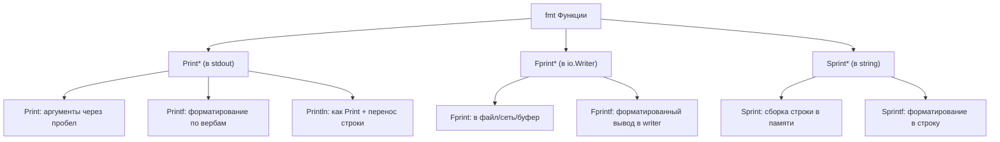

## Введение: больше, чем просто «печать»

Пакет `fmt` — это первый инструмент, с которым знакомится каждый новичок в Go через `fmt.Println("Hello, World!")`. Однако за этой простотой скрывается мощный, гибкий и при этом **дорогой** механизм форматирования, который при неумелом использовании может стать узким местом в высоконагруженном приложении.

`fmt` реализует функционал, аналогичный `printf` из языка C, но с важными отличиями, продиктованными типизацией и идиомами Go. Понимание того, как работает этот пакет «под капотом», критически важно для написания производительного кода уровня Senior Engineer.

> [!info] Под капотом
> Функции семейства `fmt` активно используют **рефлексию** (`reflect` пакет) и **вариативные аргументы** (`...interface{}`). Это означает аллокации в куче (heap allocations) для каждого вызова, где аргументы «упаковываются» в срез интерфейсов. В горячих путях (hot paths) это может генерировать значительное давление на Garbage Collector.

## Словарь форматирования (Verbs): полный справочник

Го предоставляет богатый набор «глаголов» (verbs) для форматирования. Знание тонкостей каждого из них — обязательный минимум.

### 1. Базовые вербы для любого типа

| Верб | Описание | Пример вывода (для `v := 42`) |
|------|----------|-------------------------------|
| `%v` | Значение в формате по умолчанию | `42` |
| `%+v` | Значение с именами полей (для структур) | `{ID:42 Name:"server"}` |
| `%#v` | Значение в синтаксисе Go (для отладки) | `main.Config{ID:42, Name:"server"}` |
| `%T` | Тип значения в синтаксисе Go | `main.Config` |
| `%%` | Литеральный знак процента | `%` |

### 2. Вербы для чисел и строк

| Верб | Тип | Описание | Пример |
|------|-----|----------|--------|
| `%d` | int | Десятичное целое | `42` |
| `%+d` | int | Со знаком (всегда + или -) | `+42` |
| `%x` | int/string | Шестнадцатеричный (a-f) | `2a` / `48656c6c6f` |
| `%X` | int/string | Шестнадцатеричный (A-F) | `2A` |
| `%b` | int | Двоичное | `101010` |
| `%f` | float | Десятичная дробь (по умолчанию 6 знаков) | `3.141593` |
| `%.2f` | float | С точностью до 2 знаков | `3.14` |
| `%e` | float | Научная нотация (экспонента) | `3.141593e+00` |
| `%s` | string/[]byte | Неформатированная строка | `Hello` |
| `%q` | string | Строка в двойных кавычках с экранированием | `"Hello"` |
| `%x` | string | Hex-дамп строки (без пробелов) | `48656c6c6f` |

> [!warning] Ловушка / Gotcha
> **Форматирование слайсов и мап через `%v`**.
> При использовании `%v` для слайса `[]int{1, 2, 3}` вы получите `[1 2 3]`. Это удобно для логов, но **не подходит** для сериализации данных (это не валидный JSON). Для передачи данных вовне всегда используйте `encoding/json`.
>
> Также помните: `%v` для мапы не гарантирует порядок ключей (в отличие от `%#v` в новых версиях Go, который может показывать порядок итерации, но полагаться на это в логике нельзя).

## Функциональные семейства: Print, Fprint, Sprint

Пакет `fmt` группирует функции по трем префиксам, определяющим **куда** идет вывод, и суффиксам, определяющим **формат**.



### Ключевые различия в поведении

1.  **`Print` vs `Println`**: `Println` всегда добавляет пробелы между аргументами и перенос строки в конце. `Print` добавляет пробел между аргументами **только если ни один из соседних аргументов не является строкой**. Это поведение часто приводит к неожиданным результатам в логах.

    ```go
    // Неочевидное поведение:
    fmt.Print("ID:", 123, "User:", "admin") 
    // Вывод: ID:123User:admin (нет пробелов, т.к. все аргументы - строки или конвертируются в них)
    
    fmt.Print("Error: ", err, " at ", time.Now())
    // Вывод: Error: <err_val> at <time_val> (пробелы есть, т.к. аргументы разных типов)
    ```

2.  **`Fprint` для `stderr`**: Никогда не пишите ошибки в `stdout`. Используйте `fmt.Fprintln(os.Stderr, "critical error")`. Это позволяет системам оркестрации (Kubernetes, Docker) корректно разделять поток приложения и поток ошибок.

## Under the hood: Цена абстракции и аллокации

Почему `fmt.Sprintf` считается «дорогим»? Давайте разберем путь данных.

Когда вы вызываете `fmt.Sprintf("User %s has ID %d", name, id)`:

1.  **Variadic packing**: Аргументы `name` и `id` упаковываются в срез интерфейсов `[]interface{}{name, id}`. Если `name` — это строка, а `id` — `int`, и они не «убежали» в кучу ранее, компилятор может разместить их в куче сейчас (Escape Analysis).
2.  **Reflection parsing**: Функция парсит строку формата `"User %s..."`. Для каждого верба она использует пакет `reflect`, чтобы извлечь значение из `interface{}` и определить его реальный тип.
3.  **Buffer allocation**: Внутри создается `bytes.Buffer` (или аналог), который растет по мере добавления данных.
4.  **String conversion**: В конце содержимое буфера конвертируется в `string`, что подразумевает копирование данных.

> [!info] Под капотом
> Внутренний парсер форматов `fmt` — это конечный автомат (state machine), написанный на чистом Go. Он не использует регулярные выражения для разбора строки формата, что делает его быстрее, чем могло бы быть, но рефлексия и аллокации интерфейсов остаются узким местом.

### Визуализация аллокаций

```go
func BenchmarkFmtSprintf(b *testing.B) {
    name := "user"
    id := 12345
    for i := 0; i < b.N; i++ {
        // ~2 аллокации на вызов: срез интерфейсов + результирующая строка
        _ = fmt.Sprintf("User %s has ID %d", name, id)
    }
}

func BenchmarkStringBuilder(b *testing.B) {
    name := "user"
    id := 12345
    for i := 0; i < b.N; i++ {
        var sb strings.Builder
        sb.Grow(32) // Предсказуемый размер
        sb.WriteString("User ")
        sb.WriteString(name)
        sb.WriteString(" has ID ")
        // strconv.AppendInt избегает аллокаций, работая с []byte
        sb.Write(strconv.AppendInt(nil, int64(id), 10))
        _ = sb.String() // 1 аллокация на результат
    }
}
```

> [!tip] Собеседование
> **Вопрос:** Почему `fmt.Sprintf` медленнее, чем конкатенация через `+` или `strings.Builder`?
> **Ответ:** 
> 1. `fmt.Sprintf` использует рефлексию для обработки вариативных аргументов `...interface{}`, что требует проверки типов в рантайме.
> 2. Упаковка аргументов в срез интерфейсов вызывает аллокации в куче.
> 3. Парсинг строки формата (`%s`, `%d`) — это дополнительная вычислительная работа.
> В то время как `+` и `strings.Builder` работают напрямую с памятью строк и байтов, часто оптимизируясь компилятором.

## Mechanical Sympathy: Оптимизация вывода

Для инженера уровня Senior важно знать, **где** можно использовать `fmt`, а где его нужно избегать.

### Таблица принятия решений

| Сценарий | Рекомендация | Обоснование |
|----------|--------------|-------------|
| Логирование ошибок / стартап | `fmt.Errorf` / `fmt.Println` | Читаемость кода важнее микро-оптимизаций. Эти пути не критичны по перформансу. |
| Обработчик HTTP (нагрузка > 1000 RPS) | Избегать `fmt.Sprintf` в ответе | Используйте `strconv` для чисел и `strings.Builder` для сборки ответа. |
| Метрики / Прометеус | `strings.Builder` + `WriteString` | Генерация текстового формата метрик — частая операция, аллокации здесь «съедят» CPU. |
| JSON ответы | `encoding/json` | Никогда не собирайте JSON вручную через `fmt`. Используйте стандартный сериализатор или `sonic`/`jsoniter` для экстремальных нагрузок. |
| Отладка (Debug) | `%+v` или `%#v` | Максимальная информативность для разработчика. |

### Пример: Оптимизация горячего пути

Допустим, мы формируем ключ для кэша в высоконагруженном цикле.

**❌ Медленно (fmt):**
```go
func makeCacheKey(userID int, action string) string {
    // 2+ аллокации на каждый вызов
    return fmt.Sprintf("cache:user:%d:action:%s", userID, action)
}
```

**✅ Быстро (strconv + strings.Builder):**
```go
func makeCacheKey(userID int, action string) string {
    // Оценим длину: "cache:user:" (11) + digits (~10) + ":action:" (8) + action
    // Grow помогает избежать реаллокаций буфера при росте
    var sb strings.Builder
    sb.Grow(30 + len(action)) 
    
    sb.WriteString("cache:user:")
    // AppendInt пишет сразу в []byte буфера, без лишних аллокаций
    sb.Write(strconv.AppendInt(nil, int64(userID), 10))
    sb.WriteString(":action:")
    sb.WriteString(action)
    return sb.String() // Единственная аллокация финальной строки
}
```

## Интернационализация и `fmt`

Важно помнить, что `fmt` **не предназначен** для локализации (l10n). Он не поддерживает подстановку аргументов в строки с учетом порядка слов в разных языках (как `{0}` в C# или Java `MessageFormat`).

Если ваше приложение требует поддержки нескольких языков, используйте специализированные библиотеки (например, `golang.org/x/text/message`), которые позволяют определять каталоги переводов и безопасно подставлять аргументы.

> [!warning] Ловушка / Gotcha
> **Утечка чувствительных данных через `%v`**.
> При логировании структур с паролями или токенами, `%v` выведет **все** поля, включая приватные.
> ```go
> type User struct {
>     Name     string
>     Password string // Секрет!
> }
> // Вывод: {Name:"admin" Password:"secret123"}
> ```
> **Решение:** Реализуйте интерфейс `fmt.Stringer` для структуры, чтобы явно контролировать вывод:
> ```go
> func (u User) String() string {
>     return fmt.Sprintf("User{Name:%s, Password:***}", u.Name)
> }
> ```

## Сравнение с другими языками

| Язык | Конструкция | Особенности в сравнении с Go |
|------|-------------|------------------------------|
| **C / C++** | `printf` | Типобезопасность: в Go компилятор (и линтер `go vet`) проверит соответствие верба типу аргумента. В С это приводит к неопределенному поведению (UB) и уязвимостям. |
| **Python** | `f"{var}"` / `%` | В Go нет интерполяции строк на уровне синтаксиса (пока). `fmt` — это рантайм-решение. Интерполяция в синтаксисе обсуждается, но отклоняется ради простоты компилятора. |
| **C#** | `$"{var}"` | Аналогично Python. В Go акцент сделан на явности и проверке типов, а не на синтаксическом сахаре. |

> [!tip] Собеседование
> **Вопрос:** Как `go vet` помогает при работе с `fmt`?
> **Ответ:** `go vet` имеет встроенный анализатор для функций семейства `fmt.Printf`. Он проверяет, соответствует ли строка формата переданным аргументам (например, не передан ли `string` для `%d`). Это отлавливает ошибки, которые в C/C++ проявились бы только в рантайме или привели к краху памяти.

## Итог

1.  **`fmt` — мощный, но дорогой инструмент.** Используйте его для логирования, обработки ошибок и не критичных к перформансу участков кода.
2.  **Избегайте `fmt` в горячих путях.** Для сборки строк под высокой нагрузкой используйте `strings.Builder` и `strconv`.
3.  **Знайте свои вербы.** `%+v` и `%#v` незаменимы при отладке, `%q` безопасен для логов строк.
4.  **Реализуйте `fmt.Stringer`.** Это стандартный способ контролировать представление ваших типов в логах и предотвращать утечки данных.

Освоив тонкости вывода текста, мы переходим к фундаментальному аспекту обработки сбоев в Go. В следующей статье мы разберем, как правильно создавать и обрабатывать ошибки, используя возможности стандартной библиотеки: [[3. errors. Создание, оборачивание и сравнение ошибок]].