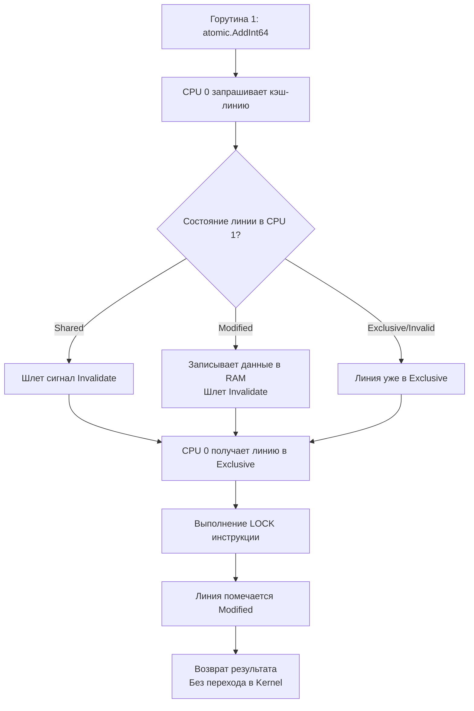

## Философия lock-free программирования и машинных инструкций

Пакет `sync/atomic` предоставляет прямой доступ к атомарным инструкциям процессора. В отличие от `sync.Mutex`, который управляет очередями горутин и может переводить их в ожидание ядра ОС, атомарные операции выполняются полностью в User Space за несколько тактов CPU. Это фундамент для построения высоконагруженных счетчиков, флагов состояния и неблокирующих (lock-free) структур данных.

> [!info] Под капотом
> Атомарность в Go гарантируется не рантаймом, а аппаратным обеспечением. Компилятор транслирует вызовы `atomic.AddInt64` или `atomic.CompareAndSwapUint32` в специфичные для архитектуры машинные инструкции:
> * **x86_64**: `LOCK CMPXCHG`, `LOCK XADD`
> * **ARM64**: `LDREX` / `STREX` (Load-Exclusive / Store-Exclusive)
> * **RISC-V**: `LR.W` / `SC.W` (Load-Reserved / Store-Conditional)
> Эти инструкции используют аппаратные механизмы блокировки шины памяти или протокол когерентности кэшей, чтобы гарантировать, что операция над ячейкой памяти будет завершена целиком до того, как другое ядро CPU сможет её прочитать.

## Under the hood: Протокол MESI и когерентность кэшей

Когда вы вызываете атомарную операцию, процессор не просто «блокирует память». Он взаимодействует с иерархией кэшей других ядер через протокол **MESI** (Modified, Exclusive, Shared, Invalid).



Понимание этого процесса критично для Mechanical Sympathy. Атомарные операции **дешевы при отсутствии конкуренции**, но при частом обновлении одной и той же ячейки несколькими ядрами возникает `cache coherence traffic`. Каждое обновление заставляет другие ядра инвалидировать свои копии кэш-линии, что приводит к падению производительности.

## 1. Типизированные атомики и паттерн CAS (Go 1.19+)

Начиная с Go 1.19, пакет `sync/atomic` предоставляет типобезопасные обертки: `atomic.Int32`, `atomic.Int64`, `atomic.Bool`, `atomic.Pointer[T]`. Они устраняют необходимость в `unsafe` и ручном выравнивании.

### Основные методы
* `Load()` / `Store()`: Атомарное чтение/запись.
* `Add(delta)`: Атомарное сложение (для счетчиков).
* `Swap(new)`: Безусловная замена, возврат старого значения.
* `CompareAndSwap(old, new)`: CAS. Основа lock-free алгоритмов. Обновляет значение **только если** оно всё ещё равно `old`.

### Классический CAS-цикл
```go
type LockFreeCounter struct {
    val atomic.Int64
}

func (c *LockFreeCounter) Increment() {
    for {
        old := c.val.Load()
        new := old + 1
        
        // Пытаемся атомарно заменить old на new
        if c.val.CompareAndSwap(old, new) {
            return // Успех
        }
        // Если CAS провалился, значит другая горутина изменила значение.
        // Повторяем цикл с новым стартовым значением.
    }
}
```

> [!warning] Ловушка / Gotcha
> **Смешивание атомарного и обычного доступа**.
> Если вы читаете переменную через `atomic.Load()`, но пишете через обычное присваивание `x = 5`, компилятор не защитит вас. Это приведет к гонке данных (data race) и сломанной памяти на уровне CPU. **Правило:** Если к переменной применен хотя бы один атомарный метод, **все** обращения к ней должны быть атомарными.

## Mechanical Sympathy: False Sharing и выравнивание

Поскольку атомарные операции работают с целыми кэш-линиями (обычно 64 байта), размещение нескольких независимых атомиков в одной структуре может вызвать **False Sharing** (ложное разделение).

```go
// ❌ ПЛОХО: a и b могут попасть в одну кэш-линию
type BadMetrics struct {
    a atomic.Int64
    b atomic.Int64
}

// ✅ ХОРОШО: Паддинг гарантирует разделение кэш-линий
type GoodMetrics struct {
    a atomic.Int64
    _ [56]byte // 8 + 56 = 64 байта. b начнется с новой линии
    b atomic.Int64
}
```
При использовании `GoodMetrics`, обновление `a` не будет инвалидировать кэш-линию для `b`, даже если они обновляются параллельно разными горутинами. В высоконагруженных метрических системах это ускоряет работу в 5–10 раз.

## 2. atomic.Pointer[T] и обновление конфигураций без блокировок

`atomic.Pointer` позволяет безопасно заменять указатели на сложные структуры без `sync.RWMutex`. Это идеально для горячего обновления конфигураций или кэшей в памяти.

```go
var config atomic.Pointer[AppConfig]

// Инициализация при старте
config.Store(&AppConfig{Timeout: time.Second})

// Горутина-обработчик читает конфиг без блокировки
func handleRequest() {
    // Load атомарно читает указатель.
    // Даже если другой поток обновит конфиг прямо сейчас,
    // эта горутина получит консистентную версию.
    cfg := config.Load()
    process(cfg.Timeout)
}

// Горутина-релоадер обновляет конфиг
func reloadConfig(newCfg *AppConfig) {
    config.Store(newCfg)
}
```
Garbage Collector в Go отслеживает достижимость объектов. Старый `AppConfig` не будет собран мусорщиком до тех пор, пока все горутины, взявшие его через `Load()`, не завершат работу. Это делает паттерн полностью безопасным.

## Ловушки и хардкорные вопросы с собеседований

| Ловушка | Описание | Решение |
|---------|----------|---------|
| Выравнивание на 32-битных архитектурах | `atomic.Int64` требует 8-байтового выравнивания. В структурах на 32-бит ARM/x86 это может вызвать панику. | В Go 1.19+ типизированные атомики встроены и компилятор автоматически выравнивает их. Если используете legacy `atomic.AddInt64(&x, n)`, выносите `x` в начало структуры или используйте `atomic.Value`. |
| ABA-проблема | Горутина читает `A`, засыпает. Другая меняет `A` -> `B` -> `A`. Первая просыпается и CAS срабатывает, хотя данные изменились. | В Go с GC и `atomic.Pointer` проблема смягчена, так как старый объект не переиспользуется для новых данных. Для целочисленных счетчиков используйте версионирование или `atomic.Swap`. |
| Блокировка в CAS-цикле | Если конкуренция высокая, цикл `for { if CAS break }` может крутиться бесконечно, сжигая 100% CPU одного ядра. | Добавляйте `runtime.Gosched()` после N неудачных попыток, чтобы передать квант другим горутинам, или падайте на `sync.Mutex`. Атомики не заменяют мьютексы при высокой contention. |
| `atomic.Value` для любых типов | `atomic.Value` требует, чтобы все вызовы `Store()` передавали значения одного конкретного типа. Смена типа вызовет панику. | Используйте `atomic.Pointer[T]`. Он типобезопасен на уровне компилятора и не имеет ограничений на тип. |

> [!tip] Собеседование
> **Вопрос:** Почему `sync/atomic` не предоставляет `Wait()` или уведомлений об изменении значения?
> **Ответ:** Атомарные операции спроектированы как максимально легковесные и блокирующие только шину памяти/кэш. Ожидание изменения требует постановки горутины в очередь и парковки, что уже выходит за пределы User Space и требует планировщика или мьютексов. Если нужно ждать изменения флага, используйте `sync.Cond` или каналы. Атомики — для опроса (`Load`) и модификации, не для синхронизации потоков.
>
> **Вопрос:** Когда `atomic` быстрее `sync.Mutex`, а когда медленнее?
> **Ответ:** При низкой конкуренции `atomic` быстрее в 10–100 раз, так как это 1–2 ассемблерные инструкции без переключения контекста. При высокой конкуренции (десятки горутин долбят одну ячейку) `atomic` проигрывает из-за `cache coherence traffic` и спиннинга. Мьютекс в таком случае эффективнее, так как переводит горутины в сон, освобождая ядра CPU для другой работы.

## Сравнение с экосистемами других языков

| Язык | Механизм | Особенности в сравнении с Go |
|------|----------|------------------------------|
| **C++** | `std::atomic<T>`, `<atomic>` | Дает тонкий контроль над `memory_order` (relaxed, acquire, release, seq_cst). Go использует только `seq_cst` для простоты и безопасности, жертвуя микроскопической оптимизацией. |
| **Java** | `AtomicInteger`, `VarHandle` | Использует `Unsafe` под капотом. `VarHandle` (Java 9+) дает контроль над барьерами памяти, аналогично C++. Go абстрагирует это полностью. |
| **C#** | `Interlocked` класс | Статические методы `Interlocked.Increment`, `CompareExchange`. Аналогично Go, но без типизированных структур. Работает поверх CPU инструкций. |
| **PHP** | Отсутствует | PHP не разделяет память между процессами. Атомарность достигается только через внешние системы (Redis `INCR`, атомарные скрипты Lua). |

## Итог

1. `sync/atomic` транслируется в аппаратные инструкции (`LOCK CMPXCHG` и др.). Гарантирует атомарность на уровне кэш-линий.
2. Используйте типизированные атомики (`atomic.Int64`, `atomic.Pointer[T]`). Они безопаснее и быстрее legacy `unsafe` подходов.
3. Паттерн CAS-цикла — основа lock-free алгоритмов. Всегда проверяйте возвращаемое значение `CompareAndSwap`.
4. Избегайте `False Sharing` через паддинг структур до размера кэш-линии (64 байта).
5. Атомики не заменяют мьютексы при высокой конкуренции. Используйте их для счетчиков, флагов и lock-free обновления указателей.
6. Никогда не смешивайте атомарные и обычные операции над одной переменной.

Понимание того, как эффективно работать с примитивами синхронизации, ведет к следующей критической теме оптимизации: управлению памятью. Создание миллионов короткоживущих объектов убивает GC. Как переиспользовать память без блокировок и аллокаций? В следующей статье мы разберем пулы объектов: [[21. sync_pool. Переиспользование объектов]].