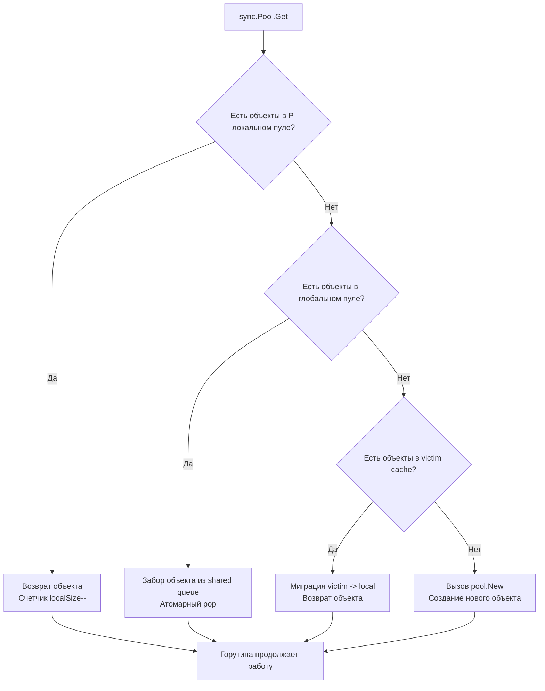

## Философия временных буферов и давления на GC

В высоконагруженных Go-приложениях главная проблема производительности — не вычисления, а работа с памятью. Каждый вызов `make([]byte, N)`, `bytes.NewBuffer()` или создание временной структуры генерирует аллокацию в куче. Когда таких объектов тысячи в секунду, Garbage Collector вынужден постоянно сканировать heap, помечать мусор и выполнять Stop-The-World паузы. Это явление известно как **GC Assist Time**: горутины начинают помогать сборщику, тратя CPU на очистку памяти вместо выполнения бизнес-логики.

`sync.Pool` решает эту проблему, предоставляя механизм переиспользования временных объектов. Это не кэш и не хранилище долгоживущих данных. Это «корзина возврата», предназначенная строго для короткоживущих буферов, которые нужны на время одного запроса и затем могут быть выданы следующему.

> [!info] Под капотом
> `sync.Pool` интегрирован в цикл сборки мусора. Между циклами GC пул сохраняет объекты. Во время полной сборки кучи (`STW`) локальные пулы очищаются, но объекты перемещаются в **Victim Cache**, чтобы пережить еще один цикл GC. Это сглаживает резкие скачки аллокаций и предотвращает полное истощение пула при каждом запуске сборщика.

## Under the hood: Per-P архитектура и Victim Cache

Внутренняя структура `sync.Pool` оптимизирована под модель планировщика G-M-P. Она избегает глобальных мьютексов, разделяя хранилище по логическим процессорам (P).



Ключевые элементы внутренней реализации:
1. **Local Pools**: Массив `poolLocal`, где каждый элемент привязан к конкретному P. Доступ к нему не требует блокировок, так как только горутины на этом P могут его читать.
2. **Shared Pool**: Глобальная очередь для случаев, когда локальный пул P пуст, а объекты есть в других пулах. Доступ защищен атомарными операциями.
3. **Victim Cache**: Дублирующий пул, который заполняется перед очисткой основного во время GC. При следующем вызове `Get` объекты сначала мигрируют из victim в local. Это позволяет объектам жить до 2 циклов GC вместо 1.

> [!warning] Ловушка / Gotcha
> **Никаких гарантий сохранности.**
> `sync.Pool` может удалить объект в любой момент после запуска GC. Вы **не можете** использовать его для кэширования подключений к БД, сессий пользователей или данных, которые нужны дольше одного запроса. Для долгосрочного хранения используйте `map` с `sync.RWMutex` или внешнее хранилище (Redis).

## Mechanical Sympathy: Аллокации, Cache Locality и влияние на STW

Почему `sync.Pool` так сильно снижает нагрузку на CPU?

1. **Устранение `malloc`**: Выделение памяти в куче требует поиска свободного блока в heap bitmap, обновления `mspan` структур и возможных системных вызовов `mmap`. `pool.Get()` возвращает готовый указатель из массива. Это O(1) операция без поиска.
2. **Cache Locality**: Объекты в `sync.Pool` часто находятся в горячей области памяти. Переиспользование одного и того же буфера улучшает предсказуемость загрузки данных в L1/L2 кэш CPU, так как память не фрагментируется хаотичными аллокациями.
3. **Снижение частоты GC**: Уменьшение количества аллокаций напрямую сдвигает порог запуска сборщика (`GOGC`). Рантайм реже инициирует STW, что снижает задержки (latency) HTTP-запросов и сетевых вызовов.

## Идиоматичное использование в production

### Паттерн для `bytes.Buffer`
```go
var bufPool = sync.Pool{
    New: func() interface{} {
        // Выделяем буфер с достаточной емкостью для типичного запроса
        return bytes.NewBuffer(make([]byte, 0, 1024))
    },
}

func handleRequest(w http.ResponseWriter, r *http.Request) {
    // 1. Получаем буфер из пула
    buf := bufPool.Get().(*bytes.Buffer)
    
    // 2. Обязательно сбрасываем состояние перед использованием
    buf.Reset() 
    
    // ВАЖНО: defer pool.Put(buf) в горячих циклах создает оверхед.
    // Лучше использовать явный Put или defer вне цикла.
    defer bufPool.Put(buf) 
    
    // 3. Работаем с буфером
    buf.WriteString("Hello ")
    buf.WriteString(r.URL.Path)
    w.Write(buf.Bytes())
}
```

> [!info] Под капотом
> `buf.Reset()` не освобождает память. Он просто сбрасывает внутренний счетчик `off` и `len` в 0. Емкость (`cap`) остается прежней. Это гарантирует, что при следующем `Get` буфер не потребует реаллокаций через `append`.

### Оптимизация для `[]byte`
```go
var bytesPool = sync.Pool{
    New: func() interface{} {
        b := make([]byte, 4096)
        return &b // Возвращаем указатель на слайс, чтобы избежать копирования указателя
    },
}

func readData(r io.Reader) error {
    bufPtr := bytesPool.Get().(*[]byte)
    buf := (*bufPtr)[:0] // Сохраняем емкость, сбрасываем длину
    
    defer bytesPool.Put(bufPtr)
    
    n, err := r.Read(buf)
    if err != nil && err != io.EOF {
        return err
    }
    process(buf[:n])
    return nil
}
```

## Ловушки и вопросы с собеседований

| Ловушка | Описание | Решение |
|---------|----------|---------|
| Забытый `Reset()` | Объект возвращается с мусором от предыдущего запроса | Всегда вызывайте `Reset()` или перезаписывайте данные сразу после `Get()`. |
| `defer pool.Put()` в tight-loop | Overhead `defer` на 10-20% снижает производительность в циклах | Выносите `Put` за цикл или используйте явный вызов в конце итерации. |
| Сохранение состояния в пуле | Горутина сохраняет указатель на объект и кладет его в пул с данными | `sync.Pool` предназначен для безсостоятельных буферов. Любое состояние должно быть явно очищено. |
| Паника в `pool.New` | Если `New` паникует, пул не восстанавливается, последующие `Get` падают | Пишите надежный `New`. Обрабатывайте ошибки внутри, используйте `recover` только если это критично. |

> [!tip] Собеседование
> **Вопрос:** Почему `sync.Pool` возвращает `interface{}`, а не дженерик `T`?
> **Ответ:** Исторически пул появился до введения дженериков в Go 1.18. Изменение API нарушило бы обратную совместимость для миллионов строк кода. В Go 1.18+ появилась обертка `pool.New()` с типизацией, но базовый `sync.Pool` остался `interface{}`. На практике используют кастомную обертку или приводят типы явно. Дженерики в самом `sync` пакете не планируются к внедрению ради сохранения ABI стабильности рантайма.
>
> **Вопрос:** Когда `sync.Pool` НЕ стоит использовать?
> **Ответ:** 
> 1. Объекты живут дольше одного запроса (кэши, соединения).
> 2. Создание объекта дешевле, чем `Get/Put` (например, маленькие `int`, `struct{}`).
> 3. Объекты содержат указатели на внешние ресурсы (файлы, сокеты), которые нельзя безопасно переиспользовать без закрытия.
> 4. Приложение работает под низкой нагрузкой, где аллокации редки, а overhead пула заметен.

## Сравнение с экосистемами других языков

| Язык | Механизм | Особенности в сравнении с Go |
|------|----------|------------------------------|
| **Java** | `Apache Commons Pool`, `ThreadLocal` | Требует явной настройки `maxSize`, `eviction policy`. Часто использует глобальные локи. В Go пул интегрирован с GC и планировщиком P. |
| **C++** | `Object Pool`, `tcmalloc`/`jemalloc` | Ручное управление памятью. Разработчик сам пишет пулы. Go предлагает встроенное, GC-aware решение с автоматической очисткой. |
| **Python** | `queue.Queue`, `collections.deque` | Нет встроенного пула объектов. GC ссылочного типа + generational collector. Пулинг реализуется вручную, но не дает такого выигрыша, так как аллокация маленьких объектов в Python дешевая. |
| **Go** | `sync.Pool` | Lock-free на уровне P, автоматическая очистка GC, Victim Cache для сглаживания нагрузок. Минимальный boilerplate. |

## Итог

1. `sync.Pool` предназначен **строго для временных, короткоживущих объектов**. Не используйте его как кэш.
2. Архитектура Per-P + Victim Cache минимизирует блокировки и сглаживает влияние сборщика мусора.
3. Всегда вызывайте `Reset()` или очищайте состояние объекта перед возвратом в пул.
4. Избегайте `defer pool.Put()` в горячих циклах. Явный `Put` или вынос за цикл дает прирост производительности.
5. Пул не гарантирует сохранность данных. Объекты могут быть удалены GC в любой момент.
6. Используйте пул для `[]byte`, `bytes.Buffer`, парсинг-буферов и временных структур, создаваемых на каждый запрос.

Разобрав управление памятью на уровне пулов, мы переходим к сердцу языка. Как рантайм отслеживает горутины, управляет памятью и предоставляет отладочную информацию? В следующей статье мы изучим пакет, который дает доступ к внутренностям Go: [[22. runtime. Получение информации о рантайме]].