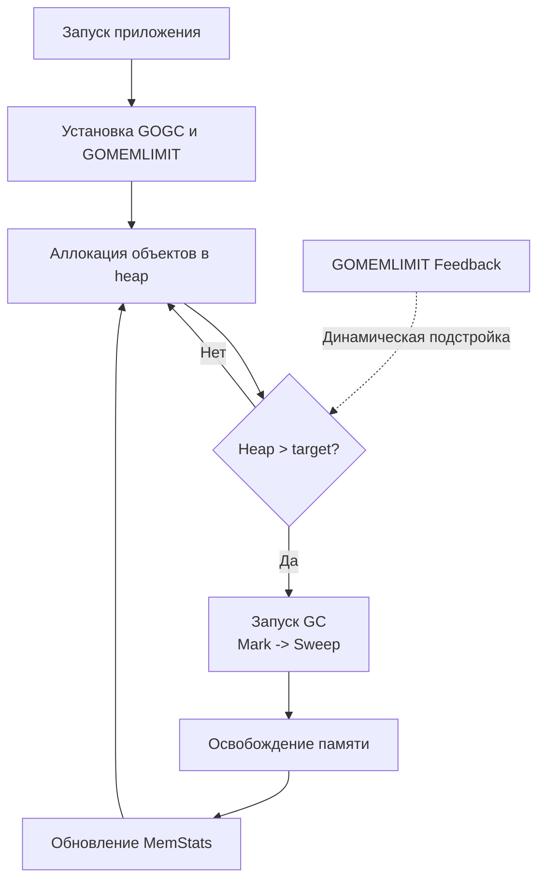

## Философия интроспекции и контроля

Пакет `runtime` — это прямой мост в машинный зал Go. В отличие от `os`, который предоставляет абстракцию над операционной системой, `runtime` дает доступ к планировщику горутин, сборщику мусора, управлению стеками и низкоуровневым метрикам памяти. Это не инструмент для повседневной бизнес-логики, а критический набор функций для отладки production-инцидентов, написания профайлеров, тонкой настройки высоконагруженных сервисов и реализации низкоуровневых примитивов.

Использование `runtime` в обычном коде обычно сигнализирует о нарушении абстракций. Однако для инженера уровня Senior/Lead понимание его механики обязательно: оно позволяет диагностировать утечки горутин, оптимизировать потребление памяти и избегать деградации производительности в контейнеризированных средах.

> [!info] Под капотом
> Пакет `runtime` компилируется в один бинарный файл вместе с приложением и линкуется статически. Он не использует системные вызовы напрямую для внутренней координации, а полагается на встроенный планировщик G-M-P и атомарные инструкции CPU. Это обеспечивает минимальную задержку при интроспекции, но требует осторожности: ошибочный вызов может перевести весь процесс в состояние `Stop-The-World`.

## 1. Интроспекция планировщика и диагностика горутин

Базовая диагностика состояния приложения начинается с мониторинга активных горутин.

```go
// Количество активных горутин в системе
count := runtime.NumGoroutine()

// Полный дамп стеков всех горутин (дорого!)
buf := make([]byte, 1024*1024)
n := runtime.Stack(buf, true)
fmt.Printf("%s", buf[:n])
```

### Under the hood: Как работает `runtime.Stack`
Функция `runtime.Stack` приостанавливает выполнение всех горутин (`stopTheWorld` на микросекунды), безопасным образом копирует их стеки из сегментированной памяти в переданный буфер и возобновляет работу. В production вызов `runtime.Stack(..., true)` с флагом `all=true` может вызвать заметный `latency spike` при десятках тысяч горутин. Для безопасного получения стека текущей горутины используйте `debug.Stack()` из пакета `runtime/debug`, который работает асинхронно.

Внутренний счетчик горутин (`sched.ngrun` + `sched.nmidle`) обновляется атомарно при создании (`newproc`) и завершении (`goexit`) горутин. `runtime.NumGoroutine()` читает его без блокировок, но возвращает мгновенный срез, который может не отражать горутины в процессе создания.

## 2. Управление потоками ОС и привязка

Go абстрагирует потоки ОС, но иногда требуется жесткий контроль над системными тредами (M).

### `NumCPU` vs `GOMAXPROCS`
`runtime.NumCPU()` возвращает количество логических ядер, видимых процессу. В современных Linux-контейнерах эта функция читает `cgroups v2` (`cpuset.cpus.effective`) и корректно учитывает лимиты Kubernetes/Docker.
`runtime.GOMAXPROCS(n)` изменяет количество логических процессоров (`P`), используемых планировщиком Go. По умолчанию равно `NumCPU`. Изменение на лету возможно, но не рекомендуется: оно вызывает перераспределение очередей горутин и временную деградацию пропускной способности.

### `LockOSThread` и `UnlockOSThread`
Эти функции привязывают текущую горутину `g` к системному треду `m` на 1:1.
```go
func runWithThreadAffinity() {
    runtime.LockOSThread()
    // Гарантируем, что Unlock вызовется всегда, даже при panic
    defer runtime.UnlockOSThread()
    
    // Работа с CGO, GUI, специфичными syscall или Thread-Local Storage
    performNativeOperation()
}
```

> [!warning] Ловушка / Gotcha
> **Забытый `UnlockOSThread` приводит к утечке тредов.**
> Если горутина завершается (или паникует) в состоянии `locked`, тред `M` помечается как `lockedg = nil`, но не возвращается в пул. Планировщик создает новый системный тред для замены. При частых вызовах это приводит к росту `thread_count` ОС, исчерпанию лимитов (`pthread_create` fails) и OOM-killer. Всегда используйте `defer runtime.UnlockOSThread()` сразу после `Lock`.

## 3. Метрики памяти и эволюция управления GC

Пакет `runtime` предоставляет единственный способ получить точные данные о работе сборщика мусора без внешних агентов.

### `runtime.MemStats`
```go
var ms runtime.MemStats
runtime.ReadMemStats(&ms)

fmt.Printf("Alloc: %d MB\n", ms.Alloc/1024/1024)          // Текущий heap
fmt.Printf("TotalAlloc: %d MB\n", ms.TotalAlloc/1024/1024) // Сумма всех аллокаций
fmt.Printf("Sys: %d MB\n", ms.Sys/1024/1024)               // Запрошено у ОС
fmt.Printf("NumGC: %d\n", ms.NumGC)                        // Завершенных циклов
```

> [!info] Под капотом
> `runtime.ReadMemStats` в Go 1.21+ использует асинхронное сэмплирование. Ранние версии вызывали микроскопический `STW` для снятия точного среза. Сейчас данные читаются из `memstats`, который обновляется фоновым потоком `bggc` атомарно. Вызов остается дорогим при экстремальной нагрузке (>50k RPS) из-за барьеров памяти.

### `GOGC` и `GOMEMLIMIT`
* `GOGC=100` (по умолчанию) запускает GC, когда heap удвоился с момента последнего сбора. Уменьшение (`GOGC=50`) делает сборку чаще, но снижает peak-память. Увеличение (`GOGC=200`) повышает latency, но снижает CPU overhead GC.
* `GOMEMLIMIT` (Go 1.19+) задает жесткий лимит RSS. Рантайм использует feedback-контроллер для динамического изменения целевого размера heap и частоты GC, чтобы процесс не превысил указанный лимит. Это замена ручному тюнингу `GOGC` в контейнерах с ограниченными ресурсами.



## 4. Mechanical Sympathy: Стек, `Gosched` и барьеры памяти

### `runtime.Gosched`
Вызов `runtime.Gosched()` эквивалентен `sched_yield()` в POSIX. Он принудительно передает квант времени другой горутине, перемещая текущую `g` в конец локальной очереди `P`. Используется редко, в основном в tight-loop алгоритмах без блокирующих вызовов, чтобы избежать starvation других задач.

### `runtime.KeepAlive`
В Go компилятор может оптимизировать код так, что объект будет считаться недостижимым раньше, чем ожидается, если на него нет явных ссылок. `runtime.KeepAlive(x)` создает искусственную ссылку до точки вызова, предотвращая преждевременную сборку GC.
Критически важно при работе с `unsafe.Pointer`, финализаторами (`runtime.SetFinalizer`) и CGO, где C-код может использовать память, которую Go уже пометил для освобождения.

### Рост стека
Go использует **сегментированные стеки** (ранее связанные, сейчас contiguous с копированием). При переполнении вызывается `runtime.morestack`, который выделяет новый блок памяти, копирует содержимое старого стека и обновляет указатели. `runtime.Stack` отражает эту структуру. Размер стека начинается с 2 КБ и растет кратно 2 до ~1 ГБ на горутину.

## 5. Ловушки и вопросы с собеседований

| Ловушка | Описание | Решение |
|---------|----------|---------|
| `runtime.GC()` в production | Принудительный запуск сборки останавливает все горутины и сбрасывает pacing алгоритм. | Никогда не вызывать вручную. Полагаться на `GOGC`/`GOMEMLIMIT`. |
| Игнорирование `UnlockOSThread` | Тред помечается как deadlocked, ОС создает новый. Лимит потоков исчерпывается. | Всегда `defer Unlock` после `Lock`. Оборачивайте в надежные функции. |
| `ReadMemStats` в hot-path | Сбор метрик занимает микросекунды, но при тысячах вызовов добавляет contention на память. | Выносить в отдельную горутину с интервалом 1-5 сек. |
| `runtime.Caller` для логирования | Извлечение stack trace требует раскрутки стека и аллокаций. В циклах убивает производительность. | Использовать `runtime.CallersFrames` с кэшированием или готовые профайлеры. |

> [!tip] Собеседование
> **Вопрос:** В чем разница между `runtime.NumCPU()` и `os.Getenv("NPROC")`?
> **Ответ:** `runtime.NumCPU()` обращается к API ядра (`sched_getaffinity` или cgroups) и возвращает точное число доступных ядер для процесса. Переменная окружения `NPROC` или `OMP_NUM_THREADS` — это соглашение, которое не гарантирует фактических ограничений `cgroups`. В Kubernetes `NumCPU()` корректно учитывает `requests/limits`, в отличие от многих сторонних инструментов.
>
> **Вопрос:** Почему `runtime.Stack(buf, true)` не рекомендуется в middleware HTTP-сервера?
> **Ответ:** Флаг `all=true` вызывает остановку всех горутин (`stopTheWorld`). На нагруженном сервере это приводит к задержке ответов на сотни миллисекунд, таймаутам клиентов и каскадным отказам. Для отладки используйте `pprof` или `debug.PrintStack()` только для текущей горутины.

## 6. Сравнение с экосистемами

| Язык / Среда | Механизм интроспекции | Особенности в сравнении с Go |
|--------------|----------------------|------------------------------|
| **JVM (Java)** | `java.lang.management.ManagementFactory`, VisualVM | Требует JMX-агентов, тяжелая метрика. GC-тюнинг через флаги `-XX`. Go встраивает метрики в `runtime`, тюнинг через env-переменные. |
| **C / C++** | `valgrind`, `gdb`, `pthread_*` | Нет встроенного рантайма. Отладка памяти внешними утилитами. Управление потоками полностью на уровне ОС. |
| **PHP** | `xdebug`, `memory_get_usage()` | Процессы изолированы, нет shared state. Метрики собираются через внешние APCu или экспорт в Prometheus. Go дает прямой доступ к внутреннему счетчику. |
| **Go** | `runtime`, `runtime/debug` | Легковесный, статически слинкованный, атомарный. Интегрирован с G-M-P планировщиком. Позволяет точную настройку без внешних агентов. |

## Итог

1. `runtime` — это диагностический и настройный слой, а не инструмент бизнес-логики.
2. `runtime.NumGoroutine()` атомарен, но `runtime.Stack(..., true)` вызывает `STW` и не подходит для hot-path.
3. Всегда используйте `defer runtime.UnlockOSThread()` после `Lock`. Забытый вызов ведет к утечке системных тредов.
4. `runtime.ReadMemStats` предоставляет точные метрики heap/GC. Для контроля лимитов используйте `GOMEMLIMIT` вместо ручного изменения `GOGC`.
5. `runtime.KeepAlive` предотвращает раннюю сборку GC при работе с `unsafe` и финализаторами.
6. Понимание `runtime` необходимо для отладки production-инцидентов, но злоупотребление им нарушает абстракции языка.

Разобрав низкоуровневые механизмы рантайма, мы переходим к механизму, который позволяет Go работать с типами, неизвестными на этапе компиляции. Ценой этой гибкости является производительность и сложность. В следующей статье мы глубоко погрузимся в рефлексию: [[23. reflect. Рефлексия и ее цена]].