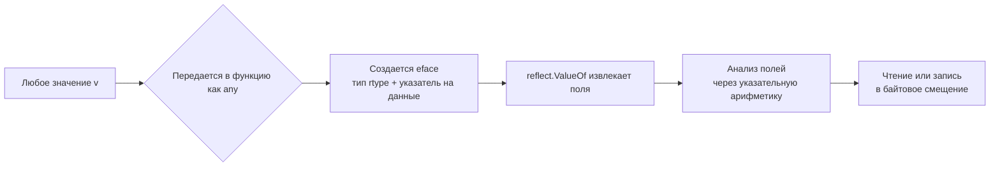

## Философия интроспекции и динамической типизации

Рефлексия в Go — это механизм интроспекции типов и значений во время выполнения. Она позволяет коду, не знающему о структуре данных на этапе компиляции, исследовать её поля, вызывать методы и динамически создавать объекты. Именно на пакете `reflect` построены `encoding/json`, `database/sql` и большинство мапперов. Однако за эту гибкость приходится платить высокую цену в производительности и безопасности типов. Для инженера уровня Senior понимание того, где рефлексия оправдана, а где она становится бутылочным горлышком — ключевой навык оптимизации.

> [!info] Под капотом
> В Go типы не стираются при компиляции. Компилятор генерирует для каждого уникального типа структуру дескриптора `runtime._type`, содержащую размер, выравнивание, указатели на методы и таблицу полей для структур. `reflect.Type` — это просто безопасная обертка над указателем на этот дескриптор. `reflect.Value` хранит указатель на данные и ссылку на тип. Это позволяет рефлексии работать, но требует обхода иерархии метаданных, что нарушает предсказание ветвлений CPU и инлайнинг.

## Under the hood. Типы, дескрипторы и память

Когда вы вызываете `reflect.TypeOf(v)` или `reflect.ValueOf(v)`, происходит преобразование значения в пустой интерфейс `any`. Компилятор упаковывает тип и данные в структуру `eface` или `iface`.



`rtype` содержит метаданные: `size`, `align`, `kind`, `ptrdata` для сборщика мусора, `str` и массив описателей полей. Рефлексия буквально читает эти поля, используя арифметику указателей, чтобы смещаться на нужные байты внутри структуры. В отличие от статического кода, где компилятор вычисляет смещения на этапе сборки, здесь каждое обращение требует рантайм-расчетов.

## Mechanical Sympathy. Почему рефлексия убивает производительность

Цена рефлексии складывается из нескольких фундаментальных факторов, нарушающих принципы Mechanical Sympathy:

1. **Отсутствие Inlining и Devirtualization**: Компилятор не может инлайнить код, использующий `reflect`. Вызов `v.Field(i).Interface()` транслируется в косвенный вызов функции по указателю. Это ломает `branch prediction` и инструкционный кэш L1.
2. **Аллокации интерфейсов**: Методы `.Interface()`, `.Set()`, `.Call()` требуют упаковки примитивов в `interface{}`. Это вызывает аллокации в куче через `runtime.convT2E`, создавая давление на GC.
3. **Потеря Cache Locality**: Обход полей структуры через рефлексию не является последовательным чтением памяти. Компилятор добавляет `padding` для выравнивания, а рефлексия вычисляет смещения динамически, вызывая случайные доступы к памяти и `cache misses`.
4. **Рантайм-проверки**: Каждая операция `reflect` проверяет границы, типизацию и мутабельность. Эти проверки выполняются на каждой итерации, добавляя ветвления, которые процессор не может предсказать.

## Практика и идиомы. CanSet, мутабельность и работа с nil

Самая частая ошибка — попытка изменить значение через рефлексию без проверки возможности записи. `reflect.ValueOf(v)` создает **копию** значения, если `v` не адресует память напрямую.

```go
type Config struct {
    Timeout int
}

func main() {
    cfg := Config{Timeout: 1000}
    
    // ❌ Паника: reflect: reflect.Value.SetInt using unaddressable value
    // v := reflect.ValueOf(cfg)
    // v.Field(0).SetInt(5000)
    
    // ✅ Идиоматично: передаем указатель
    vPtr := reflect.ValueOf(&cfg).Elem()
    
    // Всегда проверяем возможность записи
    if vPtr.Field(0).CanSet() {
        vPtr.Field(0).SetInt(5000)
    }
}
```

> [!warning] Ловушка / Gotcha
> **`reflect.ValueOf(nil)` и интерфейсы**.
> Если передать `nil` в `ValueOf`, вы получите валидный `reflect.Value` с `Kind() == reflect.Invalid`. Попытка вызвать `.Type()` или `.Method()` приведет к панике.
> Более того, `reflect.DeepEqual` **не работает** с функциями, каналами и мапами корректно во всех сценариях. Для структур с полями `time.Time` или `sync.Mutex` он может вести себя непредсказуемо из-за внутренних указателей и состояний блокировок. Никогда не используйте `reflect.DeepEqual` в продакшен-коде для сравнения структур, содержащих `sync` примитивы или функции.

## Ловушки и вопросы с собеседований

| Сценарий | Проблема | Решение |
|----------|----------|---------|
| `reflect.DeepEqual` для мап и слайсов | Сравнивает элементы, но порядок в мапе не детерминирован, слайсы сравниваются по содержимому, а не по ссылке. | Используйте `cmp.Equal` из `google/go-cmp` для тестов. В бизнес-логике пишите явные методы сравнения. |
| Динамический вызов методов `.Call()` | Требует создания среза `[]reflect.Value` для аргументов и возврата. Аллокации на каждом вызове. | Для высоконагруженных систем используйте кодогенерацию или `unsafe` кэширование функций. |
| `reflect.Indirect` и паники | Попытка разыменовать `nil` указатель через рефлексию вызывает панику, а не возвращает `zero value`. | Всегда проверяйте `v.Kind() == reflect.Ptr && !v.IsNil()` перед `.Elem()`. |
| Скрытые аллокации в `.Interface()` | Возврат значения в `interface{}` всегда аллоцирует, если тип не помещается в указатель. | Избегайте `.Interface()` в циклах. Работайте напрямую с `Value` или используйте типизированные методы `.Int()`, `.String()`. |

> [!tip] Собеседование
> **Вопрос:** Почему `reflect.TypeOf((*io.Reader)(nil)).Elem()` работает, а `reflect.TypeOf(nil).Elem()` паникует?
> **Ответ:** `(*io.Reader)(nil)` — это значение типа указатель на интерфейс, равное `nil`. Компилятор знает тип указателя и генерирует `rtype` для него. `reflect.TypeOf` получает этот тип. `Elem()` возвращает тип, на который указывает указатель. `nil` как `any` не несет информации о типе, поле `eface.typ == nil`, поэтому `Elem()` паникует с сообщением о невалидном типе.
>
> **Вопрос:** Как ускорить сериализацию данных без потери гибкости?
> **Ответ:** Стандартная библиотека кэширует рефлективные структуры типов через `sync.Map`. Для экстремальных нагрузок используйте кодогенерацию или библиотеки, избегающие рефлексии через `unsafe` и генерацию парсеров на этапе компиляции. Рефлексия нужна только для полностью динамических структур.

## Сравнение с экосистемами других языков

| Язык | Механизм | Особенности в сравнении с Go |
|------|----------|------------------------------|
| **Java** | `java.lang.reflect` | Работает на уровне JVM. Типы стираются для дженериков. Тяжелые объекты `Method`, `Field`. Медленнее из-за проверок безопасности и JIT. |
| **C#** | `System.Reflection` | Поддерживает приватные поля, динамическую компиляцию выражений в IL. Быстрее Java, но все еще дороже нативного кода. |
| **PHP** | Динамическая типизация | Переменные — это структуры `zval`. Доступ к свойствам встроен в интерпретатор. Нет отдельного пакета, но есть `ReflectionClass`. |
| **Go** | `reflect` | Статическая типизация сохраняется в бинарнике. Нет стирания типов. Работает напрямую с памятью. Быстрее JVM для простых операций, но проигрывает кодогенерации в десятки раз. |

## Итог

1. `reflect` дает доступ к метаданным типов и памяти значений, но нарушает принципы Mechanical Sympathy.
2. Рефлексия медленная из-за отсутствия инлайнинга, динамических проверок, аллокаций интерфейсов и потери локальности кэша.
3. Всегда передавайте **указатели** в `reflect.ValueOf`, если планируете менять данные. Проверяйте `CanSet()`.
4. Избегайте `reflect.DeepEqual` в продакшене. Для тестов используйте специализированные пакеты сравнения.
5. В горячих путях заменяйте рефлексию кодогенерацией, кэшированием структур типов или прямым доступом к полям.
6. Рефлексия — это мост к гибкости, но цена этой гибкости измеряется в тактах CPU и аллокациях сборщика мусора.

Понимание того, как рефлексия взаимодействует с памятью и типами, логически подводит нас к инструменту, который позволяет полностью обойти систему типов и компилятор. Это последний рубеж, где инженер берет на себя полную ответственность за безопасность памяти. В следующей статье мы разберем, когда и зачем применять этот опасный, но мощный механизм: [[24. unsafe. Когда и зачем нужен unsafe]].