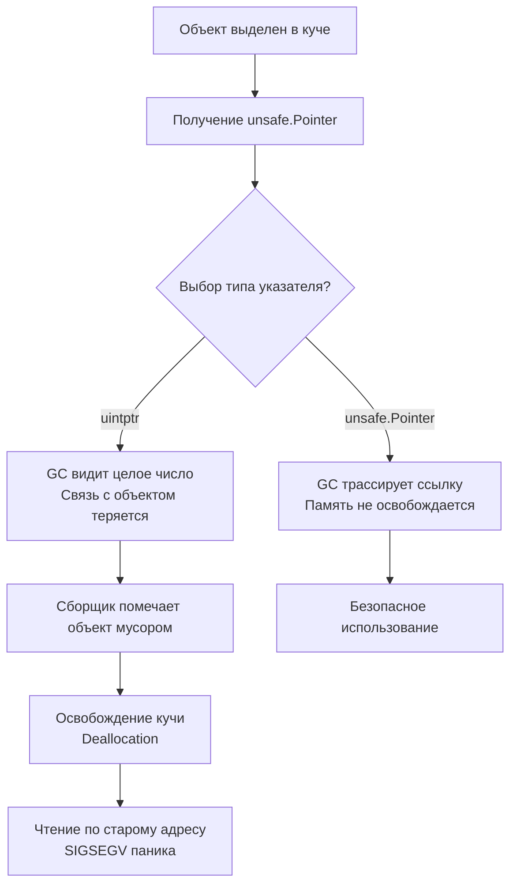

## Философия обхода системы типов

Пакет `unsafe` — это единственный легальный способ в Go выйти за границы строгой типизации и напрямую манипулировать адресами памяти. Он не содержит магии, а лишь открывает доступ к примитивам, которые компилятор обычно запрещает ради безопасности. Использование `unsafe` — это архитектурная сделка: вы получаете предельную производительность, полный контроль над layout'ом памяти и возможность взаимодействия с C/C++ библиотеками, но взамен берете на себя ответственность за корректность указателей, безопасность сборщика мусора и совместимость кода с будущими версиями компилятора.

> [!info] Под капотом
> В Go существует строгий контракт: компилятор и GC полагаются на систему типов для сканирования кучи. `unsafe` позволяет временно отключить эти проверки. 
> Однако документация `go doc unsafe` четко определяет **5 правил**, нарушение которых ведет к undefined behavior, паникам или тихому повреждению данных. 
> Инженер уровня Senior обязан знать эти правила наизусть.

## 1. Under the hood. `unsafe.Pointer` vs `uintptr` и правила GC

Ключевое различие между `unsafe.Pointer` и `uintptr` определяет судьбу управляемой памяти.



`unsafe.Pointer` — это специальный тип, который GC распознает как ссылку на объект в куче. При сканировании памяти GC следует по таким указателям и помечает достижимые объекты как живые.
`uintptr` — это просто целое число архитектурного размера. Для GC это мусор. Если вы сконвертируете указатель в `uintptr` и сохраните его в долгоживущей структуре, а оригинальный объект больше не будет доступен по другим ссылкам, сборщик освободит память. При следующем разыменовании `uintptr` процесс упадет с `SIGSEGV`.

**Правило конвертации:** Преобразование `Pointer` → `uintptr` допустимо **только** если результат используется немедленно в той же инструкции или выражении, где происходит конвертация обратно в `Pointer`. Сохранять `uintptr` на будущее запрещено.

## 2. Современный API Go 1.17+ и 1.20+

Исторически `unsafe` требовал сложной арифметики указателей через `uintptr`, что приводило к ошибкам. Начиная с Go 1.17 и 1.20, в язык добавлены типобезопасные встроенные функции, которые делают работу с памятью предсказуемой.

| Функция | Назначение | Замена legacy-подходу |
|---------|------------|----------------------|
| `unsafe.Sizeof(x)` | Размер переменной в байтах | `reflect.TypeOf(x).Size()` |
| `unsafe.Alignof(x)` | Выравнивание в памяти | `reflect.TypeOf(x).Align()` |
| `unsafe.Offsetof(x.f)` | Смещение поля в структуре | `reflect.TypeOf(x).Field(0).Offset` |
| `unsafe.Add(ptr, len)` | Сдвиг указателя на `len` байт | `uintptr(ptr) + uintptr(len)` |
| `unsafe.Slice(ptr, len)` | Создание слайса поверх памяти | `reflect.SliceHeader` + `unsafe.Pointer` |
| `unsafe.StringData(s)` / `unsafe.SliceData(b)` | Получение `*byte` из строки/слайса | `*(*byte)(unsafe.Pointer(s))` |

### Пример идиоматичного zero-copy преобразования
```go
func stringToBytes(s string) []byte {
    // Go 1.20+: безопасное получение указателя на данные строки
    // без копирования и без рефлексии
    ptr := unsafe.StringData(s)
    if ptr == nil {
        return nil
    }
    // Создаем слайс, указывающий на ту же память
    // ВАЖНО: модификация returned []byte нарушает контракт иммутабельности string
    return unsafe.Slice(ptr, len(s))
}
```

> [!warning] Ловушка / Gotcha
> **Изменение слайса, созданного из `unsafe.StringData`**.
> Строки в Go неизменяемы. Если вы конвертируете `string` в `[]byte` через `unsafe` и измените байт, это может сломать другие горутины, которые кэшировали эту строку, или нарушить работу `map` (где строки используются как ключи). Используйте такой трюк **только** если строка гарантированно одноразовая или вы контролируете все ссылки на неё.

## 3. Mechanical Sympathy. Выравнивание, кэш и zero-copy

Прямая работа с памятью через `unsafe` позволяет обойти аллокации, но требует понимания layout'а структур и протоколов когерентности кэшей.

### 1. Struct Padding и `unsafe.Offsetof`
Компилятор добавляет пустые байты между полями структуры для выравнивания под границы слов CPU. Это ускоряет доступ, но увеличивает размер. `unsafe` позволяет работать с packed-структурами, полученными из C или сетевого протокола.

```go
type NetworkPacket struct {
    Type    byte   // 1 byte
    Length  uint16 // 2 bytes (выравнивание по 2)
    Payload [4]byte // 4 bytes
    Checksum uint32 // 4 bytes (выравнивание по 4)
}

// Смещения компилятора:
// Type: 0, Length: 2, Payload: 4, Checksum: 8
// Общий размер: 12 байт (с паддингом)
```

Если вы читаете сырые байты из сети в такую структуру через `unsafe.Slice`, убедитесь, что `unsafe.Alignof(packet) == 1` или используйте `binary.Read` для переносимости. Прямое наложение `unsafe` на сеть без учета Endianness и Padding приведет к чтению мусора на другой архитектуре.

### 2. Избегание аллокаций в горячих путях
`reflect` упаковывает данные в `interface{}`, создавая нагрузку на GC. `unsafe` работает напрямую с указателями. В высоконагруженном парсере протоколов замена `reflect` на `unsafe.Slice` и ручное чтение по смещениям может ускорить обработку в 5–10 раз и снизить `GC Pause` до нуля, так как память переиспользуется, а не выделяется.

## 4. Ловушки и вопросы с собеседований

| Сценарий | Проблема | Решение |
|----------|----------|---------|
| Хранение `uintptr` в `map` или `chan` | GC не видит ссылку, объект собирается, паника при чтении | Всегда храните `unsafe.Pointer` или держите ссылку в `interface{}`. Конвертируйте в `uintptr` только на лету. |
| Использование `unsafe` с интерфейсами | Интерфейс (`eface`/`iface`) содержит указатель на таблицу методов, а не на данные | `unsafe.Pointer` интерфейса нельзя разыменовать как данные. Сначала приведите к конкретному типу, затем берите указатель. |
| `unsafe.Slice` с `nil` указателем и `len > 0` | Создает валидный слайс с `nil` данными, но доступ к нему вызывает панику | Проверяйте `ptr == nil` перед созданием слайса. Возвращайте `nil` или пустой слайс `[]T{}`. |
| Изменение порядка полей структуры после релиза | `unsafe.Offsetof` или ручные смещения сломаются, данные перепутаются | Документируйте layout. Используйте `binary.Read` или кодогенерацию для стабильных протоколов. Не полагайтесь на `unsafe` без тестов на layout. |

> [!tip] Собеседование
> **Вопрос:** Почему `unsafe` не предоставляет `unsafe.Malloc` или управление аллокатором?
> **Ответ:** Go использует высокооптимизированный аллокатор tcmalloc-подобной архитектуры. Прямое управление памятью (`malloc`/`free`) нарушило бы работу сборщика мусора, который полагается на битовые карты (`heap bitmap`) для отслеживания указателей. `unsafe` позволяет работать с уже выделенной памятью или памятью, полученной через CGO, но не заменять рантайм-аллокатор.
>
> **Вопрос:** В чем разница между `*(*T)(unsafe.Pointer(ptr))` и `*ptr`?
> **Ответ:** `*ptr` проверяет типы на этапе компиляции. `unsafe.Pointer` позволяет переинтерпретировать биты памяти как любой тип `T`. Если `ptr` указывал на `int32`, а вы разыменовываете как `float32`, компилятор не выдаст ошибку, но вы получите битовую интерпретацию числа IEEE 754. Это мощный инструмент для сериализации, но опасный для бизнес-логики.

## 5. Сравнение с экосистемами других языков

| Язык | Механизм | Особенности в сравнении с Go |
|------|----------|------------------------------|
| **C / C++** | `void*`, pointer arithmetic, `reinterpret_cast` | Полная свобода. Нет GC, разработчик сам управляет `malloc`/`new`. Высокая производительность, но частые segfault и memory leaks. |
| **Java** | `sun.misc.Unsafe`, `VarHandle`, `MemorySegment` (Panama) | Изначально скрытый API. Современный Project Panama предоставляет безопасную foreign memory access. GC все равно сканирует, но контроль над layout ограничен. |
| **PHP** | Отсутствует | PHP управляет памятью через `zval` и copy-on-write. Прямой доступ к адресам невозможен. Расширения пишутся на C с использованием Zend API. |
| **Go** | `unsafe` package | Ограниченный, но контролируемый доступ. Сохраняет работу GC, но требует строгого следования 5 правилам. Баланс между скоростью C и безопасностью Go. |

## 6. Итог

1. `unsafe` — это мост к низкоуровневому контролю, а не замена стандартной библиотеки. Используйте его только когда профилирование показало необходимость.
2. `unsafe.Pointer` видим для GC, `uintptr` — нет. Никогда не храните `uintptr` как долгоживущие ссылки.
3. Современный Go (1.17+/1.20+) предоставляет `unsafe.Add`, `unsafe.Slice`, `unsafe.StringData`. Используйте их вместо `reflect` и ручной арифметики `uintptr`.
4. Zero-copy преобразования (`string` ↔ `[]byte`) экономят аллокации, но нарушают контракт иммутабельности. Применяйте с осторожностью.
5. Выравнивание (`Alignof`) и смещения (`Offsetof`) зависят от компилятора. Не полагайтесь на них в сетевых протоколах без явной спецификации.
6. Всегда соблюдайте 5 правил из `go doc unsafe`. Нарушение ведет к тихому повреждению памяти или паникам, которые сложно отловить.

Освоив работу с сырой памятью, мы возвращаемся к стандартным задачам обработки коллекций. Как эффективно сортировать данные в Go, используя встроенные алгоритмы и избегая скрытых аллокаций? В следующей статье мы разберем современные подходы к упорядочиванию данных: [[25. sort и slices. Сортировка данных]].