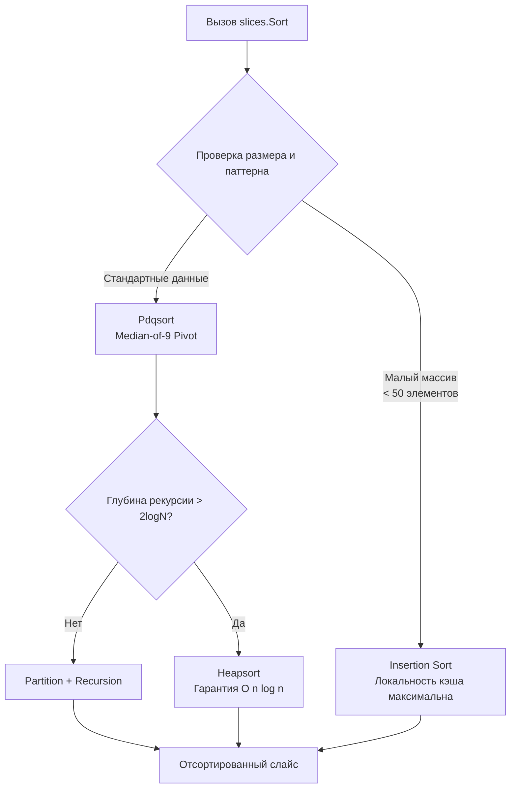

## Эволюция сортировки: от интерфейсов к дженерикам

Сортировка данных — одна из самых частых операций в бэкенде, будь то пагинация результатов API, агрегация метрик или подготовка батчей для записи в БД. В Go подход к этой задаче претерпел фундаментальное изменение с выходом версии 1.21. Если раньше разработчик был вынужден писать шаблонный код или платить за рефлексию, то теперь пакет `slices` предоставляет типобезопасные, скомпилированные в нативный код алгоритмы с нулевыми накладными расходами.

Для инженера уровня Senior понимание внутренней механики сортировки — это не просто знание API, а умение предсказывать поведение CPU-кэшей, избегать аллокаций в горячих путях и выбирать стратегию в зависимости от размера и структуры данных.

> [!info] Под капотом
> Слайс в Go — это дескриптор, а не массив данных:
> ```go
> type SliceHeader struct {
>     Data uintptr // Указатель на непрерывный блок памяти
>     Len  int     // Текущее количество элементов
>     Cap  int     // Выделенная емкость
> }
> ```
> Алгоритмы сортировки работают напрямую с памятью по адресу `Data`. Они не создают новые слайсы и не копируют данные, а переставляют байты in-place. Это гарантирует `O(1)` дополнительной памяти для нестабильной сортировки и минимальное давление на сборщик мусора.

## Under the hood: Pdqsort и механика перестановок

Go не использует классический Quicksort или Mergesort «в лоб». В основе `sort` и `slices` лежит **Pdqsort (Pattern-Defeating Quicksort)**.

### Почему Pdqsort?
Классический Quicksort имеет худший случай `O(n^2)` на уже отсортированных или инвертированных данных. Go решает эту проблему гибридным подходом:
1. **Introsort**: Отслеживает глубину рекурсии. Если она превышает `2 * log2(n)`, алгоритм переключается на Heapsort, гарантируя `O(n log n)` в худшем случае.
2. **Anti-pattern detection**: Pdqsort распознает специфичные паттерны данных (частично отсортированные, много дубликатов, «pip»-структуры) и применяет оптимизированные вставки или развороты подмассивов.
3. **Разделитель (Pivot)**: Используется медиана из трех или девяти элементов, что минимизирует вероятность вырожденных разбиений.

Для **стабильной сортировки** (`slices.SortStableFunc`) используется оптимизированный Block Merge Sort. Он разбивает данные на блоки, сортирует их in-place, а затем сливает с использованием временного буфера. Стабильность критична, когда порядок равных элементов должен сохраняться (например, сортировка транзакций по дате, а внутри дня — по ID).



## Миграция с `sort` на `slices` (Go 1.21+)

До Go 1.21 существовало три пути, каждый со своими недостатками. Теперь `slices` унифицирует подход.

| Метод | Механизм | Производительность | Статус |
|-------|----------|-------------------|--------|
| `sort.Sort` | Реализация `sort.Interface` | 🚀 Быстро (статическая типизация) | ✅ Для кастомных коллекций |
| `sort.Slice` | Рефлексия + замыкание | 🐢 Медленно (+30-50% оверхед) | ⚠️ Устарел для новых проектов |
| `slices.Sort` | Дженерики + монотонизация | 🚀🚀 Максимально быстро | ✅ Стандарт для слайсов |
| `slices.SortFunc` | Дженерики + LessFunc | 🚀🚀 Инлайн компилятора | ✅ Гибкая сортировка |

### Идиоматичный код
```go
type User struct {
    ID   int
    Name string
    Age  int
}

func main() {
    users := []User{
        {ID: 3, Name: "Alice", Age: 30},
        {ID: 1, Name: "Bob", Age: 25},
        {ID: 2, Name: "Alice", Age: 22},
    }

    // ✅ Go 1.21+: Прямая сортировка по полю
    slices.SortFunc(users, func(a, b User) int {
        return cmp.Compare(a.Age, b.Age)
    })
}
```
Пакет `cmp` (Go 1.21+) предоставляет `cmp.Compare[T constraints.Ordered]`, который заменяет громоздкие `if a < b { return -1 } ...` на безопасное сравнение любых упорядочиваемых типов.

## Mechanical Sympathy: Кэш-линии, предсказание ветвлений и GC

Сортировка — это стресс-тест для CPU и памяти. Алгоритм может быть математически оптимальным, но проигрывать на реальном железе из-за плохой локальности.

### 1. Локальность кэша и размер структур
При сортировке `[]User`, где `User` занимает 40 байт, каждое перемещение элемента требует `memmove` 40 байт. Это быстро выходит за пределы кэш-линии L1 (64 байта).
**Оптимизация для тяжелых структур:**
Если структура большая (>32 байт) или содержит указатели, сортировка слайса указателей `[]*User` часто быстрее, несмотря на косвенную адресацию. Перемещение указателя (8 байт) дешевле для CPU, чем копирование 40+ байт, а предзагрузка (hardware prefetcher) лучше работает с последовательными указателями.

```go
// Для структур > 64 байт часто выгоднее сортировать индексы
indices := make([]int, len(users))
for i := range users { indices[i] = i }

slices.SortFunc(indices, func(i, j int) int {
    return cmp.Compare(users[i].Age, users[j].Age)
})
// Результат применяем через indices[k]
```

### 2. Предсказание ветвлений (Branch Prediction)
Функция сравнения вызывается `O(n log n)` раз. Если ветвление внутри `LessFunc` непредсказуемо (например, сравнение случайных строк), CPU pipeline сбрасывается десятки тысяч раз.
`cmp.Compare` компилируется в инструкции `SETL`, `SETG`, которые минимизируют условные переходы. Избегайте сложных `if/else` цепочек внутри компаратора.

### 3. Влияние на GC
`sort.Slice` требует передачи `func(int, int) bool`. При каждом вызове рантайм создает замыкание, которое аллоцируется в куче и попадает в пул для GC. В цикле с обработкой тысяч запросов это генерирует фоновый шум `GC Assist Time`. `slices.Sort` использует дженерики, которые **монотонизируются** (monomorphization) компилятором. Функция сравнения инлайнится прямо в тело сортировки, замыкания не создаются, аллокаций нет.

## Ловушки и вопросы с собеседований

| Сценарий | Проблема | Решение |
|----------|----------|---------|
| Нарушение транзитивности | `a < b`, `b < c`, но `a > c`. Pdqsort зацикливается или паникует. | Убедитесь, что `LessFunc` математически корректен. Для `float64` обрабатывайте `NaN`. |
| Сортировка слайса указателей | `sort.Slice` сортирует сами указатели, а не значения по адресу. | В `LessFunc` разыменовывайте: `users[i].Age < users[j].Age`. |
| `NaN` в `float64` | `math.NaN() < 0.0` ложно, `> 0.0` ложно. Алгоритм не может определить порядок. | Явно обрабатывайте `NaN` в компараторе или фильтруйте до сортировки. |
| Стабильность vs скорость | `Sort` быстрее, но ломает порядок равных элементов. `SortStable` медленнее на ~15%. | Используйте `SortStableFunc` только если порядок вставки важен (например, вторичный ключ). |

> [!warning] Ловушка / Gotcha
> **Сортировка в конвейере обработки.**
> Никогда не сортируйте данные, которые могут быть изменены другими горутинами в процессе работы алгоритма. Pdqsort и Merge Sort не потокобезопасны. Гонка данных приведет к повреждению памяти или панике. Если данные потоковые, используйте `chan` + буфер с последующей сортировкой в изолированной горутине.
>
> **`sort` vs `slices` для `[]byte`.**
> Пакет `slices` работает с любыми типами, но `slices.Sort` для `[]byte` сортирует по значению байта. Для сортировки по строковому представлению или сложным правилам лексикографии используйте `slices.SortFunc` с `bytes.Compare` или `strings.Compare`.

## Сравнение с экосистемами других языков

| Язык | Алгоритм | Особенности в сравнении с Go |
|------|----------|------------------------------|
| **C++** | `std::sort` (Introsort) | Аналогичная гибридная логика. Требует ручной передачи компаратора. Нет встроенной стабильной сортировки по умолчанию (`std::stable_sort` отдельная). |
| **Java** | `Arrays.sort` (Dual-Pivot Quicksort / Timsort) | Для примитивов — Dual-Pivot, для объектов — Timsort (стабильный). Высокий overhead из-за объекта-обертки и JVM. |
| **Python** | `list.sort` (Timsort) | Стабильный по умолчанию. Адаптирован под реальные данные (много уже отсортированных серий). Интерпретатор замедляет кастомные компараторы. |
| **Go** | Pdqsort / Block Merge Sort | Сбалансирован между скоростью и предсказуемостью. Монотонизация дженериков устраняет рефлексию. Стабильность опциональна. |

> [!tip] Собеседование
> **Вопрос:** Почему `slices.Sort` может быть медленнее `sort.Sort` на очень маленьких массивах (n < 10)?
> **Ответ:** На самом деле, `slices.Sort` обычно быстрее или равен по скорости из-за инлайнинга. Но если компаратор в `slices.SortFunc` сложный, а в `sort.Sort` метод `Less` прост и статичен, разница может нивелироваться. В Go 1.21+ компилятор оптимизировал генерацию кода для дженериков, поэтому `slices` стал де-факто стандартом. Если вы видите замедление, проверьте аллокации в компараторе, а не сам алгоритм сортировки.
>
> **Вопрос:** Как отсортировать `[]string` по длине, а при равной длине — лексикографически?
> **Ответ:** Используйте цепочку сравнений в `SortFunc`:
> ```go
> slices.SortFunc(items, func(a, b string) int {
>     if len(a) != len(b) {
>         return cmp.Compare(len(a), len(b))
>     }
>     return strings.Compare(a, b)
> })
> ```
> Компилятор инлайнит оба вызова, превращая их в последовательные сравнения длин и байтов без виртуальных вызовов.

## Итог

1. **Используйте `slices.Sort` и `slices.SortFunc`** для всех новых проектов на Go 1.21+. Они быстрее, безопаснее и не создают аллокаций.
2. **Pdqsort гарантирует `O(n log n)`** и автоматически адаптируется к паттернам данных, избегая вырожденных случаев.
3. **Контролируйте размер структуры**. Для больших объектов сортировка указателей или индексов часто выгоднее по кэш-локальности, чем in-place перемещение.
4. **Избегайте сложных ветвлений в компараторе**. Это ломает предсказание переходов CPU. Используйте `cmp.Compare`.
5. **Стабильность не бесплатна**. Применяйте `SortStableFunc` только когда порядок равных элементов имеет бизнес-значение.
6. **Никогда не сортируйте конкурентно**. Алгоритмы `sort`/`slices` не потокобезопасны.

Понимание того, как эффективно упорядочивать коллекции, логически подводит нас к другим фундаментальным коллекциям, которые претерпели значительные улучшения в последних версиях языка. В следующей статье мы разберем оптимизацию хеш-таблиц, новые утилиты для работы с ними и пакет для безопасного сравнения: [[26. maps, cmp и новые утилиты Go 1.21+]].