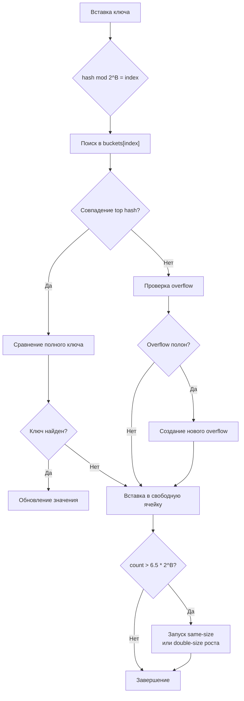

## Философия хеш-таблиц и эволюция API

Хеш-таблицы в Go — это фундаментальная структура данных, лежащая в основе кэширования, агрегации метрик, маршрутизации запросов и управления состоянием. До Go 1.21 работа с мапами требовала написания циклов для клонирования, очистки или сравнения, что приводило к дублированию кода и ошибкам. Введение пакетов `maps` и `cmp`, а также встроенной функции `clear()`, закрыло эти пробелы, сделав операции декларативными, типобезопасными и часто более эффективными.

Однако за простым синтаксисом `m["key"] = value` скрывается сложная механика распределения памяти, рандомизированного хеширования и управления кэшем процессора. Для инженера уровня Senior понимание внутренней структуры `hmap` критически важно для предсказания поведения системы под нагрузкой и избегания скрытых аллокаций.

> [!info] Под капотом
> Встроенный тип `map` — это не абстракция на уровне языка, а структура данных, управляемая рантаймом. При компиляции любые операции с мапой транслируются в вызовы функций пакета `runtime`: `runtime.mapassign`, `runtime.mapaccess`, `runtime.mapdelete`. Это позволяет компилятору не генерировать громоздкий код в бинарнике, а делегировать тяжелую логику оптимизированным функциям рантайма.

## Under the hood: `hmap`, бакеты и механизм роста

Внутреннее представление мапы — это указатель на структуру `runtime.hmap`. Она не хранит элементы напрямую, а управляет массивом бакетов.

```go
// Упрощенная структура hmap
type hmap struct {
    count     int      // Количество элементов
    flags     uint8    // Флаги состояния (итерация, рост, запись)
    B         uint8    // log2(количество бакетов). 2^B бакетов в массиве
    noverflow uint16   // Приблизительное число overflow-бакетов
    hash0     uint32   // Соль для хеширования (рандомизируется при создании)
    buckets   unsafe.Pointer // Указатель на массив бакетов
    oldbuckets unsafe.Pointer // Старый массив бакетов во время роста
    nevacuate uintptr // Прогресс эвакуации при росте
}
```

Каждый бакет (тип `bmap`) хранит до 8 пар ключ-значение. Когда бакет заполняется, к нему привязывается `overflow bucket`. Хеширование ключа делится на две части:
1. **Нижние биты** (определяются `B`) выбирают индекс бакета в массиве.
2. **Старшие биты** (top hash, 1 байт) сравниваются для быстрого отсева несовпадений без чтения полного ключа.

### Механизм роста
Рост мапы происходит асинхронно, по одному бакету за операцию вставки/удаления. Это предотвращает длительные `Stop-The-World` паузы.
1. **Double-size рост**: Запускается, когда `count > loadFactor * 2^B` (loadFactor ≈ 6.5). Создается новый массив в 2 раза больше, элементы постепенно переезжают (evacuation).
2. **Same-size рост**: Запускается, когда много удалений, но бакеты фрагментированы (`noverflow` высок). Создается массив того же размера, чтобы собрать разрозненные элементы и освободить overflow-бакеты.



> [!warning] Ловушка / Gotcha
> **Порядок итерации рандомизирован.**
> Go гарантирует, что `for k, v := range m` **никогда** не выдаст детерминированный порядок. При каждом запуске цикла рантайм выбирает случайный стартовый бакет и смещение внутри него. Попытки полагаться на порядок (например, для сериализации) приведут к нестабильному поведению. Всегда копируйте ключи в слайс и сортируйте их, если важен порядок вывода.

## Новые утилиты Go 1.21+: `maps`, `cmp` и `clear()`

### 1. `clear(m)`
Встроенная функция `clear()` обнуляет все элементы мапы без выделения нового заголовка `hmap` или массива бакетов. Это значительно эффективнее, чем `m = make(map[K]V)`, если вы планируете заполнять её вновь и не хотите платить за аллокацию нового массива и последующую сборку мусора.

### 2. Пакет `maps`
Предоставляет типовые операции без ручных циклов:
```go
import "maps"

// Клонирование (поверхностное)
cloned := maps.Clone(original)

// Удаление по условию
maps.DeleteFunc(m, func(k string, v int) bool {
    return v < 0
})

// Копирование из другой мапы
maps.Copy(dest, src)

// Сравнение
if maps.Equal(m1, m2) { ... }
// или с кастомным компаратором значений
if maps.EqualFunc(m1, m2, func(a, b *User) bool {
    return a.ID == b.ID
}) { ... }
```
> [!info] Под капотом
> `maps.Clone` и `maps.Copy` реализованы с предварительным выделением `make` нужного размера. Они не используют рефлексию, поэтому компилятор монотонизирует их под конкретные типы ключей/значений, инлайнит проверки и минимизирует аллокации.

### 3. Пакет `cmp`
`cmp.Compare[T constraints.Ordered](a, b T)` возвращает `-1`, `0` или `1`. Заменяет громоздкие `if/else` при сортировке мап по ключам или значению. Компилятор транслирует его в инструкции `SETL/SETG`, устраняя ветвления.

## Mechanical Sympathy: Кэш-линии, аллокации и GC

### 1. Локальность памяти и размер бакетов
Бакеты `bmap` спроектированы так, чтобы занимать ровно одну кэш-линию (64 байта) на большинстве архитектур. Внутри бакета ключи и значения хранятся раздельно (все ключи подряд, затем все значения), чтобы избежать паддинга между парами `K-V`. Это улучшает плотность данных и предсказуемость загрузки в L1-кэш.
Однако при использовании `overflow buckets` происходит переход по указателю в случайную область кучи. Это вызывает `cache miss` и нагрузку на TLB. При высоких `noverflow` производительность мапы падает нелинейно.

### 2. Предварительное выделение
`make(map[K]V, n)` резервирует `2^ceil(log2(n/6.5))` бакетов сразу. Это предотвращает промежуточные `double-size` роста при последовательных вставках, экономя CPU на реаллокациях и копировании элементов.

### 3. `sync.Map` vs `map` + `sync.RWMutex`
`sync.Map` оптимизирован для сценариев **Write-Once, Read-Many** или когда разные горутины пишут в непересекающиеся подмножества ключей. Он использует атомарные операции и разделяет данные на `read` (только чтение, lock-free) и `dirty` (требует мьютекс при miss).
При частых обновлениях одних и тех же ключей `sync.Map` проигрывает `map + RWMutex` из-за сложности поддержания `read`-кэша и аллокаций `entry` объектов.

## Ловушки и вопросы с собеседований

| Сценарий | Проблема | Решение |
|----------|----------|---------|
| Конкурентная запись/чтение | `fatal error: concurrent map read and map write` | Go не использует атомарные операции в `map` по дизайну. Оберните в `sync.RWMutex` или используйте `sync.Map`. |
| `maps.Clone` и указатели | Копирует указатели, а не объекты. Изменение клона меняет оригинал. | Для глубокого копирования сериализуйте/десериализуйте или пишите ручную рекурсию. |
| `clear()` vs `make()` | `clear()` сохраняет емкость и массив бакетов. `make()` создает новый, старый уходит в GC. | Используйте `clear()` при переиспользовании мапы в циклах. `make()` — при одноразовом создании. |
| Хеширование пользовательских структур | Кастомные типы без корректного хеширования могут давать коллизии или панику. | Мапы работают только с хешируемыми типами (числа, строки, массивы, интерфейсы без нехэшируемых полей). Слайсы/мапы как ключ запрещены. |
| `len()` и `cap()` | У мапы нет `cap()`. `len()` возвращает точное число элементов O(1). | Для контроля размера используйте ручные счетчики или `len()`. Не полагайтесь на внутренние поля `hmap`. |

> [!tip] Собеседование
> **Вопрос:** Почему Go рандомизирует порядок итерации по мапе?
> **Ответ:** Это защитный механизм от архитектурных багов. Разработчики часто неявно полагались на порядок вставки (как в PHP 7+ или Python 3.7+), что приводило к нестабильному поведению при изменении хеш-функции или размера. Рандомизация заставляет явно сортировать ключи, если порядок важен, повышая надежность систем.
>
> **Вопрос:** Как хеширование в Go защищено от HashDoS-атак?
> **Ответ:** `hash0` генерируется криптографически случайным образом при старте процесса. Без знания `hash0` злоумышленник не может подобрать ключи, вызывающие коллизии в одном бакете. На современных CPU хеширование использует AES-NI инструкции, что делает подбор вычислительно невозможным в реальном времени.

## Сравнение с экосистемами других языков

| Язык | Реализация | Особенности в сравнении с Go |
|------|------------|------------------------------|
| **Java** | `HashMap`, `ConcurrentHashMap` | Использует load factor 0.75, дерево вместо списка при коллизиях (JDK 8+). Высокий overhead из-за объектов-оберток (`Integer`, `Node`). |
| **C++** | `std::unordered_map` | Требует ручного указания хеш-функции и аллокатора. Нет встроенной защиты от коллизий на уровне языка. Быстрая, но сложная в настройке. |
| **Python** | `dict` | Плотный массив индексов + разреженный массив хешей. Отличная локальность кэша. Порядок вставки гарантирован с 3.7. |
| **Go** | `map` (buckets + overflow) | Баланс между скоростью, памятью и безопасностью. Рандомизация, автоматический рост, интеграция с GC. Оптимизирована под типичные бэкенд-сценарии. |

## Итог

1. `map` в Go — это структура `hmap` с бакетами, overflow-цепочками и асинхронным ростом. Порядок итерации **всегда рандомизирован**.
2. Используйте `clear()` для повторного использования мапы без аллокаций. `maps.Clone` и `maps.Copy` предоставляют безопасные и оптимизированные стандартные операции.
3. Предварительное выделение `make(map, n)` предотвращает промежуточные роста и снижает давление на GC.
4. При высоких коллизиях производительность падает из-за `cache miss` при обходе `overflow`. Контролируйте качество ключей и используйте `sync.Map` только для специфичных паттернов доступа.
5. Хеширование защищено от HashDoS через случайную соль `hash0` и аппаратное ускорение AES-NI.
6. Пакет `cmp` устраняет бойлерплейт сравнения и компилируется в предсказуемые CPU-инструкции без ветвлений.

Разобравшись с хеш-таблицами и современными утилитами, мы переходим к готовым структурам данных, которые покрывают специфичные сценарии: двусвязные списки, кучи и кольцевые буферы. В следующей статье мы изучим, когда они действительно нужны, а когда их стоит избегать: [[27. container_list, heap, ring и готовые структуры данных]].