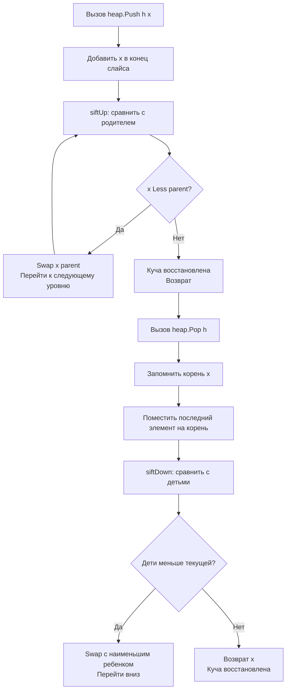

## Философия node-based коллекций и цена указателей

Пакет `container` предоставляет три структуры данных: `list`, `heap` и `ring`. Для разработчика, приходящего из Java или C#, их наличие в стандартной библиотеке может показаться избыточным, учитывая мощь слайсов и мап. Однако эти контейнеры решают специфичные алгоритмические задачи, где гарантии временной сложности `O(1)` или `O(log n)` критически важны.

В современном Go подход к этим структурам изменился. Инженеры уровня Senior всё чаще заменяют их кастомными реализациями на слайсах или специализированными библиотеками. Причина кроется не в отсутствии функциональности, а в Mechanical Sympathy: node-based коллекции генерируют фрагментацию кучи, вызывают `cache miss` и создают давление на Garbage Collector. Понимание их внутреннего устройства помогает принимать взвешенные архитектурные решения.

> [!info] Под капотом
> Ни одна из структур в `container` **не является потокобезопасной**. Это осознанное решение: добавление мьютексов внутрь контейнеров нарушило бы принцип разделения ответственности, сделало бы API тяжелым и замедлило бы однопоточные сценарии. Разработчик сам обязан оборачивать контейнеры в `sync.Mutex` или `sync.RWMutex` при конкурентном доступе.

## 1. container_list. Двусвязный список и pointer chasing

`list.List` реализует классический двусвязный список. Каждый элемент хранится в структуре `list.Element`:
```go
type Element struct {
    next, prev *Element
    list       *List
    Value      any
}
```
Операции `PushFront`, `PushBack`, `InsertAfter`, `Remove` выполняются за `O(1)`, так как требуют лишь изменения пары указателей. Однако цена этой константы высока.

### Почему список проигрывает слайсу в 90% сценариев
1. **Аллокация на каждый узел**: `list.PushBack(val)` вызывает `runtime.newElement`, который выделяет память в куче для `Element`. В цикле на 100k элементов это 100k отдельных аллокаций. Слайс с `make` выделяет память один раз и использует её повторно.
2. **Pointer Chasing**: При итерации CPU переходит по указателям `next`. Эти указатели ведут в случайные области кучи. Аппаратный `prefetcher` не может предугадать адрес, что приводит к постоянным `L1/L2 cache miss`.
3. **GC Overhead**: Сборщик мусора должен просканировать каждый узел отдельно. При удалении элементов память не возвращается ОС сразу, а ждет следующего цикла GC.

```go
// ❌ Антипаттерн: list для последовательной обработки
l := list.New()
for _, v := range data {
    l.PushBack(v) // Аллокация на каждый элемент
}
for e := l.Front(); e != nil; e = e.Next() {
    process(e.Value) // Косвенная адресация, cache miss
}

// ✅ Идиоматично: слайс
for _, v := range data {
    slice = append(slice, v) // Амортизированная аллокация
}
for _, v := range slice {
    process(v) // Последовательное чтение, prefetcher активен
}
```

> [!warning] Ловушка / Gotcha
> **Удаление во время итерации**.
> Если вы вызовете `l.Remove(e)` внутри цикла `for e := l.Front()...`, следующий вызов `e.Next()` вернет `nil` или указатель на освобожденный узел. Всегда сохраняйте `next := e.Next()` перед удалением, либо используйте метод `l.Back()`/`l.Front()` в цикле `for l.Len() > 0`.

## 2. container_heap. Приоритетная очередь через интерфейсы

`container/heap` не предоставляет готовый тип. Это реализация алгоритма кучи (binary min-heap), которая работает с любой коллекцией, реализующей `heap.Interface`:
```go
type Interface interface {
    sort.Interface // Len, Less, Swap
    Push(x any)    // Добавляет в конец, увеличивает Len
    Pop() any      // Удаляет последний, уменьшает Len
}
```

### Under the hood: Sift-Up и Sift-Down
Операции `Push` и `Pop` используют алгоритмы восстановления кучи:
1. `Push` добавляет элемент в конец слайса и "всплывает" его вверх (`siftUp`), сравнивая с родителем. Сложность `O(log n)`.
2. `Pop` берет корень, заменяет его последним элементом и "просеивает" вниз (`siftDown`). Сложность `O(log n)`.
3. `Fix` и `Remove` позволяют обновить приоритет произвольного элемента за `O(log n)`.



### Когда использовать кастомную реализацию вместо `container/heap`
Интерфейс `heap.Interface` требует передачи `any` в `Push` и возврата `any` в `Pop`. Это создает аллокации при упаковке/распаковке. В Go 1.18+ часто эффективнее реализовать кучу напрямую на типизированном слайсе `[]Task`, инкапсулировав `siftUp`/`siftDown` методы. Это устраняет интерфейсный overhead и позволяет компилятору инлайнить `Less`.

## 3. container_ring. Кольцевой буфер и его ограничения

`ring.Ring` представляет замкнутый двусвязный список из `n` элементов. Каждая нода содержит `Value` и `next`. Методы `Link`, `Unlink`, `Move` позволяют соединять кольца или смещать указатель.

### Почему он редко применяется в продакшене
1. **Фиксированная емкость с указателями**: `ring.New(1000)` сразу выделяет 1000 узлов в куче. Память резервируется навсегда.
2. **Нет поддержки IO-оптимизаций**: В отличие от слайсовых кольцевых буферов, `ring` не позволяет использовать `unsafe.Slice` для передачи данных в `net.Conn` или `os.File` одним системным вызовом.
3. **Ограниченная функциональность**: `ring` не имеет встроенных методов `Push/Pop` или проверки на пустоту. Разработчик должен управлять `next` вручную.

Для сетевых буферов, очередей сообщений или логирования лучше использовать кастомный `ring buffer` на слайсе с индексами `head` и `tail`. Он обеспечивает `contiguous memory`, поддерживает zero-copy чтение и легко интегрируется с `bufio`.

> [!tip] Собеседование
> **Вопрос:** Почему в Go нет встроенного `PriorityQueue` типа, как в `java.util.PriorityQueue`?
> **Ответ:** Go следует философии композиции через интерфейсы. Алгоритм кучи универсален и не зависит от типа данных. Реализация `heap.Interface` позволяет использовать один и тот же код для кучи задач, медианы в потоке или топ-K элементов без дублирования. Это снижает размер бинарника и упрощает поддержку.

## Mechanical Sympathy. Слайс против контейнеров

Разница в производительности между node-based коллекциями и слайсами обусловлена архитектурой современных CPU:

| Характеристика | `container/list` / `ring` | Слайс `[]T` |
|----------------|---------------------------|-------------|
| **Расположение в памяти** | Разрозненные блоки кучи | Непрерывный массив |
| **Prefetcher** | Неэффективен (случайные указатели) | Агрессивно подгружает следующие линии |
| **Аллокации** | 1 узел = 1 `malloc` + GC-сканирование | 1 `malloc` на рост емкости |
| **Кэш-локальность** | Крайне низкая (cache thrashing) | Высокая (hot в L1/L2) |
| **Время доступа** | `O(1)` указатель, но большая константа | `O(1)` индекс, константа ~2 такта CPU |

**Правило инженера:** Используйте `container` только когда:
* Вам гарантированно нужны `O(1)` удаления/вставки по известному указателю, а не индексу (например, LRU-кэш с мапой указателей на элементы списка).
* Алгоритм требует динамического соединения цепочек (`ring.Link`).
* Вы пишете образовательный код или прототип, где скорость разработки важнее latency.

В остальных случаях пишите типизированные обертки над слайсами. Они компилируются в нативный код, используют SIMD-инструкции при копировании и не фрагментируют кучу.

## Ловушки и вопросы с собеседований

| Сценарий | Проблема | Решение |
|----------|----------|---------|
| Конкурентный доступ без блокировок | Паника `concurrent map read/write` аналогично для list (повреждение указателей) | Оберните в `sync.Mutex`. Для высоконагруженных очередей используйте `chan` или lock-free структуры. |
| `heap.Push` с неправильным `Len` | Паника `index out of range` при sift-алгоритме | Убедитесь, что `Push` вызывает `*h = append(*h, x)`, а `Pop` возвращает последний элемент и срезает слайс. |
| `list.Value` и генерики | `container` остался на `any` для обратной совместимости | Создайте типизированную обертку: `type IntList struct { l *list.List }` с методами `PushBack(v int)` |
| Утечка памяти в `heap.Pop` | Забытый срез слайса `*h = (*h)[:n-1]` приводит к удержанию памяти | Всегда обновляйте длину слайса в `Pop`. Иначе GC не сможет собрать удаленные элементы. |

> [!info] Под капотом
> **Почему `list` не использует `sync.Pool` для узлов?**
> Это усложнило бы API, добавило бы гонки данных при возврате в пул и нарушило бы предсказуемость времени выполнения. Разработчики, которым критична производительность списков, реализуют собственные пулы узлов или переходят на аренную аллокацию (arena allocator) через сторонние библиотеки.

## Итог

1. `container` пакеты предоставляют корректные алгоритмы, но жертвуют механической симпатией ради универсальности.
2. `list.List` генерирует `pointer chasing` и давление на GC. Используйте его только для `O(1)` операций по указателю.
3. `heap` требует реализации 5-методного интерфейса. В современных Go часто эффективнее писать типизированную кучу на слайсе.
4. `ring` не оптимизирован под IO и кэш. Для кольцевых буферов используйте слайс с индексами `head/tail`.
5. Ни один контейнер не потокобезопасен. Оборачивайте их в примитивы синхронизации или используйте каналы для передачи владения данными.
6. В 90% продакшен-сценариев типизированные слайсы с предварительным выделением `make` работают быстрее и стабильнее.

Освоив готовые структуры данных, мы переходим к одной из самых мощных и одновременно самых критикуемых возможностей стандартной библиотеки. Как Go обрабатывает регулярные выражения, почему они медленнее PCRE и когда их стоит избегать? В следующей статье: [[28. regexp. Регулярные выражения]].