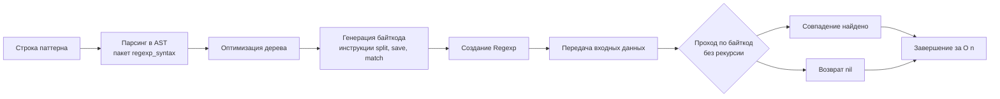

## Философия RE2: Безопасность и линейное время

Пакет `regexp` в Go кардинально отличается от реализации регулярных выражений в PHP, Python или Ruby. Вместо классического PCRE (Perl Compatible Regular Expressions), использующего рекурсивный бэктрекинг, Go использует движок **RE2**, разработанный в Google.

Главный принцип RE2 — **гарантированное линейное время выполнения `O(n)`** относительно длины входной строки. Это означает, что движок никогда не войдет в экспоненциальную рекурсию из-за неудачных совпадений. На практике это делает Go-приложения полностью иммунными к атакам **ReDoS** (Regular Expression Denial of Service), где злоумышленник отправляет специально составленный паттерн или строку, вызывающую 100% загрузку CPU на других языках.

Цена этой безопасности — отсутствие обратной совместимости с некоторыми фичами PCRE: в Go нет обратных ссылок (`\1`, `(?P=name)`), опережающих/ретроспективных проверок (`(?=...)`, `(?!...)`) и атомарных групп. Для 95% задач валидации, парсинга логов и замены текста этого более чем достаточно.

> [!info] Под капотом
> `Regexp` в Go — это иммутабельная структура, содержащая скомпилированный байткод и таблицу инструкций. Она **полностью потокобезопасна**. Вы можете безопасно вызывать методы одной и той же скомпилированной `*regexp.Regexp` из тысяч горутин одновременно без дополнительных мьютексов.

## Under the hood. Компиляция, байткод и отсутствие отката

Когда вы вызываете `regexp.Compile()`, происходит многоступенчатый процесс:

1. **Парсинг**: Строка паттерна преобразуется в AST с помощью пакета `regexp/syntax`.
2. **Оптимизация**: AST упрощается, вложенные группы сворачиваются, константы объединяются.
3. **Компиляция в байткод**: AST транслируется в последовательность низкоуровневых инструкций (`instMatch`, `instSave`, `instNop`, `instSplit` и др.).
4. **Исполнение**: Движок использует симуляцию NFA с отслеживанием множества активных состояний. В типичных случаях он работает как DFA, проходя по строке за один проход без возвратов.



Отсутствие бэктрекинга означает, что движок не тратит время на отмену неудачных совпадений. Если паттерн требует проверки нескольких ветвей, RE2 выполняет их параллельно, поддерживая активные состояния в компактном массиве. Это гарантирует предсказуемое время выполнения и защищает CPU от перегрузки.

## Mechanical Sympathy. Аллокации, кэш и переиспользование

Самая распространенная ошибка при работе с `regexp` — создание новых инстансов в циклах или HTTP-обработчиках. Компиляция регулярного выражения — дорогая операция, требующая аллокаций и парсинга.

```go
// ❌ КАТЕГОРИЧЕСКИ НЕЛЬЗЯ: Компиляция на каждый запрос
func validateEmail(email string) bool {
    re := regexp.MustCompile(`^[a-z0-9._%+-]+@[a-z0-9.-]+\.[a-z]{2,}$`)
    return re.MatchString(email)
}
```

**Идиоматичный подход:** Компилируйте один раз при инициализации пакета.

```go
// ✅ ИДИОМАТИЧНО: Глобальная переменная или пакетный уровень
var emailRegex = regexp.MustCompile(`^[a-z0-9._%+-]+@[a-z0-9.-]+\.[a-z]{2,}$`)

func validateEmail(email string) bool {
    return emailRegex.MatchString(email)
}
```

### Оптимизация аллокаций через индексы
Методы `FindString`, `FindAllString`, `FindStringSubmatch` всегда создают новые строки в куче. В высоконагруженных системах (парсинг миллионов строк логов) это генерирует значительное давление на GC.

Вместо копирования строк используйте `*Index` версии, которые возвращают смещения в исходной строке. Вы можете нарезать оригинальную строку без аллокаций.

```go
func extractMetrics(logLine string, re *regexp.Regexp) (string, float64, error) {
    // Возвращает слайс индексов: [полное_совпадение, группа1, группа2]
    matches := re.FindStringSubmatchIndex(logLine)
    if matches == nil {
        return "", 0, errors.New("metric not found")
    }
    
    // Zero-copy извлечение подстрок через нарезку
    name := logLine[matches[2]:matches[3]]
    
    // Парсим число напрямую из подстроки, избегая создания string
    valStr := logLine[matches[4]:matches[5]]
    val, err := strconv.ParseFloat(valStr, 64)
    if err != nil {
        return "", 0, fmt.Errorf("parse float: %w", err)
    }
    return name, val, nil
}
```

> [!warning] Ловушка / Gotcha
> **Индексы валидны только пока жива исходная строка.**
> Если `logLine` будет собран заново или изменен пулом байтов, ссылки по индексам станут указывать на мусор или вызовут панику при выходе за границы. Всегда используйте индексы в той же области видимости, где получен оригинал, или копируйте данные, если они должны жить дольше.

## Ловушки и хардкорные вопросы с собеседований

| Сценарий | Проблема | Решение |
|----------|----------|---------|
| Якоря `^` и `$` | По умолчанию совпадают с началом/концом **всей строки**, а не строки внутри многострочного текста. | Используйте флаг `(?m)` в начале паттерна: `(?m)^start.*end$`. |
| Точка `.` и Unicode | `.` совпадает с любым символом Юникода (руной), а не байтом. Совпадение с `\n` отсутствует по умолчанию. | Для совпадения с переносом строки добавьте `(?s)` (dotall) или используйте `[\s\S]`. |
| Обратные ссылки `\1` | Движок RE2 их не поддерживает. Компиляция упадет с ошибкой. | Используйте логику на Go или внешние парсеры (ANTLR, PEG). |
| `MatchString` vs `Match` | `MatchString` принимает `string`, `Match` принимает `[]byte`. | Если данные уже в `[]byte` (тело HTTP, лог-файл), используйте `Match` чтобы избежать конвертации `string(b)`. |
| `ReplaceAllStringFunc` | Вызывает callback для каждого совпадения. Внутри callback нельзя изменить контекст поиска. | Для сложных замен собирайте результат в `strings.Builder` или используйте `Expand`. |

> [!tip] Собеседование
> **Вопрос:** Почему `regexp.MustCompile` вызывает панику, а не возвращает ошибку?
> **Ответ:** Функция предназначена для инициализации пакетных переменных на этапе старта приложения. Если паттерн невалиден, это ошибка программирования, а не runtime-сбой. Паника на старте (fail-fast) предотвращает запуск сервиса с битой логикой валидации. В коде, где паттерн формируется динамически из пользовательского ввода, всегда используйте `regexp.Compile` и обрабатывайте ошибку.
>
> **Вопрос:** Когда регулярные выражения в Go медленнее, чем `strings` или `bytes`?
> **Ответ:** Практически всегда. Проверка `strings.HasPrefix(s, "GET ")` выполняется за константное время и использует оптимизированные ассемблерные инструкции. `regexp.MatchString("^GET ", s)` запускает парсер байткода, аллоцирует состояния и выполняет симуляцию NFA. Используйте `regexp` только когда логика совпадения не может быть выражена через простые проверки начала/конца, поиска подстроки или сравнения диапазонов.

## Сравнение с экосистемами других языков

| Язык | Движок | Особенности в сравнении с Go |
|------|--------|------------------------------|
| **PHP / Python / Ruby** | PCRE / Oniguruma | Поддерживают обратные ссылки и lookahead. Уязвимы к ReDoS из-за рекурсивного бэктрекинга. |
| **Java** | `java.util.regex` (NFA) | Аналогично PCRE, поддерживает расширенный синтаксис. Требует создания `Matcher` объекта, менее оптимизирован для конкурентного доступа. |
| **C++** | `std::regex` (ECMAScript) | Исторически медленный, часто использует бэктрекинг. В production часто заменяют на `re2` или `absl` библиотеки вручную. |
| **Go** | RE2 | Гарантированное `O(n)`, потокобезопасность, отсутствие бэктрекинга. Меньше фич, но предсказуемая производительность и безопасность. |

## Итог

1. Go использует движок **RE2**, гарантирующий линейное время `O(n)` и защиту от ReDoS-атак.
2. **Никогда не компилируйте `regexp` в циклах или обработчиках.** Используйте глобальные переменные с `MustCompile`.
3. `*regexp.Regexp` потокобезопасна. Один инстанс может обслуживать тысячи запросов параллельно.
4. Для снижения нагрузки на GC используйте `FindStringSubmatchIndex` и нарезайте оригинальную строку, избегая копирования в кучу.
5. Якоря `^`/`$` и точка `.` работают иначе, чем в PCRE. Используйте флаги `(?m)` и `(?s)` при необходимости.
6. Заменяйте регулярные выражения на функции из `strings`/`bytes`, когда логика допускает простые проверки.

Освоив парсинг текстовых паттернов, мы переходим к самой распространенной задаче сериализации данных в бэкенде. Как Go обрабатывает JSON, почему стандартная библиотека выбирает безопасность над скоростью и как обойти ограничения кодировщика? В следующей статье: [[29. encoding_json. JSON в стандартной библиотеке]].