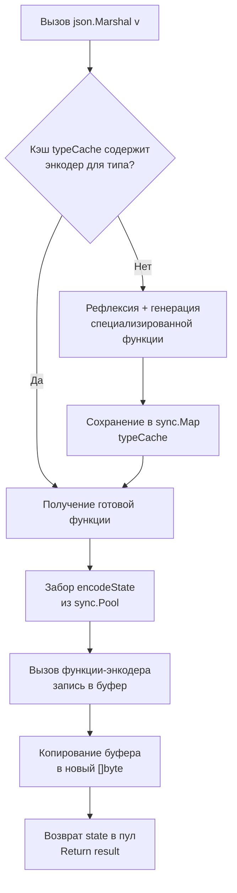

## Философия сериализации: безопасность против скорости

Пакет `encoding/json` является де-факто стандартом для обмена данными в Go-бэкенде. Его дизайн подчиняется главному принципу стандартной библиотеки: **корректность и безопасность важнее максимальной пропускной способности**. В отличие от PHP или Python, где сериализация часто игнорирует строгую типизацию, Go требует явного маппинга структур, что исключает «тихие» ошибки приведения типов и гарантирует предсказуемость контрактов API.

Однако эта безопасность имеет цену. `encoding/json` активно использует рефлексию, упаковку в интерфейсы и копирование данных. В высоконагруженных системах (10k+ RPS, микросервисы с крупными пейлоадами) это становится заметным bottleneck'ом, породив экосистему сторонних библиотек (`jsoniter`, `sonic`). Для инженера уровня Senior понимание внутренних механизмов стандартного кодировщика обязательно: это позволяет принимать осознанные решения о том, когда хватит `stdlib`, а когда пора подключать сторонние оптимизации.

## Under the hood: Кэш типов, пулы буферов и компиляция энкодеров

При первом вызове `json.Marshal` или `json.Unmarshal` для конкретного типа Go не просто запускает рефлексию «в лоб». Он проходит фазу динамической компиляции:

1. **Анализ структуры**: Рантайм сканирует поля структуры, читает теги `json`, определяет типы и правила опциональности (`omitempty`).
2. **Компиляция функций**: На основе AST типов генерируются специализированные функции-энкодеры и декодеры (`func(*encodeState, reflect.Value)`). Они кэшируются в `sync.Map` (`typeCache`), чтобы при последующих вызовах не повторять анализ.
3. **Использование `sync.Pool`**: Для временных буферов используется внутренний `encodeStatePool`. При вызове `Marshal` забирается переиспользуемый буфер, данные пишутся в него, затем копируются в новый `[]byte`, а буфер возвращается в пул.



> [!info] Под капотом
> Кэширование функций происходит на уровне пакета. Если вы передаете `any` или `interface{}`, рантайм определяет реальный тип в момент выполнения и подгружает скомпилированный энкодер. Это устраняет дублирование логики, но добавляет проверку типа при каждом вызове.

## Mechanical Sympathy: Аллокации, Escape Analysis и влияние на GC

Понимание того, как `encoding/json` взаимодействует с памятью, критически для тюнинга latency и пропускной способности.

1. **Escape Analysis**: `json.Marshal` возвращает `[]byte`. Поскольку эти данные должны жить после возврата из функции, компилятор размещает результирующий срез в куче. Это обязательная аллокация, которую нельзя обойти без использования `json.Encoder`, пишущего напрямую в `io.Writer`.
2. **Интерфейсная упаковка**: При декодировании в `map[string]any` или структуру с полями-интерфейсами каждый примитив упаковывается в `runtime.eface`. Это создает давление на GC, особенно при десериализации массивов из миллионов объектов.
3. **Копирование вместо zero-copy**: В отличие от protobuf, JSON не поддерживает чтение напрямую из байтового слайса без парсинга символов. Символы экранирования (`\"`, `\n`, `\u0000`) требуют создания новых строк, что генерирует дополнительные аллокации.

### Стриминг vs Полная буферизация
```go
// ❌ Плохо для больших пейлоадов: полная аллокация []byte в куче
func handleRequest(w http.ResponseWriter, r *http.Request) {
    body, _ := io.ReadAll(r.Body)
    var data LargePayload
    json.Unmarshal(body, &data) // body лежит в куче, data тоже в куче
    w.Write(data)
}

// ✅ Хорошо: стриминг, минимизация аллокаций
func handleStream(w http.ResponseWriter, r *http.Request) {
    dec := json.NewDecoder(r.Body)
    enc := json.NewEncoder(w)
    
    var item PayloadItem
    for dec.More() {
        if err := dec.Decode(&item); err != nil {
            break // EOF или ошибка
        }
        // Обработка и запись чанка
        if err := enc.Encode(item); err != nil {
            return
        }
    }
}
```
`json.Decoder` и `json.Encoder` работают напрямую с буфером `bufio` (внутри `io`), пропуская создание промежуточных `[]byte`. Это снижает peak-RSS и уменьшает частоту GC-пауз.

## 1. Идиоматичная работа с JSON и скрытые ограничения

### Теги и правила маппинга
* `json:"-"` — полное игнорирование поля.
* `json:"field_name,omitempty"` — пропуск поля при нулевом значении. **Важно:** для числовых типов `0` является нулевым, для строк `""`, для указателей и слайсов `nil`. Пустой слайс `[]string{}` **не будет** опущен, только `nil`.
* `json:",string"` — принудительная сериализация числа как строки (`"123"`). Решает проблему потери точности в JS при больших `int64`.

### `DisallowUnknownFields`
По умолчанию декодер молча игнорирует поля, отсутствующие в целевой структуре. Для строгих API-контрактов это антипаттерн, так как скрывает ошибки версионирования.
```go
dec := json.NewDecoder(r.Body)
dec.DisallowUnknownFields() // Строгий режим: вернет ошибку при лишнем поле
```

> [!warning] Ловушка / Gotcha
> **Конкурентный доступ к map во время Marshal.**
> `json.Marshal` читает мапы и слайсы без синхронизации. Если другая горутина параллельно пишет в мапу, которую вы сериализуете, процесс паникует с `fatal error: concurrent map iteration and map write`. Всегда создавайте копию мапы или используйте `sync.RWMutex` перед маршалингом.

## 2. Продвинутые паттерны и защита контрактов

### `json.RawMessage` для полиморфизма
Иногда структура JSON зависит от внешнего параметра. `json.RawMessage` позволяет отложить парсинг части пейлоада до выяснения контекста.
```go
type Event struct {
    Type    string          `json:"type"`
    Payload json.RawMessage `json:"payload"`
}

func processEvent(raw []byte) error {
    var ev Event
    if err := json.Unmarshal(raw, &ev); err != nil {
        return err
    }
    
    switch ev.Type {
    case "user_created":
        var user User
        if err := json.Unmarshal(ev.Payload, &user); err != nil {
            return fmt.Errorf("invalid user payload: %w", err)
        }
        // ...
    case "order_placed":
        var order Order
        json.Unmarshal(ev.Payload, &order)
        // ...
    }
    return nil
}
```
Это позволяет парсить заголовок один раз, а тело десериализовать только в нужный тип, экономя CPU и избегая ошибок приведения.

### `json.Number` для точности
Стандартный декодер парсит все числа как `float64`. Для финансовых систем или работы с ID > 9e15 это недопустимо.
```go
dec := json.NewDecoder(r.Body)
dec.UseNumber() // Парсит числа как json.Number (хранится как строка)
// Далее: n.Int64() или n.Float64() по требованию
```

## Ловушки и вопросы с собеседований

| Сценарий | Проблема | Решение |
|----------|----------|---------|
| `omitempty` и структуры | Пустая структура `User{}` не считается нулевой и не пропускается. | Используйте указатели `*User` или кастомный `MarshalJSON` для явного контроля. |
| Потеря данных при `any` | `json.Unmarshal` парсит числа в `float64`, обрубая длинные целые. | Используйте `json.Number` или строгую структуру с известными полями. |
| Рекурсивные структуры | Бесконечная сериализация при перекрестных ссылках. | Разрывайте циклы указателями или используйте `json.RawMessage`/кастомные энкодеры. |
| `json.Encoder.SetIndent` | Форматирование с отступами замедляет вывод и увеличивает размер ответа. | В production используйте `SetIndent("", "")` (по умолчанию). Отступы только для debug. |
| Экранирование HTML | `<`, `>`, `&` заменяются на `\u003c` и т.д. для защиты от XSS. | Для внутренних API это лишние байты. Вызовите `enc.SetEscapeHTML(false)`. |

> [!tip] Собеседование
> **Вопрос:** Почему `encoding/json` медленнее `jsoniter` или `sonic`?
> **Ответ:** Стандартная библиотека использует рефлексию и динамическую генерацию энкодеров в рантайме. Она гарантирует безопасность типов, корректную работу с GC и отсутствие unsafe-операций. Сторонние библиотеки либо генерируют код на этапе компиляции (`easyjson`), либо используют `unsafe` для прямого чтения памяти, SIMD-инструкции и ручное управление буферами, жертвуя безопасностью ради скорости.
>
> **Вопрос:** Как безопасно парсить JSON неизвестной структуры без потери точности чисел?
> **Ответ:** Используйте `json.NewDecoder`, включите `UseNumber()`, парсите в `map[string]any` или `[]any`, а затем кастуйте числа через `json.Number`, проверяя `.Int64()` или `.Float64()`. Никогда не кастуйте `any` напрямую в `float64` без проверки, иначе получите `panic`.

## Сравнение с экосистемами других языков

| Язык | Механизм | Особенности в сравнении с Go |
|------|----------|------------------------------|
| **PHP** | `json_encode` / `json_decode` | C-расширение, очень быстрое, но слабо типизированное. Преобразует массивы в объекты автоматически. |
| **Python** | `json` модуль | Работает с `dict` и `list`. Простой API, но GIL блокирует парсинг в многопоточной среде. Нет валидации схем из коробки. |
| **Java** | Jackson / Gson | Мощная экосистема, поддержка схем, DTO-маппинг. Высокое потребление памяти из-за объектов-оберток и JVM overhead. |
| **C++** | nlohmann/json / simdjson | `nlohmann` удобен, но медленен. `simdjson` использует AVX2/AVX-512 для парсинга гигабайт в секунду, но требует ручной работы с типами. |
| **Go** | `encoding/json` | Баланс безопасности, простоты и скорости. Отражение кэшируется, пулы буферов снижают GC. Идеален для 90% микросервисов. |

## Итог

1. `encoding/json` компилирует энкодеры динамически и кэширует их в `sync.Map`. Первый вызов медленнее, последующие быстры.
2. Для больших пейлоадов используйте `json.Encoder` / `json.Decoder` со стримингом, чтобы избежать аллокации промежуточных `[]byte` и снизить GC-паузы.
3. Включайте `DisallowUnknownFields` и `UseNumber` для строгих и финансово-точных API.
4. `json.RawMessage` — лучший инструмент для полиморфных JSON и отложенного парсинга.
5. Никогда не маршальте конкурентно изменяемые `map` без синхронизации. Это приведет к панике.
6. Стандартная библиотека жертвует максимальной скоростью ради безопасности. Для экстремальных нагрузок рассмотрите `sonic` или кодогенерацию, но только после профилирования.

Освоив главный формат сериализации, мы переходим к другим стандартным кодировщикам, которые решают специфичные задачи бэкенда: парсинг конфигураций, обмен бинарными данными и работа с таблицами. В следующей статье разберем, когда их использовать, а когда заменить на внешние библиотеки: [[30. encoding_xml, csv, gob и другие форматы сериализации]].