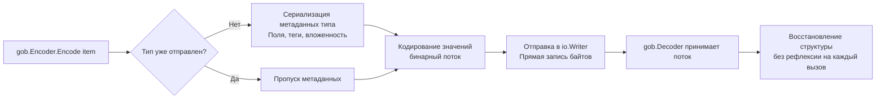

## Философия выбора формата сериализации

JSON доминирует в веб-API, но бэкенд-разработчик регулярно сталкивается с задачами, где текстовые ключи-значения неэффективны или не соответствуют внешним контрактам. Стандартная библиотека Go предоставляет три альтернативных инструмента, покрывающих специфичные домены: `encoding/xml` для строгой интеграции с legacy-системами, `encoding/csv` для эффективной обработки табличных выгрузок и `encoding/gob` для высокопроизводительной внутренней коммуникации между Go-сервисами.

Каждый из этих пакетов спроектирован с учетом принципов идиоматичного Go: потоковость, типобезопасность и минимальный оверхед. Однако их внутренняя механика кардинально различается, что напрямую влияет на CPU, потребление памяти и архитектуру системы.

## 1. encoding_xml. Строгость XML и legacy-интеграции

Пакет `encoding/xml` реализует парсер, работающий в стиле SAX (Simple API for XML), но с возможностью ленивой загрузки в Go-структуры через рефлексию. В отличие от JSON, XML требует поддержки пространств имен (`xmlns`), атрибутов, комментариев, CDATA-секций и строгого соблюдения порядка тегов.

### Under the hood: Token-based парсинг
`xml.Decoder` не загружает весь документ в память. Он читает байт за байтом, распознает синтаксические маркеры и генерирует токены (`xml.StartElement`, `xml.CharData`, `xml.EndElement`). Это позволяет обрабатывать XML-файлы гигабайтного размера с фиксированным потреблением RAM.

```go
func processLargeXML(r io.Reader) error {
    dec := xml.NewDecoder(r)
    
    for {
        tok, err := dec.Token()
        if err == io.EOF {
            break
        }
        if err != nil {
            return fmt.Errorf("xml token: %w", err)
        }
        
        switch el := tok.(type) {
        case xml.StartElement:
            if el.Name.Local == "Item" {
                var item Item
                if err := dec.DecodeElement(&item, &el); err != nil {
                    return err
                }
                handle(item)
            }
        }
    }
    return nil
}
```

> [!warning] Ловушка / Gotcha
> **Пространства имен ломают маппинг.**
> Если XML содержит `<ns:item xmlns:ns="http://api.example.com">`, стандартный `xml.Unmarshal` не сопоставит поле с тегом `"item"`. Необходимо явно указать пространство в теге: ``xml:"http://api.example.com item"``. Игнорирование этого правила приводит к нулевым структурам без ошибок.

## 2. encoding_csv. Потоковая обработка табличных данных

CSV (Comma-Separated Values) кажется простым форматом, но спецификация RFC 4180 содержит множество пограничных случаев: экранирование кавычек, переносы строк внутри полей, разные разделители. `encoding/csv` реализует конечный автомат, который корректно обрабатывает все эти сценарии без загрузки всего файла в память.

### Механика работы
`csv.Reader` читает данные порциями, разбирает строки на поля и возвращает `[]string`. Пакет предоставляет флаги для адаптации под некорректные CSV:
* `LazyQuotes`: разрешает экранированные кавычки в нестандартных позициях.
* `TrimLeadingSpace`: игнорирует пробелы перед разделителем.
* `FieldsPerRecord`: валидирует количество колонок.

```go
func importReport(r io.Reader) error {
    reader := csv.NewReader(r)
    reader.Comma = ';'
    reader.TrimLeadingSpace = true
    
    // Чтение заголовка
    headers, err := reader.Read()
    if err != nil {
        return fmt.Errorf("read headers: %w", err)
    }
    
    // Потоковая обработка строк
    for {
        record, err := reader.Read()
        if err == io.EOF {
            break
        }
        if err != nil {
            return fmt.Errorf("parse row: %w", err)
        }
        processRecord(headers, record)
    }
    return nil
}
```

## 3. encoding_gob. Высокопроизводительный бинарный протокол для Go

`gob` (Go Binary) — это собственный бинарный формат сериализации, разработанный специально для экосистемы Go. Он передает типы данных вместе со значениями, поддерживает указатели, циклические ссылки и интерфейсы.

### Under the hood: Передача метаданных
При первой отправке значения определенного типа, `gob.Encoder` отправляет в поток его схему (названия полей, типы, порядок). Декодер строит на её основе карту десериализации. Последующие сообщения того же типа передают только сырые байты данных. Это устраняет необходимость в IDL-файлах (как в Protobuf) и упрощает разработку внутренних RPC.



> [!info] Под капотом
> `gob` использует `sync.Pool` для буферов кодирования/декодирования, что минимизирует аллокации. Однако при работе с `interface{}` или кастомными типами требуется явная регистрация через `gob.Register()` до первого использования, иначе декодер не сможет сопоставить бинарный поток с Go-типом.

## Mechanical Sympathy: Производительность и выбор формата

Выбор сериализатора напрямую влияет на архитектуру системы и утилизацию железа:

| Формат | CPU overhead | Память | Кроссплатформенность | Сценарий использования |
|--------|--------------|--------|----------------------|------------------------|
| `encoding/json` | Средний (рефлексия, парсинг строк) | Высокая (строки, аллокации) | ✅ Идеально | Public API, вебхуки, конфигурации |
| `encoding/xml` | Высокий (парсинг тегов, атрибуты, namespaces) | Высокая | ✅ Идеально | SOAP, банковские шлюзы, legacy ERP |
| `encoding/csv` | Низкий (потоковый, линейный парсинг) | Низкая (построчный) | ⚠️ Ограничена (без типов) | Отчеты, выгрузки, ML-датасеты, миграции БД |
| `encoding/gob` | Очень низкий (бинарный, кэш типов) | Низкая (компактный бинарник) | ❌ Только Go | Кэширование сессий, Go-to-Go RPC, очереди задач |

### Оптимизация аллокаций
Для `xml` и `csv` используйте стриминг. `ReadAll()` или `Unmarshal()` полного докумена создает слайс в куче и вызывает рекурсивную рефлексию, что приводит к `GC pressure`. Пакет `gob` оптимизирован для пакетной передачи: вызов `Encode()` одного большого массива структур быстрее, чем 1000 отдельных вызовов для мелких объектов, из-за оверхеда на проверку метаданных и синхронизацию пулов.

## Ловушки и вопросы с собеседований

| Сценарий | Проблема | Решение |
|----------|----------|---------|
| `xml.Decoder.Strict = true` по умолчанию | Парсер падает на невалидном HTML или XML с дублирующимися атрибутами | Установите `dec.Strict = false` для работы с legacy или пользовательским контентом. |
| `csv.Reader.ReadAll()` на больших файлах | Чтение всего файла в `[][]string` вызывает OOM | Используйте `csv.Reader.Read()` в цикле или `bufio.Scanner` для построчной обработки. |
| `gob` и версионирование структур | Удаление поля в структуре ломает десериализацию старых данных | Добавляйте новые поля, не удаляйте старые. Используйте `omitempty` или указатели для обратной совместимости. |
| `gob` и безопасность | Десериализация ненадежных `gob` потоков позволяет выполнять произвольный код через `gob.Register` | Никогда не декодируйте `gob` из внешних источников. Используйте Protobuf или JSON для публичных контрактов. |
| BOM в CSV/JSON | Файл начинается с `\xEF\xBB\xBF`, что ломает парсинг первой строки | Отбрасывайте BOM через `bytes.TrimPrefix(data, []byte{0xEF, 0xBB, 0xBF})` перед парсингом. |

> [!tip] Собеседование
> **Вопрос:** Почему `gob` быстрее `json`, но не используется как основной формат API?
> **Ответ:** `gob` быстрее, потому что передает бинарные данные без парсинга текста, кэширует метаданные типов и избегает рефлексии на каждое сообщение. Однако он не читается человеком, привязан к экосистеме Go и не имеет строгой схемы версионирования из коробки. Для внешних API критичны совместимость с любыми языками, отладочная читаемость и четкие контракты, которые обеспечивают JSON или Protobuf.
>
> **Вопрос:** Как эффективно парсить CSV с 50+ колонками без создания миллионов срезов строк?
> **Ответ:** Не используйте `csv.Reader`, если не нужна валидация кавычек. Для чистых данных пишите кастомный парсер на `bufio.Scanner` + `bytes.Split`, который конвертирует поля сразу в целевые типы (`strconv.Atoi`, `strconv.ParseFloat`), минуя промежуточные `[]string`. Это снижает аллокации на 40-60%.

## Сравнение с экосистемами других языков

| Язык | Аналог | Особенности в сравнении с Go |
|------|--------|------------------------------|
| **Java** | JAXB (XML), OpenCSV, Java Serialization | JAXB тяжелый, требует генерации классов. Java Serialization устарел и опасен. Go `gob` безопаснее и быстрее Java-сериализации. |
| **Python** | `xml.etree`, `csv` модуль, `pickle` | `pickle` аналогичен `gob`, но небезопасен. Python `csv` медленнее из-за интерпретатора. Go предлагает строгую типизацию на этапе компиляции. |
| **C++** | `rapidXML`, `simdjson` (CSV/JSON), ручная сериализация | C++ требует ручной настройки аллокаторов и схем. Go предоставляет готовые, безопасные пакеты с интеграцией в GC. |
| **Go** | `encoding/xml`, `csv`, `gob` | Потоковые, типобезопасные, интегрированные с `io`. Минимум boilerplate, максимум контроля над памятью через стриминг. |

## Итог

1. `encoding/xml` обязателен для интеграций с legacy-системами и финансовыми шлюзами. Используйте `xml.Decoder` для стриминга и явно указывайте пространства имен.
2. `encoding/csv` идеален для больших табличных данных. Избегайте `ReadAll()`, настраивайте `Comma` и `TrimLeadingSpace`, обрабатывайте BOM.
3. `encoding/gob` — лучший выбор для внутренней коммуникации между Go-сервисами, кэширования и очередей. Обеспечивает минимальный CPU overhead, но требует контроля версий структур и изоляции от внешних источников.
4. Всегда предпочитайте потоковые API (`Decoder`/`Encoder`, циклы `Read`) пакетным методам (`Unmarshal`, `ReadAll`) для снижения давления на GC.
5. Никогда не используйте `gob` для парсинга ненадежных данных. Для внешних контрактов выбирайте JSON или Protobuf.

Разобрав стандартные форматы обмена данными, мы переходим к фундаменту сетевой коммуникации. Как Go взаимодействует с сетевым стеком ОС, что стоит за `net.Dial` и как рантайм управляет файловыми дескрипторами сокетов? В следующей статье: [[31. net. Базовая работа с сетью]].