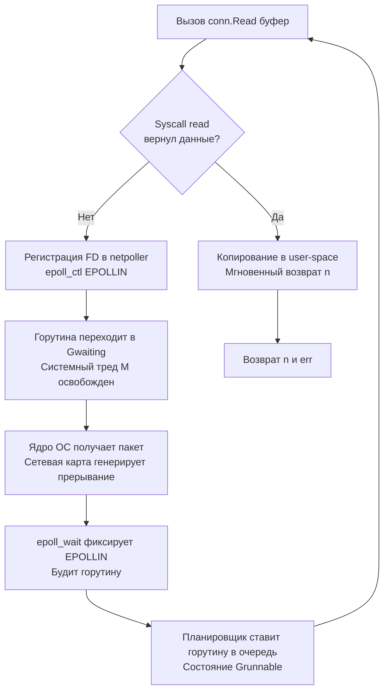

## Фундамент сетевого стека и неблокирующий ввод-вывод

Пакет `net` — это не просто обертка над POSIX-сокетами. Это глубоко интегрированная в рантайм Go подсистема, реализующая высокоуровневую асинхронную модель программирования без колбэков, промисов или event-loop'ов, видимых разработчику. Благодаря ему, сетевой код на Go выглядит синхронным, но выполняется асинхронно на уровне планировщика горутин и ядра ОС.

Для инженера уровня Senior понимание `net` — это понимание того, как тысячи соединений обслуживаются одним бинарником с минимальным потреблением памяти и CPU, как работает интеграция с `epoll`/`kqueue`, и почему сетевые таймауты в Go фундаментально отличаются от таймаутов на уровне `context`.

> [!info] Под капотом
> В основе пакета лежат интерфейсы `net.Conn` и `net.Listener`. Они абстрагируют потоковый и дейтаграммный IO, предоставляя унифицированный API для TCP, UDP, Unix-сокетов и IP-протоколов. Реальные реализации (например, `*net.TCPConn`) делегируют работу структуре `netFD`, которая связывает файловый дескриптор сокета с внутренним сетевым поллером (`netpoller`).

## Under the hood: netpoller, G-M-P и асинхронность без колбэков

Классический блокирующий socket API (`read`, `write`, `accept`) останавливает выполнение потока ОС до готовности данных или завершения записи. В Go сокеты создаются в неблокирующем режиме (`O_NONBLOCK` на Linux, `ioctlsocket` на Windows). 

Механика работы при вызове `conn.Read()`:
1. Вызывается syscall `read()`. Если данные есть, они копируются в буфер приложения мгновенно.
2. Если данных нет, `read()` возвращает `EAGAIN`/`EWOULDBLOCK`.
3. Рантайм Go не блокирует системный тред. Он регистрирует файловый дескриптор сокета в **сетевом поллере** (`epoll` на Linux, `kqueue` на macOS/BSD, `IOCP` на Windows).
4. Горутина переводится в состояние `Gwaiting` и паркуется. Системный тред `M` освобождается для выполнения других горутин из локальной очереди `P`.
5. Когда в ядре ОС появляется событие `EPOLLIN`, поллер будит горутину, переводя её в `Grunnable`.



Эта архитектура позволяет обрабатывать сотни тысяч одновременных соединений, используя лишь десятки системных тредов. Планировщик Go и `netpoller` работают как единый механизм, скрывая сложность асинхронности за синхронным API.

## 1. Интерфейсы Conn и Listener: контракты и дедлайны

### net.Conn
```go
type Conn interface {
    Read(b []byte) (n int, err error)
    Write(b []byte) (n int, err error)
    Close() error
    LocalAddr() Addr
    RemoteAddr() Addr
    SetDeadline(t time.Time) error
    SetReadDeadline(t time.Time) error
    SetWriteDeadline(t time.Time) error
}
```
**Ключевая особенность:** `net.Conn` **потокобезопасен**. Вы можете безопасно вызывать `Read` и `Write` из разных горутин одновременно (в отличие от `bufio`, который требует внешней синхронизации).

### net.Listener
```go
type Listener interface {
    Accept() (Conn, error)
    Close() error
    Addr() Addr
}
```
`Accept()` блокируется до появления нового входящего соединения. При вызове `Close()` все ожидающие `Accept` горутины просыпаются с ошибкой `net.ErrClosed`.

> [!warning] Ловушка / Gotcha
> **Дедлайны vs Context.**
> `conn.SetDeadline()` работает на уровне `netpoller` и системных таймеров. `context.Context` управляет логическим временем жизни операции в бизнес-слое. В `net/http` они связаны: при отмене `r.Context()` сервер автоматически вызывает `conn.Close()`, что пробуждает горутины, ждущие IO с ошибкой `net.OpError`. Не смешивайте их без четкого понимания границ ответственности.

## 2. Mechanical Sympathy: Файловые дескрипторы, epoll и цена syscall

### Файловые дескрипторы и лимиты ОС
Каждый `net.Conn` потребляет 1 файловый дескриптор (FD). В Linux лимит задается `ulimit -n` (часто 1024 по умолчанию). Для production-сервисов это катастрофически мало. Настройте `fs.file-max` и `LimitNOFILE` в systemd до `65535` или выше. Утечка FD из-за забытого `conn.Close()` — одна из самых частых причин падения сервисов.

### Буферы ядра и Nagle's Algorithm
Сокеты имеют буферы на уровне ядра (`SO_SNDBUF`, `SO_RCVBUF`). По умолчанию TCP включает `TCP_NODELAY=off` (Nagle's algorithm), который кооперирует мелкие пакеты для уменьшения накладных расходов. Для RPC и игровых серверов это неприемлемо из-за задержек (latency). Отключается через:
```go
tcpConn, ok := conn.(*net.TCPConn)
if ok {
    tcpConn.SetNoDelay(true) // Отправка сразу, без коалисценции
}
```
Это увеличивает количество пакетов в сети, но снижает latency.

### Цена создания сокета
`net.Dial` выполняет:
1. `socket()` — создание FD (syscall)
2. `setsockopt()` — настройка неблокирующего режима, буферов, таймаутов (syscall)
3. `connect()` — TCP handshake (syscall)
При высокой нагрузке (десятки подключений в секунду к внешним API) это создает заметный overhead. Используйте пулы соединений (`http.Transport`, `pgxpool`), чтобы переиспользовать установленные сокеты.

## 3. Идиоматичные паттерны: Accept loop и конкурентные записи

### Правильный Accept loop
Никогда не используйте `Accept` в цикле без обработки ошибок и контекста. Это приводит к busy-loop при закрытии листенера или утечке горутин.

```go
func runServer(ln net.Listener) {
    for {
        conn, err := ln.Accept()
        if err != nil {
            if netErr, ok := err.(net.Error); ok && netErr.Timeout() {
                continue // Таймаут accept, пробуем снова
            }
            // Закрытие листенера или фатальная ошибка
            log.Printf("Accept error: %v", err)
            return
        }
        
        // Обработка в отдельной горутине
        go handleConnection(conn)
    }
}

func handleConnection(conn net.Conn) {
    defer conn.Close() // Гарантирует освобождение FD и ресурсов ядра
    
    // Установка дедлайнов для предотвращения вечных ожиданий
    conn.SetReadDeadline(time.Now().Add(30 * time.Second))
    
    buf := make([]byte, 4096)
    for {
        n, err := conn.Read(buf)
        if err != nil {
            if netErr, ok := err.(net.Error); ok && netErr.Timeout() {
                log.Println("Read timeout")
                return
            }
            if err == io.EOF {
                return
            }
            log.Printf("Read error: %v", err)
            return
        }
        process(buf[:n])
    }
}
```

## 4. Разрешение имен и асинхронный DNS

Функции `net.LookupIP`, `net.Dial` используют `net.DefaultResolver`. До Go 1.14 DNS-резолвер использовал `cgo` (`getaddrinfo`), что блокировало системный тред и могло вызывать deadlocks в высоконагруженных сервисах.

С Go 1.14+ по умолчанию используется **чисто Go'шный асинхронный резолвер**. Он читает `/etc/resolv.conf`, отправляет UDP-запросы напрямую через сокет и парсит ответ без блокировки OS-тредов.

```go
// Настройка кастомного резолвера с таймаутом
resolver := &net.Resolver{
    PreferGo: true,
    Dial: func(ctx context.Context, network, address string) (net.Conn, error) {
        d := net.Dialer{Timeout: 2 * time.Second}
        return d.DialContext(ctx, network, address)
    },
}
ips, err := resolver.LookupIPAddr(context.Background(), "api.example.com")
```
> [!info] Под капотом
> Go кэширует DNS-ответы в рантайме только если включена `GODEBUG=asyncdns=1` и используются определенные системные настройки. В контейнеризированных средах (Kubernetes) часто отключают кэширование на уровне ОС, что делает асинхронный резолвер Go критически важным для стабильности.

## Ловушки и хардкорные вопросы с собеседований

| Сценарий | Проблема | Решение |
|----------|----------|---------|
| `conn.Write` конкурентно | Хотя `net.Conn` потокобезопасен, фреймы протокола могут перемешиваться | Используйте `sync.Mutex` или один `Writer` на соединение, если протокол не мультиплексирует. |
| `Accept` без `err.Timeout()` проверки | Закрытие `Listener` возвращает `ErrClosed`, цикл падает или уходит в busy-loop | Всегда проверяйте `net.Error` и `netErr.Timeout()` перед `break`/`continue`. |
| Игнорирование `SetDeadline` | Зомби-соединения висят годами, занимая FD и память | Устанавливайте Read/Write дедлайны. Для keep-alive используйте heartbeat. |
| `net.Dial` в цикле без пула | Каждый запрос = TCP handshake + TLS + аллокации | Используйте `http.Transport` или `net.Dialer` с `KeepAlive` и пулами соединений. |
| `SO_REUSEADDR` и `SO_REUSEPORT` | `SO_REUSEPORT` позволяет нескольким процессам слушать один порт (RPS scaling) | В Go `net.Listen` включает `SO_REUSEADDR` автоматически. Для `SO_REUSEPORT` нужен `syscall.SetsockoptInt`. |

> [!tip] Собеседование
> **Вопрос:** Почему `net.Conn.Read` может вернуть `n > 0` и `err != nil` одновременно?
> **Ответ:** Это штатное поведение для сетевых стеков. Например, при получении `EOF` после чтения последних байтов, `Read` вернет прочитанные данные и `io.EOF`. Или при таймауте с частично прочитанными данными. **Всегда обрабатывайте `n` перед проверкой `err`.**
>
> **Вопрос:** Как Graceful Shutdown работает с `net.Listener`?
> **Ответ:** При вызове `ln.Close()` блокирующий `Accept()` просыпается с `net.ErrClosed`. HTTP-сервер Go использует это для остановки приема новых соединений, а затем ждет завершения активных запросов через `context` и таймауты.

## Сравнение с экосистемами других языков

| Язык | Механизм | Особенности в сравнении с Go |
|------|----------|------------------------------|
| **Java** | NIO.2, `Selector`, `EventLoop` | Явное управление `ByteBuffer`, регистрация каналов, ручная обработка колбэков. Высокий boilerplate, но полный контроль. |
| **Python** | `asyncio` + `selectors` | Event-loop в user-space, `await/async`. GIL блокирует CPU-нагрузку. Go встраивает асинхронность в рантайм и планировщик. |
| **C++** | Boost.Asio, `epoll`/`io_uring` | Zero-overhead, колбэки или coroutines. Максимальная скорость, но сложность управления жизненным циклом и памятью. |
| **PHP** | `stream_socket_client` | Блокирующий по умолчанию. Async реализуется через расширения (`swoole`) или внешние очереди. Не предназначен для высоконагруженных демонов. |
| **Go** | `net` + `netpoller` + G-M-P | Синхронный API, асинхронное исполнение. Автоматическое управление горутинами, таймерами и поллером. Баланс скорости и простоты. |

## Итог

1. `net` предоставляет синхронный API поверх асинхронного `netpoller`, интегрированного с планировщиком G-M-P. Это устраняет callback hell и event-loop boilerplate.
2. `net.Conn` потокобезопасен, но требует явного `Close()` и управления дедлайнами для предотвращения утечек FD и зомби-соединений.
3. DNS-резолвер в Go асинхронный и не блокирует системные треды, что критично для микросервисов.
4. Всегда настраивайте `SetDeadline`, обрабатывайте `net.Error.Timeout()` в циклах и используйте пулы соединений для внешних вызовов.
5. Для low-latency систем отключайте Nagle's algorithm (`SetNoDelay(true)`). Для масштабируемых серверов используйте `SO_REUSEPORT`.

Понимание низкоуровневой работы с сетью логически подводит нас к работе с адресацией и параметрами запросов. Как корректно парсить, валидировать и экранировать URL-ы, избегая инъекций и ошибок маршрутизации? В следующей статье: [[32. net_url. URL, query parameters и escaping]].