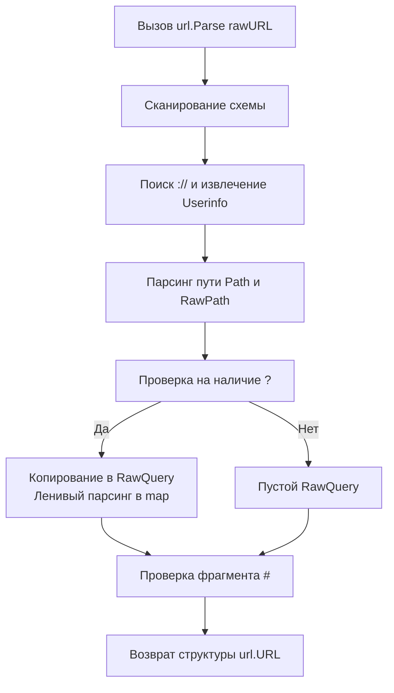

## Архитектура парсера и структура `url.URL`

В Go URL — это не просто строка, а строго типизированная структура, разделяющая компоненты на логические поля. Пакет `net/url` предоставляет парсер, который работает как детерминированный конечный автомат, а не через регулярные выражения. Это гарантирует предсказуемое время выполнения `O(n)` и защиту от ReDoS-атак при обработке злонамеренно длинных или malformed строк.

Структура `url.URL` в памяти выглядит так:
```go
type URL struct {
    Scheme      string
    Opaque      string    // Специфично для непрозрачных схем (mailto:, data:)
    User        *Userinfo // username:password
    Host        string    // host:port (включая IPv6 в квадратных скобках)
    Path        string    // Декодированный путь
    RawPath     string    // Закодированный путь (если отличается от Path)
    ForceQuery  bool      // Принудительный знак вопроса без параметров
    RawQuery    string    // Сырой запрос (a=1&b=2)
    Fragment    string    // Декодированный фрагмент
    RawFragment string    // Закодированный фрагмент
}
```
Разделение на `Path` и `RawPath`, а также `Query` и `RawQuery` — ключевая архитектурная особенность. Go сохраняет оригинальные закодированные строки в полях `Raw*`, чтобы при генерации `String()` можно было восстановить URL без потери информации, но предоставляет декодированные версии для удобной работы в бизнес-логике.



> [!info] Под капотом
> `url.Parse` **лениво** не парсит query-параметры в мапу при вызове. Он просто копирует подстроку после `?` в поле `RawQuery`. Преобразование в `url.Values` (`map[string][]string`) происходит только при первом вызове метода `u.Query()`. Это экономит CPU и память, если параметры не используются в конкретном хендлере.

## Under the hood: `url.Values` и механизмы экранирования

`url.Values` — это просто псевдоним:
```go
type Values map[string][]string
```
Почему `[]string`, а не `string`? Потому что спецификация URL допускает дубликаты ключей (`?tag=go&tag=backend`). Стандартная библиотека корректно агрегирует их в слайс, избегая потери данных при конкурентной или последовательной обработке.

Методы `Add`, `Set`, `Del` и `Encode` работают напрямую с этой мапой. `Encode()` генерирует строку в формате `application/x-www-form-urlencoded`, экранируя специальные символы через `url.QueryEscape`.

Функция `QueryEscape` заменяет все символы, кроме букв, цифр и `-_.~`, на `%XX`. Под капотом она использует предварительное выделение буфера `make([]byte, 3*len(s))` в худшем случае, чтобы избежать промежуточных реаллокаций при росте строки. Парсинг работает строго побайтово, без рефлексии.

## Mechanical Sympathy: Аллокации, GC и оптимизация горячих путей

Работа с URL в высоконагруженных прокси, роутерах или HTTP-клиентах может стать источником скрытых аллокаций:
1. `url.Parse` выделяет новую структуру `URL` и строки для каждого компонента.
2. `u.Query()` парсит `RawQuery` в новую мапу. Если вызывается многократно, создается множество временных мап.
3. `u.Query().Encode()` создает новую строку с экранированием.

**Оптимизация для Hot Paths:**
Если вы знаете, что параметры не изменятся, кэшируйте `url.URL` или `url.Values`. Если вам нужно только проверить наличие ключа, не вызывайте `Query()` полностью — используйте строковые поиск и `url.PathUnescape` на сырой подстроке, либо работайте напрямую с `r.URL.RawQuery`.

```go
// ❌ Плохо в цикле обработки 10k RPS
q := r.URL.Query() // Аллокация мапы + копирование строк
val := q.Get("token") // Поиск в мапе
newURL := r.URL.String() // Форматирование строки

// ✅ Хорошо: кэширование или работа с RawQuery
// Если параметры статичны, парсите один раз и сохраняйте в контексте запроса
// или используйте пулы значений для временных операций
```

> [!warning] Ловушка / Gotcha
> **Мутабельность и гонки данных.**
> `url.URL` **не потокобезопасен**. Метод `Query()` пересоздает мапу при каждом вызове, однако ручная модификация `u.RawQuery` и одновременное чтение через `u.Query()` в другой горутине может привести к непредсказуемым результатам. Всегда передавайте `url.URL` по значению или оборачивайте в `sync.RWMutex`, если мутируете его в конкурентной среде.

## Идиоматичные паттерны и безопасное использование

### 1. `+` против пробела: стандарт `application/x-www-form-urlencoded`
В query-строках пробел кодируется как `+`. При декодировании через `Query().Get()` `+` автоматически превращается в пробел. Если вам нужен буквальный символ `+`, его нужно экранировать как `%2B`. `url.PathEscape` **не** заменяет `+` на `%2B`, так как в пути пробел кодируется только как `%20`.

```go
q := url.Values{}
q.Set("query", "hello world")
fmt.Println(q.Encode()) // query=hello+world

q2 := url.Values{}
q2.Set("formula", "A+B")
fmt.Println(q2.Encode()) // formula=A%2BB
```

### 2. Безопасное логирование: `Redacted()`
Никогда не логируйте `u.String()` в production. URL часто содержат токены, пароли или чувствительные query-параметры. Метод `u.Redacted()` заменяет `Userinfo` на `xxxxx` и очищает `RawQuery`, предотвращая утечку секретов в логи.

### 3. Конкатенация путей без дыр
Для безопасного соединения базового URL и относительного пути используйте `url.JoinPath` (Go 1.19+). Он корректно обрабатывает слеши, кодирует компоненты и предотвращает Directory Traversal.
```go
base, _ := url.Parse("https://api.example.com/v1/")
full, _ := base.JoinPath("users", "profile")
// Результат: https://api.example.com/v1/users/profile
```

## Вопросы с собеседований и сравнение с экосистемами

| Сценарий | Проблема | Решение |
|----------|----------|---------|
| Двойное экранирование `%%20` | `url.PathUnescape` не распакует валидно, вернет ошибку или оставит как есть. | Валидируйте входные данные на клиенте. В Go используйте `url.QueryUnescape` с проверкой `err != nil`. |
| IPv6 в URL `http://[::1]:8080` | Парсер корректно обрабатывает скобки. Ручная конкатенация ломает порт. | Всегда используйте `url.URL.Host = net.JoinHostPort(ip, port)` для сборки. |
| `u.RawQuery = "a=1"` vs `q.Set("a","1")` | Прямая запись в `RawQuery` инвалидирует логику кэширования и может сломать парсер. | Используйте методы `Query()`, `Set()`, `Encode()` и только потом присваивайте `u.RawQuery = q.Encode()`. |
| `url.ParseRequestURI` vs `url.Parse` | `Parse` допускает относительные URL без схемы. `ParseRequestURI` требует абсолютного пути, как в HTTP-запросах. | Для HTTP-хендлеров используйте `url.ParseRequestURI` или `r.URL` (уже распарсено сервером). |

> [!tip] Собеседование
> **Вопрос:** Почему `url.URL` не всегда копируется безопасно простым присваиванием?
> **Ответ:** В Go 1.17+ метод `Clone()` добавлен именно для этого. До этого разработчики должны были копировать структуру вручную. Простое копирование `u2 := u1` копирует указатель на `Userinfo`. Изменение пароля в `u2.User` изменит и `u1`. Всегда используйте `u1.Clone()` для безопасного ветвления.
>
> **Вопрос:** Как эффективно парсить query-параметры без аллокации мапы?
> **Ответ:** Стандартная библиотека `url.Values` всегда аллоцирует мапу. Для zero-allocation парсинга в экстремально нагруженных сценариях используют кастомные парсеры на `bytes.IndexByte`, которые ищут `&`, `=`, `%` и сразу конвертируют значения в целевые типы через `strconv`, минуя промежуточные `map` и `[]string`.

## Сравнение с экосистемами других языков

| Язык | Механизм | Особенности в сравнении с Go |
|------|----------|------------------------------|
| **Python** | `urllib.parse` | Функциональный API. Возвращает `ParseResult`. Кэширует ничего. Много аллокаций при split/encode. |
| **Java** | `java.net.URI` / `URLEncoder` | `URI` иммутабелен. Строгая валидация, но verbose API. Требует явного указания `Charset`. |
| **PHP** | `parse_url` / `http_build_query` | Возвращает массив. `+` декодируется в пробел автоматически. Меньше контроля над Raw/Decoded разделением. |
| **Node.js** | `URL` / `querystring` | `URL` следует WHATWG стандарту. Быстрый, но требует ручного управления параметрами через `URLSearchParams`. |
| **Go** | `net/url` | Баланс между производительностью и безопасностью. Ленивый парсинг query, четкое разделение Raw/Decoded, встроенный `JoinPath`, `Redacted`. |

## Итог

1. `url.URL` разделяет сырые и декодированные поля. `Query()` парсит `RawQuery` лениво в `map[string][]string`.
2. В query-строках `+` означает пробел, `%2B` — плюс. `PathEscape` не кодирует `+`, `QueryEscape` — кодирует.
3. `url.URL` мутируем. Используйте `Clone()` для копирования, `Redacted()` для логов, `JoinPath` для безопасной конкатенации.
4. В горячих путях избегайте многократного вызова `Query()` и `Encode()`. Кэшируйте результаты или используйте кастомные zero-allocation парсеры.
5. Для сборки хостов с IPv6 всегда применяйте `net.JoinHostPort`.

Разобрав адресацию и параметры, мы переходим к сердцу веб-коммуникации. Как Go управляет HTTP-запросами, маршрутизацией, мидлварами и жизненным циктом соединений? В следующей статье мы глубоко погрузимся в стандартный веб-стек: [[33. net_http. HTTP-клиент и HTTP-сервер]].