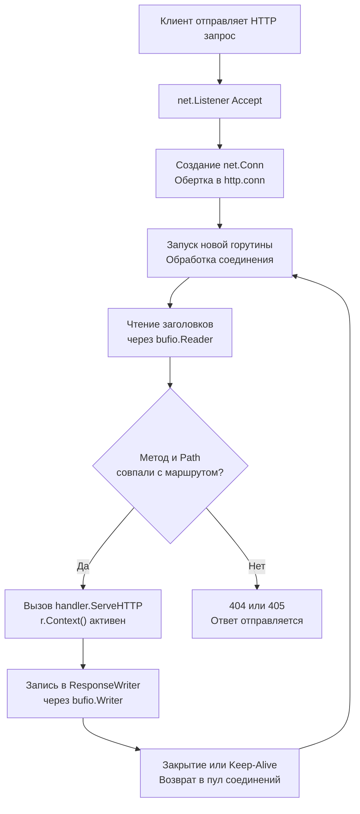

## Философия «горутина на запрос» и production-ready стандарт

Пакет `net_http` в Go — это не просто обертка над сокетами. Это высокоуровневая, production-ready реализация HTTP/1.1, HTTP/2 и HTTP/3 протоколов, спроектированная вокруг модели «одна горутина на одно соединение». В отличие от асинхронных event-loop подходов (Node.js, Python asyncio) или пулов потоков (Java Tomcat), Go делегирует управление конкурентностью планировщику рантайма. Это позволяет писать синхронно выглядящий код, который под капотом выполняется асинхронно через `netpoller`, не блокируя системные треды и масштабируясь до сотен тысяч одновременных соединений.

Для инженера уровня Senior понимание `net_http` означает умение управлять ресурсами процесса: предотвращать утечки горутин из-за неотмененных запросов, корректно настраивать таймауты на всех уровнях и использовать пулы соединений для минимизации TCP-handshake overhead.

> [!info] Под капотом
> При старте `http.Server` создает цикл `Accept`, который в отдельной горутине принимает соединения. На каждое принятое соединение `net.Listen` создает `net.Conn`, который оборачивается в `http.conn`. Для этого соединения запускается **новая горутина**, обрабатывающая весь жизненный цикл запроса: чтение заголовков, парсинг тела, выполнение `http.Handler`, запись ответа и закрытие/возврат соединения в пул.

## 1. Under the hood: Сервер, роутинг и жизненный цикл запроса

### Эволюция ServeMux (Go 1.22+)
До Go 1.22 `http.ServeMux` поддерживал только точное совпадение путей и префиксов. Начиная с 1.22, роутер поддерживает:
* Методы в маршрутах: `GET /users/{id}`
* Переменные в путях: `PathValue(r, "id")`
* Автоматическую обработку 405 Method Not Allowed
* Точное совпадение префиксов с `trailing slash`

Внутренне `ServeMux` использует дерево маршрутов с оптимизированным поиском. При совпадении вызывается `handler.ServeHTTP(w, r)`. Контекст запроса `r.Context()` автоматически отменяется при закрытии соединения клиентом или по таймауту сервера.



### Контекст и отмена
`r.Context()` содержит `http.responseContext`, который привязан к `conn`. При обрыве TCP-соединения (FIN/RST) или таймауте `ReadTimeout`, контекст закрывается. Все операции внутри хендлера, использующие `ctx`, мгновенно прерываются. Это фундаментальная часть graceful shutdown и защиты от slowloris-атак.

## 2. Механика http.Client: По умолчанию опасно

`http.Client` — это stateless-обертка над `http.Transport`. По умолчанию он **не имеет таймаутов**. Это означает, что при зависании целевого сервера или сетевой проблеме, горутина навсегда останется в состоянии ожидания.

```go
// ❌ Смерть для production: нет таймаутов, нет ограничения на редиректы
resp, err := http.Get("https://api.external.com/data")
// Может висеть бесконечно. При массовом вызове утечет память и горутины.

// ✅ Production-ready клиент
var defaultClient = &http.Client{
    Timeout: 15 * time.Second, // Глобальный таймаут на весь запрос+ответ
    Transport: &http.Transport{
        MaxIdleConns:        100,
        MaxIdleConnsPerHost: 20,
        IdleConnTimeout:     90 * time.Second,
        TLSHandshakeTimeout: 5 * time.Second,
    },
}
```

`http.Transport` управляет пулом соединений. Он поддерживает HTTP/1.1 Keep-Alive и HTTP/2 Multiplexing. При повторном запросе на тот же хост, Transport переиспользует существующий `net.Conn`, экономя время на DNS, TCP handshake и TLS negotiation.

## 3. Mechanical Sympathy: Аллокации, буферы и управление памятью

### Пулы буферов в Transport
`http.Transport` использует `sync.Pool` для буферов `bufio.ReadWriter` размером 4 КБ. При активном соединении горутина берет буфер из пула, читает ответ, парсит JSON и возвращает буфер. Это минимизирует давление на GC при тысячах RPS.

### Аллокации тела запроса
`io.ReadAll(r.Body)` всегда аллоцирует новый `[]byte` в куче. Если вы читаете большие payload (например, >1MB файлы), это вызывает скачки `heap_in_use`. Для стриминга используйте `io.Copy` или прямую передачу `io.Reader` в парсеры:
```go
// ✅ Стриминг в БД или парсер без полной загрузки в память
err := json.NewDecoder(r.Body).Decode(&payload)
```

### Влияние на CPU Cache
Обработка HTTP-запроса — это линейный проход по памяти. `http.ServeMux` маршрутизация и `json.Unmarshal` работают последовательно, что улучшает prefetching. Однако создание замыканий в middleware цепочке (`func next http.Handler { return http.HandlerFunc(...) }`) генерирует аллокации замыканий в куче. Для высоконагруженных шлюзов (>50k RPS) предпочтительна flat-структура без вложенных замыканий или кодогенерация роутеров.

## 4. Идиомы и паттерны для Production

### Graceful Shutdown
Сервер должен корректно завершать активные запросы при получении SIGTERM.

```go
func runGracefulServer(addr string, handler http.Handler) error {
    srv := &http.Server{
        Addr:              addr,
        Handler:           handler,
        ReadHeaderTimeout: 5 * time.Second, // Защита от Slowloris
        IdleTimeout:       120 * time.Second,
    }

    errCh := make(chan error, 1)
    go func() {
        errCh <- srv.ListenAndServe()
    }()

    quit := make(chan os.Signal, 1)
    signal.Notify(quit, syscall.SIGINT, syscall.SIGTERM)
    <-quit // Ожидание сигнала

    ctx, cancel := context.WithTimeout(context.Background(), 30*time.Second)
    defer cancel()

    log.Println("Shutting down server...")
    return srv.Shutdown(ctx)
}
```

### Middleware Chain
Используйте явное оборачивание для логирования, метрик и восстановления после паник.

```go
func Middleware(next http.Handler) http.Handler {
    return http.HandlerFunc(func(w http.ResponseWriter, r *http.Request) {
        start := time.Now()
        defer func() {
            if rec := recover(); rec != nil {
                log.Printf("Panic recovered: %v", rec)
                http.Error(w, "Internal Server Error", http.StatusInternalServerError)
            }
            log.Printf("%s %s %d %v", r.Method, r.URL.Path, http.StatusOK, time.Since(start))
        }()
        next.ServeHTTP(w, r)
    })
}
```

## 5. Ловушки и хардкорные вопросы с собеседований

| Ловушка | Описание | Решение |
|---------|----------|---------|
| Отсутствие `ReadHeaderTimeout` | Сервер висит вечно, ожидая заголовки от клиента (Slowloris) | Всегда задавайте `ReadHeaderTimeout` (5-10 сек). |
| `http.Client` без `Transport` | Создаются новые соединения на каждый запрос, лимит FD исчерпывается | Используйте глобальный `&http.Client{Transport: &http.Transport{...}}` или `http.DefaultTransport`. |
| Игнорирование `r.Body.Close()` | Соединение не возвращается в пул Transport, FD утекает | Всегда `defer r.Body.Close()` или читайте до EOF. `http.Client` закрывает автоматически, но серверные хендлеры — нет. |
| `http.TimeoutHandler` vs `Server.Timeout` | `TimeoutHandler` создает копию контекста и буферизует ответ. `ReadTimeout` работает на уровне IO. | Используйте `Server.ReadTimeout` для защиты инфраструктуры, `TimeoutHandler` для бизнес-логики с graceful fallback. |
| HTTP/2 Head-of-Line Blocking | Один медленный запрос блокирует мультиплексированный поток | В Go 1.22+ исправлено. Для старых версий используйте `GODEBUG=http2server=0` или настройте `MaxConcurrentStreams`. |

> [!tip] Собеседование
> **Вопрос:** Почему `http.Get()` без таймаута — это классическая ошибка production?
> **Ответ:** Без `http.Client.Timeout` запрос может висеть бесконечно при DNS-зависании, TLS-handshake проблемах или медленном ответе сервера. Горутина не завершится, соединение останется открытым. При скачке трафика это приводит к `too many open files`, OOM из-за накопления горутин и полной недоступности сервиса.
>
> **Вопрос:** Как `http.ServeMux` в Go 1.22+ выбирает маршрут между `GET /users/{id}` и `POST /users`?
> **Ответ:** Роутер сначала матчит метод, затем путь. Если методы разные, конфликтов нет. Если методы совпадают, приоритет у более специфичного пути (`/users/profile` выше `/users/{id}`). Точное совпадение всегда побеждает паттерн.

## 6. Сравнение с экосистемами

| Язык / Фреймворк | Модель | Особенности в сравнении с Go |
|------------------|--------|------------------------------|
| **Node.js (Express)** | Event-loop, один поток | Быстрый на IO, но CPU-блокировки тормозят все запросы. Нет встроенного пула соединений. |
| **Python (FastAPI)** | Asyncio, GIL | Требует `async/await` везде. GIL ограничивает CPU-параллелизм. Go использует истинную многопоточность через G-M-P. |
| **Java (Spring/Tomcat)** | Thread-pool (BIO/NIO) | Тяжелый overhead на создание потоков. Требует тонкой настройки `maxThreads`. Go использует легкие горутины. |
| **Go (net_http)** | Goroutine-per-request | Баланс скорости, памяти и простоты. Встроенные таймауты, пулы, HTTP/2, контекст. Минимальный boilerplate. |

## Итог

1. `net_http` использует модель «горутина на соединение», интегрированную с `netpoller`. Это устраняет callback hell и event-loop сложность.
2. Никогда не используйте `http.Get()` без `http.Client` и `Timeout`. Настройте `Transport` с `MaxIdleConns` и `IdleConnTimeout`.
3. Всегда задавайте `ReadHeaderTimeout` на сервере для защиты от Slowloris и используйте `r.Context()` для отмены долгих операций.
4. `io.ReadAll(r.Body)` аллоцирует в куче. Для больших данных используйте стриминг (`json.Decoder`, `io.Copy`).
5. Graceful shutdown требует `srv.Shutdown(ctx)` и обработки сигналов ОС.
6. В Go 1.22+ `http.ServeMux` поддерживает методы и переменные в путях, упрощая маршрутизацию без внешних роутеров.

Разобрав базовый API клиента и сервера, необходимо понять, как Go управляет пулами соединений, поддерживает Keep-Alive и оптимизирует повторное использование TCP-соединений. В следующей статье мы глубоко погрузимся в механику Transport: [[34. net_http под капотом. Transport, Connection Pool, Keep Alive]].