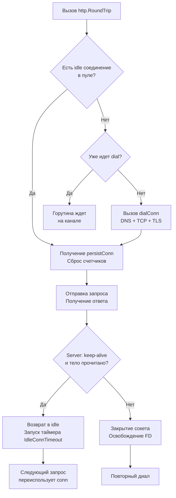

## Философия повторного использования соединений

В высоконагруженных бэкенд-системах создание нового TCP-соединения для каждого HTTP-запроса — это архитектурная ошибка, ведущая к латентным задержкам, перегрузке сетевого стека и исчерпанию файловых дескрипторов. Пакет `net/http` решает эту проблему через `http.Transport` — мощный, потокобезопасный диспетчер соединений, который абстрагирует пулинг, управление Keep-Alive, TLS-рукопожатия и переключение протоколов.

Понимание внутренней механики `Transport` критически важно для инженера уровня Senior. Дефолтные настройки (`MaxIdleConnsPerHost: 2`) часто становятся невидимым bottleneck'ом в продакшене, а неправильная работа с пулом соединений приводит к утечкам FD, `TIME_WAIT` штормам и каскадным отказам микросервисов.

> [!info] Под капотом
> `http.Transport` **потокобезопасен**. Вы должны создавать один экземпляр на всё приложение и переиспользовать его. Внутренние структуры пула (`connPool`, `dialing`, `idleConnCh`) защищены мьютексами и атомарными операциями. Создание нового `Transport` на каждый запрос уничтожает преимущества кеширования и генерирует нагрузку на сборщик мусора.

### 1. Under the hood: Структура Transport и persistConn

При вызове `client.Do(req)` запрос попадает в `Transport.roundTrip()`. Ключевая абстракция — `persistConn` (persistent connection). Это обертка над `net.Conn`, управляющая состоянием соединения, чтением/записью через `bufio`, обработкой `Connection: keep-alive` и сигнализацией пулу о освобождении ресурса.

Внутренний пул (`http.connPool`) управляет двумя типами очередей:
1. **Idle Connections**: Свободные, готовые к повторному использованию соединения.
2. **Dialing Connections**: Соединения в процессе установки (DNS resolve + TCP handshake + TLS).

```go
// Упрощенная схема пула соединений
type connPool struct {
    mu sync.Mutex
    idle map[string][]*persistConn      // Ключ: scheme://host. Слайс свободных коннектов
    idleWait map[string]chan *persistConn // Очередь ожидающих горутин
    dialing map[string][]chan *persistConn // Каналы для доставки новых соединений
}
```

Метод `getConn()` реализует логику получения соединения:
1. Ищет в `idle` по ключу хоста.
2. Если есть — возвращает немедленно.
3. Если нет — проверяет `dialing`. Если уже идет установка, горутина блокируется на канале и ждет завершения handshake.
4. Если нет активных диалов — создает новый через `dialConn()`.

### 2. Механика Connection Pool: От запроса до пула

Когда ответ получен, `Transport` не закрывает сокет сразу. Он проверяет заголовки сервера:
* Если `Connection: keep-alive` (или HTTP/1.1 без `Connection: close`) — сокет помечается как idle и кладется в пул.
* Если сервер вернул `Connection: close` или тело прочитано не полностью — сокет закрывается принудительно.



> [!warning] Ловушка / Gotcha
> **Непрочитанное тело запроса.**
> Если вы вызываете `resp, _ := client.Do(req)` и игнорируете `resp.Body`, соединение **никогда не вернется в пул**. `Transport` не может определить конец ответа и вынужден закрыть сокет, чтобы не смешивать данные следующего запроса. Всегда закрывайте тело: `defer resp.Body.Close()` или читайте до EOF: `io.Copy(io.Discard, resp.Body)`.

### 3. Keep-Alive и TCP-состояния

HTTP Keep-Alive — это протокольная договоренность. На уровне ядра ОС она поддерживается через TCP-сокеты и опцию `SO_KEEPALIVE`.
* **HTTP уровень**: Заголовок `Connection: keep-alive` разрешает переиспользование сокета для последующих запросов.
* **TCP уровень**: `SO_KEEPALIVE` отправляет пустые пакеты каждые 2 часа (по умолчанию в Linux) для обнаружения разорванных соединений. В Go `Transport` включает `SetKeepAlive(true)` и `SetKeepAlivePeriod(3 * time.Minute)` по умолчанию.

При закрытии пулом соединения (по таймауту `IdleConnTimeout`) происходит вызов `conn.Close()`. Ядро ОС переводит сокет в состояние `FIN_WAIT2`, а затем `TIME_WAIT` (обычно 60 секунд в Linux). Это не проблема для пула, но если вы создаете тысячи одноразовых соединений без Keep-Alive, `TIME_WAIT` быстро исчерпает лимит локальных портов (`net.ipv4.ip_local_port_range`).

### 4. HTTP/1.1 vs HTTP/2: Мультиплексирование пула

Логика пула кардинально меняется в зависимости от версии протокола:
* **HTTP/1.1**: Одно соединение обрабатывает **один запрос за раз**. Чтобы обслуживать 100 одновременных запросов к одному хосту, пул должен держать до 100 соединений. Лимит `MaxIdleConnsPerHost` (по умолчанию 2) быстро вызывает очередь `dialing`.
* **HTTP/2**: Использует `http2.Transport`, который мультиплексирует множество стримов (запросов) по **одному** TCP-соединению. Внутренний пул Go всё равно создает соединения, но их количество кратно меньше. `http2.ConfigureTransports` настраивает пул под специфику мультиплексирования, увеличивая `MaxIdleConns` и `MaxConnsPerHost`.

> [!info] Под капотом
> Go автоматически выбирает HTTP/2, если сервер поддерживает ALPN (Application-Layer Protocol Negotiation) при TLS-рукопожатии. Если вы видите `http: TLS handshake timeout` или `EOF` при HTTP/2, чаще всего проблема в несовместимости прокси или настройках `http2.Transport`.

### 5. Mechanical Sympathy: Файловые дескрипторы, память и тюнинг

Каждое активное или idle-соединение потребляет ресурсы:
1. **File Descriptor**: 1 FD на сокет. Лимит `ulimit -n` должен быть настроен с запасом.
2. **Kernel Memory**: Каждому TCP-сокету ядро выделяет буферы чтения/записи (`skbuff`), структуры `sock` и таймеры. Idle-соединение держит эти ресурсы занятыми до закрытия.
3. **User Space Memory**: `persistConn` содержит `bufio.ReadWriter` (~4-8 КБ), структуры синхронизации и указатели на `Transport`.

**Тюнинг для Production:**
```go
var tr = &http.Transport{
    // Лимит idle соединений на хост. Увеличьте для HTTP/1.1 микросервисов
    MaxIdleConnsPerHost: 50,
    // Общий лимит idle соединений. 0 = без лимита (следите за ulimit)
    MaxIdleConns:        200,
    // Время жизни idle соединения. 90s - хороший баланс между латентностью и памятью
    IdleConnTimeout:     90 * time.Second,
    // Таймаут установки соединения. Критичен для предотвращения долгих горутин
    DialContext: (&net.Dialer{
        Timeout:   30 * time.Second,
        KeepAlive: 30 * time.Second,
    }).DialContext,
    // Лимит одновременных диалов на хост. 0 = без лимита
    MaxConnsPerHost:     100,
    TLSHandshakeTimeout: 10 * time.Second,
}

var client = &http.Client{
    Timeout:   15 * time.Second, // Таймаут на весь цикл запрос-ответ
    Transport: tr,
}
```

### 6. Ловушки и вопросы с собеседований

| Сценарий | Проблема | Решение |
|----------|----------|---------|
| `MaxIdleConnsPerHost: 2` по умолчанию | При скачке трафика к одному сервису создаются сотни новых соединений, растет latency | Увеличьте до `50-100` для внутренних вызовов. Мониторьте `netstat -an \| grep ESTABLISHED`. |
| Утечка соединений при `resp.Body.Close()` | Забытый defer или паника перед закрытием | Всегда `defer resp.Body.Close()` сразу после проверки `err == nil`. |
| `http2.Transport` vs `http.Transport` | `http2.Transport` не поддерживает `http://` (только `https://`). | Для смешанных схем используйте стандартный `http.Transport`, он сам делегирует `http2` при TLS. |
| `Transport.Clone()` | Клонирование небезопасно, если оригинал уже использовался. | Используйте `tr.Clone()` только для инициализации. Никогда не мутируйте `Transport` после старта горутин. |
| `Client.CloseIdleConnections()` | Закрывает все idle соединения, но не активные. При частом вызове разрушает пул. | Вызывайте только при graceful shutdown или динамической смене DNS/прокси. |

> [!tip] Собеседование
> **Вопрос:** Почему `http.Transport` не использует `sync.Pool` для соединений?
> **Ответ:** `sync.Pool` предназначен для короткоживущих, безсостоятельных объектов. TCP-соединение содержит состояние (очереди TCP, TLS session state, буферы чтения/записи, флаги Keep-Alive). Возврат такого объекта в пул потребовал бы полной очистки состояния, что сложнее, чем создание нового. Поэтому Go использует кастомный `connPool` с явным отслеживанием жизненного цикла и таймерами idle.
>
> **Вопрос:** Как отследить количество idle соединений в рантайме без метрик Prometheus?
> **Ответ:** В Go 1.21+ добавлен метод `client.Transport.(*http.Transport).GetIdleConns()` (и `MaxIdleConns()`). Он возвращает слайс соединений. Для старых версий используйте `runtime.NumGoroutine()` + анализ логов `GODEBUG=httpclient=1` или внешние eBPF-метрики.

## Итог

1. `http.Transport` — единый, потокобезопасный диспетчер. Создавайте его один раз и передавайте по зависимостям.
2. Пул соединений использует логику `idle -> dialing -> new`. `MaxIdleConnsPerHost` по умолчанию равен 2, что требует увеличения для продакшена.
3. Всегда закрывайте `resp.Body`. Непрочитанное тело ломает Keep-Alive и вынуждает создавать новые соединения.
4. HTTP/2 мультиплексирует запросы по одному TCP-соединению, HTTP/1.1 требует пула соединений, равного количеству параллельных вызовов.
5. Idle-соединения держат FD и память ядра. Настройте `IdleConnTimeout` и `MaxIdleConns` под нагрузку и лимиты ОС.
6. Мониторьте состояние пула. Используйте `GetIdleConns()` и экспортируйте метрики для предотвращения `TIME_WAIT` штормов.

Освоив управление сетевыми соединениями, мы переходим к критическому аспекту разработки: как тестировать HTTP-сервисы без реальных сетевых задержек, мокировать внешние API и писать стабильные интеграционные тесты. В следующей статье мы разберем стандартный инструментарий: [[35. httptest. Тестирование HTTP-сервисов]].