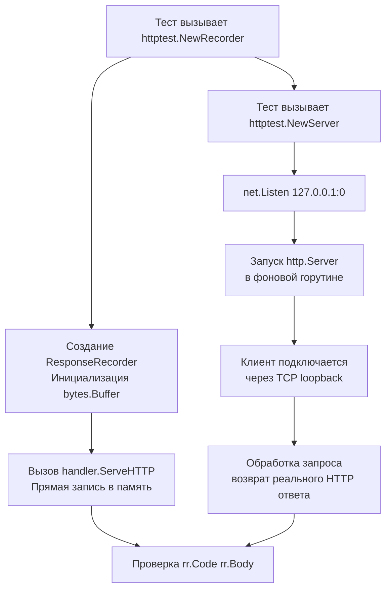

## Философия изоляции и детерминизма

Тестирование HTTP-сервисов через реальный сетевой стек — это источник нестабильности (`flaky tests`). Задержки DNS, состояние `TIME_WAIT` в ОС, блокировка портов и асинхронность сетевых драйверов делают такие тесты медленными и непредсказуемыми. Пакет `net/http/httptest` устраняет эти факторы, предоставляя инструменты для изоляции кода от сети и создания детерминированного окружения.

Для инженера уровня Senior `httptest` — это не просто моки. Это средство верификации контрактов, проверки граничных условий заголовков, тестирования TLS-рукопожатий и симуляции отказов инфраструктуры без поднятия Docker-контейнеров или внешних заглушек.

> [!info] Под капотом
> `httptest` работает на двух уровнях абстракции:
> 1. **In-memory тестирование** (`httptest.ResponseRecorder`): полностью обходит сетевой стек. Обработчик вызывается как обычная функция. Ноль системных вызовов.
> 2. **Loopback-тестирование** (`httptest.NewServer`): поднимает реальный `net.Listener` на случайном порте `127.0.0.1`. Трафик проходит через TCP/IP стек ОС, но не выходит за пределы хоста. Это позволяет тестировать реальных HTTP-клиентов, включая редиректы и куки.

## Under the hood: ResponseRecorder и жизненный цикл сервера

### ResponseRecorder: Захват ответа в памяти
Структура `httptest.ResponseRecorder` реализует интерфейс `http.ResponseWriter`. Вместо записи в сокет, она сохраняет статус, заголовки и тело в буферы внутри процесса.

```go
type ResponseRecorder struct {
    Code      int           // HTTP статус ответа
    HeaderMap Header        // Заголовки ответа
    Body      *bytes.Buffer // Тело ответа
    flushed   bool          // Флаг вызова Flush()
}
```
При вызове `handler.ServeHTTP(w, r)` код напрямую пишет в `w`. `ResponseRecorder` перехватывает вызовы `WriteHeader`, `Write` и `Flush`, синхронизируя состояние через внутренние мьютексы. Это делает её потокобезопасной, но требует аккуратности при чтении результатов.

### NewServer: Случайные порты и автоматическая очистка
`httptest.NewServer(handler)` выполняет:
1. Создание `net.Listener` на адресе `127.0.0.1:0`. Ядро ОС автоматически назначает свободный эфемерный порт.
2. Запуск `http.Server` в фоновой горутине.
3. Возврат структуры `*httptest.Server` с полем `URL`, содержащим точный адрес `http://127.0.0.1:<порт>`.

При завершении теста вызов `server.Close()` немедленно закрывает `Listener`, обрывает активные соединения и освобождает порт. Это предотвращает `address already in use` ошибки в CI/CD пайплайнах.



> [!warning] Ловушка / Gotcha
> **Незакрытый сервер в тестах.**
> Если забыть `defer srv.Close()`, горутина сервера останется активной до завершения процесса. При параллельном запуске тысяч тестов (`go test -p 8`) это приводит к исчерпанию лимита открытых файлов и `listen tcp: too many open files`. Всегда используйте `defer srv.Close()` сразу после проверки `err == nil`.

## Mechanical Sympathy: Аллокации, кэш CPU и отсутствие syscall

Понимание стоимости тестов критично для поддержания высокой скорости CI.

1. **Zero Syscall Path**: `ResponseRecorder` выполняется за сотни наносекунд. Вызов `ServeHTTP` не требует переключения Ring 3 -> Ring 0, не задействует сетевые драйверы и не создает `skbuff` в ядре. Это идеальный вариант для юнит-тестов обработчиков.
2. **Аллокации буфера**: `httptest.NewRequest` и `NewRecorder` выделяют память на стеке или в куче в зависимости от размера тела. При тестировании загрузки больших файлов (`>1MB`) `bytes.Buffer` внутри `Recorder` будет реаллоцироваться. Для проверки `Content-Length` или заголовков без чтения тела используйте `rr.Body` лениво или мокайте `io.Writer`.
3. **Cache Locality**: Поскольку `Recorder` и тестовый код находятся в одном адресном пространстве, данные остаются горячими в L1/L2 кэше CPU. Тесты с `NewServer` проходят через loopback-интерфейс `lo`, что добавляет накладные расходы на копирование пакетов между ядрами и контекстные переключения в планировщике сетевого стека.

**Правило выбора:**
* Используйте `ResponseRecorder` для тестирования **логики хендлера** (валидация, маршрутизация, бизнес-правила).
* Используйте `NewServer` для тестирования **клиентского кода**, редиректов, работы с куки и интеграции с `http.Client`.

## Идиомы и паттерны для Production-тестов

### 1. Тестирование хендлера через Recorder
```go
func TestMyHandler(t *testing.T) {
    // 1. Создаем рекордер и запрос
    rr := httptest.NewRecorder()
    req := httptest.NewRequest(http.MethodPost, "/api/users", bytes.NewReader([]byte(`{"name":"test"}`)))
    req.Header.Set("Content-Type", "application/json")
    
    // 2. Вызываем обработчик напрямую
    myHandler.ServeHTTP(rr, req)
    
    // 3. Проверяем результат через Result() для корректной сборки заголовков
    resp := rr.Result()
    defer resp.Body.Close() // Освобождаем буфер рекордера
    
    if resp.StatusCode != http.StatusCreated {
        t.Errorf("expected 201, got %d", resp.StatusCode)
    }
    
    var out map[string]string
    if err := json.NewDecoder(resp.Body).Decode(&out); err != nil {
        t.Fatalf("decode response: %v", err)
    }
    if out["status"] != "ok" {
        t.Errorf("unexpected body: %+v", out)
    }
}
```

### 2. Тестирование TLS и клиентских таймаутов
`httptest.NewTLSServer` генерирует самоподписанный сертификат на лету и возвращает клиент, уже настроенный на доверие этому CA.
```go
func TestTLSClient(t *testing.T) {
    srv := httptest.NewTLSServer(http.HandlerFunc(func(w http.ResponseWriter, r *http.Request) {
        w.WriteHeader(http.StatusOK)
    }))
    defer srv.Close() // Закрывает и сервер, и TLS-сокеты
    
    // srv.Client() уже содержит srv.TLS
    client := srv.Client()
    client.Timeout = 2 * time.Second
    
    resp, err := client.Get(srv.URL)
    if err != nil {
        t.Fatalf("request failed: %v", err)
    }
    defer resp.Body.Close()
    // assertions...
}
```

## Ловушки и хардкорные вопросы с собеседований

| Сценарий | Проблема | Решение |
|----------|----------|---------|
| `rr.Header()` vs `rr.Result().Header` | `HeaderMap` в `Recorder` не нормализует ключи и не копирует их. | Всегда используйте `rr.Result()` для финальной проверки. Он создает валидную `http.Response`, эмулирующую сетевой ответ. |
| Тестирование `context` отмены | `ServeHTTP` не проверяет отмену `r.Context()` автоматически. | Создавайте запрос с `req.WithContext(ctx)` и эмулируйте отмену через `cancel()` внутри теста, если хендлер блокирующий. |
| `NewServer` и IPv6 | На некоторых машинах `127.0.0.1` недоступен, сервер падает при старте. | Используйте `httptest.NewUnstartedServer` + кастомный `net.Listen` или настройте окружение. В CI предпочтительно `127.0.0.1`. |
| Параллельные тесты и общие серверы | Несколько тестов стучатся в один `httptest.Server` -> гонки данных. | Создавайте сервер внутри каждого теста или используйте `sync.Once` для тяжелых fixtures. |
| Проверка `Flush()` | `ResponseRecorder` не симулирует `http.Flusher` по умолчанию. | Используйте `httptest.NewRecorder()`, но для тестов SSE/WebSockets лучше мокайте интерфейс `http.Flusher` или `http.Hijacker` явно. |

> [!tip] Собеседование
> **Вопрос:** Как протестировать таймаут `http.Client` без реальных сетевых задержек?
> **Ответ:** `httptest.Server` не добавляет искусственную задержку. Чтобы протестировать таймаут клиента, используйте `time.Sleep` внутри тестового хендлера или `context.WithTimeout` на запросе. Для более точного контроля создайте `httptest.NewUnstartedServer`, оберните его `net.Listener` в кастомный `delayListener`, который задерживает `Accept()`, или используйте `httptest.Server` + хендлер с `time.After`.
>
> **Вопрос:** Почему `rr.Body.String()` может вернуть пустую строку, хотя `resp.Body.Read` дал данные?
> **Ответ:** После вызова `rr.Result()` или прямого чтения `rr.Body`, внутренний указатель буфера смещается в конец. Повторный вызов `String()` вернет пустоту. Либо читайте один раз и сохраняйте, либо используйте `bytes.NewReader(rr.Body.Bytes())` для многократного парсинга.

## Сравнение с экосистемами других языков

| Язык / Инструмент | Подход | Особенности в сравнении с Go |
|-------------------|--------|------------------------------|
| **Java** | `MockWebServer` (OkHttp), WireMock | Внешние зависимости. Мощный роутинг, но тяжелый JVM-оверхед. Go `httptest` встроен в стандартную библиотеку. |
| **Python** | `responses`, `pytest-httpserver` | Мок на уровне `requests` библиотеки или легковесный Flask-сервер. Медленнее из-за GIL и интерпретатора. |
| **Node.js** | `nock`, `msw` | Интерцепция на уровне HTTP-модуля. Быстро, но требует сторонних пакетов. Go тестирует реальные `net.Listener` без магии интерцепции. |
| **Go** | `net/http/httptest` | Zero-dependency, типобезопасный, интеграция с `context`. Позволяет тестировать и сервер, и клиент в одном процессе. |

## Итог

1. `httptest` предоставляет два уровня изоляции: in-memory (`ResponseRecorder`) для юнит-тестов и loopback (`NewServer`) для интеграционных тестов.
2. Всегда вызывайте `defer srv.Close()` для предотвращения утечек портов и файловых дескрипторов.
3. Используйте `rr.Result()` для получения валидного `http.Response`, а не прямое чтение полей `Recorder`.
4. `ResponseRecorder` обходит сетевой стек полностью, обеспечивая максимальную скорость и предсказуемость тестов.
5. Для TLS-тестов используйте `NewTLSServer` и `srv.Client()`, которые автоматически настраивают доверие к тестовому сертификату.
6. Не полагайтесь на `httptest` для проверки реальной сетевой маршрутизации, MTU или поведения файрвола. Используйте `testcontainers-go` или Docker для этого.

Освоив тестирование HTTP-сервисов, мы переходим к встроенным средствам диагностики production-систем. Как экспортировать метрики, анализировать потребление памяти и профилировать горутины прямо из запущенного бинарника без перезапуска? В следующей статье: [[36. net_http_pprof и expvar]].