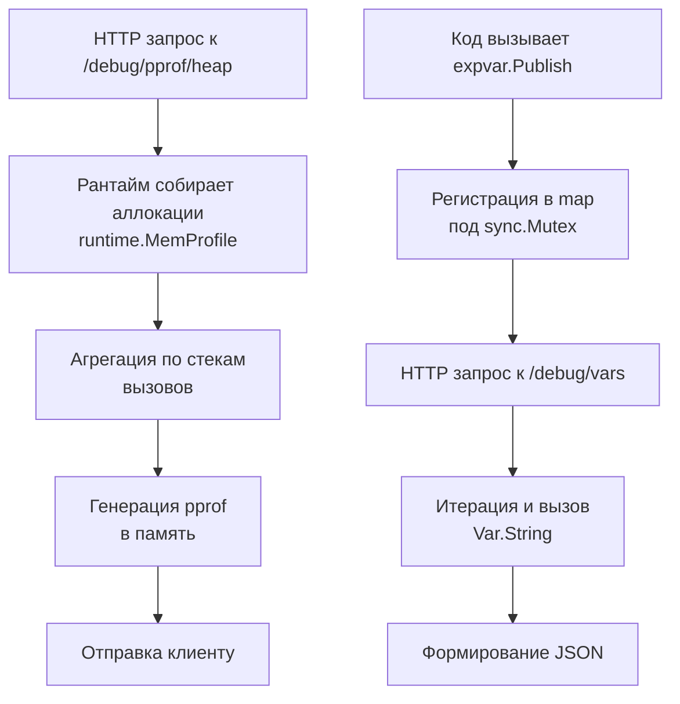

## Философия наблюдаемости и диагностики из коробки

Пакеты `net/http/pprof` и `expvar` предоставляют встроенный механизм наблюдаемости (observability) и отладки production-систем. Они позволяют извлекать метрики состояния рантайма, профилировать CPU, память и блокировки без перезапуска приложения или внедрения внешних агентов. Интеграция этих инструментов в стандартную библиотеку отражает философию Go: диагностика должна быть доступна из коробки, но разработчик несет полную ответственность за защиту этих эндпоинтов от несанкционированного доступа.

Для инженера уровня Senior понимание `pprof` и `expvar` — это не просто умение открыть `http://localhost:6060`, а способность программно собирать дампы, настраивать частоту сэмплирования под нагрузку и интерпретировать результаты с учетом Mechanical Sympathy (влияние профилирования на кэш-линии, GC и планировщик).

> [!info] Под капотом
> `net/http/pprof` регистрирует HTTP-роуты через побочный эффект в функции `init()`. Простого импорта `_ "net/http/pprof"` достаточно, чтобы эндпоинты `/debug/pprof/...` появились на `DefaultServeMux`. Это сделано для удобства, но создает скрытую зависимость: если вы не используете `http.ListenAndServe` на default-мультиплексоре, профилировщик останется недоступным. Всегда явно привязывайте `pprof` к админскому `http.ServeMux` или отдельному порту.

## Under the hood. net/http/pprof: Сэмплирование и рантайм-инструментация

`pprof` не мониторит каждую инструкцию CPU или каждую аллокацию. Это привело бы к падению производительности на порядки. Вместо этого используется **вероятностное сэмплирование** и **инструментация рантайма**.

### CPU Profiling
При запросе `/debug/pprof/profile?seconds=30` рантайм настраивает системный таймер (`setitimer` на Linux, `CreateTimerQueueTimer` на Windows) для генерации сигнала `SIGPROF` ~100 раз в секунду. Каждый сигнал:
1. Приостанавливает выполнение текущей горутины.
2. Снимает стек вызовов (`runtime.Callers`).
3. Записывает хеш стека в кольцевой буфер.
4. Возвращает управление.

Частота 100 Гц выбрана как баланс между детализацией и overhead (~5-10% CPU). При высокой нагрузке ядро ОС может коалесцировать сигналы, но рантайм Go компенсирует это математической экстраполяцией в профайлере.

### Heap и Memory Profiling
Работает через `runtime.MemProfileRate`. По умолчанию равен `512 * 1024` (512 КБ). Это значит, что примерно каждая 512-я аллокация в куче будет записана в таблицу `runtime.MemProfile`. При запросе `/debug/pprof/heap` рантайм агрегирует записанные стеки и формирует protobuf-дамп. Снижение `runtime.MemProfileRate = 1` даст 100% точность, но увеличит потребление памяти и замедлит `mallocgc`.

### Goroutine и Block Profiles
`goroutine` профиль собирает состояние всех активных горутин из `runtime.allgs`. Это **операция с остановкой мира (STW)** на микросекунды, так как требуется безопасное чтение стеков. `block` и `mutex` профили используют атомарные счетчики в примитивах `sync`, записывая длительность блокировки только если она превысила порог `runtime.SetBlockProfileRate`.



## expvar: Глобальный реестр и ограничения формата

`expvar` предоставляет простой способ экспортировать скалярные метрики в формате JSON. Внутренне это структура `expvar.Map`, защищенная `sync.Mutex`, содержащая `map[string]expvar.Var`.

При вызове `expvar.Publish("my_counter", counter)` значение регистрируется в глобальном реестре. Эндпоинт `/debug/vars` итерирует карту, вызывает метод `String()` у каждого значения и собирает JSON-ответ.

**Критическое ограничение:** `expvar` не поддерживает гистограммы, квантили, сложную агрегацию или теги. Он предназначен только для монотонных счетчиков (`expvar.Int`) и гаужей. Метод `String()` аллоцирует новую строку на каждый запрос `/debug/vars`, что при высокой частоте опроса мониторингом создает фоновое давление на GC.

> [!warning] Ловушка / Gotcha
> **Конкурентное обновление `expvar.Map`.**
> Метод `expvar.Map.Set()` блокирует глобальный мьютекс. Если вы обновляете метрики в горячем цикле (тысячи раз в секунду), вы создадите contention, который замедлит не только сбор метрик, но и другие горутины, пытающиеся обновить или прочитать `expvar`. Для высокочастотных метрик используйте атомарные счетчики `atomic.Int64` и экспортируйте их в `expvar` только по запросу или через кэшированный снэпшот.

## Mechanical Sympathy: Цена профилирования и аллокации

Профилирование — это не бесплатная операция. Понимание её стоимости необходимо для безопасного использования в продакшене.

1. **CPU Overhead**: `SIGPROF` вызывает контекстные переключения и прерывает конвейер CPU. При нагрузке >50k RPS профилировщик может добавить 10-15% latency из-за сброса pipeline и кэш-промахов.
2. **STW при Goroutine Dumps**: `/debug/pprof/goroutine` останавливает все горутины для безопасного обхода стеков. При 100k+ горутин это занимает десятки миллисекунд, что видно как всплеск p99 latency.
3. **Аллокации `expvar`**: Каждый запрос `/debug/vars` генерирует новый JSON. Если Prometheus или Grafana опрашивает эндпоинт каждые 5 секунд, аллокации накапливаются. Решается через прокси-кэш или переход на `prometheus/client_golang`, который использует zero-аллокационные текстовые протоколы.

### Идиомы production-безопасности
Никогда не выставляйте `/debug/` в публичную сеть. Используйте базовую аутентификацию, IP-фильтрацию или отдельный админский порт за firewall.

```go
func setupDebugServer(addr string) error {
    mux := http.NewServeMux()
    
    // Явная регистрация pprof (без импорта _ "net/http/pprof")
    pprof.Handler("profile").ServeHTTP // и т.д. для каждого эндпоинта
    mux.HandleFunc("/debug/pprof/", pprof.Index)
    mux.HandleFunc("/debug/pprof/profile", pprof.Profile)
    mux.HandleFunc("/debug/pprof/symbol", pprof.Symbol)
    mux.HandleFunc("/debug/vars", expvar.Handler().ServeHTTP)
    
    // Middleware для базовой аутентификации
    authMux := http.HandlerFunc(func(w http.ResponseWriter, r *http.Request) {
        user, pass, ok := r.BasicAuth()
        if !ok || user != "admin" || pass != os.Getenv("DEBUG_PASS") {
            http.Error(w, "Unauthorized", http.StatusUnauthorized)
            return
        }
        mux.ServeHTTP(w, r)
    })
    
    srv := &http.Server{Addr: addr, Handler: authMux, ReadHeaderTimeout: 5 * time.Second}
    return srv.ListenAndServe()
}
```

## Ловушки и вопросы с собеседований

| Сценарий | Проблема | Решение |
|----------|----------|---------|
| `/debug/pprof/profile` висит 30с | По умолчанию собирает 30 секунд. Блокирует HTTP-соединение. | Используйте `?seconds=5` для быстрых проверок или запускайте через `go tool pprof http://host/debug/pprof/profile` локально. |
| `expvar` дублирует ключи | `expvar.Publish` паникует при повторной регистрации. `expvar.Map` добавляет без проверки. | Всегда регистрируйте метрики в `init()` или используйте `sync.Once`. Для динамических ключей создавайте кастомный `expvar.Func`. |
| Горутинный стек не показывает асинхронность | `pprof` показывает только синхронные вызовы. Каналы и таймеры не видны напрямую. | Используйте `pprof/trace` для анализа планировщика или `GODEBUG=schedtrace=1000` для логов планировщика. |
| `runtime.MemProfileRate` = 0 | Отключает профилирование памяти. `/debug/pprof/heap` вернет пустой дамп. | Установите значение > 0. По умолчанию 512KB оптимально. Для точного анализа снижайте до 1 только локально. |
| `pprof` в production без auth | Любой может скачать дамп кучи, содержащий пароли, токены, приватные данные. | Обязательно оборачивайте в auth middleware или используйте `build tag` `-tags noprof` для релизных сборок. |

> [!tip] Собеседование
> **Вопрос:** Как программно получить дамп горутин без HTTP-запроса?
> **Ответ:** Используйте `runtime/pprof.Lookup("goroutine")`. Метод `WriteTo(w io.Writer, debug int)` позволяет записать профиль в `os.File`, `bytes.Buffer` или `syslog`. Параметр `debug=0` возвращает protobuf, `debug=2` — текстовый дамп с полными стеками.
>
> **Вопрос:** Почему `expvar` не подходит для продакшен-мониторинга в больших кластерах?
> **Ответ:** `expvar` экспортирует данные в JSON, который требует парсинга на стороне сборщика метрик. Он не поддерживает эффективный binary-протокол (как Prometheus protobuf), не имеет встроенных меток/тегов и аллоцирует память на каждый запрос. Для production используйте `prometheus/client_golang` или OpenTelemetry, которые оптимизированы под pull/push модели и zero-copy экспорт.

## Сравнение с экосистемами других языков

| Язык / Инструмент | Механизм | Особенности в сравнении с Go |
|-------------------|----------|------------------------------|
| **Java** | JMX, Java Flight Recorder | JMX тяжелый, требует агентов, потребляет много памяти. JFR мощный, но лицензирован для production. Go `pprof` легковесный и бесплатный. |
| **Python** | `cProfile`, `tracemalloc`, `sys.setprofile` | Работают на уровне интерпретатора, замедляют код на 30-50%. `tracemalloc` требует включения до старта. Go профилирует нативный код с минимальным overhead. |
| **C++** | `gperftools`, `perf`, Valgrind | Требуют внешних утилит, ручной настройки флагов компиляции и линковки. Go встраивает всё в бинарник, не требуя пересборки. |
| **Node.js** | `clinic.js`, `--inspect`, `v8-profiler` | Зависит от V8. Профилирование JS и native кода разделено. Go единый бинарник, профилировщик видит весь стек (Go + Cgo). |
| **Go** | `net/http/pprof`, `expvar` | Нулевая конфигурация, HTTP-интерфейс, безопасное сэмплирование, встроенная интеграция с рантаймом. Идеален для быстрого старта, но требует защиты в prod. |

## Итог

1. `net/http/pprof` использует вероятностное сэмплирование (~100 Гц) для CPU и `MemProfileRate` для кучи, минимизируя overhead.
2. `expvar` — простой реестр скалярных метрик с `sync.Mutex`. Не поддерживает гистограммы и создает аллокации при `/debug/vars`.
3. Никогда не выставляйте `/debug/` публично. Используйте auth, IP-фильтры или отдельный админский порт.
4. Горутинные дампы вызывают микросекундные STW. Не запускайте `/debug/pprof/goroutine` часто под высокой нагрузкой.
5. Для production-мониторинга предпочитайте Prometheus/OpenTelemetry. `pprof` и `expvar` идеальны для отладки инцидентов и dev-среды.
6. Программный доступ к профилям осуществляется через `pprof.Lookup("тип").WriteTo()`, что удобно для автоматического сбора дампов при ошибках.

Понимание инструментов диагностики и экспорта метрик логически подводит нас к вопросу генерации случайных чисел. Как Go обеспечивает криптографическую стойкость, почему стандартный генератор не является потокобезопасным и как правильно выбирать источник случайности? В следующей статье: [[37. crypto_rand и math_rand]].