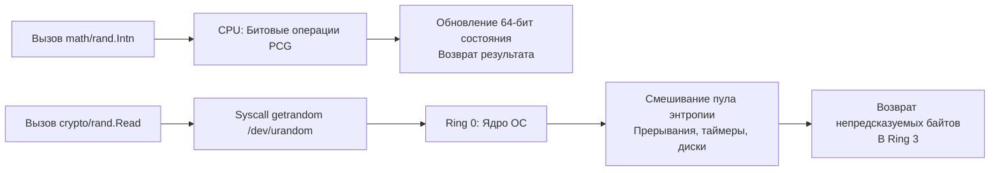

## Философия разделения: Скорость против Безопасности

В Go генерация случайных чисел строго разделена на два пакета, отражающих фундаментальный компромисс инженерии: **производительность** против **непредсказуемости**. 

Пакет `math/rand` реализует быстрый алгоритмический генератор псевдослучайных чисел (PRNG). Он детерминирован, вычисляется исключительно на CPU и предназначен для симуляций, игр, случайной выборки данных и небезопасных идентификаторов. Начиная с Go 1.20, он автоматически инициализируется случайным seed-ом при старте программы, что упрощает работу, но не меняет его криптографическую слабость.

Пакет `crypto/rand` — это интерфейс к генератору криптографически стойких случайных чисел (CSPRNG). Он опирается на пул энтропии ядра ОС, гарантируя, что следующий байт невозможно предсказать даже при знании всех предыдущих. Это единственный допустимый источник для токенов сессий, паролей, nonce, ключей шифрования и любых данных, где утечка паттернов ведет к взлому системы.

> [!info] Под капотом
> Разделение пакетов — это архитектурный контракт безопасности. Компилятор и линтеры не могут запретить использование `math/rand` для токенов, но это считается критической уязвимостью уровня CWE-330. Инженер обязан явно выбирать источник, исходя из модели угроз, а не из удобства импорта.

## Under the hood. Алгоритмы и источники энтропии

### Механика math/rand
До Go 1.20 использовался алгоритм Lagged Fibonacci, подверженный статистическим артефактам. В современных версиях перешли на **PCG (Permuted Congruential Generator)**. Он работает с 64-битным состоянием, выполняет несколько битовых сдвигов и умножений на каждом вызове, обеспечивая отличное качество случайности и скорость.

Глобальные функции (`rand.Intn`, `rand.Float64`) защищены внутренним `sync.Mutex`. Это делает их потокобезопасными, но создает точку конкуренции при высокой нагрузке. Создание локального источника `rand.New(rand.NewSource(seed))` убирает мьютекс, но **запрещает** конкурентный доступ к одному экземпляру `rand.Rand`.

### Механика crypto/rand
Пакет не реализует математику сам. Он выступает тонкой оберткой над системными вызовами:
* **Linux**: `getrandom()` (современные ядра) или чтение `/dev/urandom`.
* **macOS/FreeBSD**: `getentropy()` или `sysctl(KERN_URND)`.
* **Windows**: `BCryptGenRandom()`.

На современных системах пул энтропии ядра не «истощается». Он смешивает шумы аппаратных прерываний, таймеров, дисков и сетевого стека. Вызов `crypto/rand` инициирует переход в Ring 0, чтение буфера ядра и возврат данных. Это гарантирует криптографическую стойкость, но добавляет задержку syscall.



## Mechanical Sympathy: CPU-циклы, contention и аллокации

### 1. Цена конкуренции в math/rand
При использовании глобальных `rand.*` в тысячях горутин одновременно, `sync.Mutex` внутри рантайма становится bottleneck'ом. Горутины блокируются, планировщик переводит их в ожидание, растут latency.
**Решение:** Для высоконагруженных сценариев используйте пул локальных источников:
```go
var randPool = sync.Pool{
    New: func() interface{} {
        // Go 1.20+ автоматически сидирует, но для детерминизма можно указать явно
        return rand.New(rand.NewSource(time.Now().UnixNano()))
    },
}

func fastRandomInt(n int) int {
    r := randPool.Get().(*rand.Rand)
    defer randPool.Put(r)
    return r.Intn(n)
}
```
Это полностью устраняет блокировки, так как каждая горутина работает с изолированным состоянием PCG в L1-кэше своего треда.

### 2. Syscall overhead в crypto/rand
Каждый вызов `rand.Read()` требует переключения контекста. На современных CPU это ~100-300 наносекунд, что в 50-100 раз медленнее `math/rand`. Для генерации больших объемов данных (например, ключей или токенов) предпочтительно запрашивать буфер нужного размера одним вызовом, а не вызывать `Read([]byte{b})` в цикле.

### 3. GC и аллокации
`math/rand` не аллоцирует память после инициализации. `crypto/rand` также минимален, но передача среза `[]byte` в `rand.Read()` может вызвать escape analysis, если буфер создается внутри цикла. Всегда переиспользуйте буферы или создавайте их вне горячих путей.

## Идиомы и паттерны для Production

### Безопасная генерация токенов
Никогда не конвертируйте случайные байты в строку через `fmt.Sprintf` или `string()`. Используйте кодирование `base64.URLEncoding` для URL-безопасных идентификаторов:
```go
func GenerateSecureToken(length int) (string, error) {
    b := make([]byte, length)
    if _, err := rand.Read(b); err != nil {
        return "", fmt.Errorf("read crypto rand: %w", err)
    }
    // URL-safe, без padding, предсказуемая длина
    return base64.URLEncoding.EncodeToString(b), nil
}
```

### Перемешивание слайсов
`rand.Shuffle` использует глобальный источник. Для больших слайсов в конкурентной среде лучше реализовать собственный алгоритм Фишера-Йетса с локальным `rand.Rand`, избегая мьютекса.

## Ловушки и вопросы с собеседований

| Сценарий | Проблема | Решение |
|----------|----------|---------|
| `math/rand` для JWT токенов | Алгоритм детерминирован. Зная seed, атакер восстановит все прошлые и будущие токены. | Используйте строго `crypto/rand`. |
| Общий `rand.Rand` между горутинами | Внутреннее состояние PCG повреждается гонкой данных. Вызовет панику или зацикливание. | Создавайте экземпляр на горутину или используйте `sync.Pool`. |
| `/dev/random` блокирует процесс | На старых ядрах Linux `/dev/random` блокируется при низкой энтропии. | Go использует `/dev/urandom` или `getrandom`, которые **никогда** не блокируются. |
| `crypto/rand.Read` возвращает `n < len` | В отличие от `io.Reader`, `rand.Read` всегда заполняет буфер полностью или возвращает ошибку. | Не нужно проверять `n` в цикле. Достаточно `if _, err := rand.Read(b); err != nil`. |
| Auto-seed в Go 1.20+ | Разработчик вручную сидирует `math/rand`, ломая авто-инициализацию или делая её предсказуемой. | Не вызывайте `rand.Seed()` в новых версиях. Удаляйте legacy-код. |

> [!tip] Собеседование
> **Вопрос:** Почему `math/rand` не является потокобезопасным для локальных экземпляров, в отличие от глобальных функций?
> **Ответ:** Глобальные функции оборачиваются во внутренний мьютекс рантайма для удобства и безопасности. Локальный `rand.Rand` спроектирован для максимальной производительности в однопоточных контекстах (например, симуляции, однопоточные алгоритмы). Добавление мьютекса в каждый вызов локального источника нарушило бы принцип zero-overhead абстракций Go и ухудшило бы производительность на ~30-40% даже там, где синхронизация не нужна.
>
> **Вопрос:** Как проверить, что генератор криптографически стойкий, не читая документацию?
> **Ответ:** Проверьте пакет импорта. Только `crypto/rand` гарантирует CSPRNG. Любые математические преобразования над `math/rand` (хеширование, соль, умножение) не повышают энтропию, а лишь маскируют предсказуемость. Криптографическая стойкость обеспечивается исключительно источником, а не обработкой вывода.

## Сравнение с экосистемами других языков

| Язык | Пакет / Механизм | Особенности в сравнении с Go |
|------|------------------|------------------------------|
| **Python** | `random` vs `secrets` / `os.urandom` | `random` использует Mersenne Twister. `secrets` обертка над `os.urandom`. Разделение есть, но `random` по умолчанию не потокобезопасен. Go `math/rand` безопаснее глобально, но требует явного пулинга для скорости. |
| **Java** | `java.util.Random` vs `SecureRandom` | `Random` использует линейный конгруэнтный генератор. `SecureRandom` делегирует ОС. В Java `SecureRandom` может блокироваться на старых системах, в Go этого не происходит благодаря `getrandom`. |
| **C++** | `std::rand()` vs `std::random_device` | `std::rand()` считается устаревшим и плохим. `random_device` часто реализован через `/dev/urandom`, но стандарт не гарантирует криптографическую стойкость. Go дает строгие гарантии API. |
| **Go** | `math/rand` vs `crypto/rand` | Четкое разделение, авто-сидирование в 1.20+, потокобезопасные глобальные вызовы, гарантия неблокируемости CSPRNG на всех ОС. |

## Итог

1. `math/rand` — для скорости, симуляций и некритичных данных. Начиная с Go 1.20, автоматически сидируется. Глобальные функции потокобезопасны, локальные — нет.
2. `crypto/rand` — строго для секретов, токенов и криптографии. Использует syscall к энтропии ядра, не блокируется, потокобезопасен.
3. Избегайте глобального `math/rand` в высоконагруженных конкурентных путях. Используйте `sync.Pool` для локальных источников, чтобы убрать contention мьютекса.
4. Никогда не пытайтесь «улучшить» `math/rand` хешированием или солью для безопасности. Детерминизм алгоритма делает предсказуемость неизбежной при известном seed.
5. `crypto/rand.Read` всегда заполняет буфер целиком или возвращает ошибку. Не проверяйте `n` в цикле.

Разобравшись с источниками случайности, мы переходим к фундаментальным инструментам защиты данных. Как Go реализует криптографические примитивы, обеспечивает безопасность на уровне CPU и почему стандартная библиотека отказалась от устаревших алгоритмов? В следующей статье: [[38. crypto. Хеши, HMAC, AES, RSA, TLS]].