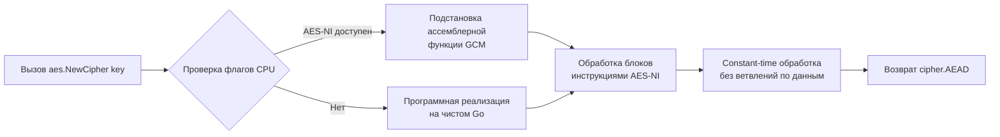

## Философия безопасности и постоянной сложности

Пакет `crypto` и его подпакеты в Go спроектированы вокруг единственного принципа: **безопасность не должна зависеть от осторожности разработчика**. В отличие от библиотек на других языках, где устаревшие алгоритмы остаются доступными ради обратной совместимости, Go по умолчанию скрывает криптографически сломанные примитивы (`MD5`, `SHA1`, `DES`) и навязывает современные стандарты.

Ключевая архитектурная особенность стандартной библиотеки — **гарантия постоянной сложности выполнения** (constant-time execution). Операции сравнения, расшифровки и подписи реализованы так, что время их выполнения не зависит от секретных данных. Это фундаментальная защита от атак по сторонним каналам (side-channel attacks), когда злоумышленник измеряет время отклика сервера для восстановления ключей.

> [!info] Под капотом
> В Go криптография — это не набор высокоуровневых абстракций, а прямая интеграция с инструкциями процессора и строгими интерфейсами. Пакеты `crypto/sha256`, `crypto/aes`, `crypto/hmac` реализуют контракты `hash.Hash`, `cipher.Block`, `cipher.AEAD`. Компилятор линкует их с ассемблерными реализациями, которые используют аппаратные расширения CPU, не требуя от разработчика ручного управления буферами или выравниванием памяти.

## Under the hood. Ассемблер, аппаратное ускорение и защита от атак

Go не полагается на интерпретируемые алгоритмы для криптографии. Подпакеты содержат оптимизированные ассемблерные реализации для `x86_64` и `ARM64`.

При инициализации `sha256.New()` или `aes.NewCipher(key)` рантайм проверяет флаги CPU через `runtime` пакет. Если процессор поддерживает инструкции `AES-NI`, `SHA Extensions` (x86) или `Crypto Extensions` (ARM), рантайм патчит таблицу методов интерфейса, подставляя ассемблерную функцию вместо программной реализации на чистом Go.



**Constant-time гарантии:** При сравнении MAC-кодов или подписей Go использует пакет `crypto/subtle`. Функции вроде `subtle.ConstantTimeCompare` выполняют побитовое XOR-сравнение всех байтов, независимо от того, совпали ли они на первом байте или на последнем. Это устраняет `branch misprediction`, зависящий от секретных данных, и делает невозможным извлечение информации через анализ задержек кэша или таймингов.

## Хеширование и HMAC. Верификация без утечек времени

`crypto/sha256` и `crypto/hmac` предоставляют потоковый интерфейс `hash.Hash`, совместимый с `io.Writer`.

```go
// ✅ Идиоматично: вычисление HMAC-SHA256
func computeHMAC(secret, data []byte) ([]byte, error) {
    mac := hmac.New(sha256.New, secret)
    if _, err := mac.Write(data); err != nil {
        return nil, fmt.Errorf("write hmac: %w", err)
    }
    return mac.Sum(nil), nil // Sum добавляет текущий хеш к буферу, копирует и возвращает
}
```

При верификации токенов критически важно использовать `hmac.Equal`:
```go
// ❌ ОПАСНО: bytes.Equal возвращает false при первом несовпадении
// if !bytes.Equal(computed, received) { return false }

// ✅ БЕЗОПАСНО: constant-time сравнение
if !hmac.Equal(computed, received) {
    return errors.New("invalid signature")
}
```
> [!warning] Ловушка / Gotcha
> **Парольные хеши отсутствуют в stdlib.**
> Стандартный пакет `crypto` содержит только криптографические хеши (`SHA256`, `SHA512`). Для безопасного хеширования паролей **никогда** не используйте `SHA256` с солью напрямую. Применяйте `golang.org/x/crypto/bcrypt` или `argon2`. Они добавляют вычислительно затратные раунды и защиту от GPU-перебора, чего нет в стандартной библиотеке из-за строгих лицензионных и архитектурных ограничений.

## Симметричное шифрование. AES-GCM и запрет старых режимов

Go отказался от поддержки небезопасных режимов блочного шифрования (`ECB`, `CBC` без аутентификации). Современным стандартом является **AEAD** (Authenticated Encryption with Associated Data), представленный в `crypto/cipher.NewGCM`.

```go
func encryptAESGCM(plaintext, key []byte) ([]byte, error) {
    block, err := aes.NewCipher(key)
    if err != nil {
        return nil, fmt.Errorf("create cipher: %w", err)
    }
    
    gcm, err := cipher.NewGCM(block)
    if err != nil {
        return nil, fmt.Errorf("create GCM: %w", err)
    }
    
    // Nonce должен быть уникальным и криптографически случайным
    nonce := make([]byte, gcm.NonceSize())
    if _, err := rand.Read(nonce); err != nil {
        return nil, fmt.Errorf("generate nonce: %w", err)
    }
    
    // Seal шифрует и аутентифицирует данные. 
    Нонс префиксируется к результату.
    ciphertext := gcm.Seal(nonce, nonce, plaintext, nil)
    return ciphertext, nil
}
```
**Почему `nonce` критичен:** В режиме GCM повторное использование `nonce` с одним ключом полностью ломает безопасность: атакер может восстановить XOR-сумму открытых текстов и подделать MAC. `crypto/rand` гарантирует уникальность при 96-битном nonce с вероятностью коллизии, близкой к нулю.

## TLS и безопасность канала

`crypto/tls` реализует протокол TLS 1.2 и 1.3. Начиная с Go 1.22, конфигурация по умолчанию жестко настроена на безопасность: минимальная версия `TLS 1.2`, отключены небезопасные cipher suites, включена поддержка TLS 1.3 PSK.

```go
tlsConfig := &tls.Config{
    MinVersion:               tls.VersionTLS12,
    PreferServerCipherSuites: false, // В TLS 1.3 порядок сервера игнорируется
    SessionTicketsDisabled:   false, // Разрешаем сессионные тикеты для 0-RTT
}
```
При рукопожатии `tls.Dial` выполняет:
1. `ClientHello` с перечислением поддерживаемых алгоритмов.
2. Асинхронное согласование cipher suite (в TLS 1.3 это происходит в одном RTT).
3. Верификацию сертификата через системный `x509` пул.
4. Генерацию master secret и производных ключей.

> [!info] Под капотом
> TLS 1.3 кардинально упрощает протокол: удалены `RSA key transport`, `CBC` режимы, статические `DH`. Остался только `ECDHE` для forward secrecy и `AEAD` для шифрования. Это сокращает количество RTT до 1 и устраняет целые классы атак (POODLE, BEAST, Lucky13).

## Mechanical Sympathy. Влияние на CPU и память

| Фактор | Влияние | Оптимизация |
|--------|---------|-------------|
| **AES-NI** | Ускоряет шифрование в 5-10 раз. ~1-2 такта CPU на байт. | Убедитесь, что контейнеры/VM поддерживают `AES-NI` (проверьте `grep aes /proc/cpuinfo`). |
| **Cache Timing** | Constant-time ops избегают ветвлений, но могут читать больше памяти. | Алгоритмы спроектированы так, чтобы доступ к кэш-линиям не зависел от секрета. |
| **Аллокации в TLS** | Handshake выделяет ~10-20 КБ в кучу для буферов и сертификатов. | Используйте `tls.Config` кэширование или пулы соединений. При 10k+ RPS handshake становится bottleneck. |
| **GC Pressure** | Частые `crypto/tls` соединения генерируют много временных структур. | Включите `tls.Config.SessionTicketsDisabled = false` для reuse сессий, снижая full handshake. |

## Ловушки и вопросы с собеседований

| Сценарий | Проблема | Решение |
|----------|----------|---------|
| Повторный nonce в AES-GCM | Полная потеря конфиденциальности и целостности. Атака восстановления ключа. | Всегда генерируйте `nonce` через `crypto/rand`. Никогда не инкрементируйте его вручную без строгого контроля. |
| `bytes.Equal` вместо `hmac.Equal` | Тайминг-атака восстанавливает токен байт за байтом. | Используйте только `hmac.Equal` или `subtle.ConstantTimeCompare`. |
| TLS 1.0/1.1 в конфиге | Уязвимости BEAST, POODLE, отсутствие forward secrecy. | Установите `MinVersion: tls.VersionTLS12`. В Go 1.21+ старые версии отключены по умолчанию. |
| Хардкодинг RSA-2048 | Генерация ключей занимает секунды, требует высокой энтропии. | Генерируйте ключи один раз при деплое, храните в Secrets Manager. В runtime используйте ECDSA-P256 для скорости. |
| `crypto/rand` не импортирован | `math/rand` используется для генерации ключей. | Компилятор не запретит, но это CWE-330. Всегда используйте `crypto/rand` для ключей, nonce, сессий. |

> [!tip] Собеседование
> **Вопрос:** Почему AES-CBC считается небезопасным в современных системах, хотя он был стандартом 10 лет назад?
> **Ответ:** CBC не обеспечивает аутентификацию шифротекста. Атакер может изменить биты в шифротексте, и при расшифровке изменится предсказуемый блок открытого текста (bit-flipping attack). Кроме того, CBC уязвим к padding oracle атакам, если сервер возвращает разные ошибки при неправильном паддинге и неверном MAC. AEAD (AES-GCM, ChaCha20-Poly1305) решает обе проблемы, интегрируя шифрование и MAC в одну атомарную операцию.
>
> **Вопрос:** Как `crypto/tls` обрабатывает отмену сертификата (OCSP/CRL)?
> **Ответ:** Go по умолчанию **не проверяет** OCSP/CRL при TLS handshake. Это сделано для предсказуемости handshake (запрос к OCSP responder добавляет задержку и точку отказа). Для строгой проверки нужно реализовать кастомный `VerifyPeerCertificate` в `tls.Config` или использовать reverse-proxy с поддержкой OCSP stapling.

## Сравнение с экосистемами

| Язык | Механизм | Особенности в сравнении с Go |
|------|----------|------------------------------|
| **Java** | JCA / Bouncy Castle | Плагинная архитектура через `Security.addProvider`. Мощная, но тяжелая. Требует `KeyStore`. Go использует прямые вызовы без провайдерной магии. |
| **Python** | `hashlib`, `cryptography` | `hashlib` быстрый (C-расширение). `cryptography` требует сборки OpenSSL. GIL блокирует параллельные крипто-операции. Go обходится без внешних зависимостей. |
| **C++** | OpenSSL / libsodium | Максимальная гибкость, но сложное управление памятью и частые CVE. Go предоставляет безопасные высокоуровневые API с встроенным GC и constant-time гарантиями. |
| **Go** | `crypto/*` | Нулевые зависимости, автоматическое аппаратное ускорение, строгие интерфейсы, безопасные дефолты. Идеален для микросервисов и сетевых протоколов. |

## Итог

1. Go криптография построена на constant-time алгоритмах и аппаратном ускорении (AES-NI). Безопасность заложена на уровне архитектуры, а не конфигурации.
2. Используйте `hmac.Equal` для верификации. Никогда не применяйте `bytes.Equal` для секретов.
3. Симметричное шифрование должно быть только AEAD (`AES-GCM`). `nonce` обязан генерироваться через `crypto/rand`.
4. TLS 1.2 — минимальный стандарт. TLS 1.3 обеспечивает 1-RTT handshake и forward secrecy по умолчанию.
5. Стандартная библиотека не содержит password hashing. Для паролей используйте `golang.org/x/crypto/bcrypt` или `argon2`.
6. Криптография создает нагрузку на CPU и кэш. При высокой нагрузке используйте сессионные тикеты TLS и пулы соединений.

Разобрав фундаментальные криптографические примитивы, мы переходим к интеграции с системами хранения данных. Как Go стандартизирует взаимодействие с реляционными базами, управляет пулами соединений и обеспечивает транзакционную целостность? В следующей статье мы изучим стандартный драйверный слой: [[39. database_sql. Универсальный интерфейс к SQL-базам]].