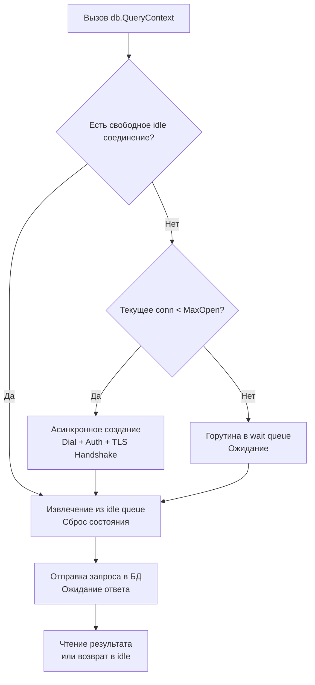

## Философия абстракции и пула соединений

Пакет `database/sql` — это не драйвер для базы данных, а стандартизированный интерфейс доступа к реляционным СУБД. Его главная задача — отделить бизнес-логику приложения от конкретной реализации СУБД, предоставляя унифицированный API для выполнения запросов, транзакций и управления пулом соединений.

Для инженера уровня Senior понимание `database/sql` — это не просто знание методов `Exec` и `Query`. Это понимание того, как пакет управляет жизненным циклом сетевых соединений, как взаимодействует с планировщиком горутин при ожидании ответа от БД и почему неправильная настройка пула приводит к каскадным отказам и исчерпанию лимитов файловой системы.

> [!info] Под капотом
> `database/sql` не содержит кода для работы с протоколами PostgreSQL или MySQL. Он полагается на интерфейс `driver.Driver`, который регистрируется через побочный эффект `init()` в стороннем пакете. При вызове `sql.Open()` рантайм ищет зарегистрированный драйвер по имени DSN и создает структуру `sql.DB`, которая **не открывает соединение сразу**. Подключение происходит лениво, при первом запросе.

### 1. Under the hood: `sql.DB` как менеджер пула

`sql.DB` — это не одно соединение, а stateful менеджер пула (`connPool`). Внутренне он использует несколько очередей и каналов для координации горутин:
1. **Idle Queue**: Свободные соединения, готовые к повторному использованию.
2. **Wait Queue**: Горутины, ожидающие освобождения соединения, если лимит `MaxOpenConns` достигнут.
3. **New Conn Channel**: Канал для асинхронного создания новых соединений без блокировки вызывающей горутины.



### 2. Mechanical Sympathy: TCP, FD и давление на GC

Управление пулом напрямую влияет на утилизацию ресурсов ОС и процессора:
* **File Descriptors (FD):** Каждое соединение потребует 1 FD. `MaxOpenConns` должен быть строго меньше `ulimit -n` с запасом на сокеты, файлы и метрики.
* **TCP TIME_WAIT:** При частом создании и закрытии соединений ядро ОС переводит сокеты в состояние `TIME_WAIT`. Это блокирует локальные порты и создает иллюзию утечки соединений. Пул решает проблему переиспользованием активных сессий.
* **ConnMaxLifetime:** Протоколы БД и сетевое оборудование могут молча разрывать застоявшиеся TCP-сессии. `SetConnMaxLifetime` гарантирует, что соединение будет переоткрыто до истечения таймаута на сетевом уровне.
* **Аллокации и GC:** Каждый вызов `rows.Next()` выделяет память под буфер сканирования и структуры драйвера. Неправильное использование `Scan` генерирует мусор. Переиспользование переменных для сканирования снижает давление на GC.

### 3. Идиоматичное использование и обработка ошибок

```go
func getUserByID(db *sql.DB, id int64) (*User, error) {
    row := db.QueryRowContext(context.Background(), "SELECT name, email FROM users WHERE id = $1", id)
    
    var u User
    if err := row.Scan(&u.Name, &u.Email); err != nil {
        if errors.Is(err, sql.ErrNoRows) {
            return nil, nil
        }
        return nil, fmt.Errorf("scan user: %w", err)
    }
    return &u, nil
}
```

> [!warning] Ловушка / Gotcha
> **Забытый `rows.Close()` или непрочитанные строки.**
> При `db.Query()` соединение блокируется до тех пор, пока `*sql.Rows` не будет полностью прочитан или явно закрыт. Если вы выйдете из функции с ошибкой парсинга, не вызвав `rows.Close()`, соединение останется заблокированным в пуле. Это приведет к постепенному истощению пула и deadlock'у всех последующих запросов. Всегда используйте `defer rows.Close()` сразу после проверки `err == nil`.

### 4. Контекст и управление временем жизни

Все методы с суффиксом `Context` интегрированы с `context.Context`. Если клиент отменяет HTTP-запрос, контекст закрывается, и драйвер прерывает выполнение SQL на уровне сети. Это критически важно для защиты от долгих запросов, которые блокируют таблицы и накапливаются в системных представлениях СУБД.

| Сценарий | Проблема | Решение |
|----------|----------|---------|
| `sql.Open` без `db.Ping()` | `Open` только проверяет имя драйвера. Ошибка подключения всплывет только при первом запросе. | Вызовите `db.PingContext(ctx)` сразу после `Open` для fail-fast диагностики. |
| `MaxIdleConns` > `MaxOpenConns` | Пакет автоматически снизит `MaxOpenConns` до уровня `MaxIdleConns`, что сломает ожидания приложения. | Всегда настраивайте `MaxIdleConns <= MaxOpenConns`. |
| Использование `QueryRow` для 0 строк | `QueryRow` всегда возвращает `*Row`. Ошибка `sql.ErrNoRows` вернется только при `Scan()`. | Проверяйте `errors.Is(err, sql.ErrNoRows)` после `Scan`. Это штатное поведение. |
| Сканирование `NULL` в `string` | Драйвер вернет ошибку `converting NULL to string is unsupported`. | Используйте `sql.NullString`, `sql.NullInt64` или драйвер-специфичные типы. |
| `SetConnMaxLifetime` не настроен | Соединения висят часами, NAT сбрасывает их, запросы падают с `broken pipe`. | Устанавливайте `SetConnMaxLifetime` в 2-5 минут для production. |

> [!tip] Собеседование
> **Вопрос:** В чем разница между `db.Query()` и `db.QueryRow()`?
> **Ответ:** `Query()` возвращает `*Rows`, итератор для 0..N строк. Требует явного `rows.Close()`. `QueryRow()` возвращает `*Row`, оптимизированный для ожидания ровно одной строки. Он лениво выполняет запрос и возвращает ошибку `sql.ErrNoRows` или ошибку парсинга только при вызове `.Scan()`. Под капотом `QueryRow` также использует `*Rows`, но автоматически закрывает его после `Scan`, предотвращая утечки соединений.
>
> **Вопрос:** Почему `database/sql` не поддерживает подготовленные выражения автоматически для каждого запроса?
> **Ответ:** Подготовка и выполнение на стороне СУБД требуют поддержания состояния на сервере. Автоматическое кэширование всех запросов привело бы к переполнению памяти сервера БД и сложностям с инвалидацией планов. Go предоставляет явный `db.Prepare()`, оставляя выбор стратегии за разработчиком.

### 5. Сравнение с экосистемами других языков

| Язык / Библиотека | Подход | Особенности в сравнении с Go |
|-------------------|--------|------------------------------|
| **Java** | JDBC + Connection Pool (HikariCP) | JDBC тянет тяжелые мета-объекты. Пул подключается через внешнюю библиотеку. Go встраивает пул в stdlib. |
| **Python** | DB-API 2.0 + SQLAlchemy | DB-API блокирующий, GIL мешает конкурентности. SQLAlchemy добавляет ORM-слой. Go легковесный, асинхронный на уровне горутин. |
| **PHP** | PDO | Процессы изолированы, пул соединений невозможен на уровне PHP. Используется `pgbouncer`. Go держит пул в памяти процесса. |
| **Go** | `database/sql` | Единый интерфейс, встроенный пул, нативная поддержка context, lazy-connect, zero-dependency драйверная архитектура. |

### Итог

1. `database/sql` — это интерфейс-абстракция, а не драйвер. Реальная работа выполняется через зарегистрированные `driver.Driver`.
2. `sql.Open` не создает соединение немедленно. Подключение происходит лениво при первом запросе. Всегда вызывайте `db.Ping()` после открытия.
3. `sql.DB` управляет пулом соединений. Настройка `SetMaxOpenConns`, `SetMaxIdleConns` и `SetConnMaxLifetime` обязательна для стабильного продакшена.
4. Всегда используйте `defer rows.Close()` для `Query()` и проверяйте `rows.Err()` после цикла.
5. Интеграция с `context.Context` позволяет прерывать долгие запросы и предотвращать блокировки в БД.
6. Для `NULL` значений используйте `sql.Null*` типы или драйвер-специфичные мапперы.

Понимание высокоуровневого интерфейса `database/sql` открывает путь к глубокой оптимизации взаимодействия с СУБД. Как рантайм управляет пулом, как работают транзакции на уровне протокола и почему подготовленные выражения могут как ускорить, так и замедлить систему? В следующей статье мы разберем механику под капотом: [[40. database_sql под капотом. Pooling, Tx, Prepared Statement]].