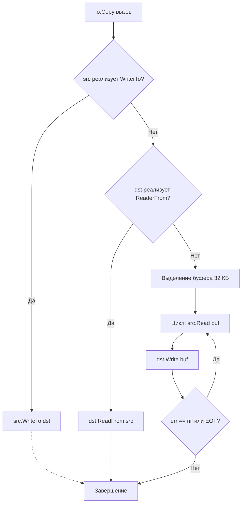

## Философия минимализма и композиции

Пакет `io` — это архитектурное сердце стандартной библиотеки Go. В то время как в других языках работа с потоками данных обросла сложными иерархиями классов и абстрактными фабриками, Go предлагает радикально простой подход: два метода, определяющие универсальный контракт обмена данными.

```go
type Reader interface {
    Read(p []byte) (n int, err error)
}

type Writer interface {
    Write(p []byte) (n int, err error)
}
```

Всего 24 байта в памяти (два указателя на таблицу методов и данные) определяют абстракцию, через которую проходит всё: чтение файлов, сетевых пакетов, парсинг JSON, работа с gzip и даже передача HTTP-запросов. 

> [!info] Под капотом
> Интерфейсы `io` спроектированы так, чтобы **не блокировать архитектуру**. Реализация может быть файлом, сетевым сокетом, буфером в памяти или генератором случайных чисел. Go не проверяет тип источника через `instanceof` или `type assertions` внутри ядра библиотек. Всё сводится к вызову метода через таблицу `itab`. Это позволяет писать обобщенные функции (например, `io.Copy`), которые работают с любым типом, реализующим контракт.

## Контракт: почему не int, а (n int, err error)

В C `read()` возвращает количество байтов или `-1` при ошибке. В Java `InputStream.read()` возвращает `int`, где `-1` означает EOF. Go делает это явно через кортеж возврата, что устраняет двусмысленность и позволяет обработать критический сценарий: **частичное чтение при наличии ошибки**.

Когда вы вызываете `r.Read(buf)`:
1. Функция пытается заполнить `buf`.
2. Если данные доступны, она пишет их и возвращает `n` (сколько записано).
3. Если поток закончился или произошел сбой, она возвращает `err`.

Важнейшее правило: **`n` и `err` независимы**. Функция может вернуть `n = 1024` и `err != nil` одновременно. Игнорирование `n` при ошибке приводит к потере данных.

## Под капотом: как работает io.Copy и оптимизация системных вызовов

Функция `io.Copy(dst, src)` — это стандартный способ передачи потоков. Но её реализация далека от наивного копирования.



### Механизм fallback-оптимизаций
Go проверяет наличие интерфейсов `WriterTo` и `ReaderFrom`. Если они есть, `io.Copy` делегирует передачу напрямую им. Это позволяет реализациям использовать системно-зависимые zero-copy механизмы.

Например, при копировании `*os.File` в `*net.Conn` на Linux, вызов может быть оптимизирован через системные вызовы `sendfile` или `splice`. Они передают данные напрямую между файловыми дескрипторами в ядре, **полностью минуя пользовательское пространство (User Space)** и избегая двойного копирования памяти (kernel -> user -> kernel).

```go
// Пример оптимизации в net/internal/poll (упрощенно)
// Если оба аргумента подходят, Go вызывает syscall.splice()
// Данные летят из сокетного буфера в сокет назначения, минуя RAM приложения.
```

## Mechanical Sympathy: буферы, кэш процессора и цена syscall

Почему `io.Copy` использует буфер в 32 КБ по умолчанию? Это не произвольное число, а результат калибровки под архитектуру современных ОС и CPU.

1.  **Страницы памяти Linux**: Размер страницы — 4 КБ. Буфер в 32 КБ = 8 страниц. Это оптимально для заполнения TCP-сокета без фрагментации пакетов.
2.  **Кэш-линии CPU**: Данные читаются линейно. Современные CPU предзагружают память (hardware prefetching) в кэш L1/L2. Буфер, выровненный по кратным размерам, минимизирует `cache miss`.
3.  **Цена системного вызова**: Каждый `read()`/`write()` — это переход Ring 3 -> Ring 0, сохранение регистров, очистка TLB. Слишком маленький буфер (например, 64 байта) заставит делать тысячи syscall на 1 МБ данных, уничтожая пропускную способность. Слишком большой (например, 1 МБ) вызовет `cache thrashing` (вытеснение полезных данных из кэша) и увеличит время блокировки горутины.

### Пример ручного чтения: как избежать аллокаций
```go
// ❌ Плохо: выделение нового буфера на каждой итерации
for {
    buf := make([]byte, 4096) // Аллокация в куче каждый цикл
    n, err := r.Read(buf)
    // ...
}

// ✅ Хорошо: переиспользование памяти
buf := make([]byte, 32*1024) // Выделяем ОДИН раз вне цикла
for {
    n, err := r.Read(buf)
    // Работаем с buf[:n]
    if err == io.EOF {
        break
    }
    if err != nil {
        return err
    }
}
```

> [!info] Под капотом
> При многократном чтении в одном и том же срезе `[]byte` Go не аллоцирует память повторно. Это критически для `GC`. Если вы создаете буфер внутри цикла, Escape Analysis отправит его в кучу, создавая давление на сборщик мусора. Вынос буфера наружу позволяет рантайму разместить его в куче один раз или даже оптимизировать до стека, если цикл короткий.

## Критическая ловушка: обработка io.EOF и частичных чтений

Это самый частый источник багов при переходе на Go. `io.EOF` **не является паникой или исключением**. Это обычный сигнал об окончании потока.

### Правило обработки EOF
```go
func readFully(r io.Reader) ([]byte, error) {
    var data []byte
    buf := make([]byte, 1024)
    
    for {
        n, err := r.Read(buf)
        
        // 1. Всегда обрабатываем прочитанные данные ДО проверки ошибки
        if n > 0 {
            data = append(data, buf[:n]...)
        }
        
        // 2. Только теперь проверяем err
        if err == io.EOF {
            break // Нормальное завершение
        }
        if err != nil {
            return nil, err // Реальная ошибка
        }
    }
    return data, nil
}
```

> [!warning] Ловушка / Gotcha
> Если вы напишете:
> `if err != nil { if err == io.EOF { break } ... }`
> Вы можете потерять последние байты, если `Read` вернул `n=5, err=io.EOF`. 
> **Всегда сначала `if n > 0 { process }`, потом `if err != nil { ... }`**.

## Композиция потоков без копирования данных

Сила `io` проявляется в декораторах. Они не копируют данные, а создают цепочку вызовов методов.

1. `io.LimitReader(r, n)`: Ограничивает чтение ровно `n` байтами. Идеально для защиты от DoS при чтении `Content-Length`.
2. `io.TeeReader(r, w)`: Читает из `r`, пишет всё в `w`, возвращает прочитанное. Полезно для логирования запросов или подсчета хешей на лету.
3. `io.MultiReader(readers...)`: Последовательно читает из нескольких источников, как из одного потока.
4. `io.MultiWriter(writers...)`: Пишет один раз, дублирует данные во все писатели (аналог `tee` в Linux).

```go
// Пример: подсчет SHA256 хеша файла на лету, без загрузки в память
func hashFile(path string) (string, error) {
    f, err := os.Open(path)
    if err != nil {
        return "", err
    }
    defer f.Close()
    
    h := sha256.New()
    // TeeReader читает из файла и параллельно пишет хешеру
    r := io.TeeReader(f, h)
    
    // Копируем в /dev/null, чтобы триггерить чтение всего файла
    if _, err := io.Copy(io.Discard, r); err != nil {
        return "", err
    }
    return fmt.Sprintf("%x", h.Sum(nil)), nil
}
```

## Сравнение с Java, C++ и PHP

| Аспект | Java `InputStream` | C++ `std::istream` | PHP Streams | Go `io.Reader` |
|--------|-------------------|-------------------|-------------|----------------|
| **Архитектура** | Наследование, `ByteArrayInputStream`, `FileInputStream`, декораторы через `FilterInputStream` | Итераторы, `streambuf`, шаблоны | Ресурс-дескрипторы `fopen`, `stream_context` | Интерфейс из 1 метода, композиция |
| **Обработка EOF** | Возвращает `-1` | Устанавливает `failbit/eofbit` | Возвращает `false`/`""` | Возвращает `io.EOF` (ошибку) |
| **Zero-Copy** | `FileChannel.transferTo` (NIO) | `std::filesystem` + mmap | `stream_copy_to_stream` | `io.Copy` + `sendfile`/`splice` (автоматически) |
| **Блокировка** | Часто синхронная, требует `CompletableFuture`/NIO для async | Синхронная по умолчанию | Синхронная, зависит от контекста | Синхронная, но планировщик Go паркует горутину, не блокируя OS thread |

> [!tip] Собеседование
> **Вопрос:** Почему в `io` пакете нет поддержки `context.Context` для отмены операций?
> **Ответ:** Пакет `io` абстрагирует *данные*, а не *срок жизни операций*. Добавление `context` в `Reader`/`Writer` нарушило бы обратную совместимость и усложнило бы композицию. Для отмены используют:
> 1. Сетевые таймауты: `net.Conn.SetDeadline` / `SetReadDeadline`.
> 2. Контекст в `http.Request.Context()` (обрабатывается `net/http`).
> 3. Прерывание чтения через закрытие соединения или сигнал от отдельной горутины (например, запись в `chan struct{}`).

## Хардкорные вопросы с собеседований

| Вопрос | Краткий ответ |
|--------|---------------|
| Что произойдет, если передать в `io.Copy` `nil`? | Паника: `runtime: invalid pointer dereference` при вызове интерфейсного метода. `io` не проверяет на `nil` из соображений производительности. |
| Может ли `Write` вернуть `n < len(p)` и `err == nil`? | Да, особенно при записи в неблокирующие сокеты или пайпы. Вызывающий код обязан проверить `n` и продолжить запись остатка. |
| Как реализовать `io.Reader`, который читает из `chan []byte`? | Через блокировку в `Read`: ждать данные из канала, копировать в `p`, вернуть `n` и `err`. При закрытии канала вернуть `io.EOF`. |
| Почему `io.ReadAll` может быть опасен в продакшене? | Он читает **всё** в память до EOF. Без `Content-Length` или `LimitReader` злоумышленник может отправить бесконечный поток, вызывая OOM. |

## Итог

1. **`io.Reader` и `io.Writer` — это контракты, а не классы.** Их минимализм позволяет компоновать любые источники данных.
2. **Всегда проверяйте `n` перед `err`.** Частичное чтение/запись с ошибкой — штатный сценарий.
3. **Используйте готовые утилиты.** `io.Copy`, `io.LimitReader`, `io.TeeReader` оптимизированы на уровне рантайма и поддерживают zero-copy fallback.
4. **Уважайте syscall и кэш.** Правильный размер буфера (32 КБ) и переиспользование памяти (`sync.Pool`) критически важны для высокой нагрузки.
5. **Контекст таймаутов лежит на уровне `net`.** `io` пакет работает синхронно, но не блокирует потоки ОС благодаря планировщику Go.

Понимание потоков `io` логически приводит нас к историческому изменению в стандартной библиотеке. Мы разберем, какие утилиты стали антипаттернами, чем их заменили и как правильно мигрировать легаси-код: [[5. io_ioutil устарел. Чем его заменили]].