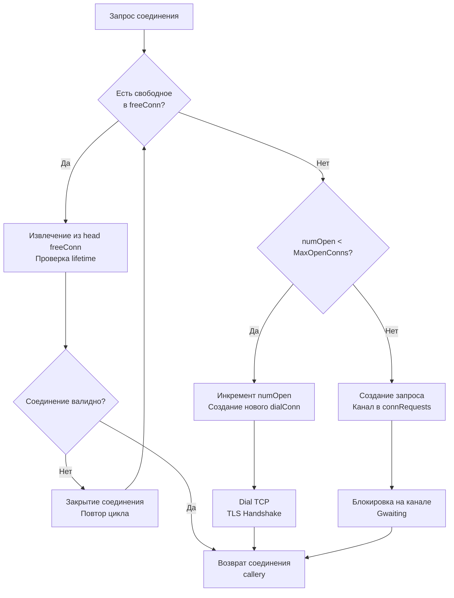

## Внутренняя механика пула и управление состоянием соединений

Пакет `database/sql` — это не просто обертка над протоколом драйвера. Это сложный, потокобезопасный менеджер состояний, который абстрагирует работу с сетевыми сокетами, таймаутами и пулом ресурсов. Для Senior-инженера критически важно понимать, что `*sql.DB` — это тяжелая структура, удерживающая мьютексы, каналы и очереди горутин.

В отличие от Python (где пулы часто вынесены во внешние библиотеки типа `SQLAlchemy` или `PgBouncer`), Go интегрирует пул прямо в процесс. Это дает низкую задержку (latency), но перекладывает ответственность за настройку `MaxOpenConns` и жизненный цикл соединений на разработчика.

> [!info] Под капотом
> Структура `sql.DB` содержит два основных поля для координации:
> 1. `freeConn`: слайс свободных (idle) соединений, готовых к использованию.
> 2. `connRequests`: очередь каналов, по которым горутины ожидают доступ к соединению.
>
> Когда вызывается `db.Query()`, рантайм пытается получить соединение из `freeConn`. Если его нет и лимит `MaxOpenConns` не достигнут, создается новое соединение в фоне, а горутина блокируется на канале. Это предотвращает блокировку системных потоков (M), переводя горутину в состояние `Gwaiting`.

## Under the hood: Стратегия получения соединения

Логика получения соединения (`DB.conn()`) строго детерминирована и оптимизирована под высокую конкуренцию:



### Проблема "Driver: bad connection"
Это ошибка возникает на уровне драйвера, когда `database/sql` пытается использовать соединение из пула, но оно уже закрыто (например, сервер БД перезагрузился или файрвол разорвал сессию). Пакет `database/sql` автоматически ретраит запрос: он закрывает "битое" соединение, удаляет его из пула и берет другое (или создает новое). Это делает обработку транзие́нтных ошибок прозрачной для кода, но добавляет задержку на повторный `dial`.

## Механика Транзакций и "Pin" соединения

Транзакция в Go (`*sql.Tx`) — это не просто SQL-команда `BEGIN`. Это логический контракт, который **привязывает (pins)** соединение из пула исключительно к этой транзакции до момента `Commit` или `Rollback`.

### Почему это критично для производительности?
Когда вы вызываете `db.BeginTx()`, пакет берет соединение из пула и помечает его как `txCtx`. В этот момент соединение **не может** быть использовано другими горутинами, даже если пул переполнен и другие запросы ждут в очереди `connRequests`.

1. **Блокировка ресурсов**: Долгая транзакция с бизнес-логикой (например, HTTP-запрос к внешнему API внутри транзакции) держит сетевое соединение занятым впустую. Это быстро приводит к истощению пула (`MaxOpenConns`) и dead-lock'у приложения.
2. **Изоляция**: Все запросы внутри `*sql.Tx` гарантированно выполняются на одном физическом сокете. Это обеспечивает консистентность snapshot'ов в MVCC базах данных (PostgreSQL, MySQL).

```go
// ❌ Антипаттерн: долгая операция внутри активной транзакции
tx, _ := db.BeginTx(ctx, nil)
// Соединение "захвачено". Другие горутины могут ждать его освобождения.
data, err := externalService.FetchData() // Сетевой вызов занимает 2 секунды
// ...
tx.Exec("UPDATE ...")
```

> [!warning] Ловушка / Gotcha
> **Утечка соединения при ошибке.**
> Если внутри транзакции происходит паника или ошибка, и вы забываете вызвать `tx.Rollback()`, соединение навсегда останется в состоянии "занято транзакцией". Оно не вернется в пул `freeConn`. Со временем пул иссякнет, и база данных перестанет отвечать.
> **Решение:** Всегда используйте `defer tx.Rollback()` сразу после `BeginTx()`. Если `Commit` пройдет успешно, `Rollback` станет no-op.

## Приготовленные выражения: Кэширование и нюансы

Вызов `db.Prepare(query)` создает объект `*sql.Stmt`, который кэширует подготовленное выражение. Однако здесь кроется сложность взаимодействия с пулом.

### Проблема привязки к соединению
В большинстве СУБД подготовленный запрос (`PREPARE stmt FROM ...`) живет только в рамках текущей сессии (соединения). Если соединение вернется в пул и будет взято другой горутиной, подготовленного запроса на нем может не быть.

Go решает эту проблему хитро:
1. `*sql.Stmt` хранит список соединений, на которых он был подготовлен.
2. При выполнении `Stmt.Exec()`, пакет пытается взять соединение, на котором `Stmt` уже подготовлен.
3. Если такого нет в пуле, берется любое свободное, и `Stmt` заново посылает `PREPARE` на это соединение.

Это означает, что использование `db.Prepare()` может приводить к "прилипанию" (sticky) соединений к конкретным запросам, что снижает эффективность перемешивания пула, но ускоряет выполнение за счет отсутствия повторного парсинга SQL на стороне сервера.

### `db.Prepare` vs `db.Query` с параметрами
Многие современные драйверы (например, `pgx`) поддерживают "implicit preparation" или передачу параметров напрямую в текстовом протоколе без явного `PREPARE`. В таких случаях вызов `db.Query("SELECT ... WHERE id = $1", id)` может быть быстрее, чем `db.Prepare`, так как он экономит один сетевой roundtrip на создание stmt, если запрос выполняется однократно.

## Mechanical Sympathy: Память, CPU и GC

### 1. Давление на Garbage Collector
Каждая строка результата (`rows.Next()`) требует выделения памяти для сканирования данных.
* Если вы сканируете в `string` или `[]byte`, Go выделяет память под эти данные в куче.
* Если вы сканируете 1 миллион строк в цикле без обработки, вы создадите 1 миллион объектов.
**Оптимизация:** Переиспользуйте переменные для сканирования.
```go
// ✅ Лучше: буферы переиспользуются
var name string
var email string
for rows.Next() {
    rows.Scan(&name, &email) // Scan перезаписывает значения, но не аллоцирует новые string-объекты, если драйвер оптимизирован
    // Однако, строки в Go иммутабельны, поэтому Scan все равно создаст новые string при копировании из []byte драйвера.
    // Для нулевых аллокаций используйте драйвер-специфичные методы чтения сырых байтов.
}
```

### 2. CPU и Парсинг SQL
Передача сырого SQL-текста в базу требует, чтобы сервер БД распарсил его, построил AST и сгенерировал план выполнения.
* `PREPARE` делает это один раз.
* `EXECUTE` только подставляет параметры.
При высокой нагрузке (`>10k RPS`) перенос парсинга из СУБД в момент `Prepare` снижает нагрузку на CPU базы данных, но увеличивает потребление памяти в Go-процессе для хранения состояния `Stmt`.

## Ловушки и вопросы с собеседований

| Сценарий | Проблема | Решение |
|----------|----------|---------|
| `MaxIdleConns` > `MaxOpenConns` | Пакет автоматически снижает `MaxOpenConns` до уровня `MaxIdleConns`. Логика пула ломается. | Настройте `MaxIdleConns <= MaxOpenConns`. Обычно ставят `MaxIdleConns` равным количеству ядер CPU или чуть больше. |
| Вложенные транзакции | `database/sql` не поддерживает вложенность нативно. | Используйте Savepoints (`SAVEPOINT sp1; ... ROLLBACK TO sp1;`) через `db.Exec()`. |
| `rows.Next()` без `Close()` | Если цикл прерван по ошибке или `break`, соединение остается заблокированным. | Всегда `defer rows.Close()`. Если нужно прервать чтение, `Close()` вернет соединение в пул. |
| `Stmt` и закрытие БД | При закрытии соединения, все подготовленные на нем stmts становятся невалидными. | `database/sql` обрабатывает это прозрачно, пересоздавая stmt при следующем вызове, но это стоит latency. |
| `Context` в `ExecContext` | Контекст отменяет запрос, но не откатывает транзакцию автоматически. | При отмене контекста в транзакции, нужно явно проверить `ctx.Err()` и вызвать `Rollback()`. |

> [!tip] Собеседование
> **Вопрос:** В чем разница между `sql.Conn` (Go 1.10+) и обычным использованием `db.Query()`?
> **Ответ:** `db.Query()` берет соединение из пула на время запроса и возвращает его сразу. `sql.Conn` (получаемый через `db.Conn(ctx)*) резервирует соединение из пула **насовсем**, пока не будет вызван `conn.Close()`. Это полезно для выполнения последовательности операций на одной сессии (например, `LOCK TABLES`, создание временных таблиц, сессийные переменные), где важно гарантировать, что между запросами соединение не будет отдано другой горутине. Это аналог резервирования соединения, но без начала транзакции.
>
> **Вопрос:** Как `database/sql` обрабатывает ситуацию, когда сервер БД перезагружается во время работы пула?
> **Ответ:** Соединения в пуле станут "bad". При следующей попытке использования, драйвер вернет ошибку `bad connection`. `database/sql` увидит эту ошибку, удалит соединение из пула и попытается создать новое. Для прозрачного восстановления важно, чтобы приложение обрабатывало ошибки и не кэшировало соединения вручную вне пула.

## Итог

1.  **Пул соединений — это сердце `database/sql`.** Настройте `MaxOpenConns` в зависимости от лимитов БД и `ulimit`.
2.  **Транзакции блокируют соединение.** Не выполняйте долгий код внутри `Tx`, чтобы не вызвать starvation пула.
3.  **Prepared Statements кэшируются** на уровне пула, но могут требовать повторной подготовки на новых соединениях. Используйте их для часто повторяющихся сложных запросов.
4.  **Всегда закрывайте `rows` и `tx`.** Используйте `defer` для защиты от утечек ресурсов.
5.  **Понимайте стоимость парсинга.** Для простых запросов `Query` с параметрами может быть быстрее `Prepare`. Для сложных — `Prepare` экономит CPU базы данных.
6.  **Обрабатывайте `bad connection`.** Пакет делает ретраи автоматически, но бизнес-логика должна быть готова к повторному выполнению запроса в случае транзие́нтных ошибок.

Освоив работу с базами данных, мы переходим к задачам упаковки и транспортировки файлов. Как эффективно работать с архивами ZIP и TAR, избегая загрузки огромных файлов в память и используя потоковую обработку? В следующей статье: [[41. archive_zip, tar и работа с архивами]].