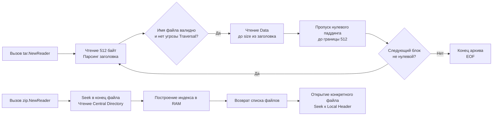

## Философия потоковой обработки и структура архивов

Пакеты `archive/zip` и `archive/tar` решают задачу упаковки множества файлов в единый поток данных. Важно сразу разделить понятия: **архив** — это контейнерная структура, описывающая метаданные и расположение файлов, а **компрессия** — это алгоритм сжатия байтов. Go строго разделяет эти домены: `archive/` отвечает за структуру и метаданные, `compress/` — за алгоритмы упаковки (gzip, flate, bzip2).

Для инженера уровня Senior работа с архивами — это прежде всего управление памятью и безопасностью. Наивная загрузка всего архива в RAM через `os.ReadFile` или `zip.Reader.File[i].Open()` без контроля размера ведет к Out-Of-Memory (OOM) при обработке больших артефактов или ZIP-бомб. Идиоматичный подход в Go строится исключительно на потоковой обработке (`io.Reader`/`io.Writer`), ленивом парсинге заголовков и строгой валидации путей.

## Under the hood: ZIP против TAR

Внутренняя организация форматов кардинально различается, что диктует разные стратегии парсинга.

### ZIP: Центральная директория и произвольный доступ
Формат ZIP спроектирован для быстрого чтения содержания без полного сканирования файла. Структура линейна:
1. **Local File Header + Data**: Заголовок и сжатые/несжатые данные каждого файла идут друг за другом.
2. **Central Directory**: Находится в **конце** файла. Содержит полные метаданные всех файлов, смещения к их Local Headers и комментарии.

`archive/zip` использует `io.ReaderAt` (обычно `*os.File`), чтобы перейти в конец файла, прочитать Central Directory, построить индекс в памяти и мгновенно отдавать список файлов без чтения данных. При вызове `f.Open()` происходит seek к смещению Local Header и потоковое чтение.

### TAR: Последовательный конкатенированный поток
TAR (Tape Archive) исторически создавался для магнитных лент. Это строго линейный формат:
1. **Header (512 байт)**: Метаданные файла, выровненные по границе.
2. **File Data**: Содержимое файла, дополненное нулями до кратности 512 байт.
3. **EOF Marker**: Два блока по 512 нулевых байт сигнализируют о конце архива.

`archive/tar` читает последовательно. Он не требует `io.ReaderAt` и работает с любым `io.Reader`, что делает его идеальным для сетевых потоков или пайпов.



> [!warning] Ловушка / Gotcha
> **Разница в требованиях к IO**.
> `archive/zip` **требует** `io.ReaderAt` для эффективной работы. Вы не можете создать `zip.Reader` из `net.Conn` или `io.Pipe` без предварительного копирования всего потока в `bytes.Buffer` или временный файл. `archive/tar` работает с потоками напрямую. При проектировании API загрузки архивов всегда выбирайте TAR для потоковой обработки неизвестного размера, или сохраняйте входящий поток во временный файл перед парсингом ZIP.

## Mechanical Sympathy: Потоки, выравнивание и защита от OOM

### 1. Аллокации и давление на GC
При парсинге архива `archive/tar` и `archive/zip` выделяют память под заголовки и структуры метаданных. Если архив содержит миллионы мелких файлов, это создает значительный `GC pressure`. 
**Оптимизация:** Не сохраняйте весь список файлов в слайс, если он не нужен. Итеративно обрабатывайте файлы, обнуляя ссылки на заголовки после обработки, чтобы сборщик мог их утилизировать.

### 2. Выравнивание и syscall
TAR строго выравнивает данные по 512 байт. При чтении это означает, что каждый `Read()` возвращает данные блоками. Прямое копирование в `os.File` без `bufio` приведет к тысячам мелких syscall `write`. 
**Решение:** Оборачивайте `tar.Reader` в `bufio.Reader`, а целевой файл — в `bufio.Writer`. Это амортизирует стоимость переходов в Kernel Space.

### 3. Защита от ZIP-бомб и Traversal
ZIP-бомба — это архив с мизерным размером на диске, но гигантским `UncompressedSize` в заголовке. Если приложение слепо вызывает `io.Copy`, оно быстро исчерпает дисковое пространство или RAM.
Путь `../../../etc/passwd` в имени файла позволяет атакующему перезаписать системные файлы. Стандартные библиотеки **не защищают** от этого автоматически.

## Идиомы производства: Безопасное создание и извлечение

### Безопасное извлечение TAR
```go
func extractTar(ctx context.Context, r io.Reader, destDir string) error {
    tr := tar.NewReader(r)
    
    for {
        header, err := tr.Next()
        if err == io.EOF {
            break
        }
        if err != nil {
            return fmt.Errorf("tar next: %w", err)
        }
        
        // 1. Защита от Path Traversal
        target := filepath.Join(destDir, header.Name)
        if !strings.HasPrefix(filepath.Clean(target), filepath.Clean(destDir)) {
            return errors.New("tar: illegal path traversal detected")
        }
        
        // 2. Защита от Symlink атак
        if header.Typeflag == tar.TypeSymlink || header.Typeflag == tar.TypeLink {
            return errors.New("tar: symlinks are not allowed")
        }
        
        switch header.Typeflag {
        case tar.TypeDir:
            if err := os.MkdirAll(target, os.FileMode(header.Mode)); err != nil {
                return fmt.Errorf("mkdir: %w", err)
            }
        case tar.TypeReg:
            f, err := os.OpenFile(target, os.O_CREATE|os.O_WRONLY, os.FileMode(header.Mode))
            if err != nil {
                return fmt.Errorf("open file: %w", err)
            }
            
            // 3. Защита от ZIP/TAR бомб
            if _, err := io.CopyN(f, tr, header.Size); err != nil {
                f.Close()
                return fmt.Errorf("copy file: %w", err)
            }
            f.Close()
        }
    }
    return nil
}
```

### Создание ZIP в память или поток
```go
func createZip(w io.Writer, files map[string][]byte) error {
    zw := zip.NewWriter(w)
    defer zw.Close() // Закрывает центральную директорию в конце
    
    for name, data := range files {
        // Создание заголовка без компрессии (Store) или с Deflate
        fw, err := zw.Create(name)
        if err != nil {
            return fmt.Errorf("create zip entry: %w", err)
        }
        
        if _, err := fw.Write(data); err != nil {
            return fmt.Errorf("write data: %w", err)
        }
    }
    // defer zw.Close() запишет Central Directory и flush
    return nil
}
```

## Ловушки и вопросы с собеседований

| Сценарий | Проблема | Решение |
|----------|----------|---------|
| Игнорирование `zw.Close()` | Файл ZIP не завершается, Central Directory не записывается. Архив поврежден. | Всегда `defer zw.Close()` или вызывайте явно перед возвратом `io.Writer`. |
| Парсинг ZIP из `net.Conn` | `zip.NewReader` требует `io.ReaderAt`. Коннект не поддерживает seek. | Сохраняйте поток во временный файл (`os.CreateTemp`) или используйте `io.TeeReader` с `bytes.Buffer` (если объем известен и мал). |
| Потеря прав доступа | `header.Mode` содержит биты типа файла. Прямая передача в `os.Mkdir` может сломать логику. | Используйте `os.FileMode(header.Mode & 0777)` для маскировки типовых битов перед созданием. |
| `archive/zip` и большие файлы (>4GB) | Стандартный ZIP не поддерживает файлы >4ГБ без расширения Zip64. | Go `archive/zip` автоматически включает Zip64 при необходимости. Убедитесь, что парсер на клиентской стороне также поддерживает Zip64. |
| `tar.Reader.Next()` возвращает ошибку | Поток оборван или поврежден паддинг. | Обрабатывайте `io.EOF` как нормальное завершение. Любые другие ошибки считайте критическими и останавливайте обработку. |

> [!tip] Собеседование
> **Вопрос:** Почему `zip.NewReader` принимает `io.ReaderAt`, а не `io.Reader`?
> **Ответ:** Структура ZIP хранит индекс файлов (Central Directory) в самом конце архива. Чтобы не читать весь файл последовательно в поисках заголовков, `zip.Reader` делает `Seek` в конец, читает индекс и строит карту смещений. `io.ReaderAt` предоставляет метод `ReadAt(p []byte, off int64)`, позволяющий читать произвольные участки без изменения состояния потока. `io.Reader` поддерживает только последовательное чтение.
>
> **Вопрос:** Как безопасно извлечь архив, если имена файлов закодированы в нестандартной кодировке (например, Windows-1251)?
> **Ответ:** `archive/tar` и `archive/zip` ожидают UTF-8. Для legacy-архивов используйте сторонние библиотеки или кастомный парсер, который транслирует байты имени через `charmap` перед вызовом `filepath.Join`. Никогда не передавайте сырые байты в `os.Open` без валидации.

## Сравнение с экосистемами других языков

| Язык | Механизм | Особенности в сравнении с Go |
|------|----------|------------------------------|
| **Python** | `zipfile`, `tarfile` | Автоматически детектируют компрессию. `tarfile.open(mode='r:*')` удобен, но GIL блокирует параллельную обработку. Go разделяет `archive/` и `compress/`. |
| **Java** | `java.util.zip`, `java.nio.file` | Использует `ZipInputStream`/`ZipFile`. Требует явного закрытия каждого `ZipEntry`. Высокий boilerplate и объекты-обертки. |
| **C** | `libarchive` | Мощная, поддерживает десятки форматов. Требует ручного управления памятью и сборки из исходников. Go предоставляет нативную, безопасную альтернативу. |
| **Go** | `archive/zip`, `archive/tar` | Чистый Go, нулевые зависимости, строгая типизация, интеграция с `io` пакетом. Идеален для микросервисов и CI/CD пайплайнов. |

## Итог

1. `archive/zip` требует `io.ReaderAt` для произвольного доступа к Central Directory. `archive/tar` работает с последовательными потоками `io.Reader`.
2. Никогда не загружайте архивы полностью в память. Используйте потоковую обработку через `io.Copy` и `tar.Reader`/`zip.Reader`.
3. Всегда валидируйте пути на наличие `..` (Path Traversal) и запрещайте симлинки при извлечении в продакшене.
4. Контролируйте `header.Size` перед копированием данных, чтобы защититься от архивов-бомб.
5. Закрывайте `zip.Writer` явно для записи Central Directory. Не полагайтесь на GC для финализации архива.
6. Разделяйте домены: `archive/` отвечает за упаковку файлов, `compress/` — за алгоритмы сжатия байтов.

Разобрав контейнерные форматы, мы переходим к алгоритмам сжатия, которые экономят место на диске и полосу пропускания сети. Как работают DEFLATE, ZLIB и GZIP под капотом, почему они используют скользящее окно и как интегрировать их в HTTP-потоки без лишних аллокаций? В следующей статье: [[42. compress_gzip, zlib, flate]].