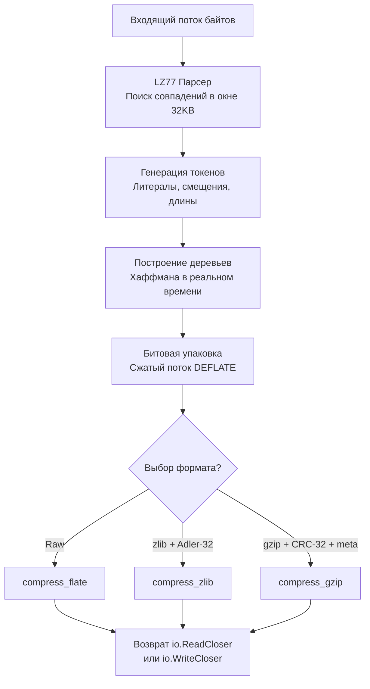

## Философия потокового сжатия и семейство DEFLATE

Пакеты `compress/flate`, `compress/zlib` и `compress/gzip` в Go реализуют не три разных алгоритма, а три оберточных формата над одним и тем же ядром: **DEFLATE** (RFC 1951). Разделение обусловлено историческими и протокольными требованиями. `flate` предоставляет сырой поток данных, `zlib` добавляет контрольную сумму Adler-32 и минимальный заголовок, а `gzip` оборачивает DEFLATE в формат, совместимый с HTTP и веб-инфраструктурой, добавляя CRC-32, метаданные и согласование кодировок.

Для бэкенд-разработчика понимание этих пакетов критично не столько для создания архивов, сколько для реализации HTTP-сжатия ответов, оптимизации передачи логов, снижения нагрузки на сеть и управления балансом CPU/RAM в микросервисной архитектуре.

> [!info] Под капотом
> Все три пакета работают в **потоковом режиме** (`io.ReadCloser` / `io.WriteCloser`). Они не требуют загрузки всего контента в память. Данные кодируются и декодируются чанками по мере поступления, что позволяет сжимать гигабайтные логи или видеопотоки с фиксированным потреблением RAM, пропорциональным только размеру внутреннего буфера и скользящего окна.

## Under the hood. Алгоритм DEFLATE: LZ77 и Хаффман

Ядро DEFLATE комбинирует два этапа сжатия, каждый из которых устраняет определенный тип избыточности:

1. **LZ77 (Скользящее окно)**: Алгоритм ищет повторяющиеся последовательности байтов в последних 32 КБ данных. Найденное совпадение заменяется на пару `<смещение, длина>` (back-pointer). Это устраняет пространственную избыточность.
2. **Кодирование Хаффмана**: Полученные токены (литералы, смещения, длины) анализируются по частоте встречаемости. Частым символам присваиваются короткие битовые коды, редким — длинные. Это устраняет статистическую избыточность.



Внутренний парсер поддерживает размер окна строго в 32 КБ, что идеально ложится на размер кэш-линий L2 современных CPU. Поиск совпадений выполняется последовательно, что позволяет аппаратному предзагрузчику (`prefetcher`) эффективно подтягивать данные из памяти, минимизируя `cache miss`.

## Различия пакетов: flate, zlib, gzip

| Пакет | Заголовок | Контрольная сумма | Метаданные | Основное применение |
|-------|-----------|-------------------|------------|---------------------|
| `compress/flate` | Отсутствует | Нет | Нет | Внутренние бинарные протоколы, кастомные форматы |
| `compress/zlib` | 2 байта (CMF/FLG) | Adler-32 (4 байта) | Нет | PNG изображения, сетевые протоколы (SSH, HTTP/2 HPACK) |
| `compress/gzip` | 10+ байт (Magic, метод, флаги, mtime) | CRC-32 (4 байта) | Имя файла, комментарии, ОС | HTTP `Content-Encoding: gzip`, архивация логов, веб-статика |

> [!warning] Ловушка / Gotcha
> **Путаница в форматах при декодировании.**
> Попытка распаковать `gzip` поток через `zlib.NewReader` или `flate.NewReader` приведет к ошибке `invalid header` или `unexpected EOF`. Форматы не взаимозаменяемы. Для HTTP-трафика всегда используйте `compress/gzip`. Для работы с заголовками HTTP/2 или PNG выбирайте `zlib`. `flate` применяется только когда вы контролируете оба конца канала и хотите сэкономить 6-14 байт оверхеда.

## Mechanical Sympathy: CPU, кэш-линии и уровни сжатия

Сжатие — это классический trade-off между тактами процессора и пропускной способностью сети.

### 1. Уровни компрессии и нелинейная стоимость
Go поддерживает уровни от `flate.NoCompression` (0) до `flate.BestCompression` (9). По умолчанию используется `flate.DefaultCompression` (-1, эквивалент 6).
* **Уровни 1-3**: Быстрый LZ77 с ограниченным поиском совпадений. CPU нагрузка низкая, степень сжатия приемлемая. Идеально для HTTP-ответов в реальном времени.
* **Уровни 7-9**: Глубокий поиск совпадений, сложные деревья Хаффмана. CPU нагрузка растет экспоненциально, выигрыш в размере — маргинальный (1-3%). Неприменимо для hot-path, оправдано только для cold-storage или фоновой архивации.

### 2. Влияние на GC и пулы в HTTP
Создание `gzip.NewWriter` аллоцирует буферы, таблицы Хаффмана и структуры состояний. При 10k+ RPS это создает фоновое давление на GC. В `net/http` этот вопрос решается через `sync.Pool`:
```go
// Пример внутреннего паттерна http.Handler
var gzipPool = sync.Pool{
    New: func() interface{} {
        return gzip.NewWriter(nil)
    },
}

func gzipMiddleware(next http.Handler) http.Handler {
    return http.HandlerFunc(func(w http.ResponseWriter, r *http.Request) {
        if !strings.Contains(r.Header.Get("Accept-Encoding"), "gzip") {
            next.ServeHTTP(w, r)
            return
        }
        
        w.Header().Set("Content-Encoding", "gzip")
        gz := gzipPool.Get().(*gzip.Writer)
        defer gzipPool.Put(gz)
        
        gz.Reset(w)
        defer gz.Close() // Обязательно! Финализирует поток и CRC
        
        gw := &gzipResponseWriter{ResponseWriter: w, Writer: gz}
        next.ServeHTTP(gw, r)
    })
}
```
`Reset(w)` переиспользует выделенную память, обнуляя состояние без новой аллокации. Это сокращает GC-паузы и ускоряет инициализацию на 40-60%.

## Идиомы использования: потоки, буферы и обязательное закрытие

### Правильная запись с проверкой ошибок
```go
func compressToFile(inputPath, outputPath string) error {
    in, err := os.Open(inputPath)
    if err != nil {
        return fmt.Errorf("open source: %w", err)
    }
    defer in.Close()
    
    out, err := os.Create(outputPath)
    if err != nil {
        return fmt.Errorf("create target: %w", err)
    }
    
    gz := gzip.NewWriter(out)
    // defer gz.Close() вызывается ПЕРЕД проверкой err записи, 
    // но после defer out.Close(). Порядок важен для корректного flush.
    defer func() {
        if closeErr := gz.Close(); closeErr != nil && err == nil {
            err = fmt.Errorf("close gzip: %w", closeErr)
        }
        if closeErr := out.Close(); closeErr != nil && err == nil {
            err = fmt.Errorf("close file: %w", closeErr)
        }
    }()
    
    if _, err = io.Copy(gz, in); err != nil {
        return fmt.Errorf("compress data: %w", err)
    }
    
    return nil
}
```

> [!info] Под капотом
> **Почему `Close()` обязателен?**
> Потоки сжатия буферизируют данные и не записывают финальную контрольную сумму (CRC-32 или Adler-32) до явного завершения. Вызов `Close()` выполняет три действия: сбрасывает оставшиеся байты из внутреннего буфера, вычисляет и записывает чексумм, записывает маркер конца потока (EOB). Без `Close()` файл или ответ будут технически повреждены и не распакуются валидатором.

## Ловушки и вопросы с собеседований

| Сценарий | Проблема | Решение |
|----------|----------|---------|
| Забытый `gz.Close()` или `gz.Flush()` | Контрольная сумма не записана. Артефакт считается битым. `Content-Length` не совпадает. | Всегда `defer gz.Close()`. Для HTTP стриминга используйте `gz.Flush()` для отправки чанков. |
| Конкурентный доступ к одному Writer | Состояние LZ77 и таблицы Хаффмана портятся. Выходные данные — мусор или паника. | `gzip.Writer` **не потокобезопасен**. Используйте `sync.Pool` или создавайте экземпляр на запрос/горутину. |
| `gzip.NewReader` на пустом потоке | Возвращает ошибку `unexpected EOF` при первом `Read()`. | Проверяйте `io.EOF` или размер входных данных перед инициализацией. |
| Высокий уровень сжатия в API | Увеличение p99 latency из-за блокировки CPU на 10-50 мс. | Используйте `gzip.HuffmanOnly` или `flate.BestSpeed` для веб-ответов. Сжатие >6 оправдано только для статики на диске. |
| `flate.ErrDictionary` | Возникает при использовании динамических словарей (редкий сценарий). | Стандартные HTTP-сценарии не используют словари. Если возникает ошибка, проверьте, что вы не передаете `flate.NewWriterDict` без согласования с декодером. |

> [!tip] Собеседование
> **Вопрос:** Как HTTP/2 и HTTP/3 изменили необходимость сжатия gzip на уровне приложения?
> **Ответ:** HTTP/2 ввел HPACK (сжатие заголовков), но тело по-прежнему сжимается через gzip/br/zstd. HTTP/3 (QUIC) использует QPACK и полагается на встроенное шифрование, которое само по себе обладает свойствами компрессии. Тем не менее, gzip/br/zstd остаются стандартом для тел ответов, так как алгоритмы сжатия данных работают с семантикой текста, а не с криптографическими блоками. Go стандартная библиотека остается актуальной, но современные стеки чаще используют `compress/brotli` или `zstd` для лучшего ratio/CPU баланса.
>
> **Вопрос:** Почему `compress/gzip` не поддерживает многопоточное сжатие одного потока?
> **Ответ:** Алгоритм DEFLATE последователен по своей природе. LZ77 зависит от предыдущих 32 КБ, а деревья Хаффмана строятся на лету. Параллелизация требует разбивки потока на независимые чанки, что ломает глобальный поиск совпадений и увеличивает размер из-за дублирования заголовков. Для параллельного сжатия больших файлов используйте внешние утилиты (`pigz`) или кастомную логику разбиения на уровне приложения.

## Итог

1. `flate`, `zlib`, `gzip` используют одно ядро DEFLATE, но различаются заголовками и контрольными суммами. Выбирайте пакет под протокол.
2. Сжатие потоковое. Не загружайте данные целиком в память. Используйте `io.Copy` между `os.File` и `gzip.Writer`.
3. `gz.Close()` обязателен. Без него чексумма не записывается, поток считается поврежденным.
4. В HTTP-микросервисах используйте `sync.Pool` для переиспользования писателей и снизьте уровень сжатия до 1-3 для минимизации latency.
5. `gzip.Writer` не потокобезопасен. Конкурентный доступ без синхронизации приводит к повреждению данных.
6. Для архивации холодных данных используйте `BestCompression`, для веб-трафика — `BestSpeed` или `DefaultCompression`.

Освоив сжатие данных, мы переходим к взаимодействию Go-приложения с внешним миром через операционную систему. Как безопасно запускать внешние процессы, управлять их стандартными потоками, передавать контекст отмены и избегать утечек дескрипторов? В следующей статье разберем пакет для системного взаимодействия: [[43. os_exec. Запуск внешних процессов]].