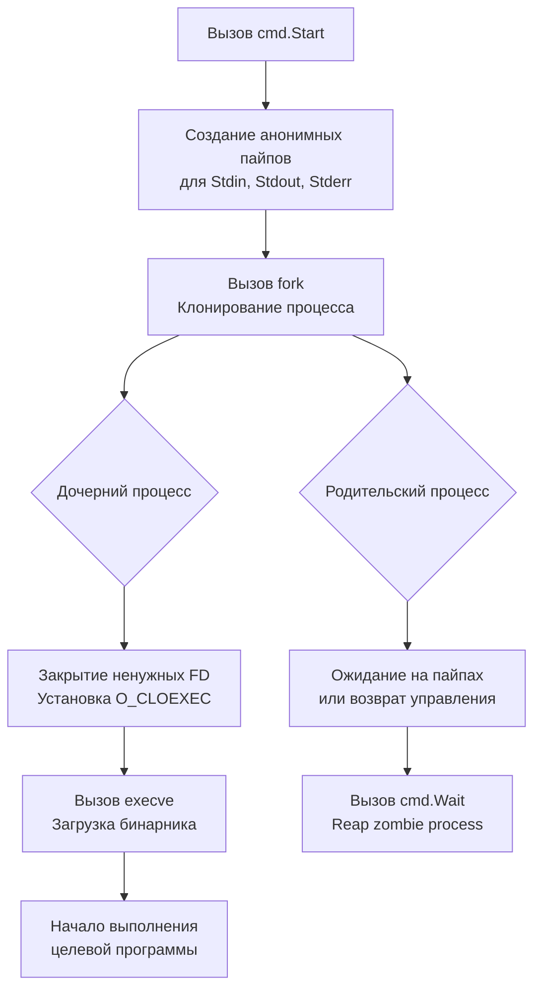

## Философия изоляции и контроля процессов

Пакет `os/exec` предоставляет стандартизированный интерфейс для запуска внешних программ из Go-приложения. В отличие от языков, где взаимодействие с ОС часто делегируется сторонним библиотекам или требует работы с низкоуровневыми API, Go интегрирует управление процессами в стандартную библиотеку, следуя принципам явности, безопасности и предсказуемости.

Запуск дочернего процесса — это архитектурно тяжелая операция. Она требует создания нового адресного пространства, настройки каналов межпроцессного взаимодействия, маппинга файловых дескрипторов и координации сигналов ОС. Пакет `os/exec` абстрагирует эту сложность, но оставляет разработчику полный контроль над жизненным циклом, таймаутами и безопасностью. Для Senior-инженера понимание внутренней механики обязательно: ошибки при работе с `exec` приводят к зависшим процессам, утечкам памяти, deadlock'ам из-за переполнения буферов пайпов и критическим уязвимостям инъекций.

> [!info] Под капотом
> На POSIX-системах `exec.Command` транслируется в системные вызовы `fork` и `execve`. Go использует `syscall.ForkExec`, который клонирует текущий процесс, настраивает перенаправление стандартных потоков через анонимные пайпы (`pipe2` с флагом `O_CLOEXEC`), закрывает все унаследованные дескрипторы кроме 0,1,2 и переданных явно, а затем заменяет адресное пространство целевым бинарным файлом. На Windows используется `CreateProcessW` с аналогичной логикой наследования хендлов.

## Under the hood: fork, execve и наследование дескрипторов

Когда вы создаете `cmd := exec.Command("ls", "-l")`, структура `exec.Cmd` не запускает процесс. Она лишь конфигурирует параметры запуска: путь к исполняемому файлу, аргументы, переменные окружения, рабочие директории и перенаправление потоков.

При вызове `cmd.Run()` или `cmd.Start()` происходит следующая последовательность:



**Ключевой аспект безопасности:** Go по умолчанию закрывает все файловые дескрипторы родительского процесса, кроме стандартных (0,1,2) и явно переданных через `cmd.ExtraFiles`. Это предотвращает утечку сокетов, файловых указателей и секретов в дочерний процесс, что часто упускается в C/Python реализациях.

## Mechanical Sympathy: Пайпы, буферы и блокировки

Понимание стоимости создания процесса и работы с его потоками критично для стабильности высоконагруженных систем.

### 1. Лимит буферов пайпов
Анонимные пайпы в Linux имеют фиксированный буфер ядра размером 64 КБ (настраивается через `fs.pipe-max-size`, но обычно остается 64K). Если дочерний процесс записывает в `stdout` больше данных, чем буфер, а родительский процесс не читает из него, вызов `write` в дочернем процессе блокируется. Это приводит к зависанию дочерней программы и deadlock'у.

### 2. Стоимость fork и COW
Системный вызов `fork` не копирует физическую память родителя. Используется стратегия Copy-On-Write: страницы памяти помечаются как общие, и копируются только при модификации. Однако для Go-процессов с большим heap (сотни мегабайт), `fork` все равно требует настройки таблиц страниц MMU и копирования структур рантайма, что занимает миллисекунды. В tight-loop сценариях создание процессов через `exec` недопустимо; используйте пулы или встроенные библиотеки.

### 3. Reaping зомби-процессов
При завершении дочернего процесса ядро не удаляет его запись из таблицы процессов сразу. Она переходит в состояние `Zombie`, сохраняя код возврата. Только вызов `wait4` (или `Wait()` в Go) читает этот статус и освобождает ресурсы. Игнорирование `cmd.Wait()` приводит к накоплению зомби и исчерпанию лимита PID (`pid_max`).

## Идиомы безопасности и управление жизненным циклом

### Запрет на `sh -c` и инъекции
Никогда не передавайте пользовательский ввод в аргументы оболочки.

```go
// ❌ ОПАСНО: Shell injection vulnerability
// cmd := exec.Command("sh", "-c", "grep "+userInput+" /var/log/app.log")

// ✅ БЕЗОПАСНО: Прямой вызов бинарника
cmd := exec.Command("grep", userInput, "/var/log/app.log")
```
`exec.Command` разделяет аргументы на массив строк. Если `userInput` содержит пробелы или спецсимволы, они передаются как литералы, а не парсятся оболочкой.

### Контекст, таймауты и graceful termination
Используйте `exec.CommandContext` для интеграции с `context.Context`. При отмене контекста или истечении таймаута, Go автоматически посылает процессу `SIGKILL` (на Unix) или `TerminateProcess` (на Windows).

```go
func runExternalTask(ctx context.Context, timeout time.Duration, args []string) error {
    // Создаем контекст с таймаутом
    ctx, cancel := context.WithTimeout(ctx, timeout)
    defer cancel() // Гарантирует очистку ресурсов даже при раннем возврате
    
    cmd := exec.CommandContext(ctx, "my-worker", args...)
    
    // Перенаправляем вывод в буфер (осторожно с большими объемами!)
    var stdout, stderr bytes.Buffer
    cmd.Stdout = &stdout
    cmd.Stderr = &stderr
    
    if err := cmd.Run(); err != nil {
        // cmd.Run возвращает *exec.ExitError при ненулевом коде завершения
        if exitErr, ok := err.(*exec.ExitError); ok {
            return fmt.Errorf("process failed with code %d: %s", 
                exitErr.ExitCode(), stderr.String())
        }
        // Контекст отменен или ошибка запуска
        return fmt.Errorf("execution error: %w", err)
    }
    return nil
}
```

> [!warning] Ловушка / Gotcha
> **`cmd.Run()` блокирует до завершения процесса.** Если дочерняя программа генерирует гигабайты вывода, `bytes.Buffer` аллоцирует всю память в куче, вызывая OOM. Для больших потоков используйте `io.Pipe` или прямую запись в `os.File`, читая данные в отдельной горутине, чтобы избежать переполнения буфера ядра.

## Конкурентная работа с потоками без deadlock

Когда вам нужно одновременно читать `stdout` и `stderr`, или писать в `stdin`, а затем читать вывод, нельзя использовать методы `Output()` или `CombinedOutput()`. Они блокируют один поток. Правильный подход: асинхронное чтение через горутины.

```go
func runConcurrent(cmd *exec.Cmd) error {
    stdout, _ := cmd.StdoutPipe()
    stderr, _ := cmd.StderrPipe()
    
    if err := cmd.Start(); err != nil {
        return fmt.Errorf("start: %w", err)
    }
    
    // Чтение в отдельных горутинах, чтобы не блокировать пайпы
    var wg sync.WaitGroup
    wg.Add(2)
    
    go func() {
        defer wg.Done()
        io.Copy(os.Stdout, stdout)
    }()
    go func() {
        defer wg.Done()
        io.Copy(os.Stderr, stderr)
    }()
    
    // Ожидание завершения процесса и горутин
    cmd.Wait()
    wg.Wait()
    return nil
}
```

## Ловушки и хардкорные вопросы с собеседований

| Сценарий | Проблема | Решение |
|----------|----------|---------|
| `cmd.Run()` без контекста | Процесс может зависнуть навсегда. Таймауты ОС не спасают. | Всегда используйте `exec.CommandContext` с `context.WithTimeout`. |
| Игнорирование `cmd.Wait()` после `cmd.Start()` | Накопление zombie-процессов, утечка PID. | Вызывайте `Wait()` в `defer` или явно после логики. |
| Запись в `cmd.Stdin` и чтение из `cmd.Stdout` в одной горутине | Deadlock при заполнении 64KB буфера ядра. | Используйте отдельные горутины или `io.Pipe` для асинхронной перекачки. |
| `exec.Command` с пустым путем | Паника `exec: "" is not an absolute path`. | Всегда указывайте абсолютный путь или бинарник из `$PATH`. Проверяйте `exec.LookPath` для валидации. |
| Наследование окружения | Дочерний процесс получает все ENV родительского (секреты, токены). | Используйте `cmd.Env = []string{...}` для явного whitelist окружения. |

> [!tip] Собеседование
> **Вопрос:** В чем разница между `exec.ExitError` и обычным `error`?
> **Ответ:** `exec.ExitError` возвращается, когда процесс завершился успешно на уровне ОС, но вернул ненулевой exit code. Обычный `error` означает, что процесс не удалось запустить (файл не найден, нет прав, контекст отменен до старта). Всегда приводите тип ошибки к `*exec.ExitError` для получения `ExitCode()` и логики graceful fallback.
>
> **Вопрос:** Как отменить запущенный процесс "мягко", а не через `SIGKILL`?
> **Ответ:** `exec.CommandContext` по умолчанию шлет `SIGKILL` при отмене. Для graceful shutdown используйте `cmd.Process.Signal(syscall.SIGTERM)` вручную, затем ждите `cmd.Wait()` с таймаутом. Если процесс не ответил, шлите `SIGKILL`. Стандартная библиотека не предоставляет "мягкой" отмены из коробки ради предсказуемости, но это легко реализуется поверх `Process.Signal`.

## Сравнение с экосистемами других языков

| Язык | Механизм | Особенности в сравнении с Go |
|------|----------|------------------------------|
| **Python** | `subprocess.run` / `Popen` | `shell=True` по умолчанию опасен. GIL блокирует асинхронные операции. `communicate()` буферизует всё в RAM. Go безопаснее и быстрее благодаря горутинам. |
| **Java** | `ProcessBuilder` | Требует ручного чтения `InputStream` в потоках для избежания deadlock. Вербоен, требует `waitFor()` и проверки `exitValue()`. Go лаконичнее. |
| **Node.js** | `child_process.spawn` / `exec` | Event-loop асинхронность. Буферы растут в V8 heap. Сложнее управлять сигналом завершения без сторонних библиотек (`tree-kill`). |
| **Go** | `os/exec` | Блокирующий API поверх асинхронных горутин, безопасный по умолчанию (закрытие FD), интеграция с `context`, явное управление пайпами и сигналами. |

## Итог

1. `os/exec` абстрагирует `fork/execve` и `CreateProcess`, обеспечивая безопасное наследование и закрытие файловых дескрипторов.
2. Всегда используйте `exec.CommandContext` с таймаутами. Не запускайте процессы без контроля времени жизни.
3. Избегайте `sh -c`. Передавайте аргументы как слайс строк для защиты от инъекций.
4. `cmd.Run()` блокирует выполнение. Для больших потоков используйте `cmd.Start()`, `cmd.StdoutPipe()` и асинхронное чтение в горутинах.
5. Никогда не игнорируйте `cmd.Wait()`. Это необходимо для reaping zombie-процессов и освобождения ресурсов ОС.
6. Контролируйте окружение через `cmd.Env`. Не передавайте секреты родителя дочерним процессам по умолчанию.

Освоив запуск внешних процессов, мы спускаемся на уровень ниже, к прямым системным вызовам и взаимодействию с ядром. Как Go обертывает `syscall`, зачем нужен пакет `golang.org/x/sys` и как безопасно работать с платформенно-зависимыми API без потери переносимости? В следующей статье мы разберем низкоуровневые механизмы ОС: [[44. syscall и golang_org_x_sys. Работа с ОС на низком уровне]].