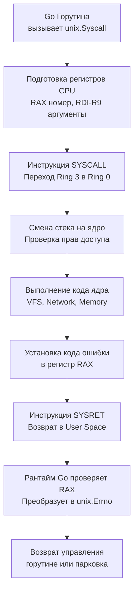

## Философия прямого взаимодействия с ядром и эволюция пакетов

Пакет `syscall` исторически предоставлял доступ к системным вызовам Linux, Windows и других ОС напрямую из стандартной библиотеки. Однако с развитием Go команда разработки приняла жесткое решение: заморозить `syscall` и перенести все низкоуровневые взаимодействия в репозиторий `golang.org/x/sys`. Это не просто рефакторинг, а фундаментальный сдвиг в архитектуре. Стандартная библиотека должна оставаться стабильной и переносимой, а API ядра ОС меняется слишком быстро, чтобы фиксировать его в основном репозитории языка.

Для инженера уровня Senior понимание этой эволюции обязательно. Прямые системные вызовы — это мост в Ring 0, где нет защиты GC, нет безопасных абстракций и любая ошибка ведет к панике рантайма или повреждению состояния процесса. Использование `golang.org/x/sys/unix` (и смежных подпакетов) стало отраслевым стандартом для написания драйверов, сетевых ускорителей, контейнерных рантаймов и профайлеров.

> [!info] Под капотом
> При вызове функции из `golang.org/x/sys/unix` компилятор генерирует код, подготавливающий регистры процессора согласно ABI операционной системы. На Linux x86_64 номер системного вызова помещается в `RAX`, аргументы в `RDI`, `RSI`, `RDX`, `R10`, `R8`, `R9`. Затем выполняется инструкция `SYSCALL`. Процессор переключается из режима пользователя (Ring 3) в режим ядра (Ring 0), сохраняет контекст, выполняет привилегированную операцию и возвращает результат в `RAX`. Рантайм Go автоматически интерпретирует отрицательные значения `RAX` как коды ошибок и преобразует их в тип `unix.Errno`.

## 1. Под капотом: Механика системного вызова в рантайме

В отличие от C, где системные вызовы оборачиваются через `libc` (glibc/musl), Go вызывает ядро напрямую. Это исключает overhead динамического линковщика, но требует, чтобы рантайм вручную управлял состоянием горутин во время блокирующих операций.



Когда горутина выполняет блокирующий системный вызов (например, `unix.Read` на обычном файле), рантайм не может просто заблокировать системный тред (M), иначе остальные горутины на этом P останутся без выполнения. Происходит механизм **Hand-off**:
1. Рантайм вызывает `runtime.entersyscall`, помечая тред как занятый syscall.
2. Если в локальной очереди P есть готовые горутины, рантайм создает или берет из пула новый тред M.
3. Горутина переводится в `Gwaiting`. Планировщик продолжает выполнять другие задачи.
4. По завершении syscall рантайм возвращает тред в пул или уничтожает его, если нагрузка упала.

## 2. Эволюция: Почему syscall устарел, а golang_org_x_sys стал стандартом

| Аспект | `syscall` (stdlib) | `golang.org/x/sys` |
|--------|-------------------|-------------------|
| **Статус** | Заморожен. Новые функции не добавляются, только критические фиксы. | Активно развивается. Новые версии ядра, архитектуры и API добавляются регулярно. |
| **Покрываемость** | Только базовые POSIX/WinAPI вызовы. Отсутствуют `epoll`, `fanotify`, `io_uring`. | Полная поддержка современных Linux-фич, `io_uring`, `bpf`, `cgroups v2`, `netlink`. |
| **Безопасность типов** | Часто использует сырые `uintptr`, `unsafe.Pointer` без валидации. | Строгие обертки, типизированные структуры, автоматическая обработка `errno`. |
| **Рекомендация** | **Запрещено** для нового кода. | **Стандарт** для низкоуровневых взаимодействий. |

> [!warning] Ловушка / Gotcha
> **Смешивание `syscall` и `golang.org/x/sys` в одном проекте.**
> Эти пакеты используют разные внутренние структуры для представлений файловых дескрипторов, путей и сигналов. Передача `syscall.FD` в функцию, ожидающую `unix.FD`, или использование `syscall.SIGINT` вместе с `unix.Signal` может привести к тихим ошибкам или паникам. Всегда полностью переходите на `golang.org/x/sys` в новых модулях.

## 3. Mechanical Sympathy: Блокировки, кэш и цена переключения

Каждый системный вызов — это дорогая операция. Переключение Ring 3 → Ring 0 требует:
* Сохранения всех регистров общего назначения и сегментных регистров.
* Смены таблицы страниц (TLB flush не происходит, но валидация прав занимает циклы).
* Очистки части кэш-линий L1/L2 для предотвращения Spectre/Meltdown атак (инвалидация по indirect branch).

При частых вызовах (например, чтение файла по 1 байту или отправка мелких сетевых пакетов) процессор тратит >70% времени на переключение контекста, а не на полезную работу. `golang.org/x/sys` предоставляет буферизированные и векторизированные альтернативы (`unix.Preadv`, `unix.Readv`), которые позволяют передавать несколько буферов за один syscall, снижая нагрузку на планировщик ядра и CPU pipeline.

### Критическая роль `runtime.LockOSThread`
Некоторые системные вызовы изменяют состояние, привязанное к конкретному потоку ОС: маски сигналов, `ptrace`, `setns`, FPU состояние. Если горутина после такого вызова мигрирует на другой тред, изменения могут быть потеряны или приведут к падению.
```go
func changeNamespace(newNetNS string) error {
    runtime.LockOSThread()
    defer runtime.UnlockOSThread()
    
    nsFD, err := unix.Open(newNetNS, unix.O_RDONLY|unix.O_CLOEXEC, 0)
    if err != nil {
        return fmt.Errorf("open ns: %w", err)
    }
    defer unix.Close(nsFD)
    
    if err := unix.Setns(nsFD, unix.CLONE_NEWNET); err != nil {
        return fmt.Errorf("setns: %w", err)
    }
    // Горутина гарантированно остается на этом же треде до UnlockOSThread
    return nil
}
```
Без `LockOSThread` планировщик может перенести горутину сразу после `Setns`, и последующие сетевые операции могут выполниться в старой сети, что приведет к трудноотлавливаемым багам.

## 4. Идиомы использования: Эполл, обработка ошибок и сырые сокеты

Прямая работа с `unix` пакетом требует явной обработки `errno`. В Go ошибки системных вызовов не являются паниками. Они возвращаются как `unix.Errno` или обертки `*PathError`.

```go
import "golang.org/x/sys/unix"

// Создание неблокирующего сокета и регистрация в epoll
func createNonblockingSocketAndEpoll() (int, error) {
    // 1. Создание сокета с CLOEXEC для защиты от утечки FD в дочерних процессах
    fd, err := unix.Socket(unix.AF_INET, unix.SOCK_STREAM|unix.SOCK_CLOEXEC, unix.IPPROTO_TCP)
    if err != nil {
        return -1, fmt.Errorf("socket: %w", err)
    }
    
    // 2. Установка неблокирующего режима через ioctl
    flags, err := unix.FcntlInt(uintptr(fd), unix.F_GETFL, 0)
    if err != nil {
        unix.Close(fd)
        return -1, fmt.Errorf("fcntl getfl: %w", err)
    }
    if _, err := unix.FcntlInt(uintptr(fd), unix.F_SETFL, flags|unix.O_NONBLOCK); err != nil {
        unix.Close(fd)
        return -1, fmt.Errorf("fcntl setfl: %w", err)
    }
    
    // 3. Настройка epoll (упрощенно)
    epfd, _ := unix.EpollCreate1(unix.EPOLL_CLOEXEC)
    event := unix.EpollEvent{Events: unix.EPOLLIN | unix.EPOLLERR, Fd: int32(fd)}
    unix.EpollCtl(epfd, unix.EPOLL_CTL_ADD, fd, &event)
    
    return fd, nil
}
```

> [!info] Под капотом
> Почему `unix.FcntlInt` принимает `uintptr`? Функции `unix` часто требуют передачи файловых дескрипторов или указателей в регистры. `uintptr` гарантирует, что сборщик мусора не будет отслеживать этот указатель как ссылку на объект в куче, но при этом сохранит архитектурный размер (64 бита). Рантайм знает, что во время syscall значение не изменится, и не выполняет write barrier.

## 5. Ловушки и хардкорные вопросы с собеседований

| Сценарий | Проблема | Решение |
|----------|----------|---------|
| Вызов `unix.Read` в цикле без проверки `EAGAIN` | Неблокирующий FD вернет ошибку `EAGAIN` (или `EWOULDBLOCK`), код воспримет её как фатальную. | Явно проверяйте `err == unix.EAGAIN` и паркуйте горутину через `netpoll` или `select`. |
| Использование `syscall` в новом коде | Пакет не обновляется, отсутствуют константы для новых ядер Linux. | Мигрируйте на `golang.org/x/sys/unix`. Обновляйте версию через `go get -u golang.org/x/sys`. |
| Игнорирование `O_CLOEXEC` при `unix.Open` | Дочерний процесс унаследует FD, что приведет к утечкам и блокировкам файлов. | Всегда добавляйте `unix.O_CLOEXEC` к флагам открытия. |
| `runtime.UnlockOSThread` не вызывается из-за паники | Тред помечается как locked, рантайм создает новый. При частых паниках происходит тред-трешинг. | Оборачивайте `LockOSThread` в `defer` или используйте паттерн `try-finally` эквивалент. |
| Прямой вызов `unix.Mmap` с `unix.PROT_EXEC` | Современные ядра (SELinux, PaX, grsecurity) запрещают исполняемую память на лету. | Используйте `unix.PROT_READ | unix.PROT_WRITE` и `unix.MADV_EXEC` только при наличии прав, либо JIT-аллокаторы вроде `mmap` с `MAP_JIT`. |

> [!tip] Собеседование
> **Вопрос:** Почему Go не позволяет напрямую вызывать `unix.Mprotect` для изменения прав на память, выделенную рантаймом?
> **Ответ:** Рантайм Go управляет кучей через битовые карты (`heap bitmap`) и собственным аллокатором (tcmalloc-подобным). Изменение прав на страницы, которые использует GC, приведет к `SIGSEGV` при сканировании кучи. `unix.Mprotect` безопасен только для памяти, полученной через `unix.Mmap` с `MAP_ANONYMOUS | MAP_PRIVATE`, которую рантайм не отслеживает.
>
> **Вопрос:** Как `golang.org/x/sys` обрабатывает разные версии ядер Linux?
> **Ответ:** Пакет экспортирует константы и структуры для минимальной поддерживаемой версии ядра. При необходимости используются фоллбэки или проверка версий через `unix.Uname`. Для современных фич (например, `io_uring`) пакет предоставляет строгие обертки, но ответственность за проверку поддержки ядра (`unix.Unimplemented` или `EPERM`) лежит на разработчике.

## 6. Сравнение с экосистемами других языков

| Язык | Механизм | Особенности в сравнении с Go |
|------|----------|------------------------------|
| **C / C++** | `<sys/syscall.h>`, `libc` | Прямой доступ к номерам вызовов. Нет рантайм-менеджмента горутин. `libc` добавляет совместимость, но скрывает прямые `syscall` обертки. |
| **Java** | JNI, `ProcessBuilder`, `Unsafe` | Переход в нативный код требует `CallNative` барьеров, дорогой по latency. `Unsafe` дает доступ к памяти, но не к syscall. Go вызывает ядро напрямую без JNI-моста. |
| **Python** | `os`, `subprocess`, `ctypes` | Интерпретатор блокирует GIL во время syscall. Прямые вызовы через `ctypes` медленные и небезопасные. Go обеспечивает истинный параллелизм. |
| **Go** | `golang.org/x/sys/unix` | Нулевой overhead мостов, автоматическая интеграция с планировщиком G-M-P, типобезопасные обертки, `LockOSThread` для контроля потоков. |

## Итог

1. `syscall` устарел. Для всех низкоуровневых задач используйте `golang.org/x/sys`.
2. Системные вызовы дороги из-за переключения контекста Ring 3 → Ring 0. Буферизуйте данные, используйте `io_uring` или векторные вызовы (`readv`, `writev`) для высокой нагрузки.
3. Изменяющие состояние треда вызовы (`setns`, `ptrace`, маски сигналов) требуют `runtime.LockOSThread`/`UnlockOSThread`.
4. Всегда используйте `O_CLOEXEC` при открытии FD, чтобы избежать утечек в дочерних процессах.
5. `golang.org/x/sys` предоставляет типизированные структуры и автоматическую обработку `errno`. Не игнорируйте `unix.EAGAIN` при работе с неблокирующими дескрипторами.
6. Прямое взаимодействие с ядром снимает защиту рантайма. Тестируйте изолированно, используйте `strace`/`perf` для диагностики и валидируйте поддержку фич на уровне ядра.

Освоив прямое взаимодействие с операционной системой, мы переходим к одному из самых важных этапов инженерной практики: обеспечению качества кода. Как писать надежные, быстрые и безопасные тесты, используя встроенные средства языка без сторонних фреймворков? В следующей статье мы разберем стандартный инструментарий проверки: [[45. testing. Unit test, Benchmark, Fuzzing]].