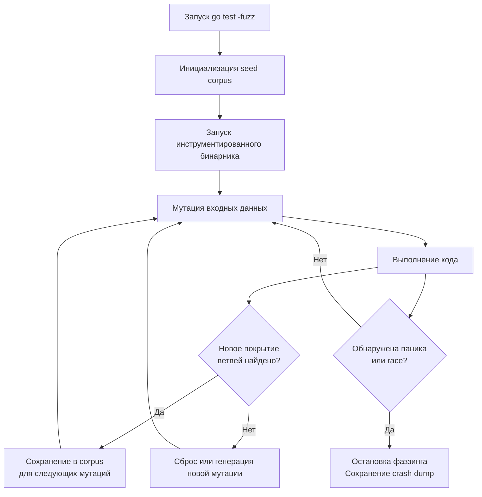

## Философия минимализма и конвенций

Пакет `testing` в Go кардинально отличается от фреймворковых подходов в других экосистемах. Здесь нет аннотаций, магических раннеров, моков или зависимостей от сторонних библиотек. Вместо этого язык предоставляет набор соглашений: функции должны начинаться с `Test`, `Benchmark` или `Fuzz`, аргументом выступает специализированный тип `T`, `B` или `F`, а логика сравнения и управления жизненным циклом строится на явных методах.

Этот минимализм — не ограничение, а архитектурное преимущество. Тесты становятся частью кодовой базы, компилируются вместе с приложением и не зависят от версионных конфликтов. Для Senior/Lead инженера `testing` — это не только проверка логики, но и инструмент валидации производительности, поиска race-условий и автоматического фаззинга критических путей.

> [!info] Под капотом
> При запуске `go test` компилятор собирает все файлы `*_test.go` в отдельный бинарный пакет. Тестовый раннер использует `testing.MainStart`, который сканирует символы через рефлексию на этапе линковки, строит список тестовых функций и запускает их в кооперативном пуле горутин. Никаких внешних зависимостей, только статическая линковка и прямые вызовы.

### 1. Under the hood. Табличные тесты и модель параллельного выполнения

Идиоматичный паттерн в Go — табличные тесты (table-driven tests). Они устраняют дублирование кода и позволяют явно декларировать входные данные, ожидаемый результат и сценарий ошибки.

```go
func TestParseURL(t *testing.T) {
    tests := []struct {
        name    string
        input   string
        want    string
        wantErr bool
    }{
        {"valid_https", "https://example.com", "https://example.com", false},
        {"missing_scheme", "example.com", "", true},
        {"invalid_chars", "http://exam ple.com", "", true},
    }
    
    for _, tc := range tests {
        t.Run(tc.name, func(t *testing.T) {
            // t.Parallel() можно включить для независимых тестов
            got, err := ParseURL(tc.input)
            if (err != nil) != tc.wantErr {
                t.Errorf("got err=%v, wantErr=%v", err, tc.wantErr)
            }
            if got != tc.want {
                t.Errorf("got=%q, want=%q", got, tc.want)
            }
        })
    }
}
```

При использовании `t.Parallel()` рантайм не запускает тесты мгновенно. Вместо этого он помещает горутину в глобальную очередь синхронизации. После завершения родительского теста или вызова `t.Parallel()`, рантайм ждет барьера, чтобы избежать конкурентного доступа к общим ресурсам (например, базе данных или файловой системе). Это гарантирует, что параллельные тесты не создают гонки данных на уровне теста, но позволяют максимально утилизировать ядра CPU.

### 2. Механика бенчмарков и защита от оптимизаций компилятора

Бенчмарки в Go (`func BenchmarkX(b *testing.B)`) измеряют производительность кода в реальных условиях. Однако современный компилятор Go агрессивен: он удаляет мертвый код, инлайнит функции и переупорядочивает инструкции. Если не учитывать это, бенчмарк будет измерять пустоту.

```go
var sink string // Глобальная переменная предотвращает DCE

func BenchmarkStringConcat(b *testing.B) {
    a, c := "hello", "world"
    
    b.ResetTimer()        // Сбрасывает таймер, исключая подготовку из замера
    b.ReportAllocs()      // Включает подсчет аллокаций на итерацию
    
    for i := 0; i < b.N; i++ {
        // Без sink компилятор удалит эту строку (Dead Code Elimination)
        sink = a + c
    }
}
```

> [!warning] Ловушка / Gotcha
> **GC-интерференция в бенчмарках.**
> Сборщик мусора может запуститься в середине `b.N` цикла, исказив результаты задержек на 10–50 мс. Для получения стабильных цифр используйте `GOGC=off go test -bench=.` или вызывайте `runtime.GC()` перед `b.ResetTimer()`. Это гарантирует, что куча чиста на старте измерений.

### 3. Fuzzing: Coverage-guided генерация и нативная интеграция

Начиная с Go 1.18, стандартная библиотека включает встроенный фаззинг. В отличие от случайного генератора, Go использует **coverage-guided fuzzing**. Движок инструментирует код, собирает метрики покрытия ветвлений (branch coverage) и мутирует входные данные так, чтобы максимизировать выполнение новых путей в AST и рантайме.

```go
func FuzzParseInt(f *testing.F) {
    // Seed corpus: начальные валидные данные для старта мутаций
    f.Add("123")
    f.Add("-456")
    f.Add("0")
    
    f.Fuzz(func(t *testing.T, s string) {
        // Фаззинг автоматически проверяет паники, deadlocks, race
        _, err := strconv.Atoi(s)
        // Можно добавить инварианты
        if err == nil && len(s) > 10 {
            t.Fatalf("unexpected long valid number: %s", s)
        }
    })
}
```



### 4. Mechanical Sympathy. Влияние рантайма на точность метрик

Измерение производительности — это стресс-тест для CPU и планировщика ОС.
* **CPU Frequency Scaling**: Современные процессоры динамически меняют частоту (Turbo Boost). Первые итерации бенчмарка могут быть медленнее, пока CPU не разогреется. `go test` автоматически выполняет warmup-прогоны, стабилизируя тактовую частоту.
* **OS Scheduler Noise**: Фоновые процессы могут мигрировать горутину между ядрами, вызывая `cache cold miss`. Для production-бенчмарков рекомендуется изолировать процесс: `taskset -c 0-3 go test -bench=.` или отключать `intel_pstate`.
* **Аллокации и Escape Analysis**: Функции внутри тестов компилируются с теми же флагами, что и продакшен. Если тестовая функция заставляет данные «убегать» в кучу, бенчмарк покажет завышенное количество аллокаций. Проверяйте `go build -gcflags=-m` для анализа.

### 5. Ловушки и хардкорные вопросы с собеседований

| Сценарий                              | Проблема                                                                                  | Решение                                                                                                                                                |
| ------------------------------------- | ----------------------------------------------------------------------------------------- | ------------------------------------------------------------------------------------------------------------------------------------------------------ |
| `t.Parallel()` с общим ресурсом       | Конкурентная запись в базу/файл вызывает `data race` или блокировки                       | Используйте `sync.Mutex`, `testcontainers` или изолируйте тесты по `t.Run` без параллелизма для интеграционных сценариев.                              |
| `b.N` не контролируется разработчиком | Раннер сам определяет количество итераций для достижения статистической погрешности < 10% | Не задавайте `b.N` вручную. Используйте `b.SetBytes(n)` для нормализации throughput.                                                                   |
| `t.Fatal` vs `t.Error`                | `t.Fatal` прерывает выполнение теста мгновенно, `t.Error` продолжает выполнение           | Используйте `t.Fatal` для критических ошибок (например, паника или невозможность инициализации), `t.Error` для сбора нескольких assertion-ошибок.      |
| Фаззинг падает на легитимных данных   | Coverage-guided мутатор генерирует валидные, но неожиданные строки/байты                  | Расширяйте `f.Add()` валидными edge-кейсами или добавляйте инварианты в `f.Fuzz` для фильтрации.                                                       |
| `t.Cleanup` vs `defer`                | `defer` выполняется в порядке LIFO, `t.Cleanup` регистрирует хуки независимо от паники    | Используйте `t.Cleanup()` для освобождения внешних ресурсов (контейнеры, файлы, временные директории), чтобы гарантировать очистку даже при `t.Fatal`. |
|                                       |                                                                                           |                                                                                                                                                        |

> [!tip] Собеседование
> **Вопрос:** Как бенчмарк определяет, сколько итераций (`b.N`) нужно выполнить?
> **Ответ:** Раннер запускает тест с `b.N=1`, измеряет время, затем умножает `N` на 10, пока общее время не превысит 1 секунду или не достигнет стабильной дисперсии. Это гарантирует, что короткие функции измеряются достаточное количество раз, а дорогие не занимают минуты.
>
> **Вопрос:** Почему фаззинг в Go работает быстрее, чем `go-fuzz` или `afl`? 
> **Ответ:** Встроенный фаззинг работает в одном процессе, использует нативную инструментацию покрытия на уровне AST и не требует внешних санитайзеров. Он мутирует данные в памяти, избегая накладных расходов на `fork`/`exec` и IPC. Для 90% Go-пакетов это дает скорость 10^5–10^6 exec/sec на ядро.

### 6. Сравнение с экосистемами других языков

| Язык / Фреймворк | Подход | Особенности в сравнении с Go |
|------------------|--------|------------------------------|
| **Java** (JUnit + JMH) | Аннотации, внешний раннер | JMH требует ручной настройки warmup, fork-режимов, черного ящика. Мощно, но вербозно. Go встроен, декларативно. |
| **Python** (pytest + `timeit`) | Декораторы, плагины | GIL искажает бенчмарки. `pytest` тяжелый, зависит от плагинов. Go тестирует нативно, без интерпретаторного overhead. |
| **C++** (Catch2, Google Benchmark) | Макросы, ручная линковка | Требует сборки, настройки флагов компилятора, `BENCHMARK_ADVANCED`. Go компилирует тесты вместе с кодом, без extra steps. |
| **Go** (`testing`) | Конвенции, нулевые зависимости | Минимализм, интеграция с `go test`, `go cover`, `go fuzz`, `go vet`. Идеально для CI/CD, быстро, безопасно. |

## Итог

1. `testing` пакет следует философии конвенций над конфигурацией. Используйте табличные тесты, `t.Run` и `t.Parallel()` для структурирования.
2. Бенчмарки подвержены оптимизациям компилятора. Всегда используйте `sink` переменные и `b.ResetTimer()`. Контролируйте GC через `GOGC=off` для чистых замеров.
3. Фаззинг (`go test -fuzz`) — это нативный, coverage-guided инструмент. Он находит edge-кейсы и паники автоматически, не требуя внешних генераторов.
4. `t.Cleanup` предпочтительнее `defer` для освобождения тяжелых внешних ресурсов, так как гарантирует выполнение даже при `t.Fatal`.
5. Измеряйте производительность изолированно: отключайте Turbo Boost, фиксируйте CPU governor, используйте `-count` для статистической достоверности.
6. `testing` — это стандарт индустрии. Внешние фреймворки нужны только для специфичных моков или BDD-синтаксиса, но не заменяют встроенные возможности.

Понимание стандартного инструментария тестирования открывает путь к более продвинутым техникам валидации свойств и ускоренному запуску тестовых сценариев. Как использовать быстрые прокси-запуски, генераторы данных и property-based подходы для поиска скрытых багов? В следующей статье мы разберем: [[46. testing_quick и property based testing]].