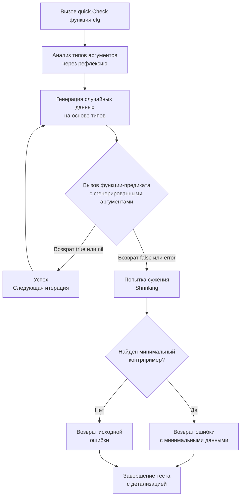

## Философия проверки свойств против примеров

Традиционное модульное тестирование в Go (example-based) проверяет конкретные случаи: «для ввода `A` ожидаем вывод `B`». Это надежно для известных edge-кейсов, но бесполезно для поиска неизвестных ошибок в сложных трансформациях данных, математических алгоритмах или парсерах. Property-Based Testing (PBT) меняет парадигму: вместо проверки конкретных значений мы формулируем **инварианты** (свойства), которые должны выполняться для **любого** валидного ввода.

Пакет `testing/quick` в стандартной библиотеке предоставляет примитивную, но мощную реализацию QuickCheck. Он автоматически генерирует сотни случайных входных данных, проверяет ваш предикат и, в случае ошибки, пытается найти минимальный контрпример (shrinking), чтобы упростить отладку.

> [!info] Под капотом
> `testing/quick` не использует сторонние генераторы. Он опирается на пакет `reflect` для интроспекции сигнатуры тестируемой функции. На основе типов аргументов (`int`, `string`, `[]byte`, структуры с экспортированными полями) рантайм рекурсивно заполняет случайными значениями, используя криптографически стойкий PRNG, но с фиксированным seed для детерминизма тестов.

## Under the hood. Механика работы и алгоритм сужения

При вызове `quick.Check(f, cfg)` происходит цепочка операций:
1. **Анализ сигнатуры**: Пакет валидирует, что `f` возвращает `(bool, error)` или `(bool)`. Извлекает типы входных аргументов.
2. **Цикл генерации**: Выполняется `cfg.MaxCount` раз (по умолчанию 100). На каждой итерации создается `reflect.Value` для каждого аргумента, заполняется случайными данными.
3. **Вызов предиката**: Функция `f` вызывается через `reflect.Call`. Если она возвращает `true` и `nil`, итерация считается успешной.
4. **Shrinking (Сужение)**: При обнаружении ошибки движок пытается упростить входные данные. Для целых чисел он последовательно делит их на 2, для строк удаляет символы с конца, для слайсов уменьшает длину. Это продолжается до тех пор, пока ошибка не исчезнет, после чего возвращается последний «сломанный» вариант как минимальный контрпример.



## Mechanical Sympathy. Цена рефлексии и оптимизация генерации

Использование `reflect` для генерации данных — это компромисс между универсальностью и производительностью. На каждом шаге рантайм выполняет:
* `reflect.New(typ)` — аллокация объекта в куче.
* `reflect.Value.Field()` или `Set()` — косвенная адресация, нарушающая предсказание ветвлений CPU.
* `reflect.Call()` — обход таблицы методов, невозможность инлайнинга.

В высоконагруженных CI-пайплайнах или при `MaxCount > 10000` это создает заметное давление на GC и замедляет прогон тестов в 5–10 раз по сравнению с нативной генерацией.

**Оптимизация для production-тестов:**
Если вам нужно тестировать чистые функции с экстремальной скоростью, используйте кастомные генераторы или переходите к кодогенерации. Для `testing/quick` можно передать `quick.Config` с ручным управлением `Rand`, но лучший путь — тестировать только критичные инварианты с разумным лимитом (100–1000 итераций).

```go
package main

import (
	"errors"
	"math"
	"reflect"
	"testing"
	"testing/quick"
)

// Инвариант: разворот массива дважды возвращает исходный массив
func reverse(slice []int) []int {
	out := make([]int, len(slice))
	copy(out, slice)
	for i, j := 0, len(out)-1; i < j; i, j = i+1, j-1 {
		out[i], out[j] = out[j], out[i]
	}
	return out
}

func TestReverseInvariant(t *testing.T) {
	// Проверяем инвариант: reverse(reverse(x)) == x
	err := quick.Check(func(x []int) bool {
		// Быстрая проверка на nil и пустые слайсы
		if x == nil {
			return true
		}
		
		// Избегаем переполнения при генерации очень больших слайсов
		// quick ограничивает размер, но явная проверка полезна для логики
		if len(x) > 10000 {
			x = x[:10000]
		}

		reversed := reverse(x)
		doubleReversed := reverse(reversed)

		// Используем reflect.DeepEqual, так как сравнение слайсов напрямую запрещено
		return reflect.DeepEqual(x, doubleReversed)
	}, &quick.Config{MaxCount: 1000})

	if err != nil {
		t.Errorf("invariant failed: %v", err)
	}
}
```

> [!warning] Ловушка / Gotcha
> **`testing/quick` не генерирует nil для слайсов и указателей по умолчанию.**
> Генератор стремится создавать валидные ненулевые структуры. Если ваша функция критично зависит от обработки `nil`, вы должны явно проверять это внутри предиката или писать кастомный генератор. Также пакет не умеет автоматически генерировать интерфейсы и каналы без явной регистрации типов.

## Ловушки и хардкорные вопросы с собеседований

| Сценарий | Проблема | Решение |
|----------|----------|---------|
| `quick.Check` с внешними зависимостями | Тест вызывает БД или HTTP. Случайные данные ломают схему или вызывают 400/500. | PBT предназначен **только** для чистых функций. Для интеграционных тестов используйте табличные данные или моки. |
| Отсутствие сужения для сложных типов | `testing/quick` сужает только примитивы. Структуры и вложенные слайсы возвращаются «как есть». | Реализуйте собственный shrinking или используйте сторонние библиотеки (`gopter`, `go-check`), если инварианты сложны. |
| Детерминизм и CI | Разные версии Go могут генерировать разные последовательности. | Фиксируйте seed через `quick.Config{Rand: rand.New(rand.NewSource(42))}`. Это гарантирует воспроизводимость падений в пайплайне. |
| Переполнение целых чисел | Генератор создает `math.MaxInt64`. Арифметика в функции вызывает панику или wrap-around. | Всегда используйте `cfg.MaxCount` разумно и валидируйте входные данные внутри предиката до вызова бизнес-логики. |
| `reflect.DeepEqual` vs `cmp.Equal` | `DeepEqual` медленный и не поддерживает кастомные компараторы. | Для структур с `time.Time` или `float64` используйте `google/go-cmp` внутри предиката, чтобы избежать ложных срабатываний. |

> [!tip] Собеседование
> **Вопрос:** Когда property-based тестирование предпочтительнее unit-тестов?
> **Ответ:** PBT выигрывает при тестировании алгоритмов, где пространство входов огромно, а свойства формализуемы: сериализация/десериализация (round-trip), сортировка, хеширование, криптографические преобразования, математические формулы, парсеры. Он проигрывает при тестировании бизнес-логики с внешними состояниями, где конкретные сценарии важнее математических инвариантов.
>
> **Вопрос:** Почему стандартный `testing/quick` считается «legacy» в современной Go-экосистеме?
> **Ответ:** Он использует старую модель рефлексии, не имеет продвинутого системы shrinking, не поддерживает сложные генераторы из коробки и давно не получает мажорных обновлений. Для серьезных проектов предпочитают `gopter` или `rapid`, но `testing/quick` остается в stdlib для базовых проверок без внешних зависимостей.

## Сравнение с экосистемами других языков

| Язык / Библиотека | Подход | Особенности в сравнении с Go |
|-------------------|--------|------------------------------|
| **Haskell** | `QuickCheck` | Родоначальник PBT. Строгая типизация позволяет выводить генераторы на этапе компиляции. Go использует рефлексию рантайма, что медленнее, но проще в синтаксисе. |
| **Java** | `jqwik`, `ScalaCheck` | Требуют аннотаций и сторонних зависимостей. Генерация через прокси-объекты. Go встроен, но ограничен базовыми типами. |
| **Python** | `hypothesis` | Очень мощный shrinking, stateful testing. Интерпретатор замедляет генерацию. Go быстрее в выполнении, но беднее в API генерации. |
| **Rust** | `proptest` | Zero-cost абстракции, макросы, нативная генерация без рефлексии. Безопасность типов компилятора исключает целый класс багов генерации. Go полагается на `reflect`. |
| **Go** | `testing/quick` | Нулевые зависимости, детерминизм, интеграция с `go test`. Идеален для быстрого smoke-check инвариантов, но уступает специализированным библиотекам в гибкости. |

## Итог

1. Property-Based Testing проверяет инварианты на случайных данных, а не конкретные примеры. Это мощный инструмент для поиска скрытых багов в алгоритмах и трансформациях.
2. `testing/quick` использует рефлексию для генерации аргументов и простого shrinking. Это создает overhead на аллокации и CPU, но не требует внешних зависимостей.
3. Ограничьте `MaxCount` разумными значениями (100–1000) и используйте фиксированный seed для воспроизводимости в CI.
4. PBT неприменим для интеграционных тестов с БД или сетью. Используйте его только для чистых функций и математических инвариантов.
5. Для сложных структур и продвинутого shrinking рассмотрите сторонние библиотеки (`gopter`, `rapid`), но `testing/quick` остается надежным базовым инструментом stdlib.
6. Всегда комбинируйте PBT с классическими табличными тестами: примерами покрывайте известные edge-кейсы, свойствами — неизвестные пространства данных.

Разобрав методы тестирования и валидации свойств кода, мы переходим к механизму динамической загрузки модулей. Позволяет ли Go загружать код в runtime, как это делают плагины в C или Java, и какие архитектурные ограничения накладывает статическая линковка? В следующей статье мы изучим возможности и границы этой технологии: [[47. plugin. Динамическая загрузка модулей]].