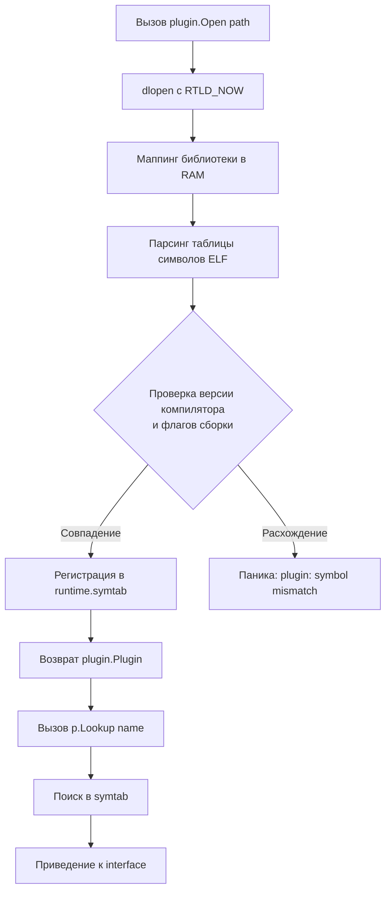

## Философия статической линковки и ограничения динамической загрузки

Go проектировался как язык со статической линковкой по умолчанию. Это обеспечивает предсказуемость бинарников, отсутствие конфликтов зависимостей и мгновенный запуск без поиска библиотек в `LD_LIBRARY_PATH`. Пакет `plugin` был добавлен как экспериментальный механизм для нишевых сценариев, но команда разработчиков явно не рекомендует его для production-систем. Для Senior-инженера критически важно понимать, почему динамическая загрузка в Go нарушает архитектурные принципы языка, и какие современные альтернативы существуют.

> [!info] Под капотом
> При компиляции `go build -buildmode=plugin` компилятор генерирует разделяемую библиотеку `.so` с экспортированной таблицей символов. В рантайме `plugin.Open()` вызывает системный вызов `dlopen`, загружает библиотеку в адресное пространство процесса, парсит ELF-заголовки и разрешает символы. Все символы загружаются в ту же кучу, используют тот же Garbage Collector и тот же планировщик горутин, что и хост-приложение.

## Механика работы и разрешение символов

Плагин в Go — это обычный пакет с `package main`, где экспортируются переменные, функции или типы верхнего уровня. Рантайм не проверяет совместимость сигнатур на этапе компиляции хоста. Всё происходит в момент `Lookup`.

```go
// plugin.go (собирается как: go build -buildmode=plugin -o mod.so)
package main

type Handler struct {}

func (h Handler) Process(data string) string {
    return "processed: " + data
}

// Экспортируемая переменная должна быть объявлена в package main
var MyPluginHandler = Handler{}
```

Загрузка в хосте:
```go
func loadAndRun(path string) error {
    p, err := plugin.Open(path)
    if err != nil {
        return fmt.Errorf("open plugin: %w", err)
    }
    
    sym, err := p.Lookup("MyPluginHandler")
    if err != nil {
        return fmt.Errorf("lookup: %w", err)
    }
    
    // Приведение типа происходит в рантайме. Несоответствие вызовет panic.
    handler, ok := sym.(interface{ Process(string) string })
    if !ok {
        return errors.New("invalid plugin signature")
    }
    
    result := handler.Process("test")
    log.Println(result)
    return nil
}
```



> [!warning] Ловушка / Gotcha
> **Жесткое требование к совпадению версий.**
> Хост и плагин *обязаны* быть скомпилированы одной версией Go, с идентичными флагами (`-trimpath`, `-ldflags`, `GOOS`, `GOARCH`) и абсолютно одинаковыми версиями всех транзитивных зависимостей. Любое расхождение вызывает панику при `Lookup` или первом вызове метода. В распределенных CI/CD это делает раздельную сборку практически невозможной.

## Mechanical Sympathy. ABI, GC и отсутствие изоляции

Динамическая загрузка в Go не создает песочницу. Она буквально вшивает байткод плагина в процесс хоста.

1. **Общая куча и GC**: Память, выделенная в плагине, управляется тем же сборщиком мусора. Это усложняет профилирование (`pprof` не разделяет аллокации), а утечки в плагине напрямую бьют по лимитам хоста.
2. **Паники убивают процесс**: `recover()` в хосте ловит только паники из *текущей* горутины. Если плагин запускает собственную горутину и там происходит паника, весь процесс аварийно завершается. Изоляции на уровне рантайма нет.
3. **ABI Instability**: Go не гарантирует стабильность бинарного интерфейса между минорными версиями. Изменение layout'а структур, порядка полей или алгоритма распределения памяти ломает совместимость. Это делает долгосрочную поддержку плагинов (например, в IDE или серверах приложений) крайне рискованной.
4. **Cache Thrashing**: Загрузка `.so` мапит новые страницы памяти в адресное пространство. Если плагин велик, он вытесняет горячие данные хоста из кэшей L1/L2, увеличивая latency на 10-20% после первой загрузки.

## Идиомы использования и современные альтернативы

Пакет `plugin` допустим только для:
* Внутренних CLI-утилит, где перезапуск процесса не проблема.
* Legacy-интеграций, требующих именно `dlopen`.
* Прототипирования, когда важна скорость разработки, а не стабильность.

Для production-архитектур используйте:
1. **gRPC / HTTP**: Строгий контракт, полная изоляция процессов, независимый деплой, graceful restart.
2. **WebAssembly (WASM)**: Изоляция памяти, безопасность, sandbox, кроссплатформенность. Рантайм `wazero` работает на чистом Go без `cgo`.
3. **Code Generation**: `go generate` + шаблоны. Генерирует статический типизированный код. Нулевой overhead, компилятор валидирует всё на этапе сборки.
4. **Интерпретаторы**: `goja` (JS), `yaegi` (Go), `cel` (Google). Безопасное исполнение пользовательского скриптового кода с ограничением ресурсов.

## Ловушки и вопросы с собеседований

| Сценарий | Проблема | Решение |
|----------|----------|---------|
| `plugin.Lookup` возвращает `interface{}` | Рантайм не проверяет совместимость сигнатур. Вызов метода с неверными аргументами вызывает панику. | Всегда используйте `type assertion` с `ok` проверкой. Оборачивайте вызовы в `recover` внутри изолированных горутин. |
| Обновление плагина без рестарта | Загрузка новой версии `.so` в тот же процесс приводит к конфликтам символов и mixed-ABI. | Невозможно штатно. Используйте rolling update контейнеров или WASM с горячей заменой модулей. |
| `go build -buildmode=plugin` на Windows | Не поддерживается нативно. Требует MinGW/cgo, работает нестабильно. | Разрабатывайте и тестируйте только на Linux/macOS, или мигрируйте на WASM. |
| Утечка памяти в долгоживущем сервисе | GC хоста не может эффективно собирать циклические ссылки между хостом и плагином. | Избегайте плагинов в сервисах с uptime > 24 часов. При необходимости используйте `runtime/debug.FreeOSMemory()` (временный хак). |
| Зависимости плагина конфликтуют с хостом | Две разные версии `github.com/lib/pq` в хосте и плагине | Go модули статически линкуются. Конфликт версий приведет к панике `plugin: symbol has wrong type`. Выносите логику в отдельный процесс. |

> [!tip] Собеседование
> **Вопрос:** Почему `plugin` пакет помечен как experimental и не рекомендуется для production?
> **Ответ:** Из-за отсутствия изоляции памяти, нестабильности ABI между версиями компилятора и невозможности безопасного hot-reload. Архитектура Go построена вокруг статических бинарников и процессов. Динамическая загрузка нарушает эти принципы, создавая скрытые точки отказа. Для расширения функционала в production стандарт индустрии — микросервисы (gRPC), WASM или code generation.
>
> **Вопрос:** Как безопасно выполнить пользовательский код в Go?
> **Ответ:** Никогда не используйте `plugin` или `eval`. Применяйте изолированные рантаймы: `wazero` для WASM, `goja` для JavaScript, или запускайте код в отдельных контейнерах/Docker-sandbox с ограничениями CPU/RAM через cgroups.

## Сравнение с экосистемами других языков

| Язык | Механизм | Особенности в сравнении с Go |
|------|----------|------------------------------|
| **Java** | `ClassLoader`, `.jar` hot-reload | Изоляция на уровне классов, возможность выгрузки. Сложный lifecycle, но полноценная поддержка. Go загружает в единое пространство без возможности выгрузки. |
| **Python** | `importlib`, `exec` | Динамическая типизация позволяет загружать и заменять модули на лету. GIL блокирует конкурентность. Go статичен и безопасен, но не гибок в рантайме. |
| **C / C++** | `dlopen`, COM | Полный контроль, но ручное управление памятью и риск segfault. ABI нестабилен. Go добавляет GC, но теряет изоляцию и безопасность выгрузки. |
| **Go** | `plugin` package | Простой API, но требует точного совпадения версий компилятора, не изолирует паники, не поддерживает hot-reload. Лучше заменить на WASM или RPC. |

## Итог

1. `plugin` — экспериментальный пакет, не рекомендованный для production. Загружает код в то же адресное пространство, используя общую кучу и GC.
2. Требует абсолютного совпадения версий Go, флагов сборки и зависимостей между хостом и плагином. Любое расхождение вызывает панику.
3. Паники в плагине убивают хост-процесс. `recover` не спасает от паник в фоновых горутинах плагина.
4. Поддержка ограничена Linux/macOS/FreeBSD. Windows требует `cgo` и работает нестабильно.
5. Для production-расширяемости используйте gRPC, WebAssembly (`wazero`), `go generate` или микросервисную архитектуру.
6. `plugin` допустим только для CLI, прототипов или legacy-интеграций, где изоляция и долгая поддержка не требуются.

Завершив анализ всех пакетов стандартной библиотеки, мы подводим итоги раздела. В следующей статье мы систематизируем полученные знания, сформулируем стратегию выбора инструментов и определим, когда stdlib достаточна, а когда пора подключать внешние зависимости: [[48. Итоги раздела. Как эффективно использовать стандартную библиотеку Go]].