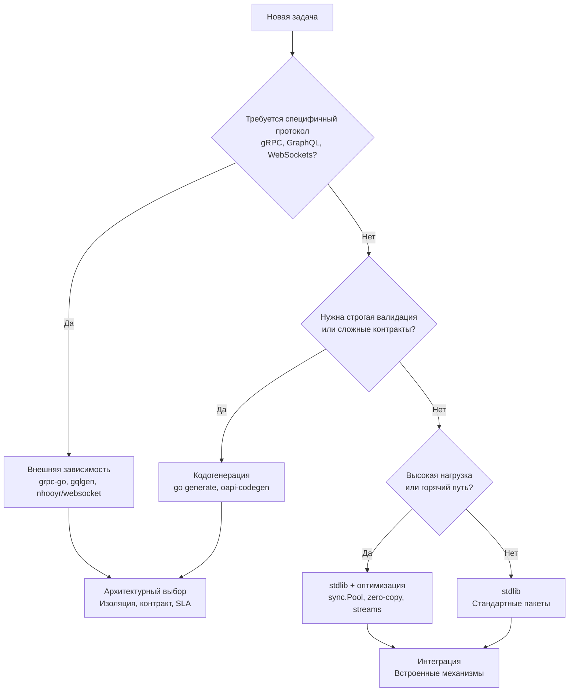

## Философия инженерного минимализма

Пройдя путь от базовых типов до динамической загрузки модулей, мы видим четкую картину: стандартная библиотека Go — это не набор разрозненных утилит, а **единая, согласованная экосистема**, спроектированная вокруг трех столпов: явность, композиция и предсказуемость. Для разработчика, пришедшего из экосистем с тяжелыми фреймворками (Spring, Laravel, .NET), это может показаться ограничением. Для Senior/Lead инженера — это архитектурное преимущество, позволяющее строить системы, где каждое звено контролируется, профилируется и масштабируется без магии.

> [!info] Под капотом
> Все пакеты stdlib используют один и тот же рантайм: один сборщик мусора, один планировщик горутин, один аллокатор `tcmalloc`. Это означает, что `net/http`, `encoding/json` и `database/sql` не просто «работают вместе» — они **делят одну кучу, одни треды ОС и одни структуры синхронизации**. Понимание этой интеграции позволяет писать код, который не конфликтует с внутренними механизмами языка, а усиливает их.

## Стратегический фреймворк выбора инструментов

Для принятия взвешенных архитектурных решений используйте следующую матрицу. Она основана на опыте production-систем с нагрузкой от 1k до 50k+ RPS.

1. **Конфигурация**: `os.Getenv` + `flag` + `encoding/json` для простых систем. Внешние библиотеки (`viper`, `koanf`) только при необходимости горячего перезапуска или сложных форматах (YAML/TOML с валидацией).
2. **Логирование**: `log/slog` (Go 1.21+) полностью закрывает потребности production. Переходите на OpenTelemetry/Structlog только при интеграции с распределенным трейсингом.
3. **HTTP и роутинг**: `net/http` + `http.ServeMux` (Go 1.22+) достаточно для 90% микросервисов. `chi`, `gin`, `echo` нужны только для сложной middleware-цепочки или legacy-переноса.
4. **Сериализация**: `encoding/json` для внешних API. `encoding/gob` для внутренних Go-to-Go очередей. `protobuf` + `sonic`/`easyjson` для экстремального throughput (>100k RPS).
5. **Базы данных**: `database/sql` + `pgx`/`mysql` драйверы + `sqlc` для генерации типового кода. ORM (`gorm`, `ent`) только если команда не владеет SQL или требуется динамическая схема.

## Under the hood: Системная интеграция и рантайм

Каждый рассмотренный пакет опирается на низкоуровневые механизмы Go. Архитектор должен видеть эти связи:

* **Сетевой стек** (`net`, `net/http`) использует `epoll/kqueue` через `netpoller`, интегрированный с планировщиком G-M-P. Горутины не блокируют треды ОС, а паркутся в пользовательском пространстве.
* **Синхронизация** (`sync`, `sync/atomic`) переходит от `CAS` в User Space к `futex` в Kernel Space только при длительной конкуренции. Это минимизирует переключения контекста.
* **Память и сборка мусора** (`sync.Pool`, `bytes`, `strings`) спроектированы так, чтобы объекты жили в поколении 0 GC. Переиспользование буферов через `Reset()` и `Grow()` устраняет аллокации, сдвигающие порог `GOGC`.
* **Контекст и таймауты** (`context`, `time`) используют атомарные каналы и кучу таймеров рантайма. Отмена операции — это O(1) закрытие канала, мгновенно пробуждающее все ожидающие горутины.
* **Криптография и безопасность** (`crypto/*`, `crypto/subtle`) используют аппаратные инструкции (AES-NI, SHA Extensions) и constant-time алгоритмы, защищая от side-channel атак на уровне CPU.

## Mechanical Sympathy: Паттерны высоконагруженных систем

Для достижения latency < 10ms и стабильного p99 в production применяйте следующие паттерны, изученные в разделе:

1. **Потоковая обработка вместо полной загрузки**: Используйте `io.Copy`, `json.Decoder`, `tar.Reader` и `bufio`. Запрещено `io.ReadAll` для неизвестных или крупных пейлоадов.
2. **Zero-copy и срезы**: Применяйте `unsafe.Slice`, `strings.Builder`, `strconv.Append*` в горячих путях. Избегайте `fmt.Sprintf` и конвертации `[]byte <-> string` внутри циклов.
3. **Управление пулами**: Настраивайте `http.Transport`, `database/sql` и `sync.Pool` явно. Лимиты `MaxIdleConns`, `MaxOpenConns` и `IdleConnTimeout` должны соответствовать нагрузке и лимитам ОС.
4. **Контекст повсюду**: `context.Context` — обязательный первый параметр. Интегрируйте его в `http`, `sql`, `exec` и кастомные бизнес-сервисы для graceful shutdown и отмены каскадных операций.
5. **Явная обработка ошибок**: Оборачивайте через `fmt.Errorf("%w", err)`, сравнивайте через `errors.Is`, извлекайте через `errors.As`. Никогда не глотайте ошибки и не используйте `_` без явного комментария.

## Правила Senior Engineer при работе со stdlib

> [!warning] Ловушка / Gotcha
> **std-lib ≠ фреймворк.** Попытка написать «микро-Spring» на Go, используя `reflect`, глобальные реестры и магическую DI, нарушает идиомы языка и ведет к медленному, сложному в отладке коду.

1. **Композиция > Наследование**: Собирайте системы через интерфейсы `io.Reader`, `http.Handler`, `fs.FS`. Не создайте преждевременные абстракции `IUserService`.
2. **Явность лучше магии**: Избегайте тегов `json`/`sql` как единственного источника правды. Пишите явные мапперы или используйте `sqlc`. Магия ломается при масштабировании.
3. **Профилирование до оптимизации**: Никогда не угадывайте bottleneck. Запускайте `go test -bench`, `pprof`, `trace`. Оптимизируйте только то, что показывает火焰 graph.
4. **Тестируйте поведение, а не реализацию**: Используйте табличные тесты, `httptest`, `testcontainers`. Property-based testing (`testing/quick`) покрывает неизвестные edge-кейсы алгоритмов.
5. **Держите зависимости легкими**: Каждая внешняя библиотека — это риск уязвимости, конфликт версий и замедление сборки. Добавляйте зависимость только если stdlib объективно не решает задачу.

> [!tip] Собеседование
> **Вопрос:** Как вы принимаете решение: писать свое на stdlib или брать готовую библиотеку?
> **Ответ:** Оценка идет по 4 критериям:
> 1. **Критичность задачи**: Ядро бизнеса vs вспомогательная утилита.
> 2. **Нагрузка**: Влияет ли решение на GC, CPU или latency.
> 3. **Сопровождение**: Активность репозитория, наличие CVE, сложность миграции.
> 4. **Сложность реализации**: Если задача решается за 50 строк идиоматичного Go с покрытием тестами — пишем сами. Если требует поддержки сотен edge-кейсов (например, парсинг Excel, сложный роутинг с middleware) — берем проверенную библиотеку.
> 
> **Вопрос:** Почему stdlib Go часто быстрее сторонних аналогов?
> **Ответ:** Благодаря глубокой интеграции с компилятором и рантаймом. Пакеты используют монотонизацию дженериков (Go 1.21+), `sync.Pool` для внутренних буферов, аппаратное ускорение через `crypto` и прямые системные вызовы без прослойки `libc`. Сторонние библиотеки часто платят за универсальность рефлексией или избыточными аллокациями.

## Итог: Фундамент для роста

Стандартная библиотека Go — это не набор «батареек», а **архитектурный скелет**, на котором строятся надежные бэкенд-системы. Её сила в минимализме, предсказуемости и глубокой интеграции с моделью памяти и конкурентности языка.

1. Используйте `stdlib` по умолчанию. Это снижает сложность, ускоряет деплой и облегчает онбординг.
2. Понимайте механику: `netpoller`, `GC pacing`, `CAS/futex`, `context cancellation`. Это отличает Junior от Senior.
3. Оптимизируйте сознательно: `sync.Pool`, стриминг, zero-copy, буферизация. Применяйте только после профилирования.
4. Избегайте фреймворкового мышления. Пишите чистый, композируемый код с явными контрактами.
5. Переходите к внешним зависимостям только при объективной необходимости: протоколы (gRPC, WS), экстремальная производительность (`sonic`), сложные бизнес-абстракции (ORM, GraphQL).

Этот раздел заложил фундамент низкоуровневого понимания языка и стандартных инструментов. Вы готовы переходить от синтаксиса к проектированию. В следующих разделах мы разберем, как строить отказоустойчивые распределенные системы, проектировать API, управлять состоянием и масштабировать сервисы до миллионов запросов в секунду, сохраняя чистоту архитектуры и предсказуемость рантайма.