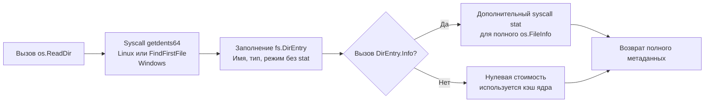

## Исторический контекст и декатализация

Начиная с версии Go 1.16, пакет `io/ioutil` официально переведён в статус `deprecated`. Это не было случайным рефакторингом. Разработчики языка провели масштабный аудит стандартной библиотеки и обнаружили, что `ioutil` нарушает ключевые принципы проектирования Go: логическую группировку по доменам и минимализм.

Функции из `ioutil` были хаотично разбросаны между операциями с потоками данных (`io`) и операциями с файловой системой (`os`). Их миграция в соответствующие пакеты устранила эту архитектурную асимметрию и подготовила почву для внедрения унифицированной абстракции `io/fs`.

> [!info] Под капотом
> Пакет `io/ioutil` **не удалён** из компилятора ради обратной совместимости. Вы можете продолжать его импортировать, код скомпилируется и будет работать. Однако `go vet` и современные линтеры будут выдавать предупреждения. В новых проектах и при рефакторинге легаси миграция обязательна.

## 1. Почему пакет `io_ioutil` исчез из рекомендаций

Основная причина — нарушение границы ответственности. `ioutil` содержал функции, которые по своей природе относятся к разным слоям абстракции:
* Потоковые операции (`ReadAll`, `NopCloser`) логичнее живут в `io`, так как работают с интерфейсами `io.Reader`/`io.Writer`.
* Файловые операции (`ReadFile`, `ReadDir`, `TempDir`) требуют доступа к `os`, так как взаимодействуют с inode, файловыми дескрипторами и правами доступа ОС.

Разнесение функций упрощает поиск документации, уменьшает когнитивную нагрузку и позволяет компилятору строже проверять типы аргументов, исключая использование пакетов не по назначению.

## 2. Карта миграции и логика переноса

Каждая функция из `ioutil` нашла своё место в новой экосистеме. Ниже приведена точная матрица соответствий.

| Старая функция `io/ioutil` | Новая функция | Логика переноса |
|----------------------------|---------------|-----------------|
| `ioutil.ReadAll` | `io.ReadAll` | Работает с `io.Reader`, не привязана к файлам. |
| `ioutil.ReadFile` | `os.ReadFile` | Требует открытия файла, знает про `os.Path`. |
| `ioutil.WriteFile` | `os.WriteFile` | Аналогично: файловые системные вызовы, права доступа. |
| `ioutil.ReadDir` | `os.ReadDir` | Возвращает `[]fs.DirEntry` вместо `[]os.FileInfo`. |
| `ioutil.TempFile` | `os.CreateTemp` | Унификация нейминга: `Create` + `Temp`. |
| `ioutil.TempDir` | `os.MkdirTemp` | Унификация нейминга: `Mkdir` + `Temp`. |
| `ioutil.NopCloser` | `io.NopCloser` | Обёртка для адаптации `io.Reader` под `io.ReadCloser`. |

> [!warning] Ловушка / Gotcha
> **Сигнатура `os.WriteFile` отличается.**
> В `ioutil.WriteFile` аргумент прав доступа (`perm`) был третьим. В `os.WriteFile` он остался третьим, но тип стал строго `os.FileMode`. Убедитесь, что передаёте `0o644` или `0o600` (с префиксом `0o` для октальных чисел в Go 1.13+), а не десятичные `644`.

## 3. Under the hood: Эволюция работы с файловой системой

Наиболее значительное изменение коснулось `ReadDir`. Старый `ioutil.ReadDir` возвращал `[]os.FileInfo`, что требовало немедленного вызова `stat()` для **каждого** файла в директории. В современных ОС системный вызов `stat` дорог, особенно на сетевых файловых системах (NFS, SMB) или при большом количестве файлов.

Новый `os.ReadDir` возвращает `[]fs.DirEntry`. Это лёгкая структура, которая кэширует базовые метаданные, полученные напрямую от ядра ОС.



Ключевое преимущество `fs.DirEntry` — ленивая загрузка тяжёлых метаданных. Если вам нужно только отфильтровать файлы по расширению или найти каталоги, `stat` никогда не вызывается. Это сокращает время обхода директорий в десятки раз.

## 4. Mechanical Sympathy: Оптимизация аллокаций и системных вызовов

Миграция на `os.ReadFile` и `os.WriteFile` несёт прямую выгоду для производительности на уровне памяти и CPU.

### Предварительное выделение памяти (Pre-allocation)
`io.ReadAll` работает вслепую: он читает чанками и растёт через `append`, вызывая реаллокацию и копирование памяти по мере заполнения буфера. `os.ReadFile`, зная, что работает с файлом, сначала выполняет быстрый `stat`, узнаёт точный размер файла и **выделяет буфер ровно нужного размера** одним вызовом `make`.

```go
func readFileOptimized(path string) ([]byte, error) {
    // os.ReadFile под капотом делает примерно следующее:
    info, err := os.Stat(path)
    if err != nil {
        return nil, err
    }
    // Точная аллокация без реаллокаций и копирований
    buf := make([]byte, info.Size())
    f, err := os.Open(path)
    if err != nil {
        return nil, err
    }
    defer f.Close()
    _, err = f.Read(buf) // Чтение за один или два syscall
    return buf, err
}
```

Это устраняет давление на Garbage Collector. В высоконагруженных сервисах, где чтение конфигов или мелких payload происходит тысячи раз в секунду, отсутствие промежуточных буферов экономит CPU-циклы и снижает `GC pause`.

### Атомарность и права доступа
`os.WriteFile` использует флаги `O_WRONLY | O_CREATE | O_TRUNC`. Она гарантирует, что файл будет создан или перезаписан с указанными правами. Это предотвращает распространённую ошибку безопасности, когда разработчики вручную создают файл через `os.Create` (который наследует `umask` системы), а потом пытаются исправить права через `Chmod`, создавая временное окно уязвимости (TOCTOU).

## 5. Ловушки и вопросы с собеседований

| Ловушка | Описание | Решение |
|---------|----------|---------|
| `fs.DirEntry.Type()` vs `Info().IsDir()` | `Type()` возвращает `fs.FileMode` только с флагами типа. `IsDir()` на `DirEntry` безопасен и быстр. `Info()` вызывает `stat`. | Для проверки директорий используйте `entry.IsDir()`. Вызывайте `entry.Info()` только если нужны `ModTime`, `Size` или `Sys`. |
| Порядок сортировки `os.ReadDir` | Возвращает файлы, отсортированные по имени. Гарантия задокументирована. | Не сортируйте вручную после вызова. Это уже сделано ядром/рантаймом эффективно. |
| `io.NopCloser` и утечка ресурсов | `NopCloser` добавляет пустой метод `Close()` к `io.Reader`. Он **не закрывает** underlying источник, если тот был `io.Closer`. | Используйте только для адаптации интерфейсов. Не полагайтесь на `Close()` для освобождения реальных ресурсов (файлов, сокетов). |
| Конфликт имён после миграции | В одном файле могут остаться `ioutil.ReadAll` и появиться `io.ReadAll`, если импорты не отформатированы. | Всегда запускайте `go fmt` и `goimports`. Убедитесь, что `io/ioutil` удалён из `go.mod` через `go mod tidy`. |

> [!tip] Собеседование
> **Вопрос:** Почему `os.ReadDir` возвращает `[]fs.DirEntry`, а не `chan fs.DirEntry` для потоковой обработки?
> **Ответ:** Возврат слайса проще в использовании, безопаснее для конкурентности и позволяет сразу оценить размер памяти. Для потоковой обработки огромных директорий (миллионы файлов) существует `os.File.Readdirnames` или использование пакета `filepath.WalkDir`, который вызывает callback на каждый элемент, не загружая всё в RAM. `ReadDir` оптимизирован под типичные сценарии загрузки конфинов и небольших каталогов.
>
> **Вопрос:** Как `os.ReadFile` ведёт себя с устройствами `/proc` или `/sys`?
> **Ответ:** Эти файлы имеют размер `0` при `stat`, но содержат данные при чтении. `os.ReadFile` обнаруживает нулевой размер, выделяет минимальный буфер и переходит в режим `ReadAll`, динамически растущего массива. Это гарантирует корректное чтение виртуальных файловых систем.

## Итог

1. **`io/ioutil` устарел.** Мигрируйте на `io` и `os` пакеты. Это стандарт с Go 1.16+.
2. **`os.ReadDir` + `fs.DirEntry` = производительность.** Ленивый `stat` и кэшированные метаданные ядра экономят сотни системных вызовов на обход директорий.
3. **`os.ReadFile` оптимизирован.** Предварительное выделение буфера по `stat` устраняет реаллокации и снижает нагрузку на GC.
4. **Соблюдайте права доступа.** Используйте `0o644`/`0o600` в `os.WriteFile`, чтобы избежать наследования небезопасных `umask`.
5. **`NopCloser` — это адаптер, а не менеджер ресурсов.** Он не закрывает underlying stream автоматически.

Разобравшись с эволюцией стандартных утилит, мы переходим к следующему уровню абстракции работы с потоками данных. Узнаем, как избежать тысяч мелких системных вызовов и работать с буферами эффективно: [[6. bufio. Буферизированный ввод и вывод]].