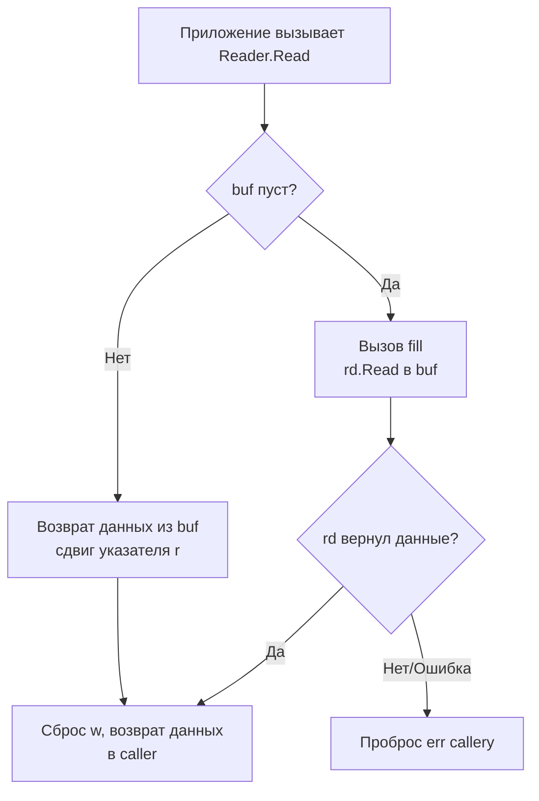

## Философия буферизации: мост между User Space и Kernel Space

Пакет `bufio` решает фундаментальную проблему производительности, описанную в статье про системные вызовы. Каждый вызов `read()` или `write()` требует переключения контекста Ring 3 → Ring 0, сохранения регистров, проверки прав ядра и возврата обратно. Если ваше приложение записывает в сокет или файл по 50 байт на операцию, 99% процессорного времени тратится на накладные расходы рантайма ОС, а не на полезную работу.

`bufio` создаёт промежуточный слой в User Space. Вместо прямого обращения к ядру данные сначала накапливаются в обычном срезе `[]byte`. Системный вызов происходит только когда буфер заполнен или когда разработчик явно требует сброса данных.

> [!info] Под капотом
> `bufio` не является магией. Это тонкая обёртка над обычным массивом байтов и счётчиками позиций. Его главная задача — **амортизировать стоимость syscall**, превращая тысячи мелких операций в несколько крупных. Это классический пример Mechanical Sympathy: мы выравниваем паттерн доступа приложения под оптимальный размер страницы памяти и MTU сетевого стека.

## Under the hood: Внутреннее устройство Reader и Writer

Внутри `bufio.Reader` и `bufio.Writer` выглядят предельно просто, но их состояние управляется строгим контрактом:

```go
// Упрощённое представление bufio.Writer
type Writer struct {
    err error          // Первая возникшая ошибка
    buf []byte         // Внутренний буфер (по умолчанию 4096 байт)
    n   int            // Количество данных в buf, готовых к flush
    wr  io.Writer      // Обёрнутый писатель
}

// Упрощённое представление bufio.Reader
type Reader struct {
    buf       []byte
    rd        io.Reader // Обёрнутый читатель
    r         int       // Позиция чтения в buf
    w         int       // Позиция записи в buf (сколько прочитано из rd)
    err       error
}
```

Алгоритм работы `Writer.Write()`:
1. Если места в `buf` достаточно, данные копируются через `copy()`, счётчик `n` увеличивается. Syscall не происходит.
2. Если места недостаточно, `Flush()` вызывает `wr.Write(buf[:n])`, отправляя накопленные данные в ядро.
3. Если новые данные всё ещё не помещаются в очищенный буфер, они пишутся напрямую в `wr`, минуя буферизацию (fallback).

Алгоритм `Reader.Read()`:
1. Возвращает данные из `buf` начиная с позиции `r`.
2. Если буфер пуст, вызывается внутренний `fill()`, который делает один крупный `rd.Read(buf)`.
3. Позиции `r` и `w` сдвигаются, избегая копирования данных через `memmove` до тех пор, пока буфер полностью не освободится.



## Mechanical Sympathy: Кэш-линии, TLB и давление на GC

Буферизация напрямую влияет на архитектуру процессора и работу сборщика мусора.

1. **Локальность ссылок (Spatial Locality)**: Последовательное чтение/запись внутри одного среза `buf` гарантирует, что данные загружаются в кэш-линии L1/L2 предсказуемо. CPU hardware prefetcher эффективно подгружает следующие 64 байта, устраняя `cache miss`.
2. **Снижение TLB-промахов**: Мелкие syscall заставляют ядро мапить разные виртуальные адреса в физические. Буферизация уменьшает количество страниц, к которым обращается процесс за единицу времени, снижая нагрузку на Translation Lookaside Buffer.
3. **Escape Analysis и аллокации**: По умолчанию `bufio.NewReader()` и `NewWriter()` выделяют внутренний буфер в куче. Если функция, создающая reader/writer, возвращает их наружу, компилятор не может разместить буфер на стеке. В высоконагруженных сервисах это создаёт фоновый поток аллокаций.

> [!warning] Ловушка / Gotcha
> **Ручное управление размером буфера.**
> Значение по умолчанию `4096` байт выбрано как безопасный компромисс. Но для сетевого IO часто эффективнее использовать размер, кратный `TCP_MSS` (1460 байт) или стандартному размеру страницы (4096, 8192, 16384). Вы можете передать свой буфер в конструктор:
> `bufio.NewReaderSize(conn, 32*1024)`. Это позволяет контролировать давление на GC и избегать внутренних реаллокаций.

## Практика и идиомы работы с пакетом

### 1. Правильная работа с Writer и Flush
Никогда не полагайтесь на `defer` для закрытия, если вам важен результат записи. `Flush()` может вернуть ошибку.

```go
func writeLogBatch(w io.Writer, lines []string) error {
    bw := bufio.NewWriter(w)
    
    for _, line := range lines {
        if _, err := bw.WriteString(line); err != nil {
            // При ошибке записи в буфер данные могут быть частично в памяти.
            // В зависимости от логики, можно попытаться Flush или вернуть ошибку сразу.
            return fmt.Errorf("write to buffer failed: %w", err)
        }
    }
    
    // Критично: явный Flush с проверкой ошибки
    if err := bw.Flush(); err != nil {
        return fmt.Errorf("flush failed: %w", err)
    }
    return nil
}
```

### 2. Scanner: парсинг по токенам
`bufio.Scanner` абстрагирует чтение по строкам или словам. По умолчанию он использует ограничение в 64 КБ. Превышение вызывает панику.

```go
func processLines(r io.Reader) error {
    scanner := bufio.NewScanner(r)
    scanner.Buffer(make([]byte, 0, 64*1024), 1024*1024) // Увеличиваем макс буфер до 1 МБ
    scanner.Split(bufio.ScanLines)
    
    for scanner.Scan() {
        line := scanner.Bytes() // Возвращает ссылку на внутренний буфер!
        process(line)
    }
    return scanner.Err()
}
```

> [!warning] Ловушка / Gotcha
> `scanner.Text()` и `scanner.Bytes()` возвращают **ссылку на внутренний буфер сканера**, который будет перезаписан при следующем вызове `Scan()`. Если вам нужно сохранить данные за пределами цикла, обязательно делайте копию: `data := make([]byte, len(scanner.Bytes())); copy(data, scanner.Bytes())` или используйте `strings.Clone()`/`[]byte(strings.Clone())`.

### 3. Peek и ReadBytes
`Peek(n)` возвращает ссылку на следующие `n` байт без сдвига указателя чтения. Это полезно для заглядывания в заголовок протокола. Но если вы не прочитаете эти байты явно после `Peek`, они останутся в буфере и будут возвращены при следующем `Read()`.

## Ловушки и вопросы с собеседований

| Сценарий | Проблема | Решение |
|----------|----------|---------|
| Смешивание API | Вызов `conn.Read()` напрямую после создания `bufio.NewReader(conn)` | Данные в буфере будут потеряны. Используйте **либо** `bufio`, **либо** прямой `io`, никогда одновременно. |
| Частичная запись | `Writer.Write()` вернул ошибку | Данные внутри буфера могут остаться. Вызовите `Flush()`, чтобы попытаться сбросить их и получить точную ошибку syscall. |
| Scanner panic | `bufio.Scanner: token too long` | Установите лимит через `scanner.Buffer()` или используйте `bufio.Reader.ReadBytes('\n')` для потоковой обработки длинных строк. |
| `ReadString` vs `ReadLine` | `ReadLine` возвращает флаг `isPrefix` для длинных строк и обрезает `\n` | `ReadString` или `ReadBytes` предпочтительнее для сетевого IO. Они возвращают полный фрагмент до разделителя включительно. |

> [!tip] Собеседование
> **Вопрос:** Почему `bufio.Scanner` не поддерживает чтение больших бинарных файлов эффективно?
> **Ответ:** `Scanner` спроектирован для текстовых данных и токенизации. Он копирует данные во внутренний буфер и реаллоцирует его при превышении лимита. Для больших бинарных чанков используйте `io.Copy` с фиксированным буфером или `io.LimitReader` + ручное чтение. `Scanner` добавляет накладные расходы на поиск разделителей и копирование строк, что не нужно для бинарных протоколов.
>
> **Вопрос:** Как переиспользовать `bufio.Writer` в горячем HTTP-обработчике?
> **Ответ:** Создайте пул буферов через `sync.Pool` или инициализируйте `bufio.NewWriterSize` один раз при старте сервера, привязав к соединению. Главное: не забывайте сбрасывать состояние или создавать новый экземпляр на каждый запрос, чтобы избежать гонки данных (data race), так как `bufio` **не потокобезопасен**.

## Сравнение с другими языками

| Язык | Механизм | Особенности в сравнении с Go |
|------|----------|------------------------------|
| **Java** | `BufferedInputStream`, `BufferedReader` | Работает по схожему принципу, но является частью иерархии `InputStream`. Требует явного вызова `close()` для сброса. В Go `Close()` не вызывает `Flush()` автоматически (в `bufio` нет `Close` у writer, только у обёрнутого `io.Closer`). |
| **C++** | `std::filebuf`, `std::streambuf` | Буферизация встроена в сам поток. Управление буфером происходит через `pubsetbuf()`. В Go буфер вынесен в отдельный пакет, что упрощает композицию (`bufio.NewWriter(os.Stdout)`). |
| **PHP** | `stream_set_chunk_size()`, обёртки над `fopen` | Буферизация часто управляется на уровне веб-сервера (Nginx/Apache) или через `output buffering`. В Go контроль полностью на уровне приложения, что даёт предсказуемость и отсутствие скрытых задержек отладки. |

## Итог

1. `bufio` — это амортизатор стоимости системных вызовов. Превращает множество мелких `read/write` в несколько крупных.
2. Всегда вызывайте `Flush()` явно и проверяйте возвращаемую ошибку. `defer` для закрытия файла не сбрасывает буфер писателя.
3. `bufio.Scanner` удобен для строк, но имеет лимит в 64 КБ по умолчанию и возвращает ссылку на внутренний буфер. Копируйте данные при необходимости.
4. Никогда не смешивайте буферизированный и небуферизированный API на одном и том же дескрипторе. Это приведёт к потере данных.
5. Пакет не потокобезопасен. При конкурентной записи используйте `sync.Mutex` или создавайте отдельные экземпляры на каждый поток выполнения.

Освоив эффективную работу с байтовыми потоками, мы переходим к одной из самых частых задач в Go: манипуляции текстовыми данными. В следующей статье разберём оптимизацию, аллокации и скрытые затраты при работе со строками: [[7. strings. Работа со строками]].